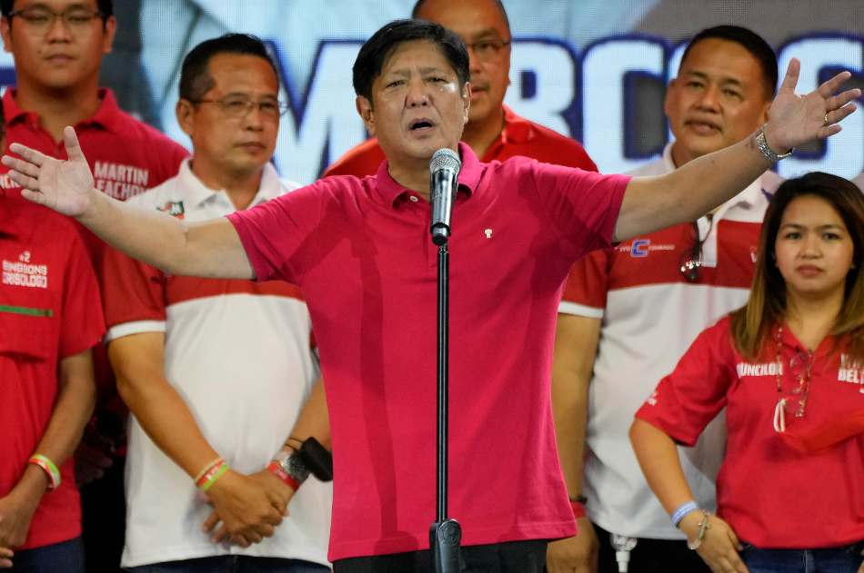

# 菲外交部长助理：菲总统明年访华，菲中将建直接沟通渠道防误判

【环球时报驻泰国特约记者 李百加 环球时报记者
张旺】29日，菲律宾外交部长助理英佩里亚尔在新闻发布会上宣布，菲律宾总统马科斯将于2023年1月初访问中国。其间，菲中两国外交部将建立一条直接沟通渠道，“以避免在有争议的海域发生误判和信息误传”。

英佩里亚尔说，马科斯总统将在明年1月3日至5日到访北京，并与中国领导人会面。这将是马科斯今年6月就任以来首次对非东盟国家进行国事访问。英佩里亚尔表示，“人们预计，此次国事访问将为两国未来五到六年的双边关系奠定基调”。菲方预计，马科斯访华期间，将与中国签署一项协议，批准中国和菲律宾外交部建立一条直接沟通渠道，“以避免在争议海域出现误判和误传”。这项协议可以使中菲两国在发生争端时的接触“程序”正式化。英佩里亚尔补充说，“总统希望争议海域局势稳定”。

媒体预计，马科斯访华期间，双方将签署10到14项双边合作协议，“其他可能达成协议的领域包括农业、贸易和可再生能源”。据菲律宾GMA新闻网报道，菲华商联总会28日表示，其成员将加入马科斯访华团。“我们相信这次历史性的国事访问对菲律宾经济的增长潜力非常重要，因为中国是我们最重要的经济和贸易伙伴，是世界上新兴的经济大国，也是我们的邻居。”菲华商联总会在声明中说。

新加坡《联合早报》称，马科斯就任总统以来，一直主张菲律宾将持续当所有人的朋友，不与任何人为敌。菲律宾在持续深化与美国同盟关系的同时，也致力维系与北京的关系。不过，美国似乎并不想让菲律宾跟中国走得太近，频繁利用南海问题挑拨两国关系。19日，美国国务院发言人普赖斯再度就南海问题发表声明，声称美国将与菲律宾一道，维护“基于规则的国际秩序和国际法所保障的南海航行自由”。彭博社还在20日炒作中国正在南海多个无人岛礁填海造地，并宣称菲律宾外交部表示“严重关切”。对此，中国外交部发言人毛宁21日在例行记者会上回应称，彭博社有关消息纯属无中生有。

广西民族大学东盟学院副院长葛红亮告诉《环球时报》记者，西方媒体又开始炒作所谓南海岛礁建设问题，将矛头对准中国，而且这种炒作恰恰在马科斯访华之前，其目的不言自明。此外，中国与东盟国家关于“南海行为准则”的谈判明年将进入关键阶段，因此也要注意到针对中菲之间摩擦的舆论炒作或许有更大的目标。

葛红亮说，“我们需要明白，菲国内在南海议题上也存在讨论”。南海问题虽然不是中菲关系的全部，却也是避不开的话题。在这种情况下，如何在确保中菲合作大局的前提下，妥善处理双边南海议题分歧，是至关重要的。这亟需双方高层加强政治引领，持续推动中菲就南海议题分歧进行有效和深入的对话。

