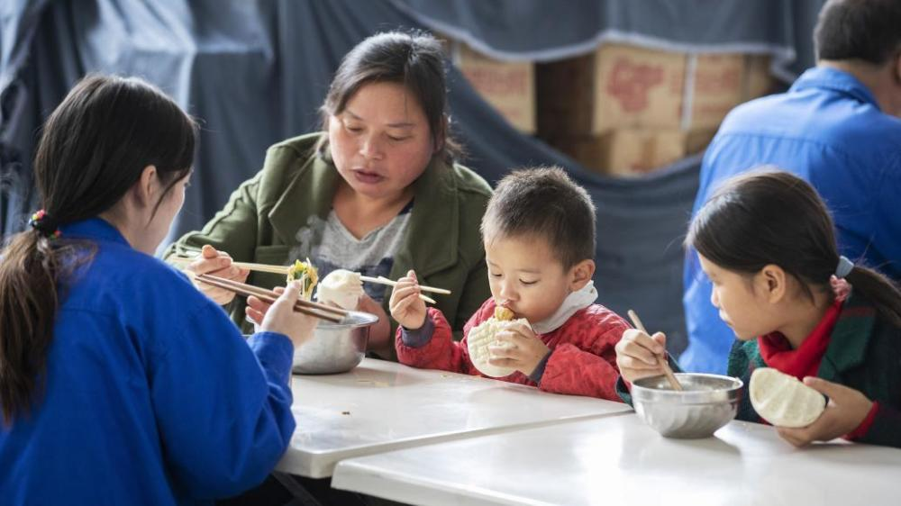

# 调查：脱贫地区乡村儿童家庭规模平均5人，多为“父养母教”

_视觉中国 资料图_

澎湃新闻从中国儿童中心获悉，在近日举行的2022中国儿童发展论坛上，中国儿童中心科研部部长、研究员朱晓宇公布了“脱贫地区乡村儿童家庭家教家风调查”结果。

该项调查显示，脱贫地区乡村儿童家庭规模以4—6人为主，物质生活具有基本保障；“父养母教”（父亲承担养育费用，母亲承担教育责任）模式较为常见；家长普遍期望孩子受到高等教育，希望孩子未来在城市从事稳定职业。

**家庭夫妻关系、亲子关系整体和谐**

朱晓宇介绍，这项调查由中国儿童中心、上海真爱梦想基金会于去年9月至10月，在全国8省10个县开展调查完成，有效调查样本涵盖1626户家庭。

调查显示，脱贫地区乡村儿童家庭规模以4—6人为主，物质生活具有基本保障。受访家庭中平均家庭人口数为5.11人。

这些家庭夫妻关系、亲子关系整体和谐，亲子共处时间相对充足。脱贫地区乡村儿童家庭夫妻关系整体评价得分为4.34分（总分5分，下同），受访家庭夫妻关系整体和谐。

与之同时，调查显示，“父养母教”模式较为常见，58.9%的家庭由父亲承担孩子的生活和教育费用；63.5%的家庭由母亲承担教育孩子责任。

**家长普遍希望孩子未来在城市从事稳定职业**

在教育方面，调查显示，脱贫地区乡村儿童家庭家长普遍期望孩子受到高等教育，希望孩子未来在城市从事稳定职业。近八成家长希望孩子从事稳定性的、机关事业单位性质的工作。

同时，家长对各教育维度重视程度整体上较为均衡。家长对学前儿童家庭教育重视程度从高到低排序依次为：安全自理教育、社会性教育、健康教育、德育、美育。家长对学龄阶段儿童家庭教育重视程度从高到低排序依次为：智育、生活和劳动教育、身体素质培养和体育、道德品质教育、文化修养和美育。

调查还显示，这些家庭的家庭教育管理方式较为积极严格，亲子沟通能力整体较好。家长与孩子在五类事情上的交流状况普遍较好，家长对学龄儿童的管理较为严格。从家长养育胜任力的数据来看，家长养育孩子的幸福感和称职性较强，家校沟通较为畅通。

**7岁组、10岁组儿童近视率低于全国同年龄段整体水平**

家风方面，调查显示，脱贫地区乡村受访儿童家庭对家风传承的意义评价较高，家风受到普遍重视，以传统节日为载体的优秀传统家风得到广泛传承。言传身教依旧是传承家风的最主要方式。63.7%的家庭通过长辈的言传身教传递家风，31.6%的家庭通过家规家训传递家风，使用其他有形载体，包括家谱、家书、刻石立传等形式的比较少。

在脱贫地区乡村儿童发展方面，调查显示，受访儿童健康发育状况相对良好。对照全国儿童身高体重发育常模，脱贫地区儿童身高体重处于标准状态，发育良好。7岁组、10岁组儿童近视率低于全国同年龄段整体水平。

另外，对照教育部发布的五项管理规定的要求来看，受访儿童时间分配基本合理。比如，“小学生每天睡眠时间应达到10小时”要求，脱贫地区儿童平均睡眠时间周末接近达标，工作日少1个小时。同时，调查显示，10岁组儿童社会适应状况良好，集体融入、学习自主、观点接纳得分均在4.1至4.2分之间。

