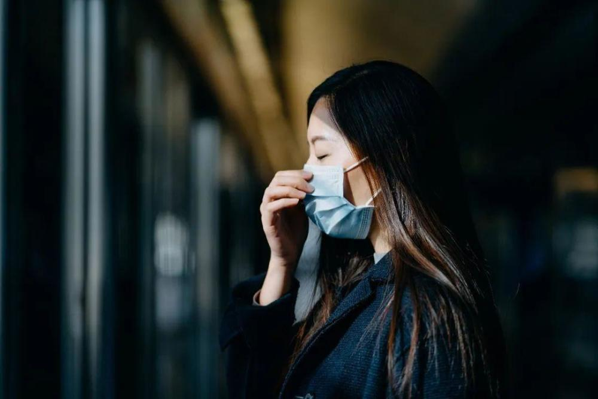
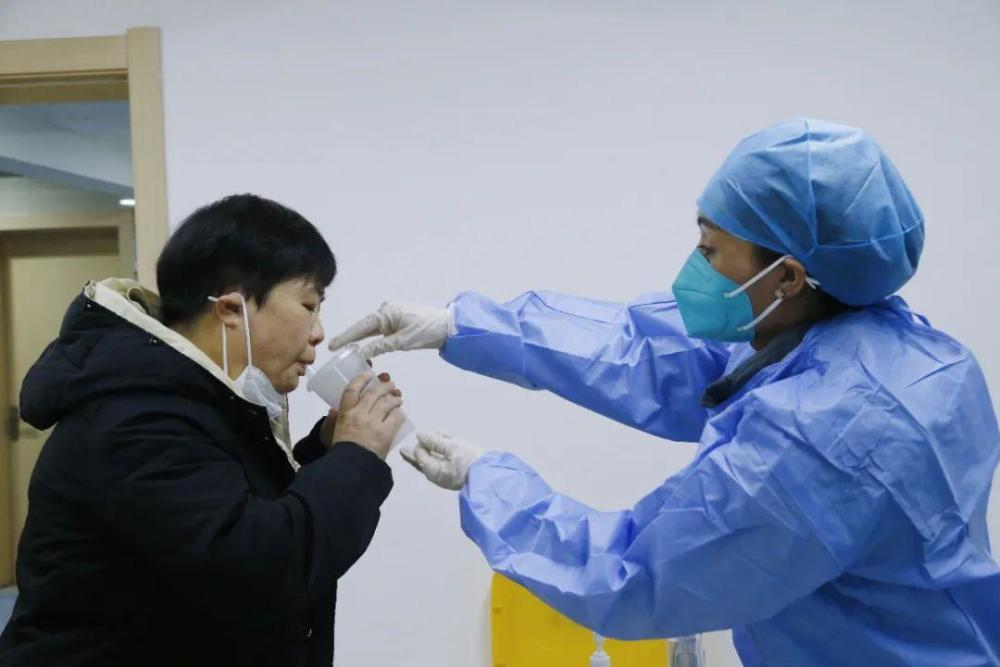
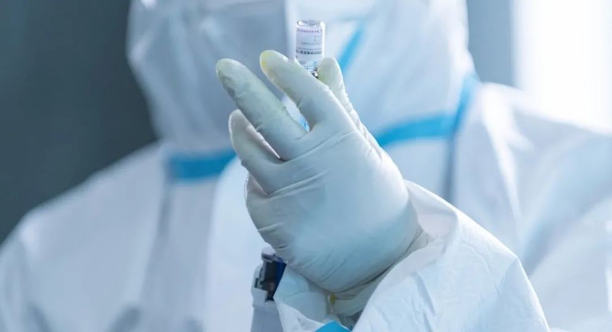
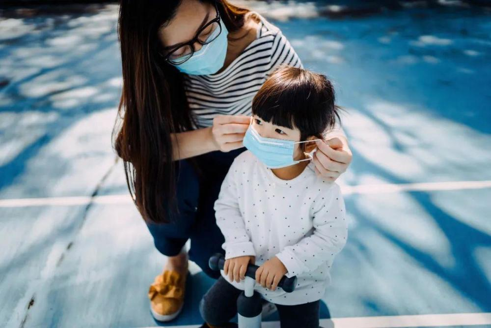

# 预测新冠如何突变的人

当下，奥密克戎正在流行，我们在经历病毒离每个人最近的时刻。

奥密克戎究竟是什么？它如何演变而来，有怎样的特性，有怎样的变异规律？人类对这个病毒的认识到了哪个阶段？而它又要走向何处？以一种科学的视角，了解这个病毒的方方面面，或许可以帮助我们更理性地应对疫情。

曹云龙是北京大学生物医学前沿创新中心副研究员、北京昌平实验室领衔科学家。曹云龙原本致力于单细胞基因组学的研究，2019年底，从哈佛大学博士毕业回国时，因为新冠疫情到来，遂而转向病毒的研究。三年来，他探究新冠病毒的免疫应答，也研究相关的抗体药物与疫苗。

2020年，新冠病毒流行期间，曹云龙与团队发现了DXP-593、DXP-604两个具有不重叠表位的抗体，并进行体外合成，作为「抗体鸡尾酒疗法」。但奥密克戎病毒太「狡猾」，免疫逃逸能力极强，这两个单抗药物已经同时被显著逃逸。这让整个团队很懊恼，也促使他们进一步思考和探究。这两年多来，他始终在问：「抗体药物的筛选是否有更好的办法？对病毒的理解如何还能更深入？是不是还有别的研究思路？」

今年，曹云龙基于自主构建的病毒突变预测模型，构建了一些「假病毒」，准确预测了BA.2.75与BA.5未来的进化趋势。今年10月，BQ.1.1毒株在尼日利亚被发现并开始大流行，一个月后，CH.1.1变异毒株（目前中国香港主要流行株）也被发现，而这两支毒株，早在今年7月，已经出现在曹云龙的预测名单里，与他构建的假病毒的序列高度一致。《Nature》杂志因此将曹云龙评选为年度十大人物，称他为「COVID
predictor（新冠预测者）」，称赞他的工作使得我们能跟上病毒进化的脚步。

近日，围绕奥密克戎的相关问题和最新研究，我们专访了曹云龙。这个年仅31岁的科学家很少直接给出「是」或是「否」的答案，而是会在每一个结论前加许多限定性条件。如果没有明确的研究结论，他也会诚恳地说，「你要允许科学家也有『不知道』」，而科研，就是在解决如此之多的「不知道」。

以下是《人物》与曹云龙的对话：

**文｜** 冯颖星

**编辑｜** 楚明

**图｜** 视觉中国（除特殊标注外）

**狡猾的奥密克戎**

**《人物》：从2019年12月最早认识新冠病毒，到现在广泛流行的奥密克戎，新冠病毒都经历了怎样的变异？到现在，奥密克戎又是什么，是如何演变而来的？**

**曹云龙：** 新冠病毒的流行经历了从原始株-Alpha变异株-Delta变异株-
Omicron变异株的过程，但在此期间出现的变异株远不止这些，这些只是WHO（世界卫生组织）命名的值得关注的变异株（VOC）。以寥寥数语描述病毒的整个变异历程是不可能的。

总而言之，新冠病毒携带的突变在不断累积，而奥密克戎这一高度突变的变异株据推测是在免疫缺陷人群中演化而来的。奥密克戎株内部也已经进化出诸多差异颇大的支系，最早出现的分支称作BA.1，如今在北京流行的BF.7的全称是BA.5.2.1.7，已经是奥密克戎进一步高度进化的产物。而目前国际上广泛流行的奥密克戎BQ.1.1的全称是BA.5.3.1.1.1.1.1.1，进化程度极高。

**《人物》：为什么奥密克戎的传播速度如此之快，会在短时间内造成感染率的急剧攀升？**

**曹云龙：**
与此前变异株相比，奥密克戎具有极强的免疫逃逸能力，这也是它的「狡猾」之处。通常情况下，人体在接种疫苗和自然感染后会建立免疫屏障，如体液免疫中的抗体，当病毒再次入侵时可以快速将病毒清除。而病毒在这些中和抗体的压力下进化，逃逸能力强的自然有生存优势，这就表现为奥密克戎产生突变来逃逸人体建立的免疫屏障，导致中和抗体失效，出现突破感染和再感染。

至于病毒的短时间感染率急剧攀升，已有证据表明，奥密克戎更倾向于感染上呼吸道，这可能是使得奥密克戎本身感染性上升的一个重要因素。奥密克戎的传播特性是指数扩增，只是我们当初的限制政策将这种指数扩增限制为局部扩张。

**《人物》：请具体解释一下什么是免疫逃逸？什么又是「抗体中和」？**

**曹云龙：**
当人体暴露于病原时（疫苗接种或自然感染），免疫系统会启动免疫应答，主要包括体液免疫和细胞免疫两部分。在体液免疫过程中，抗体发挥关键作用。抗体通过与病毒颗粒结合，阻止病毒感染细胞，从而达到「中和」的目的。而病毒为了在群体免疫的环境中流行，就会自然地产生突变来逃逸人体产生的中和抗体，或者说，只有具备足够免疫逃逸能力的病毒突变体才能够存活下来并继续流行。

**《人物》：奥密克戎的免疫逃逸能力究竟有多强？**

**曹云龙：**
很强。例如，近期在全球范围内流行的BQ.1.1.10、CH.1.1、XBB等对于三针灭活疫苗接种者的血浆显示出严重的逃逸能力，导致我们几乎测不到中和滴度（编者注：抗体浓度）；即使是接种三针疫苗后又感染BA.1、BA.2、BA.5乃至BF.7的康复者，其血浆对于最新的XBB等突变株的中和滴度也下降到了接近检测下限。

**《人物》：有一种观点是，奥密克戎变异株在人类感染中表现出毒性以及危害减弱的趋势，致病性和致死率也更低，是否是这样？**

**曹云龙：**
我们在讨论奥密克戎的毒性时，需要区分清楚病毒的天然毒性（在没有宿主免疫背景下的致病性）以及病毒感染对群体健康造成的危害（在宿主免疫背景下的致病性）。

病毒的天然毒性与其突变和演化是息息相关的，由于突变的随机性，病毒的天然毒性变化也带有随机属性。致病性需要考虑多种现实因素，在评价一个病毒的致病性时，也没有办法跟人体的免疫力区分开来。

奥密克戎变异株在真实世界的人类感染中表现出病毒危害减弱（致病性降低）有很大原因是由于疫苗接种以及既往病毒感染使人群具有相当的免疫基础导致的，而不能武断得出病毒本身毒性降低的结论。奥密克戎更倾向于感染上呼吸道，这可能是使得奥密克戎本身致病性降低的一个重要因素。

但需要提示的是，在天然毒性层面，新冠的原始株、阿尔法株到变异株德尔塔，天然毒性是上涨的，德尔塔到奥密克戎BA.1，毒性是下降的。但在奥密克戎的变异株中，从BA.2到BA.5，天然毒性是上涨的，也就是说，现在国内正在流行的BA.5支系的天然毒性是高于BA.1和BA.2的。虽然这些都是通过动物模型得出的结论，但至少可以说明新冠的天然毒性存在波动。

对于没有经历过免疫的人群，感受到的毒性更倾向于病毒的天然毒性。在群体免疫之后，我们不可避免地会进入到致病性越来越弱的趋势，但是第一拨是很难熬的。

我们一定也要去关注病毒的天然毒性，因为对于一些高危人群，比如老年人、那些有免疫缺陷的人群，他们没有很好的免疫力，一旦感染，他们受到的伤害与病毒的天然毒性相关性更高。很可惜，对于流行株的天然毒性的研究，往往需要在动物身上进行，或是社会面感染的回顾性分析，这些都要在流行之后的3个月，甚至半年之后才能给出准确评估。正因如此，我们对于高危人群的保护一刻也不能松懈。

_2022年12月20日，广东东莞万江社区医院发热门诊，等待就诊的患者_

**「临床上，二次感染的重症率会比第一次低」**

**《人物》：许多专家提出，「感染新冠半年内通常不会再感染」，您是否认同这个说法？感染后再感染的窗口期一般会有多久？**

**曹云龙：**
对于目前国内的流行株，「感染后半年内通常不会再次感染」这个说法对于同一毒株基本正确，这是由体内抗体水平的衰减速度决定的。但如果出现免疫逃逸能力更强的新毒株，特异性地使之前产生的抗体失效，就可能更早地发生再感染，这种情况下很难判定感染后多久会发生再感染。而且，每个人的具体情况也各有不同，差异较大。

**《人物》：感染过一次新冠的人所产生的抗体，在防止二次感染上能起多大的效用？甚至还有一种说法是，感染过一次，相当于打了一次疫苗？**

**曹云龙：**
对于免疫功能正常的人群，感染一种毒株后，短时间内一般不会再感染同一种毒株，即使感染也会迅速唤醒之前的免疫记忆而快速清除病毒，不会造成严重的症状。而因为新冠病毒处于快速的进化之中，目前世界上发生的二次感染与第一次感染的通常是不同的毒株。感染A毒株后，对B变异株的保护作用取决于A与B两种毒株之间氨基酸序列的相似度，特别是某些重要的产生中和抗体的位点的相似度，相似度越高，通常交叉保护作用越好。

自然感染所诱导的免疫确实是最强的，会直接给上呼吸道提供免疫屏障，但感染的副反应远远高于疫苗的副反应，所以不能把自然感染等同于接种疫苗。即便现实是通过自然感染去建立群体免疫这条路可能无法避免，但不推荐去主动感染。

**《人物》：以您观测到其他国家的数据来看，比如以色列、欧美等国家，人们的再感染状况是怎样的？**

**曹云龙：** 一个人一年感染多次以上已经属于正常。绝大部分国家在过去的一年都经历了3-4次重大感染高峰。

**《人物》：二次感染会比第一次感染时症状更轻吗？多次感染是否会对个体产生更大的危害？**

**曹云龙：**
疫苗接种和自然感染建立的免疫屏障虽然不能有效预防新毒株的再感染，但对于重症和死亡的减轻仍有不错的保护作用。从目前国际数据来看，二次感染的重症率会比第一次更低，致死率也会下降，但具体情况也取决于感染的具体毒株的致病性。目前还没有严谨的临床分析表明，二次感染的轻症比例是否也会下降。

**《人物》：有研究论证目前的奥密克戎会产生后遗症吗？如果有的话，会是什么症状？**

**曹云龙：** 当讲到新冠「后遗症」，有人所谈论的后遗症是疾病造成的终身存在的损害，有人描述的是国外叫做Long
Covid（以下译为「长新冠」）的状态，后者在WHO的定义是指最初感染新冠病毒3个月后症状持续存在或出现新症状，且这些症状持续至少2个月，且无法用其他原因解释。关于长新冠的存在，已经有很多研究证实。

长新冠的症状范围比较广，包括：严重疲劳、认知功能障碍和心悸等。它确实会对机体造成一定的损害，但是比例不会很高。目前确有初步临床证据表明，多次感染的人得长新冠的几率会更多些。关于是否存在伴随终生的损害，国际上目前还没有数据可以下结论。

**疫苗和药物能否追得上病毒**

**《人物》：本轮疫情的感染者中有很多人已经接种过多针疫苗，国外也有两次甚至多次感染者，疫苗品牌不同、接种方式不同（已有的注射或者吸入式），会产生不同的免疫效果吗？如果防感染的作用有限，我们是否还需要去接种现有的疫苗？**

**曹云龙：**
一个很讨厌的事实是，目前，我们现有的所有疫苗，无论是mRNA疫苗，还是灭活疫苗，对于感染的预防作用都较弱，压制病毒传播的作用都不理想。主要原因是，现有的疫苗诱导的抗体由于免疫逃逸无法高效中和病毒，同时抗体的浓度随时间衰减的厉害。此外，奥密克戎是在上呼吸道复制为主的病毒，目前主要的疫苗接种形式是肌肉注射，抗体主要循环在血液中，到肺部就已经有非常大的衰减，更难以到达上呼吸道黏膜，而感染是病毒进入体内时，上呼吸道黏膜的瞬间反应。但是病毒进入体内之后，会激活我们的天然免疫系统，比如接种疫苗之后所产生的记忆B细胞，只需很少的量，就能控制病毒的繁殖，所以现有的疫苗都可以有效预防重症，因此疫苗接种依然很重要。

与注射式疫苗相比，吸入式疫苗直接作用于上呼吸道，可以更高效地在上呼吸道形成黏膜免疫，对防感染的效果应当要优于其他现有疫苗，防重症的效果应当与注射疫苗差不多。

**《人物》：mRNA疫苗和灭活疫苗的差别是什么？**

**曹云龙：**
mRNA疫苗整体产生的抗体能力是要强于灭活疫苗的，随之而来的代价是它的炎症反应要大不少，比如，有的人群会产生强烈的疲劳、疼痛，发烧，高烧，这都是等价的。mRNA疫苗产生的抗体依然是在血液里，进入上呼吸道的也很少。此外，mRNA疫苗也无法避免抗体衰减，刚接种完的前两个月还具有防感染效果，但把时间拉长到半年以上，它与灭活疫苗没有本质差别。防重症上，现在的临床数据看mRNA疫苗与灭活疫苗基本是一样的。

**《人物》：疫苗防感染与防重症的机制分别是什么？**

**曹云龙：**
防感染的效果取决于暴露时有效抗体的中和滴度，而防重症的效果取决于病毒侵入后免疫系统的响应速度。换句话说，一个是存量，一个是增量。目前的疫苗防感染较弱是因为其诱导的抗体中对于突变株的有效抗体比例较低，而且大部分人距离接种第三针疫苗已经过去很久；接种疫苗可以防重症是因为，接种疫苗后体内会产生一些有效抗体的记忆B细胞（虽然这个比例在降低），这些记忆B细胞在病毒侵入后可以很快被激活，在3-7天内很快产生新的抗体，从而可以有效防重症。

**《人物》：疫苗对有基础病的老年人来说是重要的屏障，但这些有基础病的人群，也会因为担心疫苗可能产生的副作用而没及时接种，也有人因自身免疫缺陷或其他身体原因，不适合接种疫苗。对于这类人群，还有哪些措施可以防止感染或者重症？**

**曹云龙：**
疫苗的安全性是经过临床验证的，特别是灭活疫苗的副作用很小，接种的副作用远远低于感染的副反应，对于老年人等高风险人群来说，疫苗接种是最安全的选择也应该是首选。对于老年人或免疫缺陷人群等不适合疫苗接种或疫苗接种后免疫效应差的人群，还可以选择单抗药物来作为长效预防或暴露后预防。

_2022年12月28日，西宁市城中区南滩社区卫生服务中心，居民接种吸入式新冠疫苗_

**《人物》：目前有一种说法是，本轮疫情感染过后，人们可能会产生群体免疫，这种群体免疫是否可以替代疫苗的效力？**

**曹云龙：**
需要区分是通过群体免疫防感染还是防重症。如果是防感染，群体免疫的保护效力仅限于同一种毒株，或高度相似的毒株，不能完全防止新突变株的感染，通过群体免疫来阻断病毒传播是不现实的。如果是防重症，目前临床数据确实表明群体免疫能显著降低重症率，但是代价是惨痛的。单纯从免疫效果上来讲，感染过一次的效果相当于一次疫苗接种，但由于感染的副反应远远大于疫苗接种的副作用，因此不能企图用感染来代替疫苗接种。对于已经感染并康复的人士，短期内就不必再接种疫苗加强针。

**《人物》：现在市面上已经有好的特效药了吗？**

**曹云龙：**
目前市面上的新冠药物，主要有小分子和抗体两大类。新冠口服小分子药物，如Paxlovid，属于抗病毒药物，对于降低病毒载量非常有效，在前5天内使用对于重症的阻断效率是很高的。Paxlovid也有几个问题，一是容易复阳（停药后病毒载量反弹），这个问题可以通过复阳后再吃一个疗程解决；二是，根据美国在奥密克戎时代的调研，它对于65岁以下的接种了疫苗的人群效果不明显，非高危人群没有必要吃这个药；三是，使用场景受限，很多有基础疾病的人，如果同时在服用一些药物，会跟Paxlovid有很多排斥反应，必须要在医生的指导下使用；此外，它目前的价格也很高，公众接受起来也有难度。

此前，国际上已经获批了十多款抗体药物，抗体药物的有效性毋庸置疑，治疗和预防的效果都很好，但是最大的痛点是很容易被病毒逃逸。目前获批的抗体药物都已经被逃逸了。

**《人物》：广谱有效疫苗与药物研发的难点究竟在哪里？**

**曹云龙：**
广谱疫苗和药物的研发难点在于，病毒突变速度很快，远远超过了疫苗和药物的研发速度，而我们对病毒突变规律的把握仍然不足，对人体免疫系统产生抗体的规律的了解更加不够。即使是对当前流行株「广谱」的疫苗与药物，也很容易被后续新出现的突变株逃逸。

进行临床开发的抗体药物，在当时都是最好的抗体，对当时的流行株都很有效，但由于临床开发需要很长时间，怎么确保它还对一年后的病毒有效？这像是一个无解的难题。那我们就要去预测一年之后病毒的突变，这也是我目前在做的主要工作。

**《人物》：2020年，新冠病毒流行期间，您的团队提出了「抗体鸡尾酒疗法」，推动了当时临床上的治疗，这种「鸡尾酒疗法」在面对奥密克戎的时候，是否依然有效？**

**曹云龙：**
所谓的「鸡尾酒疗法」，就是我们希望能找到两个结合位置不同的中和抗体组合成为抗体药物，这样很难被单一病毒突变完全逃逸。但是新冠病毒的厉害之处是可以进化出多个突变位点，使得两个组合抗体同时失效。事实上，目前临床获批的抗体「鸡尾酒」药物都已失效。我们后来吸取这些之前研究中的教训，痛定思痛，转变筛选「抗体鸡尾酒」的思路，去寻找结合位置上最不容易发生突变的抗体（也就是预测哪里最不容易发生突变），最终筛选出来的SA55是目前所有公开数据的单抗中唯一一个处于临床开发阶段并对所有流行株有效的单抗。

**《人物》：就像您说的，对病毒的了解以及疫苗的研发速度，可能永远跟不上病毒变异的速度。面对如此狡猾的病毒，您是否会感到沮丧和困惑？**

**曹云龙：**
沮丧是在一两年之前，而现在已经把这个问题解决了大半。「鸡尾酒疗法」被逃逸之后，觉得一切努力都白费了，不甘心。如果没有经历当时那样的难受，我现在也不会这么坚定。那段时间带给我的更多是思考，然后继续去阅读大量的文献，加深自己的理解，寻找更新的技术，不断去拓展。必须要这样，科学家绝大多数情况下，面临的都是失败的境况，心态很重要。

困惑也是天天都有，科学家也不是什么都知道，但做科研就是为了解决困惑，困惑不会阻止我们的脚步。现在，我们已经比病毒变异的速度快半步了，是不是能够更快，快两步、三步、四五步？当我们足够快的时候，我们是否就能真正意义上赶在病毒前头，去研发疫苗，去阻断传播？这条路程需要多久，我不知道，但我们在努力去做。

_图源人民视觉_

**病毒走向能否被预测**

**《人物》：您被《Nature》杂志称为「COVID
predictor」（新冠预测者）。您的团队预测到新冠病毒发生怎样的变异？这种预测对疫情防控有什么作用？**

**曹云龙：**
我们对于当前人群在感染病毒和接种疫苗后产生的抗体做了大量生物化学的实验测量，基于数据我们构建了一个突变预测模型，在今年7-8月份准确预测了BA.2.75和BA.5未来的进化趋势，并在9月份公开发表。今年10月份和11月份流行的BQ.1.1和CH.1.1与我们在7月份构建的假病毒序列高度一致，也论证了BQ.1.1等毒株的免疫逃逸能力很强，提前做了一些预警。

通过预测未来将出现的变异株，我们可以提前衡量现有抗体药物或疫苗效果，为抗病毒药物和疫苗的设计与研发提供思路，将研发窗口提前。你想想看，如果我们能够在今年年初就用上BA.5的相关疫苗与药物，BA.5可能就被压制了。如果我们提前开发抗体和疫苗，是不是就可以跟上病毒变异的速度，真正意义上阻断病毒的传播？

**《人物》：您在最新的研究中提到，新冠病毒呈现出趋同进化的特点。怎么理解这种「趋同进化」？接下来病毒还将如何变异，进化终点到底是在哪里？**

**曹云龙：**
「趋同进化」是指，独立进化的不同毒株演变出了相同的突变，这对于病毒进化来说属于小概率事件。我们的理解是，病毒突变是为了逃避人体的免疫压力，出现趋同进化说明免疫压力在这些位点相对集中，并且这些位点的突变可以有效地逃逸人体免疫屏障。我们预测，病毒会不断在这些位点累积突变，以实现最大程度免疫逃逸。目前来看，真实世界的病毒进化确实如此。

我们现在还无从讨论病毒进化的终点，只要它持续在人群中流行，那就会和人群的免疫系统持续作斗争，不断产生突变来逃逸人体产生的中和抗体，我们需要持续研究毒株的流行情况和人体免疫系统产生的抗体特征，尽可能实现有前瞻性地监测未来短期内可能产生的优势突变。

**《人物》：您在此前的公开报告中提到，目前的疫情产生了根本性变化，新冠病毒的迭代似乎出现了「阶级式的跃迁」，突然出现了上百种不同的毒株在全球扩张，这会对疫情造成什么影响**

**曹云龙：**
此前是非常清晰的单一毒株的依次更替流行，但今年9月份以来，上百种有流行趋势的突变株在全球范围内同时出现，且非常多突变株都比BA.5更有增长优势。目前，已知的变体已经超过500种。这些新毒株的特点是免疫逃逸能力都很强，能够逃逸BA.5康复者的血浆中和，也就是很可能造成大规模的再次感染，同时将来可能会出现几种变异株同时流行的局面。

**《人物》：BQ.1.1、XBB等变异毒株目前在一些国家已成为优势毒株，并且形成大规模感染，您是否已经开展这方面的研究？相比于BA.5或BF.7，XBB有什么变化？传播力和危害性是否增强？**

**曹云龙：**
我们是世界上最早注意到这些毒株并着手研究其免疫逃逸能力的团队之一。12月19日，我们在最新发表的Nature文章中，已经说明了XBB可以称为是目前为止免疫逃逸能力最强的新冠毒株之一，即使是接种三针疫苗后又感染BA.5的人群，其血浆也无法有效中和该毒株。可以预见，即使国内已经流行过BA.5或BF.7的情况下，该毒株的进入仍有可能导致大规模的再感染。

最近，XBB又多了一个新的亚种XBB.1.5，增长速度之快，令人咋舌，在纽约，将近两周就打败了BQ.1.1，成为主要流行株。我们发现，XBB.1.5不仅免疫逃逸能力变强了，传播力也有很大增幅。它会在短时间内成为全世界的主要毒株，我们需要密切关注。

