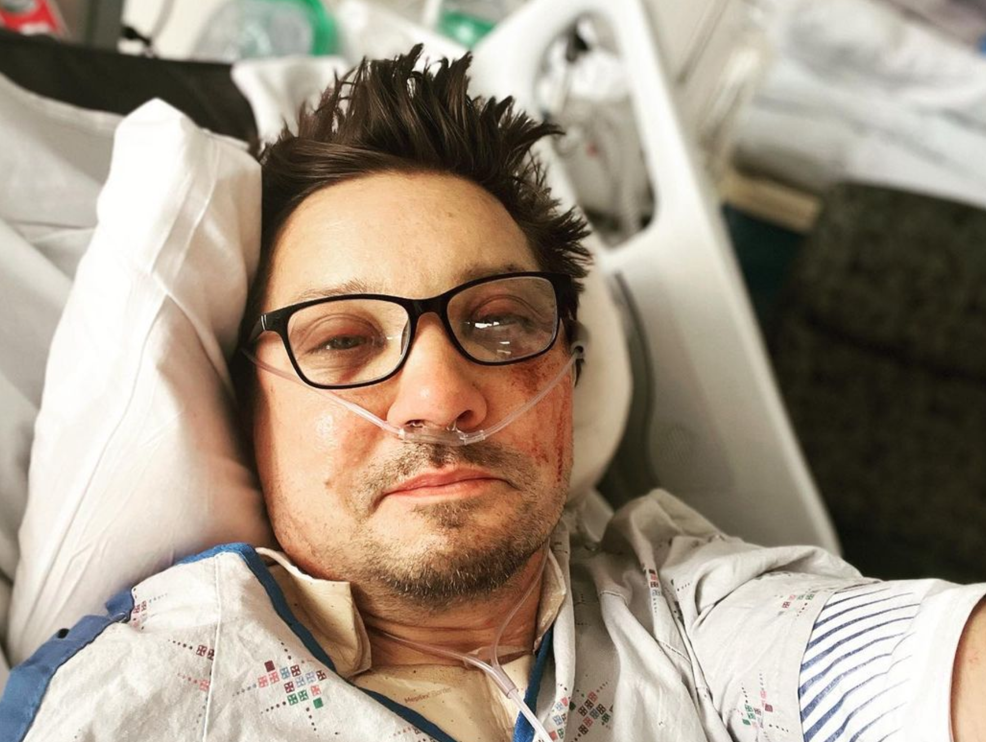
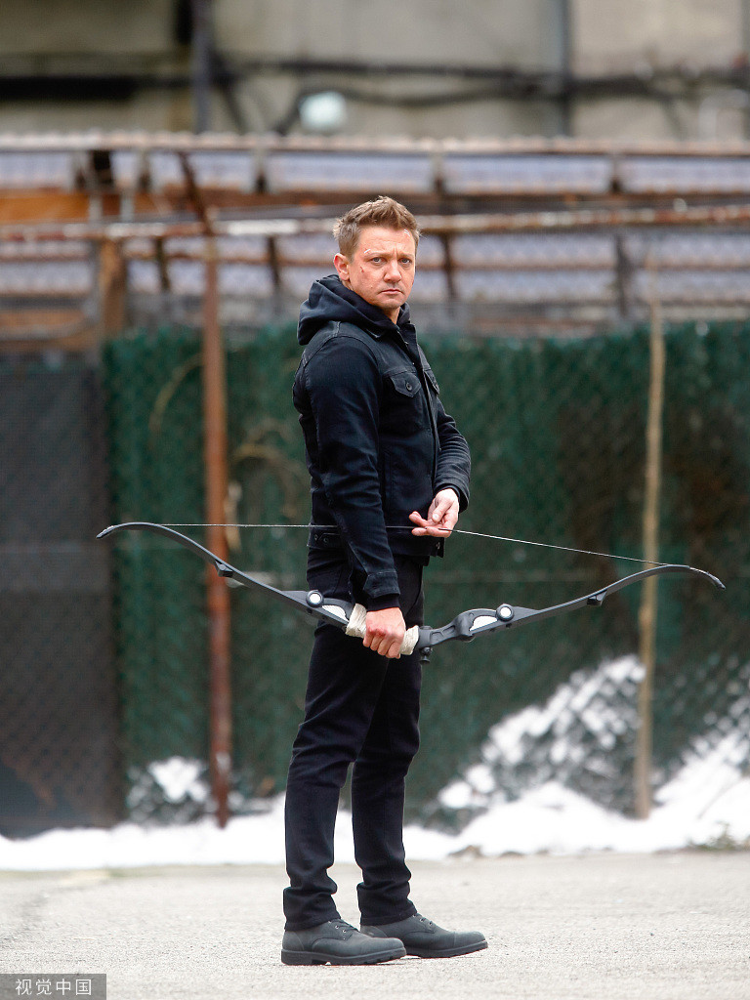
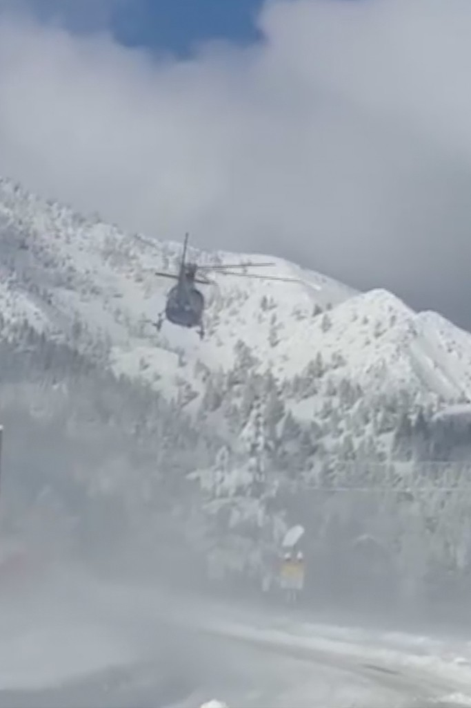

# “鹰眼”扮演者晒出ICU自拍：躺病床上吸氧 面部憔悴淤血明显

_“鹰眼”扮演者晒出ICU自拍（社交平台）_

**海外网1月4日电** 据美国有线电视新闻网1月3日报道，当天，漫威系列电影“鹰眼”扮演者杰瑞米·雷纳在社交平台上晒出自拍，称感谢网友的关心。

_“鹰眼”扮演者杰瑞米·雷纳（资料图）_

雷纳现年51岁。元旦当天，他在家里清除积雪时，被铲雪车碾过，造成胸部钝性外伤和腿部骨科损伤，还出现严重失血。

_1月1日，雷纳受伤后，被直升机送往医院。_

自拍显示，雷纳躺在病床上吸氧，面部憔悴，淤血非常明显。其发言人透露，雷纳已接受2次手术，目前仍在重症监护室，他意识清醒、能够说话，伤势严重但情况稳定。（海外网
刘强）

海外网版权作品，未经授权不得转载。

