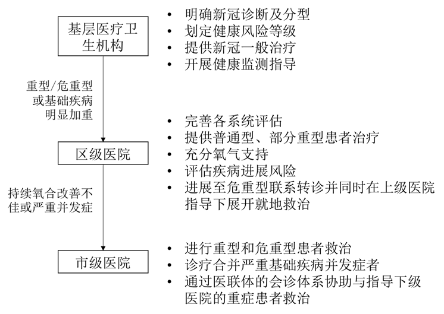

# 上海发布新冠分级诊疗方案：口服小分子抗病毒药物是主要治疗措施之一

“华山感染”微信公众号1月4日消息，当前，新冠病毒奥密克戎变异株在全球流行，我国也面临着疾病流行的巨大挑战。随着人群接种新型冠状病毒疫苗（简称新冠疫苗）覆盖率的逐步提高，对其传播力增强和致病性降低认识不断加深。临床认识到早期规范化治疗的重要性，特别是抓住脆弱群体感染后的早期救治时间段，给予抗病毒与抗炎症治疗，将显著降低新冠病毒感染的重症率与病死率。上海市新型冠状病毒病临床救治专家组协同国家传染病医学中心在国家卫健委《新型冠状病毒肺炎诊疗方案（试行第九版）》基础上，一起重新编写了《2022版上海市新型冠状病毒感染诊治规范与分级诊疗流程》（基层医疗机构应急使用简版），以期能对各级医疗机构和医生在具体病例分级管理和诊疗中提供参考和指导。下面就基层临床治疗的要点逐一介绍。

**一、临床分型**

1.轻型与普通型：出现发热、乏力、干咳、咽痛或咽部不适、全身不适等临床相关症状，但未有呼吸困难与氧饱和度下降。如有条件完善肺部CT或者胸片等影像学检查，未见肺炎表现者可诊断为轻型；影像学见肺炎表现者可诊断为普通型。

2\. 重型：

成人 符合以下任意一项可判断为重型患者：

出现气促，RR≥30次/分；

在静息状态下，吸空气时指氧饱和度≤93%；

动脉血氧分压（PaO2）/ 吸氧浓度（FiO2）≤300 mmHg；

肺部影像学检查显示24~48 h内病灶明显进展>50%者。

儿童 符合以下任意一项：

超高热或持续高热超过 3 天；

出现气促；

静息状态下，吸空气时指氧饱和度≤93%；

有辅助呼吸现象；

出现嗜睡、惊厥；

拒食或喂养困难，有脱水征。

3\. 危重型：符合以下任意一项者可判断为危重型。

出现呼吸衰竭，且需要机械通气；

出现休克；

合并其他器官功能衰竭，需ICU监护治疗。

**二、易进展至重症的高危人群**

目前，新冠感染后易进展为重型和危重型的高危因素包括：

年龄≥60岁；

心脑血管疾病（含高血压）、慢性肺部疾病、糖尿病、慢性肝脏、肾脏疾病、肿瘤、恶性血液病、血液透析等基础疾病者；

免疫功能缺陷；

肥胖（BMI≥30）；

围产期女性；

重度吸烟者；

儿童合并有某些基础疾病（先天性心脏病、支气管肺发育不良、慢性肺病、呼吸道畸形、神经系统发育落后、神经肌肉疾病、异常血红蛋白病、重度营养不良等）、或免疫缺陷或低下患儿、肥胖症儿童、及早产新生儿；

未全程以及未加强接种新冠疫苗者。

**三、新冠感染分级诊疗路径**

轻型或者普通型的病例，采取居家治疗或就近就地治疗方式，由社区卫生服务中心医疗力量提供规范化的治疗。

有严重基础疾病的感染者以及部分重型和危重型病例，由社区卫生服务中心转诊至区级医院。市级医院负责所在辖区重型和危重型病例的救治，并对区级医院加强技术指导。孕产妇、新生儿由各区指定医院收治。血液透析、肿瘤放化疗患者由原就诊医院优先救治。

**四、临床基本治疗要点（四步简易治疗法）**

（一）一般治疗

应用解热镇痛药等药物进行对症治疗，保证充分的热量摄入、营养均衡，摄入优质蛋白质食物；注意水、电解质平衡，维持内环境稳定；密切监测患者生命体征和氧饱和度等。

（二）口服小分子抗病毒药物

抗病毒治疗是新冠病毒感染主要的治疗措施之一。在社区与基层医疗机构建议重点应用于有重症高危因素的感染者。抗病毒药物的最佳治疗时机是病程的早期，最好是发病的5天内。目前已经上市可供选择的药物包括：

1\.
奈玛特韦/利托那韦片：用于轻型和普通型且伴有重症高风险因素的成人患者，推荐在发病5天以内使用。用药应注意和其他合并用药之间的相互作用，可以根据药品说明书的规定，停用有药物相互作用的禁忌用药，而必需用药（如降压药等）可选择无药物相互作用的替代用药。重度肝、肾功能损伤（eGFR

2\.
阿兹夫定：用于治疗普通型成年患者。空腹整片吞服，每次5mg，每日1次，疗程至多不超过14天。不建议在妊娠期和哺乳期使用。中重度肝、肾功能损伤患者慎用。

3\. 其他可及的小分子药物：正在上市或者即将还会有更多的小分子药物上市，如莫努匹拉韦等，可以根据患者的基础用药的相互作用和基础疾病状况等进行药物选择。

（三）糖皮质激素应用

无进展为重型和危重型高危因素的轻症患者一般不需要使用糖皮质激素。对于有进展为重型和危重型高危因素的患者，评估无糖皮质激素应用禁忌症后，可在疾病加快进展的早期应用低剂量糖皮质激素。用法为地塞米松（0.75mg/片）或者醋酸泼尼松（5mg/片）每日4-6片口服。若治疗72小时后疾病仍然出现进展，不吸氧难以维持正常的氧饱和度，则需要转诊至上级医院进一步治疗。治疗72小时后病情显著缓解者，可减量至2-3片/天，再治疗3-5天。

对于在基层医院留院观察到疾病进展较快的高危患者、需要氧疗的普通型患者、或需无创或有创呼吸支持治疗的重型及危重型患者，均应立即使用糖皮质激素治疗。糖皮质激素应用时，建议低至中等剂量（根据病情采用地塞米松5-10mg，或者甲泼尼龙20-60mg/d）短期应用（5天左右），病情严重或合并ARDS者，可适当加大剂量与延长疗程。

（四）氧疗和呼吸支持

重视发生低氧原因的鉴别。积极采取支持氧疗措施，实时评估氧疗效果，以避免整个治疗过程中，患者出现较长时间的低氧。需要将达到氧饱和度93%以上作为治疗最低目标，采取鼻导管、面罩或者高流量等无创呼吸机支持氧疗。

**五、其他能改善预后的治疗方法**

（一) 抗凝治疗

原有接受抗凝且血D-二聚体正常患者可继续口服抗凝药物治疗。血D-二聚体升高的普通型、重型早期或原接受抗凝的患者出现D-
二聚体升高，排除抗凝禁忌后，可采用低分子肝素抗凝，剂量为60~100U/kg/d，分1~2次/天使用。

（二) 俯卧位通气治疗

具有重症高危因素、病情进展较快的普通型患者、以及重型或危重型患者，应当给予规范的俯卧位通气治疗。各基层单位可以根据下发的俯卧位通气流程和影像教学材料，在上级医院的指导下普遍开展俯卧位通气的使用。

（三）中西医结合救治方案

中医治疗立足祛邪与扶正协调并进。普通发热病例，宜疏风清热，解毒利咽为主。重症病例，应重视肠道管理，肺肠同治，如采用生大黄、宣白承气汤、大承气汤等进行口服、鼻饲或灌肠，保持大便通畅，日2~3行糊状便。

