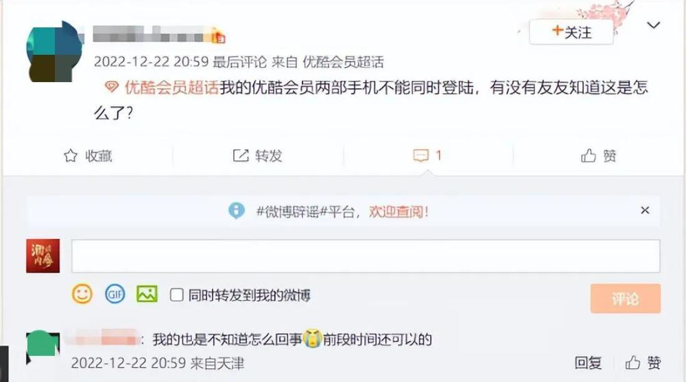
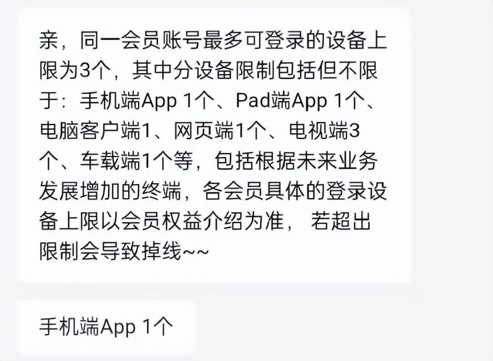
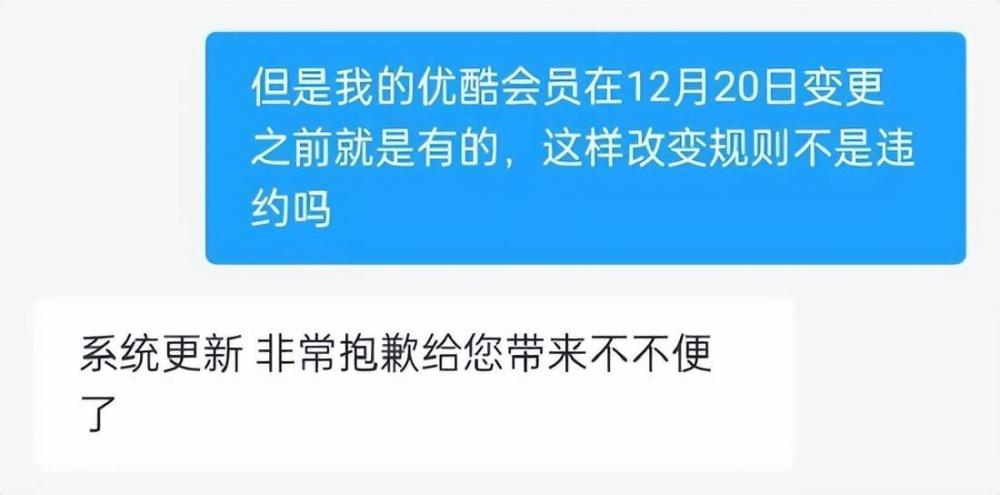
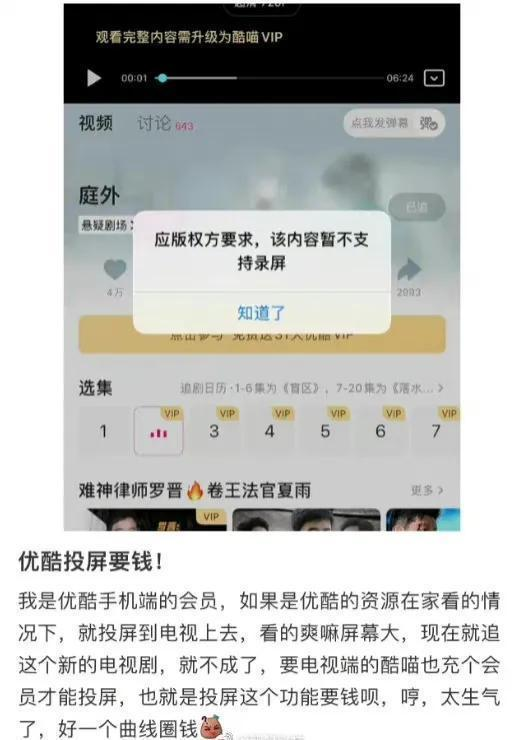
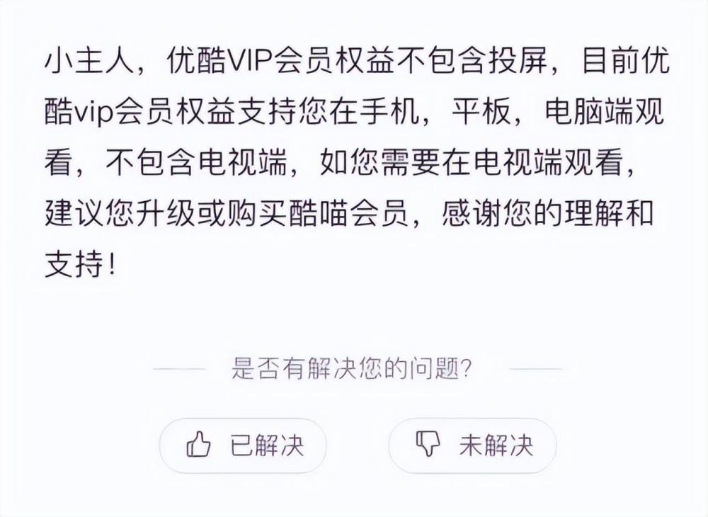

# 优酷更改会员登录规则：一个账号仅能一台手机登录

Tech星球1月4日消息，近日，多位网友在社交平台反馈称，自己的会员只能登录一个手机账号了，而此前一个优酷会员可以同时登录三个手机设备。

对此，客服回应表示，目前同一会员账号最多可登录的设备为三个，同时可登录两个设备，手机端APP只能登录一个。客服表示此规则的变更时间是2022年12月20日。问及变更原因，客服称是由于“系统更新”。

有用户对此提出异议，称自己的会员是12月20日之前开通的，突然改变规则不合理。而客服则依旧致歉表示是“系统更新”。

值得一提的是，此前2022年7月，优酷视频就曾因投屏收费问题引发热议。有大量网友反映，优酷开通VIP会员权益后，使用投屏服务还需开通酷喵会员。

对此，优酷官方自助问答页面显示，优酷VIP会员权益不包含投屏，目前支持在手机、平板、电脑端观看，不包含电视端。

