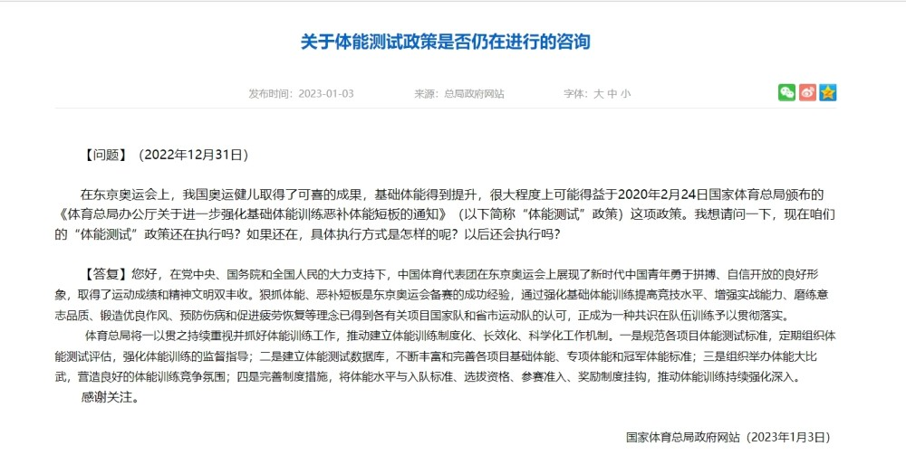

# 体育总局：将定期组织体能测试评估、体能大比武

中新网1月3日电
3日，国家体育总局网站回复了网友关于体能测试政策是否仍在进行的咨询。回复指出，狠抓体能、恶补短板是东京奥运会备赛的成功经验。国家体育总局将一以贯之持续重视并抓好体能训练工作，推动建立体能训练制度化、长效化、科学化工作机制。

图片来源：国家体育总局网站截图

据介绍，狠抓体能、恶补短板是东京奥运会备赛的成功经验，通过强化基础体能训练提高竞技水平、增强实战能力、磨练意志品质、锻造优良作风、预防伤病和促进疲劳恢复等理念已得到各有关项目国家队和省市运动队的认可，正成为一种共识在队伍训练予以贯彻落实。

国家体育总局将一以贯之持续重视并抓好体能训练工作，推动建立体能训练制度化、长效化、科学化工作机制。一是规范各项目体能测试标准，定期组织体能测试评估，强化体能训练的监督指导；二是建立体能测试数据库，不断丰富和完善各项目基础体能、专项体能和冠军体能标准；三是组织举办体能大比武，营造良好的体能训练竞争氛围；四是完善制度措施，将体能水平与入队标准、选拔资格、参赛准入、奖励制度挂钩，推动体能训练持续强化深入。

