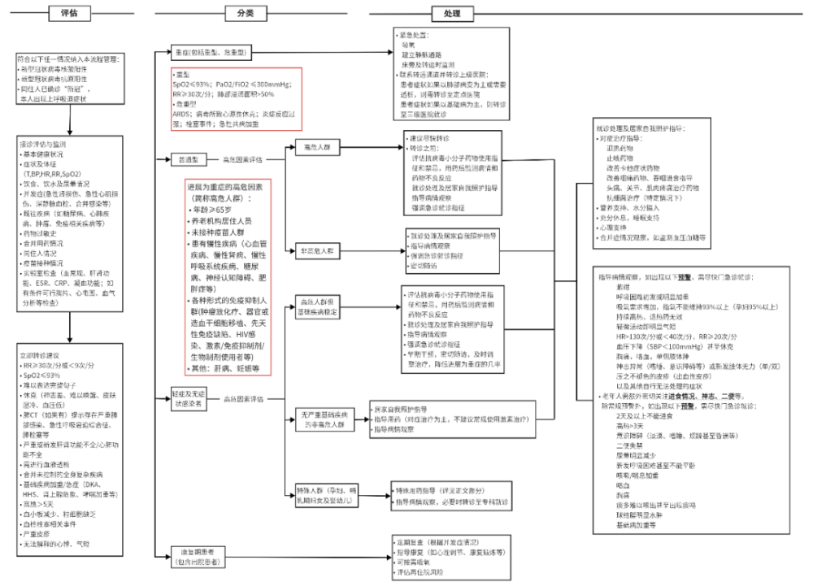
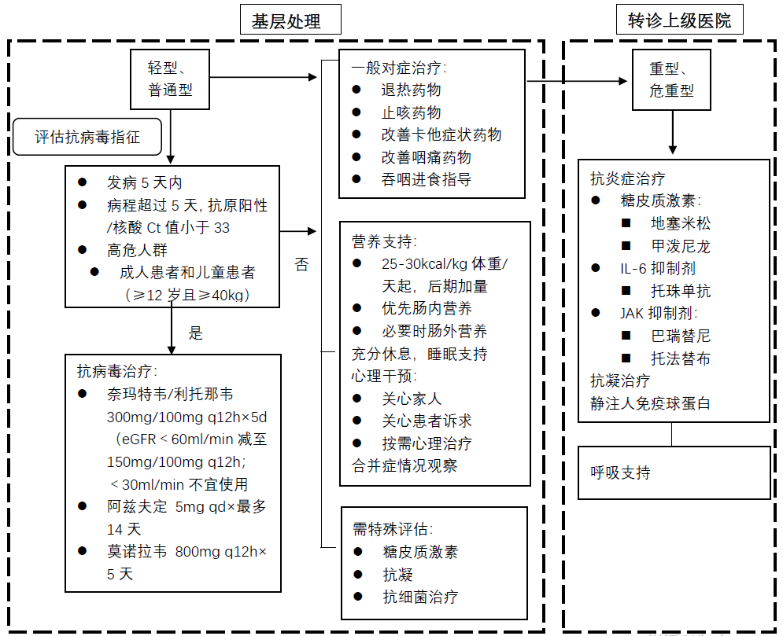
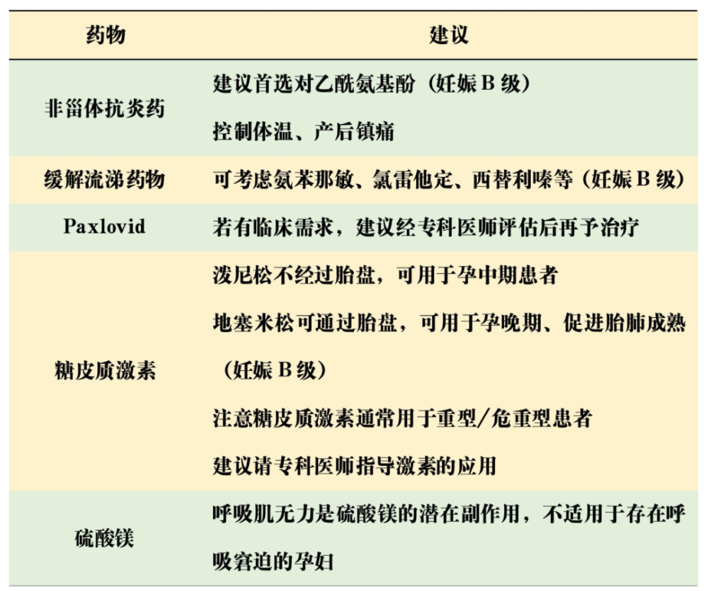

# 北京协和医院发布新冠诊疗建议：选中成药需考虑体质，中医治疗需辩证论治

**前言：**
由于疫情防控政策的放开，越来越多的各专业医生尤其是基层医生已面临接诊新冠患者的情形。北京协和医院秉承以人为本、全人照顾的理念，依据WHO等国外指南、我国《新型冠状病毒肺炎诊疗方案（试行第九版）》以及国务院最新发布的《关于对新冠病毒感染实施“乙类乙管”的总体方案》，坚持循证、简明、临床可操作的原则，编写了基层版诊疗方案建议。对目前缺乏循证医学证据的关键临床问题，结合北京协和医院一线经验，给出了相应建议。其次，强调在社区筛查高危人群，进行早期干预，注意营养、睡眠、支持等方法，构筑好家庭、社区、医院三道防线，努力保健康、防重症。最后，强烈希望基层医生在工作中也始终关注并维护包括医务人员自己在内的普通人群在疫情期间的自身健康。

本建议供医疗相关专业人士参考，欢迎批评指正。

**第一部分**

**新型冠状病毒感染患者** **诊疗及管理流程建议**

**01**

**诊断**

1

新型冠状病毒感染：有明确流行病学史，出现发热和（或）呼吸道症状等相关临床症状，且新型冠状病毒核酸/抗原（以下简称核酸/抗原）阳性

2

新型冠状病毒肺炎：诊断为新型冠状病毒感染，且肺部出现符合新型冠状病毒肺炎的新发影像学异常

**02**

**基层抗原及核酸检测人群**

1

有发热和呼吸道感染症状的就诊居民，有症状的医务人员，开展核酸或抗原检测。

2

社区65岁及以上老年人，长期血液透析患者，严重糖尿病、心脑血管疾病、慢性肺病患者等重症高风险的社区居民，3岁及以下婴幼儿，出现发热等症状后及时指导开展核酸或抗原检测。

**03**

**分型**

针对成人，参考《新型冠状病毒肺炎诊疗方案（试行第九版）》分型。

1

**轻型：** 临床症状轻微，影像学未见肺炎表现

2

**普通型：** 具有发热、呼吸道等症状，影像学可见肺炎表现

3

**重型：** 符合下列任何一条

（1）呼吸窘迫，呼吸频率≥30次/分

（2）静息状态下，动脉血氧饱和度（以下简称氧饱和度）≤93%

（3）动脉血氧分压(PaO2)/吸氧浓度(FiO2)≤300mmHg

（4）临床症状进行性加重，肺部影像学显示24-48小时内病灶明显进展50%者

4

**危重型：** 符合下列任何一条

（1）出现呼吸衰竭，且需要机械通气

（2）出现休克

（3）合并其他器官功能衰竭需ICU监护治疗

**注：下文提及的重症患者包括重型、危重型。**

**04**

**基层新冠诊疗流程建议**

本建议采用基层工作中经常使用的“评估—分类—处理”模式推荐基层新型冠状病毒感染（以下简称新冠）诊疗的流程。

**评估：**
通过对新冠核酸/抗原阳性或同住者已确诊的居民进行简单而有针对性（呼吸系统详细情况，可能并发症，疫苗接种情况，同住人情况等等）的问诊和查体，结合部分基层可实施的检验检查结果，识别需立即转诊的情况（经上级医院处理后，居民可转诊回基层进行后续诊疗）。

**分类：**
根据基层医生的病史采集、查体及辅助检查等评估后，对患者进行分类。除上述新冠分型外，还结合是否具有进展为重症高危因素及是否为老年人、孕产妇或婴幼儿、康复期患者等人群特点进一步分类，以便后续进行针对性处理。

**处理：**
对于重症患者，应紧急处理后协助联系转运通道尽快转诊。对于高危人群，应评估抗病毒小分子药物使用指征，给予药物后监测病情变化和药物不良反应。同时，普通型患者中的高危人群，建议转诊，在转诊之前加强对症治疗和支持治疗。对于其他普通型、轻症、无症状感染者需进行详尽的居家照护指导，并指导其进行病情观察，识别预警信号，告知需尽快门急诊就诊的情况。孕产妇或婴幼儿需注意特殊用药注意事项。相比专科医生，基层医生将面对更大批康复期患者，做好康复指导和病情监测，显得尤为重要。

**新型冠状病毒感染患者的基层诊疗流程建议见下图。**

**以下为流程图中涉及的部分内容解析。**

**（一）进展为重症（包括重型、危重型）的高危因素**

以下简称高危人群。

**1\. 临床特点**

1

年龄≥65岁者

2

长期居住于养老院或护理机构者

3

孕妇

4

未接种新冠疫苗或对新冠疫苗应答不佳者

5

BMI≥30kg/m2

**2\. 合并症**

1

合并肺部疾病：慢性阻塞性肺疾病、哮喘、支气管扩张、肺结核、间质性肺疾病、肺动脉高压、囊性纤维化等

2

合并控制不佳的原发疾病：糖尿病及糖尿病并发症、高血压、冠心病、慢性肾脏病、慢性心力衰竭、卒中、肝硬化、镰状细胞贫血患者等

3

认知功能障碍、神经发育障碍（包括唐氏综合征、孤独症谱系障碍、学习障碍）患者

4

器官移植受者、接受免疫抑制治疗（糖皮质激素/生物制剂/免疫抑制剂）者、艾滋病患者以及恶性肿瘤接受化疗的患者

5

发生多种合并症者

**（二）接诊时建议立即转诊的情况**

1

呼吸频率≥30次/分或

2

氧饱和度≤93%

3

难以表达完整的句子

4

休克（神志差、难以唤醒、皮肤湿冷、血压低）

5

肺CT（如果有）提示存在严重肺部感染，或合并急性呼吸窘迫综合征、肺栓塞等事件

6

严重或新发肝肾功能不全/心肺功能不全

7

需进行血液透析

8

合并未控制的全身复杂疾病

9

基础疾病加重/出现急性并发症：酮症酸中毒（DKA）、高血糖高渗综合征(HHS）、垂体或肾上腺危象、哮喘加重等

10

高热>5天

11

血小板减少、粒细胞缺乏

12

血栓栓塞事件：剧烈胸痛、言语不利、新发肢体无力、单侧面瘫、咯血、呼吸困难、单侧肢体肿胀

13

严重皮疹

14

无法解释的心悸、气短

**（三）无症状、轻型、普通型患者就诊处理及居家自我照护指导**

详见治疗部分。

1

对症治疗指导：

（1）退热药物

（2）止咳药物

（3）改善卡他症状药物

（4）改善咽痛药物、吞咽进食指导

（5）头痛、关节、肌肉疼痛治疗药物

（6）抗细菌治疗（特定情况下）

2

营养支持、水分摄入（老年人应该根据具体情况予以个体化指导）

3

充分休息，睡眠支持

4

心理支持

5

合并症观察，如监测血压血糖等

**（四）居家自我照护时需密切观察病情，如出现以下预警，需尽快门急诊就诊：**

1

紫绀

2

呼吸困难初发或明显加重

3

吸氧需求增加，指氧不能维持93%以上（孕妇95%以上）

4

持续高热，退热药无效

5

轻微活动即明显气短

6

不能平卧

7

心率>130次/分或

8

血压下降（收缩压

9

胸痛，咯血，单侧肢体肿胀

10

神志异常（嗜睡、意识障碍等），新发单侧或双侧肢体无力

11

压之不褪色的皮疹（出血性皮疹）

12

其他无法自行处理的症状

老年人（>65岁者）需额外密切关注：进食情况、神志、二便等等。除常规预警外，老年人如2天及以上不能进食、有高热>3天、意识障碍（淡漠、嗜睡、烦躁甚至昏迷等）、二便失禁、尿量明显减少、新发呼吸困难甚至不能平卧、咳嗽/喘息加重、咯血、胸痛、痰多难以咳出甚至出现痰鸣、球结膜明显水肿、基础病加重等，需立即就诊。

**第二部分**

**新型冠状病毒感染患者诊疗及管理技术建议**

**01**

**新冠相关治疗**

**（一）** **药物治疗**

1

在进行药物治疗之前，建议所有患者均需完善评估检查，进行临床分型，根据不同的临床分型决定治疗方案，在治疗期间仍需密切检测患者病情变化，及时调整治疗方案。

2

新冠主要病理生理学机制是发病后数天内病毒增殖，以及此后 7
天左右引发的宿主免疫炎症反应。因此在发病早期给予抗病毒药物，在发病7天以后对重症患者给予抗炎症药物显得很重要。

3

基层医生主要处理轻型和普通型患者，以对症支持治疗为主；而对于重症患者，建议转诊上级医院，以抗炎症和抗凝治疗为主。

※药物治疗流程图：

**（二）具体用药**

1

**抗病毒治疗**

抗病毒药物仅用于降低高危人群发展为重症的风险，不能预防新冠感染，且无法缓解新冠感染后的发热、乏力等临床症状。

**（1）治疗指征**

在感染早期（3-5天内），病毒快速复制期，对于以下新冠患者可能需要抗病毒治疗：

a. 进展为重症的高危人群（见第一部分高危人群）；

b. 未接种疫苗的50岁以上人群（不考虑危险因素，尤其是没有接种过任何疫苗，也无既往感染史的人）；

以下患者不推荐治疗：65岁以下，免疫功能正常，既往健康，全程接种疫苗，非高危人群。

对于基层医生，必要时可考虑请教或转诊给有新冠诊治经验的专科医生。

**（2）具体药物**

**奈玛特韦/利托那韦（Paxlovid）**

应用指征：

奈玛特韦/利托那韦使用时机为症状出现5天以内，注意起病5天以上使用该药超出适应证。

药品规格：

为组合包装药品，由“奈玛特韦片”和“利托那韦片”组成，每板含150mg奈玛特韦片（粉色）4片和100mg利托那韦片（白色）2片，分为日用和夜用两部分，每盒含5板。

用法用量：

该药为组合包装药品，这两种药物要求同时服用。

掰开、压碎、研磨等操作对该药物的吸收、安全性及有效性的影响尚无官方明确数据，故建议整片吞服。如果是吞咽障碍，需管饲给药的患者，建议经医生或药师的专业评估后再给药。

a.肾功能正常：奈玛特韦300mg(2片)-利托那韦100mg(1片)、每12小时1次，连续5天

b. eGFR 30-59mL/min：奈玛特韦150mg(1片)-利托那韦100mg(1片)、每12小时1次，连续5天

c. eGFR

相互作用：

利托那韦与多种药物存在相互作用，推荐使用网络工具如Liverpool COVID-19 Interactions
(https://www.covid19-druginteractions.org/checker)，除外药物合并使用禁忌。该影响会在利托那韦停药2~3
天后消失，一般在奈玛特韦片/利托那韦片停药 3 天后恢复原有治疗药物。

**常见存在相互作用的药物见下图：**

**阿兹夫定（Azvudine，FNC）**

应用指征：建议在病程相对早、核酸阳性的患者中使用。

用法用量：空腹整片吞服，每次5mg，每日1次，疗程至多不超过14天。

不建议在妊娠期和哺乳期使用，中重度肝、肾功能损伤患者慎用。

**莫诺拉韦（Molnupiravir）**

莫诺拉韦胶囊是一种口服小分子新冠病毒治疗药物。2022年12月29日国家药监局应急附条件批准默沙东公司新冠病毒治疗药物莫诺拉韦胶囊进口注册。

应用指征：轻型、普通型新冠成人患者中的高危人群，在症状出现后5天内服用。

用法用量：整粒吞服，不要打开、破坏或压碎胶囊。胶囊剂型（200mg/粒），每次800mg（4粒），每12小时1次，持续5天。

2

**退热**

发热是新冠最常见的症状之一，一般在体温超过38.5℃（老年人可适当放宽）时需要服用解热镇痛药（或称非甾体类抗炎药，NSAIDs），常用的药物包括：对乙酰氨基酚、布洛芬、洛索洛芬等。可选择其中一种，按照药品说明规范剂量服用，避免多种药物重叠服用。

注意警惕药物不良反应，包括消化道溃疡、肝肾功能损伤、血小板减少等。如出现胃肠道不适、便血、出血、黑蒙等症状，需及时至医院就诊。

3

**对症治疗**

（1）咽痛：多饮水为基础，可饮蜂蜜水（非糖尿病患者）。口服NSAIDs，可缓解疼痛。局部用药可选择西吡氯铵、华素片、西帕依清咽滴丸，含苯酚或利多卡因的含漱液，或含低温食物（如冷藏的软水果、冰淇淋、冰水）。鼻咽部痛可使用薄荷油滴鼻。此外，保持环境温度和湿度适宜可帮助缓解咽痛，建议戒烟。如果剧烈疼痛持续、影响呼吸、完全无法进食，需至医院就诊，警惕会厌炎。

（2）鼻塞：经过1周左右居家休息、布洛芬等药物对症治疗，轻度鼻塞流涕等症状会逐渐自行缓解。对于症状较重的鼻塞，可使用鼻喷糖皮质激素（例如糠酸莫米松、丙酸氟替卡松、布地奈德等）；也可选择鼻喷减充血剂（羟甲唑林、赛洛唑啉等），注意应短期使用，通常不超过7-10天，长期使用会造成药物性鼻炎等不良反应。需警惕的是，如果1周后仍不缓解，反而出现流黄脓涕、颌面部及眼眶周围胀痛、牙齿胀痛等现象，需考虑是否继发了急性细菌性鼻窦炎，应及时耳鼻喉科就诊。

（3）咳嗽咳痰：咳嗽是机体重要的防御性反射，有利于清除呼吸道分泌物和有害因子。一般的轻度咳嗽可以不予治疗。若痰多或痰不易咳出，可服用乙酰半胱氨酸、盐酸氨溴索、桉柠蒎胶囊、羧甲司坦等祛痰药。如咳嗽以干咳为主，可服用右美沙芬、复方甲氧那明胶囊、抗组胺药等。条件允许，可进行雾化治疗。若咳嗽严重、影响日常工作或睡眠、严重胸痛或出现胸闷憋气、合并低氧（如氧饱和度≤93%），或持续3周以上，建议医院就诊。

（4）全身酸痛：如症状较重，可随餐服用对乙酰氨基酚或布洛芬等镇痛药。此外，保持良好的睡眠、充分饮水、保暖等有助于减轻疼痛症状。

（5）腹泻：部分患者可能出现腹泻症状，大部分为轻度分泌型腹泻。补液和维持电解质稳定是最重要的洽疗，首选经口补液，如腹泻量大，可予口服补液盐。腹泻可导致肠道菌群紊乱，可口服肠道益生菌调节肠道菌群。少数患者可出现严重腹泻，以及抗生素相关腹泻，需完善大便常规及病原学检查，如除外感染性腹泻，可适当加用蒙脱石散止泻。如伴恶心，甚至呕吐，注意饮食清淡，少量多餐，呕吐严重需及时就诊。值得注意的是新冠病毒可能通过粪口传播，因此对于腹泻的患者尤其需要注意手卫生。

4

**中成药**

(1）常用的中成药包括：感冒清热颗粒、荆防颗粒、小柴胡颗粒、金花清感颗粒、连花清瘟胶囊（颗粒）、双黄连口服液、清热解毒口服液等。

可用于缓解咽痛的中成药包括：清咽滴丸等。

可用于缓解咳嗽的中成药包括：羚羊清肺丸、复方鲜竹沥口服液、止咳橘红丸、川贝枇杷膏、 养阴清肺丸、苏黄止咳胶囊等。

可用于缓解鼻塞、流涕的中成药：鼻渊通窍颗粒。

可用于缓解食欲差、恶心呕吐、腹泻等症状：藿香正气口服液或胶囊等。

(2）服用中成药时需注意：

避免多种药物同时使用。

部分中成药中含有西药成分，如999感冒灵中含有对乙酰氨基酚、咖啡因、马来酸氯苯那敏；因此，在服用中成药时需注意药品成分，特别是与西药联用时，避免药物过量。

**选择中成药需考虑平时体质，中医治疗需辩证论治，必要时中医科就诊指导用药。**

5

**抗凝治疗**

目前已有研究证实在新冠感染患者可能出现血栓栓塞风险，需注意以下情况：

（1）对于轻型和普通型患者，不推荐常规抗凝治疗。特殊患者建议请专科会诊评估抗凝指征，不建议基层医生独立启动抗凝治疗。

（2）对于重症患者，需要鼻导管吸氧患者，可使用预防剂量抗凝。

（3）对于需要高级呼吸支持患者，可使用治疗剂量抗凝。

（4）使用抗凝治疗需注意禁忌症，老年人和肾功能不全者需减量，并需注意与其他药物之间的相互作用。

6

**激素治疗**

**（1）应用指征**

针对重型或危重型患者，以及非重症患者如因其他原因（如慢性阻塞性肺病、慢性自身免疫性疾病）在罹患新冠之前就已经在应用全身性激素、或临床症状加重、或孕24至34周有早产风险等，可考虑使用全身性激素。

不需要住院的非重症患者不建议常规使用激素，不建议基层医生独立启动激素治疗。

儿童、罹患结核以及免疫缺陷者、糖尿病等如使用激素，尤其应密切随访病情变化和不良反应。

**（2）用法、用量**

首选地塞米松6mg/日，口服或静脉注射，也可使用其他等效剂量糖皮质激素类药物替代（如甲泼尼龙32mg/日或泼尼松40mg/日）。

7

**其它抗炎治疗**

激素治疗仍无法控制炎症的重症患者，可考虑加强免疫调节治疗，如托珠单抗（IL-6受体阻滞剂）、巴瑞替尼（JAK抑制剂），如无法获得巴瑞替尼，可以选择托法替布。建议专科评估后，与激素联用，避免单独使用上述药物。需注意药物不良反应和禁忌症，如过敏反应、活动性结核感染、妊娠等。

8

**抗生素**

新冠本身可引起发热、脓痰或脓涕，部分患者剧烈咳嗽可能出现咯血，抗生素治疗无效，且可能带来抗生素相关不良反应，因此不提倡常规使用抗生素。

对于体温明显改善后又再次升高、长时间大量脓痰或脓涕者，合并细菌性鼻窦炎者，怀疑院内感染的住院患者，可考虑评估使用抗生素指征（如完善病原学等）。

**（三）非药物治疗**

1

**补液**

需评估患者的脱水情况，尤其是老年人与婴幼儿，可以观察患者的一般情况，皮肤状态以及口唇状态，询问摄入量和尿量、尿色。建议轻型和普通型患者经口补液，可选择清水或口服补液盐，补水量根据脱水情况决定。

如果出现严重脱水或者合并明显低钠血症，则不能仅饮用清水补液，推荐使用口服补液盐或其他含电解质的溶液，必要时应进行静脉补液纠正容量与电解质。对治疗反应不佳的患者应及时转诊。

此外，对于合并有心脏相关基础疾病的患者，推荐小口慢饮。所有患者在补液期间均需要注意尿量，若出现少尿或无尿，应注意生命体征，警惕休克、急性肾损伤，建议就诊。

2

**营养**

建议保持每天摄入25-30kcal/kg体重热量以保证机体正常工作。具体来说，以清淡饮食为主，推荐摄入适量的优质蛋白质、足够的碳水化合物、新鲜的水果蔬菜，避免高油高盐、辛辣刺激类食物。对于无法自主进食的患者，可考虑经鼻胃管或空肠营养管补充营养液；如难以耐受肠内营养，可考虑肠外营养。

3

**物理降温**

对于退热药物效果不佳、存在退热药禁忌的患者，可进行物理降温。常用方法包括温水擦浴、退热贴、少穿少盖等。避免使用冷水、避免浸没身体，不推荐酒精擦浴。使用退热贴时需警惕皮肤过敏。

4

**呼吸体位**

对呼吸急促的轻型或普通型患者，且意识清醒、生命体征平稳、能自主排痰的、无气道梗阻风险，可尝试俯卧位、斜坡侧卧位、前倾坐位等方法适当缓解症状。需注意监测指氧饱和度和呼吸频率，早期识别重症患者并进行转诊。

5

**呼吸排痰技巧**

对于意识清醒、可配合的患者可选用呼吸技巧排痰，通过深呼吸，逐渐将肺内周边的痰液集中到气道，通过呼吸肌和膈肌共同做功，将痰液排出。适合于>8岁的青少年和成年人；肺功能严重损害或者大咯血的患者慎用。

6

**吸氧**

氧饱和度是新冠感染患者重要的生命体征，是判断病情严重程度、监测治疗反应的重要参数。直接测定需要在医疗机构中采集血液样本进行仪器分析，居家时可以通过脉搏血氧仪（简称脉氧仪或指氧仪）较好地反映氧饱和度。

一般情况下，氧饱和度≤93%，需建议患者就诊，评估转诊上级医院指征。经评估可居家治疗的患者，可指导其如有胸闷、气短、呼吸困难或乏力，家庭有制氧机时可进行居家鼻导管吸氧。鼻导管吸入氧浓度与氧流量有关，可从2L/min起始，氧饱和度目标范围94%-98%，如低于目标数值可逐渐上调氧流量，超过5L/min的流速常因无法充分湿化造成患者难以耐受，同时需定期检测氧饱和度与患者神志，避免二氧化碳潴留导致II型呼吸衰竭。若吸氧浓度持续提升至5ml/L时氧饱和度仍≤93%（间隔数分钟、换用不同手指测量2次），建议尽快就医。氧饱和度≤90%建议立即将患者转运至急诊或发热门诊进行诊治。

需要注意，上述界值针对一般人群，部分患有慢性呼吸或循环系统疾病的患者，平时氧饱和度即在正常范围以外，建议与随诊医疗团队及时沟通，确定个体化的监测方案。而新冠康复患者或出院患者，如存在较严重肺部病变，也可在医生指导下进行家庭氧疗，促进肺部功能的康复。

重症、危重症患者需住院治疗，根据病情给予规范有效氧疗措施，包括鼻导管、面罩给氧和经鼻高流量氧疗，必要时考虑有创呼吸支持。

7

**失眠**

导致新冠患者失眠的原因包括生理上的不适，如咽痛、鼻塞、全身酸痛等，以及心理上的紧张焦虑等。首先尽可能缓解导致失眠的躯体不适，若仍有明显失眠，可尝试小剂量服用辅助睡眠的药物。此外通过调整卧室的光线、冥想、沐浴、音乐等方法可辅助改善睡眠质量。

**02**

**各系统并发症**

新冠病毒感染患者除呼吸道感染症状外，还可能累及心血管、消化道、肾脏、神经等多个系统，严重时导致患者病情恶化。并发症的早期识别和积极治疗对于改善预后尤为重要，应识别出严重并发症并及时会诊和转诊。

**（一）心血管系统**

1\. 病毒直接侵犯、细胞介导的细胞毒作用等可导致心肌损害，还可能感染冠状动脉内皮细胞引起血管内皮损伤和血栓形成，导致心肌缺血损伤。

2\.
新冠病毒感染后出现心悸、胸闷或胸痛、气短、呼吸困难等症状的患者，应警惕心血管并发症，包括急性冠状动脉综合征、心律失常、心肌炎、应激性心肌病、心功能不全甚至心源性休克等。

3\. 注意病毒性心肌炎的早期识别，血液动力学障碍患者还需警惕爆发性心肌炎，心肌损伤标记物、心电图、超声心动图等有助于临床判断，必要时完善心肌核磁。

**（二）消化系统**

1\. 新冠患者胃肠道并发症的潜在机制涉及多重因素，可能与病毒、血管紧张素转换酶2(ACE2)受体高水平表达和/或胃肠道微血管凝血病等因素有关。

2\. 常见的胃肠道症状包括食欲下降、腹泻、恶心、呕吐、腹痛。腹泻或呕吐患者注意加强口服或静脉补液等支持治疗，维持水电解质平衡。

3\.
急性肝损伤是新冠患者的常见并发症，患者无论有无慢性肝病基础，均可能出现转氨酶升高。ALT和AST通常为轻度升高，严重的急性肝损伤较少见，但与新冠的严重程度和不良预后具有相关性。新冠患者应定期监测肝脏生化指标，以便及时发现可能出现的肝损伤。临床合理用药以减少肝损伤风险应引起足够的重视。

4\. 重症患者还可能出现肠麻痹、急性胆囊炎、胰腺炎甚至危及生命的肠系膜缺血，应予以警惕。

**（三）肾脏损害**

1\. 肾脏损害以肾小管损伤为主，多表现为蛋白尿、血尿，实验室检查可见尿素氮及肌酐升高，部分患者发展为急性肾损伤。

2\.
肾脏损害患者应当积极寻找病因（如药物、低灌注等），并做相应处理。注重监测容量负荷，维持水、电解质、酸碱平衡，针对不同病情采用不同液体管理策略。注意在明显高热、服用退热药物导致大量出汗或存在腹泻的患者中，可能低估液体排出量。当患者容量负荷过重导致其他脏器功能异常时应及早转诊至上级医院，评估是否开展肾脏替代治疗。

**（四）血栓栓塞性事件**

1\. 新冠可引起高凝状态，深静脉血栓形成和肺栓塞风险明显增加，同时需警惕脑卒中和心肌梗死等动脉血栓形成事件风险。

2\. 重症新冠患者常见异常凝血级联反应，出现诸如血小板减少症和D-
二聚体水平升高，并与死亡率升高相关。预防性使用小剂量肝素有助于降低静脉血栓风险。值得注意的是，重症患者即使采取血栓预防措施的情况下，仍存在静脉血栓栓塞风险，临床应予以警惕。

**（五）神经系统**

1\. 新冠患者神经系统并发症的潜在机制包括全身性功能障碍（如低氧、器官衰竭、药物作用等）导致的神经损伤、肾素-
血管紧张素系统功能异常、机体对感染的全身性免疫应答失调、病毒直接侵犯神经系统等。

2\.
常见神经系统表现包括头痛、头晕等；脑病常见于危重型患者，常见原因包括中毒性代谢性脑病、药物作用、脑血管疾病和非惊厥性癫痫发作；脑卒中相对少见，但临床需要警惕，包括缺血性脑卒中、颅内出血和脑静脉窦血栓形成；偶有发生格林-
巴利综合征的报道。

3\. 其他罕见神经系统表现包括脑膜脑炎、小脑炎、急性播散性脑脊髓炎、多系统炎症综合征、癫痫发作、全身性肌阵挛和可逆性后部白质脑病。

**（六）电解质紊乱**

1\.
常见的电解质紊乱包括低钠、低钾、低钙血症，其他（如高钠血症、高钾血症、低氯血症、血镁和血磷异常等）也可出现。电解质紊乱可能加重病情，严重者导致心血管系统、神经系统等多个系统并发症，例如，低钾血症容易诱发心律失常、低钠血症患者可能出现神经系统症状等。应及早识别并积极纠正电解质紊乱，以降低病情加重风险。

2.对于新冠病毒感染期间出现腹泻、呕吐、发热大量出汗及摄入不足的患者，需警惕低钾血症的发生。对于进食减少甚至无法进食的患者、尤其老年人，还需警惕低钠血症，若患者出现恶心、呕吐、精神萎靡、嗜睡甚至昏迷等情况，需同时完善血钠等电解质评估。

3\.
根据临床评估的容量状态，结合血、尿电解质及渗透压、肾功能等实验室结果对症处理电解质紊乱，同时积极寻找和纠正病因。对于严重电解质紊乱的患者，应先行紧急处置的同时及时转诊。

**03**

**基础疾病管理**

由于慢性疾病会增加新冠病毒感染的重症风险及死亡率，因此对于合并慢性病的新型冠状病毒感染者，应该更加全面谨慎地做好慢病管理。

慢病管理的总体原则是，在新冠感染流行期间，更加注意个人防护，保持社交距离、戴口罩、勤洗手等，同时保证充足的睡眠，增强营养摄入，避免剧烈运动，如果原发病稳定，仅有病毒感染症状且病情平稳，可居家自行对症治疗，但避免自行调整当前原发病用药，可通过远程医疗就诊指导原发病药物治疗或取药，最大程度避免交叉感染。如原发病或新冠病情进展，需及时转诊。

**（一）心血管疾病**

1\.
对于患有冠心病、心功能不全、高血压等心血管疾病患者，需要注意平衡每日出入量，如有大量出汗予适量补水，密切监测血压及心率。如有新发胸痛、心前区不适、心悸、喘憋、下肢水肿等症状，需警惕心脏疾病加重。对于不明原因的胸痛或心悸等症状、病情不平稳或发生急性心脑血管事件，需及时转诊。

2\.
对于高血压患者，根据病情依据指南合理用药，已使用降压药物的患者可根据血压及其他情况继续使用原有降压药物或加以调整，已使用ACEI/ARB的新冠患者可继续使用。需要注意的是，新冠患者因应激和焦虑等导致的儿茶酚胺升高、ACE2途径的影响，可以导致血压升高；但同时由于潜在的摄入不足、发热、出汗等，导致容量不足和电解质紊乱，同样可以引起血压下降。需密切关注血压情况。

**（二）内分泌代谢疾病**

对于患有糖尿病、高脂血症、肥胖等基础疾病患者，需要坚持治疗，保证充足的饮水量，以及均衡营养摄入，注意监测血糖、血脂等。对于糖尿病而言：

1.糖尿病控制不佳通常为感染的危险因素，且血糖控制不佳与新冠结局较差相关。

2.糖尿病合并新冠病毒感染患者，建议增加血糖监测频率，如有心悸、手抖、出汗等症状，随时测血糖。注意预防低血糖、严重高血糖和酮症酸中毒等。

3\. 注意严重低氧患者服二甲双胍可能增加乳酸酸中毒的风险。

4.若糖尿病患者出现血糖明显升高、恶心、呕吐、甚至意识障碍等表现，需要警惕糖尿病酮症酸中毒、高血糖高渗综合征等急性并发症。根据标准方法实施胰岛素输注、心肾功能允许下规范充分补液、电解质补充，仍是针对酮症酸中毒和高血糖高渗综合征的首选疗法，同时需立即转诊至内分泌专科继续诊治。

**（三）痛风**

1\.
痛风患者常合并多种共病，包括肥胖、糖尿病、心血管疾病和慢性肾脏病等，这些合并症与新冠病毒感染的风险增加和不良预后相关；血尿酸升高亦可能导致促炎状态，新冠感染期间痛风急性发作风险升高，可能使新冠病情复杂化。

2.一项利用英国健康促进网络（THIN）数据库基于人群的队列研究显示，痛风患者，尤其女性，即使接种疫苗的情况下，感染新冠和发生新冠严重结局的风险显著高于普通人群中的无痛风者。痛风患者发生新冠感染不良预后的风险应当引起临床医生的关注。因此在整个新冠流行期间，积极控制血尿酸水平，加强饮食、饮水等综合管理具有重要意义。不停用正在使用的降尿酸药物（包括别嘌醇、非布司他、苯溴马隆）。应用Paxlovid抗病毒治疗期间，禁止使用秋水仙碱治疗。

**（四）慢性肺部疾病**

慢性肺部疾病在合并新冠感染后，重症率及死亡率明显升高，所以此类人群应该更加注意避免聚集、保持社交距离等疫情防控措施，尽量降低新冠的风险。

1\. 新冠流行期间，哮喘患者应当继续使用控制哮喘所需的全部常规药物，包括吸入性糖皮质激素、长效支气管扩张剂、白三烯调节剂、口服糖皮质激素等。

2\.
新冠流行期间，COPD患者应继续使用治疗COPD的全部必要维持药物，包括支气管扩张剂、吸入性糖皮质激素，以及必要时使用罗氟司特和阿奇霉素。这些药物有助于最大程度降低COPD发作风险和提高肺功能。

**（五）慢性肾脏疾病**

1\.
慢性肾脏疾病的患者应该密切监测每日出入量，保证出入平衡，优质蛋白饮食，不应停止目前药物治疗。对于需要去医院透析的患者，注意日常防护，使用专门的透析设备，并做好日常清洁。

2\. 接受ACEI或ARB的患者应继续治疗，除非有停药指征(如高钾血症或低血压)。

**（六）慢性肝病**

1\. 慢性肝病患者尤其是失代偿期肝病患者易继发细菌或病毒感染，因此在新型冠状病毒肺炎流行期更需要做好防护，保护自己免受感染。

2\.
合并肝功能不全的患者尽量避免应用可能加重肝损的药物，注意药物相互作用及用药剂量调整。合并食管静脉曲张并发症的患者，注意避免硬质的食物如花生等，避免再发消化道出血风险；曾经有过肝性脑病的患者尽量避免一次性摄入过多的高蛋白食物，以免诱发肝性脑病的发生。此外，建议患者不能随意停药，注意监测肝功能。若病情进展，及时转诊。

**（七）风湿性疾病**

1\.
对于大多数确诊新冠病毒感染的风湿病患者，在新冠病毒感染期间宜暂缓使用柳氮磺吡啶、甲氨蝶呤、来氟米特、麦考酚酯、雷公藤、硫唑嘌呤、生物制剂(如TNF抑制剂、IL-6受体抑制剂）和JAK抑制剂。然而，如果患者存在活动期或危及器官的风湿病，根据个体评估结果可能需要继续给予免疫抑制治疗，应与专科医生共同协商。羟氯喹在WHO指南中不推荐用于治疗新冠病毒感染，但是对于一直服用羟氯喹的免疫病患者来说，感染新冠病毒后也无需停用。

2\. 接受糖皮质激素治疗的患者应维持感染前相同的给药剂量，以避免突然停药引起的病情活动和肾上腺皮质功能减退症的并发症。

3\. 无症状感染者可在检测阳性后10-17天恢复抗风湿药物治疗，非重症感染者可在症状缓解后7-10天恢复抗风湿药物治疗。

**（八）肿瘤性疾病**

新冠病毒检测阳性的肿瘤患者，延迟癌症导向治疗的持续时间取决于新冠病毒感染的严重程度、恶性肿瘤的类型及状态、延迟治疗导致的癌症复发和进展的风险、合并症、治疗的类型和强度以及治疗方案的不良反应。具体治疗时机及方案建议在肿瘤内科医生的指导下实施。

**（九）精神疾病**

1\.
若患者有认知功能障碍，生活难以自理，指导家庭照顾者注意监测患者的生命体征、学会评估患者意识状态，对于进食困难的患者，还应该避免呛咳，及时翻身、拍背，避免吸入性肺炎增加重症风险。

2\.
长期服用精神药物的患者可继续之前的治疗方案病合用新冠治疗药物。但发热时间持续超过3天且正在服用氯氮平者，应将当前氯氮平剂量降至原剂量的1/2-1/3，待退烧后再逐渐恢复至原剂量；服用碳酸锂的新冠病毒感染者应保持水分和食盐的稳定摄入。

**04**

**孕产妇及未成年人管理**

**（一）孕产妇**

1\. 感染新冠的孕妇多数为无症状或者轻症。感染新冠的大多数孕妇，其新生儿出生时没有感染新冠。

2\. 须指导孕妇密切关注病情变化，如出现以下预警，需尽快门急诊就诊：

（1）持续超过39℃的高热，且服用退热药后效果不佳。

（2）持续的剧烈的头痛，且在服用药物或休息后疼痛感未好转。

（3）出现头晕或晕倒，甚至出现短暂的意识丧失。

（4）呼吸急促、胸闷、喘憋，平卧时呼吸困难。

（5）新出现胸痛、心悸、脉率不齐

（6）严重的恶心和呕吐，远超出平时（孕早期）的恶心和呕吐感。

（7）突然出现的腹痛，且随着时间的推移而疼痛加重。

（8）自觉胎动减少或停止。

（9）怀孕期间新出现的阴道出血或流液。

3\. 用药

一般而言，孕产妇用药建议咨询产科，对于感染新冠的孕妇及哺乳期妇女的部分用药建议见下表。

**（二）婴幼儿及儿童**

1\. 特殊临床表现

（1）儿童多系统炎症综合征(MIS-C)：通常发生在新冠感染2-6周后，表现为高热、胃肠道症状，如腹泻、呕吐、腹痛等，并出现低血压、休克、心力衰竭，合并皮疹、结膜充血、口唇粘膜发红、草莓舌、手指和脚趾发红等类似川崎病的临床表现。部分患儿可出现抽搐、意识障碍等神经系统症状。可酌情予大量免疫球蛋白冲击或激素治疗，并积极对症治疗。

（2）高热惊厥：部分婴幼儿（尤其是有此病史或家族史）高热时可能突发短时（多在5分钟以内，24小时内仅发作一次）全身或局部肌肉阵挛及强直性抽动，呼吸急促、口唇发紫、口吐白沫等，可伴双眼斜视、直视、上翻及意识障碍等。如有发作，家长因保持患儿呼吸道通畅，将头偏向一侧、清理口中分泌物避免误吸，积极降温，及时送医。

2.须指导家长密切关注孩子病情变化，如出现以下预警，需尽快门急诊就诊：

（1）持续高热超过3天。

（2）出现呼吸急促（小于2月龄，呼吸次数≥60次/分；2~12月龄，除外发热和哭闹的影响，呼吸次数≥50次/分；1~5
岁，呼吸次数≥40次/分；5岁以上，呼吸次数≥30次/分）。

（3）高热惊厥及前兆。

（4）活动能力或意识水平下降，如出现昏睡、刺激后也不能清醒、持续哭闹，甚至出现抽搐。

（5）拒食或进食困难、反复呕吐或腹泻、尿量明显减少。

（6）出现皮肤或口唇苍白、四肢发紫。

3\. 对婴幼儿常规疫苗接种的影响

应按计划进行各年龄段推荐的疫苗接种，这对于最大限度地提高每种疫苗的功效和安全性至关重要。另外，如果出现不可避免的常规疫苗接种延迟，应尽早进行补种。对于已感染新冠病毒的患儿，建议症状改善1月后酌情恢复常规疫苗接种。

**05**

**恢复期生活和康复指导**

当新冠感染者进入恢复期，需要帮助患者通过调整生活方式逐渐恢复健康生活，同时避免滥用药物。

**（一）饮食起居**

1\.
少食多餐，易消化食物为主，逐步恢复平衡膳食。注意荤素兼顾、粗细搭配；多吃新鲜蔬菜、水果、大豆、奶类、谷类食物；适量吃鱼、禽、蛋、瘦肉，优选鱼虾、禽肉和瘦肉，少吃肥肉，饮食清淡不油腻。

2\. 保证饮水量，建议每天至少摄入1500-2000ml，保证尿量充足；

3\. 新冠感染期间易合并低钠血症，应注意适量补充；恢复期建议限制盐分摄入，每天盐的摄入量应少于5g，约一平茶匙；保持大便通畅。

4\. 保证优质睡眠：保持规律的入睡和起床时间；避免环境刺激。

5\.
新冠感染急性畏寒寒战、高热、退热虚弱时避免洗澡，发热症状消退后，如体力允许可以洗澡。但应尽量缩短洗澡时间，避免蒸桑拿。洗浴时请注意预防跌倒。避免受凉，注意室内温度和洗澡水温均不宜过高过低。洗澡后及时补充水份和能量。老年人尤其是合并基础疾病者，在急性感染期和疾病恢复早期，尽量减少洗澡。

6\. 抽烟、喝酒会加重基础疾病，建议戒烟、限酒。

**（二）心理调节**

恢复期心理调节从认知上应由疾病导向转为健康导向，鼓励调整生活趋向恢复健康，而不是始终停留在关注疾病和症状。可以试用以下方法：

1\. 保持优质睡眠。

2\. 尝试放松技巧：可以进行呼吸放松训练、有氧运动、正念打坐、冥想、沐浴、芳香疗法、太极、瑜伽、音乐等方式来调适情绪。

3\. 与他人多交流，相互鼓励，相互心理支持，转移注意力。

4\. 健康饮食，尽可能逐渐恢复日常活动或爱好，可改善情绪。

**（三）康复锻炼**

新冠感染后长期住院或居家养病会导致肌肉力量和耐力的明显下降，恢复期的康复锻炼可分为五个阶段逐渐进行，每个阶段至少保持7天才能进入下一个阶段。如果感到有困难或者症状出现倒退，可以退回原阶段。如在运动过程中出现胸痛、心悸、头晕等不适症状应立即停止运动，必要时及时就医。

第1阶段：为恢复锻炼做准备。例如：呼吸练习、温和的步行、拉伸和平衡练习。坐或站着时拉伸你的肌肉。每一次拉伸都应轻柔地进行，而且每一次都应保持15-20秒。

第2阶段：低强度活动。例如：散步、轻微的家务/园艺工作。可以逐渐将每天的锻炼时间增加10-15分钟。

第3阶段：中等强度的活动。例如：快走、上下楼梯、慢跑、引入倾斜度、阻力练习。

第4阶段：具有协调和运动技巧的中等强度练习。例如:跑步、骑自行车、游泳和舞蹈课。

第5阶段：回归到基线练习。恢复感染新冠之前的正常锻炼/体育运动/活动。

**（四）COVID后状态**

大多数非重症急性新冠患者康复较为顺利(如2-4周)，然而，部分新冠患者的康复时间预计较长(如2-3个月，危重症患者的康复时间可能更长)。其中，COVID后状态是指在新冠期间或之后出现、持续≥2个月(即发病后3个月)的一系列躯体或精神症状及症候群，影响患者的生活，且不能用其他疾病解释。

新冠的康复是一个连续过程。在急性新冠早期，应着重于发现和治疗急性新冠相关并发症，而在急性期康复后，部分患者可出现持续的躯体和心理症状，通常包括乏力、呼吸困难、胸痛和咳嗽，较少见的持续性躯体症状包括嗅觉丧失、关节疼痛、头痛、鼻炎、味觉障碍、食欲不振、头晕、肌痛、失眠、脱发、发汗和腹泻。此外，患者还可能出现心理或认知症状，包括创伤后应激障碍(PTSD)、焦虑、抑郁、记忆力减退和注意力不集中等。

例如，大多数嗅觉味觉下降，会在新冠病毒感染后一个月内恢复。如果出现嗅觉或味觉下降，建议进行以下尝试：每天刷牙两次，确保口腔卫生。进行嗅觉训练，包括每天闻柠檬、玫瑰、丁香等，一天两次，每次20秒。如持续3-4周仍无恢复，建议口腔科、耳鼻喉科门诊就诊评估。

目前暂无科学依据表明新冠会产生后遗症，医务人员应帮助患者树立信心，正确对待疾病康复过程。不同患者症状消退时间存在很大差异，可能还取决于发病前的危险因素以及新冠急性期的病情轻重。在恢复期存在上述症状并不说明病情重或复发，建议减轻心理压力，根据存在的症状参考上文推荐继续对症处理（详见对症治疗部分）。

**（五）慢性病患者恢复期注意事项**

慢性疾病会增加新型冠状病毒感染的严重程度以及其死亡率，所以，对于合并慢性病的新型冠状病毒感染者，应该更加全面谨慎地做好慢病管理。慢病管理的总体原则是，在新冠感染期间需要更加注意个人防护，保持社交距离、戴口罩、勤洗手等，同时保证充足的睡眠，增强营养摄入，避免剧烈运动。如果原发病稳定，仅有病毒感染症状，且生命体征平稳，可居家自行对症治疗，但切勿自行调整当前原发病用药，可远程医疗就诊调整治疗原发病药物或取药，最大程度避免交叉感染；对于紧急情况或者线上诊疗难以解决的问题，可以于定点医院或上级医院诊治。特别注意的是，对于患慢性疾病的人群，在感染新冠病毒期间，需要密切监测生命体征，包括血压、体温、呼吸、心率、血氧饱和度、尿量等，帮助及时了解病情变化。

**参考文献**

[1]中华人民共和国国家卫生健康委员会.
新型冠状病毒肺炎诊疗方案（试行第九版）.http://www.gov.cn/zhengce/zhengceku/2022-03/15/content_5679257.htm.

[2]中华人民共和国国家卫生健康委员会. 基层医疗卫生机构急重患者判断及转诊技术标准.
http://www.nhc.gov.cn/fzs/s7852d/202212/481aa8c9d41c455585edbacc633548b3/files/cd96ad2555d645849fe2baeded5093ac.pdf.

[3]NIH. Coronavirus Disease 2019 (COVID-19) Treatment Guidelines.
https://files.covid19treatmentguidelines.nih.gov/guidelines/covid19treatmentguidelines.pdf.

[4]SIGN. Assessment of COVID-19 in primary care.
https://www.sign.ac.uk/media/1969/covid-primary-care-assess-
update-v4-mar-22-v2.pdf.

[5]CDC. Underlying Medical Conditions Associated with Higher Risk for Severe
COVID-19: Information for Healthcare Professionals.
https://www.cdc.gov/coronavirus/2019-ncov/hcp/clinical-
care/underlyingconditions.html#complete-list-disabilities.

[6]Cheng A, Caruso D, McDougall C. Outpatient Management of COVID-19: Rapid
Evidence Review. Am Fam Physician. 2020;102(8):478-86.

[7]NICE. COVID-19 rapid guideline: managing COVID-19.
https://www.nice.org.uk/guidance/ng191/resources/covid19-rapid-guideline-
managing-covid19-pdf-51035553326.

[8]Greenhalgh T, Koh GCH, Car J. Covid-19: a remote assessment in primary
care. BMJ. 2020;368:m1182.

[9] Chimenti C, Magnocavallo M, Ballatore F, et al. Prevalence and clinical
implications of COVID-19 myocarditis. Card Electrophysiol Clin 2022;14:53-62.

[10] Patone M, Mei XW, Handunnetthi L, et al. Risks of myocarditis,
pericarditis, and cardiac arrhythmias associated with COVID-19 vaccination or
SARS-CoV-2 infection. Nat Med 2022;28:410-22.

[11]Ammirati E, Lupi L, Palazzini M, et al. Prevalence, characteristics, and
outcomes of COVID-19-associated acute myocarditis. Circulation
2022;145:1123-39.

[12]Silva FAFD, Brito BB, Santos MLC, et al. COVID-19 gastrointestinal
manifestations: a systematic review. Rev Soc Bras Med Trop. 2020;53:e20200714.

[13]Phipps MM, Barraza LH, LaSota ED, et al. Acute Liver Injury in COVID-19:
Prevalence and Association with Clinical Outcomes in a Large U.S. Cohort.
Hepatology. 2020;72(3):807.

[14]Harapan H, Fajar JK, Supriono S, et al. The prevalence, predictors and
outcomes of acute liver injury among patients with COVID-19: A systematic
review and meta-analysis. Rev Med Virol. 2022 May;32(3):e2304.

[15]中国医师协会肾脏内科医师分会. 新型冠状病毒肺炎合并肾损伤的预防和诊治专家建议. 中华医学杂志.2020,100(28):2161-2168

[16]Ali MAM, Spinler SA. COVID-19 and thrombosis: From bench to bedside.Trends
Cardiovasc Med. 2021 Apr;31(3):143-160.

[17]孙英贤,赵连友,李昭,汪道文.新型冠状病毒肺炎疫情防控常态化下高血压管理中国专家共识[J].中华高血压杂志,2020,28(11):1014-1018+1000.

[18]王卫庆, 单忠艳,王广等. 新型冠状病毒肺炎疫情期间糖尿病基层管理专家建议 [J] . 中华内分泌代谢杂志,2020,36 (03):
185-190.

[19]Hartmann-Boyce J, Rees K, Perring JC, et al. Risks of and From SARS-CoV-2
Infection and COVID-19 in People With Diabetes: A Systematic Review of
Reviews. Diabetes Care 2021; 44:2790

[20]Xie D, Choi HK, Dalbeth N, et al. Gout and Excess Risk of Severe SARS-
CoV-2 Infection Among Vaccinated Individuals: A General Population Study.
Arthritis Rheumatol, 2023,75(1):122-132.

[21] Mikuls TR, Johnson SR, Fraenkel L,et al. American College of Rheumatology
Guidance for the Management of Rheumatic Disease in Adult Patients During the
COVID- 19 Pandemic: Version 1. Arthritis Rheumatol 2020;72:1241–51.

[22]UpToDate. 2019冠状病毒病(COVID-19)：胃肠道症状和并发症.
https://www.uptodate.cn/contents/zh-Hans/covid-19-gastrointestinal-symptoms-
and-
complications?search=COVID-19%20%E6%B6%88%E5%8C%96%E7%B3%BB%E7%BB%9F%E5%B9%B6%E5%8F%91%E7%97%87&topicRef=127965&source=see_link.

[23]UpToDate. COVID-19：神经系统并发症及神经系统疾病管理. https://www.uptodate.com/contents/zh-
Hans/covid-19-neurologic-complications-and-management-of-neurologic-
conditions?search=COVID%2019%20%20%E6%B6%88%E5%8C%96&source=search_result&selectedTitle=7~150&usage_type=default&display_rank=7#H698977925.

[24]UpToDate. COVID-19：急性肾损伤、肾小球疾病和高血压相关问题.
https://www.uptodate.cn/contents/zh-Hans/covid-19-issues-related-to-acute-
kidney-injury-glomerular-disease-and-
hypertension?search=COVID-19,%20%E5%93%AE%E5%96%98&topicRef=127454&source=see_link#H2824154764.

[25]UpToDate. 哮喘管理概述. https://www.uptodate.cn/contents/zh-Hans/an-overview-of-
asthma-
management?sectionName=%E4%B8%8ECOVID-19%E5%A4%A7%E6%B5%81%E8%A1%8C%E7%9B%B8%E5%85%B3%E7%9A%84%E5%BB%BA%E8%AE%AE&search=COVID-19,%20%E5%93%AE%E5%96%98&topicRef=127454&anchor=H1664899454&source=see_link#H1664899454.

[26]UpToDate. 稳定期COPD的管理概述. https://www.uptodate.cn/contents/zh-Hans/stable-
copd-overview-of-
management?sectionName=COVID-19%E7%9B%B8%E5%85%B3%E7%9A%84%E5%BB%BA%E8%AE%AE&search=COVID-19,%20%E5%93%AE%E5%96%98&topicRef=127454&anchor=H3400843522&source=see_link#H3400843522.

[27]UpToDate. 2019冠状病毒病(COVID-19)：系统性风湿病成人患者的诊疗.
https://www.uptodate.cn/contents/zh-Hans/covid-19-care-of-adult-patients-with-
systemic-rheumatic-disease.

[28]NCCN Guidelines Version 3.2022. Management of Concurrent COVID-19 and
Cancer in Patients. https://www.nccn.org/guidelines/guidelines-
detail?category=3&id=1457

[29] Yasari F, Akbarian M, Abedini A, et al. The role of electrolyte
imbalances in predicting the severity of COVID-19 in the hospitalized
patients: a cross-sectional study. Sci Rep. 2022, 30;12(1):14732.

[30] Hugo De Carvalho, Marie Caroline Richard, Tahar Chouihed. et al.
Electrolyte imbalance in COVID‑19 patients admitted to the Emergency
Department: a case–control study. Internal and Emergency Medicine, 2021,
16:1945–1950

[31] Justyna Malinowska, Milena Małecka-Giełdowska, Diana Bankowska, et al.
Hypermagnesemia and hyperphosphatemia are highly prevalent in patients with
COVID-19 and increase the risk of death. International Journal of Infectious
Diseases 122 (2022) 543–549

[32] Christ-Crain M, Hoorn EJ, Sherlock M, et al. Endocrinology in the time of
COVID-19: Management of diabetes insipidus and hyponatraemia. Eur J
Endocrinol. 2020;183(1):G9-G15.

[33]北京市卫生健康委员会. 新型冠状病毒感染者恢复期健康管理专家指引（第一版）.
http://wjw.beijing.gov.cn/xwzx_20031/wnxw/202212/t20221229_2886740.html.

[34]世界卫生组织. 康复指导手册: COVID-19相关疾病的自我管理（第二版）.
https://apps.who.int/iris/bitstream/handle/10665/349695/WHO-
EURO-2021-855-40590-62244-chi.pdf?sequence=1&isAllowed=y.

[35]北京市卫生健康委员会. 新型冠状病毒感染者恢复期健康管理专家指引（第一版）.
http://wjw.beijing.gov.cn/wjwh/ztzl/xxgzbd/gzbdfkgz/202212/t20221229_2886740.html.

[36]CDC. Post-COVID Conditions: Information for Healthcare Providers.
https://www.cdc.gov/coronavirus/2019-ncov/hcp/clinical-care/post-covid-
conditions.html.

[37]Soriano JB, Murthy S, Marshall JC, et al. A clinical case definition of
post-COVID-19 condition by a Delphi consensus. Lancet Infect Dis.
2022;22(4):e102-e7.

[38] D'Souza R, Ashraf R, Rowe H, et al. Pregnancy and COVID-19: pharmacologic
considerations. Ultrasound Obstet Gynecol. 2021;57(2):195-203.

**编写顾问**

张抒扬教授，北京协和医院

吴沛新研究员，北京协和医院

杜斌教授，北京协和医院

**编写专家组组长**

曾学军教授，全科医学科（普通内科）主任

**执笔**

张昀副教授，全科医学科（普通内科）

张冰清主治医生，全科医学科（普通内科）

徐娜副教授，全科医学科（普通内科）

沙悦副教授，全科医学科（普通内科）

**审校**

李雪梅教授，内科学系主任

吴东教授，内科学系副主任

张文教授，风湿免疫科副主任

施举红教授，呼吸及危重症科副主任

朱惠娟教授，内分泌科副主任

曹玮副教授，感染内科副主任

沈敏教授，风湿免疫科

林雪副教授，心内科

赵静副教授，呼吸及危重症科主任助理

**编写工作组**

朱卫国，黄程锦，李源杰，焦洋，韩欣欣，尹月，狄虹，赵赫，王硕林，王一博，王悠扬，李智凯

**致谢**

感谢北京协和医院中医科田国庆教授团队、产科高劲松教授团队、耳鼻喉科吕威教授团队对本建议成文的帮助。

