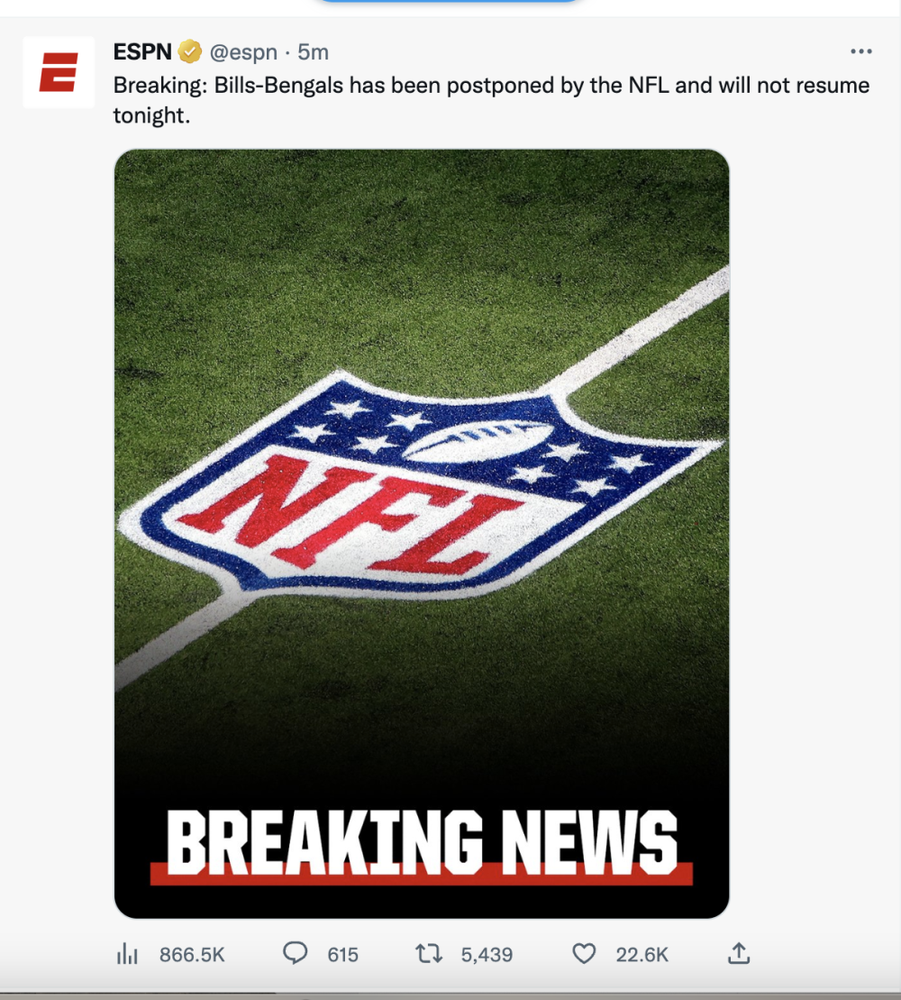

# 悲剧！NFL球员赛中心脏骤停被紧急送医 目前生命垂危比赛延期举行

北京时间1月3日，美国NFL比赛传来了悲剧，比尔队的达马尔-哈姆林遭遇严重伤病，一度使用了心肺复苏，目前被紧急送医，生命垂危。

当时，哈姆林在一次拼抢中被对手撞到了胸部，一开始，他自己站了起来，看起来没有什么大问题。可是，突然间，哈姆林径直躺在了地上。

众所周知，橄榄球是一项身体冲撞非常激烈的比赛，在场上双方球员撞得人仰马翻那是家常便饭。不过，这次哈姆林遭遇的冲撞相当猛烈。

躺在地上的哈姆林久久没有起身，医疗人员为他进行了心肺复苏。比赛一度中断，场上的球员双膝跪地为他祈祷。

在现场医疗人员进行了心肺复苏之后，哈姆林也被紧急送往了医院。据悉，哈姆林有脉搏，但是，已经无法自主呼吸。在哈姆林被送往医院之后，这场比赛也被延期了。

NFL球员联合会官方也发声，“联盟所有人都在为哈姆林祈祷，目前唯一重要的是他的健康和安全。”

根据最新消息，哈姆林目前生命体征已经恢复正常，目前已插着呼吸机睡着。

