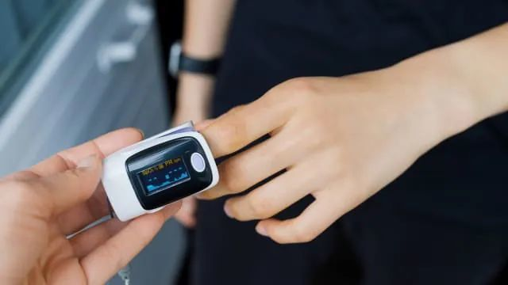
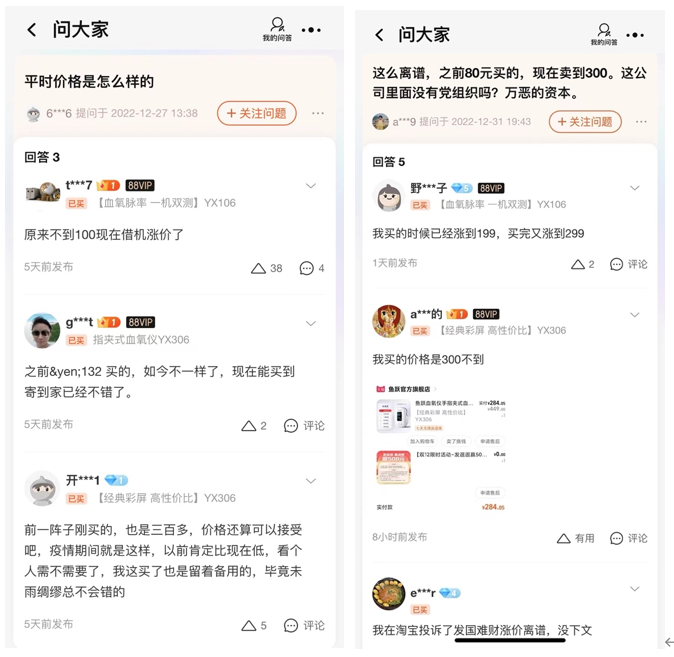

# 成本40元的血氧仪卖到300元？专家背书，出厂价一夜涨了50%

_来源：网络_

作者 | 周纯子

编辑 | 杨布丁

出品 | 棱镜·腾讯小满工作室

10多天前，北京正在经历疫情放开后的感染高峰期，布洛芬和抗原成了最热门的抢手货。小雅的医生朋友却给她发来一款血氧仪的链接，让她赶紧下单。“下一步就是抢这个了！”对方信誓旦旦地说道。

彼时，这款售价269元的鱼跃牌指夹式血氧仪尚有现货，但翻到下面的买家评论，得知1个月前这款血氧仪才卖100多块钱，这让小雅有些犹豫了。

等她第二天再点开链接，这款血氧仪一夜间已经涨价到299元，而且变成了预售，最快15天发货。其他型号的血氧仪要么售罄下架，要么也是预售的状态，一些没听过的不知名品牌倒是有现货，但价格都奔着四五百去了，小雅悔得直拍大腿。

继N95口罩、抗原、退烧药之后，近期血氧仪、制氧机等家用医疗器械，在专家们的推荐下，开始变得供不应求，价格也水涨船高，“94元的血氧仪涨到299元”等话题一度冲上热搜。

“很多人都去炒这个流通环节，倒腾的人多了，价格自然也跟着上去了。”医疗器械行业资深从业者方明（化名）告诉作者。但终端零售渠道方面则表示，如今想从血氧仪上挣钱并不容易。

行业公认技术含量并不高的血氧仪能卖出如此高价，最大的收益方是谁？

**专家背书，销量增长20倍**

血氧仪是一种监测患者的脉搏、血氧饱和度、血流灌注指数等指标的医疗器械，可分为指夹式、腕表式、手持式、台式等多种类型，并广泛应用于各种危重症的监护以及日常健康监测。人体正常血氧饱和度≥95%，长期低于93%需要及时就医。

有行业人士告诉作者，即使是在疫情刚开始的2020年，血氧仪也没有像现在这么走俏过，当时大家对血氧并不重视，不像欧美发达国家的血氧仪普及率那么高，导致在这一波行情起来之前，药店的常规备货并不多，在国内卖血氧仪的医疗器械公司也比较少，大部分出口到海外。

2022年12月21日，复旦大学附属华山医院感染科主任、国家传染病医学中心主任张文宏在演讲中提到，应警惕高龄老人的“沉默性缺氧”，因为老人对缺氧反应迟钝，甚至完全感觉不到胸闷、呼吸困难等。他建议居委会或企业可以给每个有老年人的家庭送一个脉搏血氧仪。

中日友好医院副院长、国家呼吸医学中心副主任曹彬也建议道，脆弱人群应尽早在发病初期进行抗病毒药物治疗，并且准备指夹血氧仪进行重症监测。

专家们的建议很快得到响应。12月28日，北京市卫健委发布通知称，将组织对老年人等高风险人群发放血氧夹，在家自测血氧，明确简明监测预警标准。

在专家和政府的“背书”下，血氧仪一炮而红。

作者注意到，在天猫鱼跃官方旗舰店，一款售价299元的指夹式血氧仪月销量超过了30万。而在下面的评论互动区，最新的问题集中在对其涨价的质疑。有买家表示自己以前同款才花了80多块钱，而大部分买家以前的价格在100元出头。

也有买家表示能接受这样的价格，认为特殊时期能正常发货就不错了，“未雨绸缪总不会错”。

天津斯曼尔生物科技有限公司董事长樊志勇告诉作者，近期市场上N95口罩、血氧仪、制氧机等产品都很短缺，基本上供不应求。血氧仪以前都卖几十块钱，现在涨到了两三百；5L的制氧机以前在3000元左右，现在也涨到了5000多元。

作为多家血氧仪、制氧机品牌的代理商，樊志勇透露，近期他们血氧仪的销量至少增加了20倍，他预计这一波血氧仪的行情将持续到2月底。

方明也向作者提到，疫情放开以来，血氧仪的需求呈爆炸式的增长，“基本上所有的厂家都在满负荷运转”。

他向作者讲述，几天前他刚帮朋友以75元的单价购买了4只血氧仪，过了两天这个朋友又想买40只血氧仪来送人，结果等他忙完手头的事情去帮朋友找货源的间隙，这个朋友已经以180元的单价自己买到了。

“都不带还价就直接抢购了。”在他看来，大家的这种恐慌性心理也助长了血氧仪价格的蹭蹭上涨。

事实上，出现抢购的不止血氧仪。樊志勇告诉作者，他们工厂如今一天生产20万只N95口罩，并可以实现零库存，即当天生产当天就销售完，“这在以前是不敢想的事”。而方明则见证了抗原厂家提货现场的繁荣：一辆辆大卡车排着长队，集装箱堆满仓库门口，现场一度竞价发货，“特别像一个菜市场”。

**出厂价涨了50%，厂家最赚钱？**

对于涨价一事，鱼跃医疗的工作人员回复媒体称，自营旗舰店中的299元属原价。如果消费者此前购买价格低于299元，可能是不同活动中公司给出让利空间，且人工、物流、原材料上涨，目前已调回原价。

但这一说法很难让行业人士认同。方明向作者坦言，这一轮血氧仪的成本端其实涨得很少，“个人认为涨价原因还是供小于求这个市场因素的影响”。在他看来，赚到钱的首先还是厂家，毕竟他们掌握着货源，出厂价格肯定会有相应的上涨，他估计这个涨幅在50%左右。

其次，据方明介绍，目前整个医疗行业的人都在炒血氧仪，谁能拿到货，谁就能挣到钱。这就导致原本的厂家-经销商-
终端药店这条代理商路径上，又多了好几层，有可能经好几道手才到达终端消费者手中。

一位不愿具名的行业人士也提到，即使血氧仪的上游原材料（如Led屏、线路板）有所涨价，工厂年底招工困难，但这些因素预计也就增加了血氧仪5%左右的总成本，因此受益最多的还是厂家。据他透露，在疫情放开之前，血氧仪的出厂单价只有几十块钱，而现在出厂价已经涨到了120元-150元。

“我也没听说血氧仪的原材料涨价，倒是制氧机里的压缩机比较紧缺，一下子供应量没那么大。”北京一家大型连锁药店的相关负责人告诉作者，作为一家大的经销商，他们上游会直接对接厂家，拿到货后要么在自己的药店销售，要么再分销给其他小经销商，等于既做零售又做批发。

据他介绍，如果是批发业务，中间一般会加价10%-20%左右；如果直接在终端销售的话，则会在出厂价的基础上加价50%，但扣除线上扣点、物流运输这些成本之后，最终也就能赚20%左右。同时还得承担一些风险，例如近期因为抗原物品肆意涨价，一些药店面临上百万的罚款。

“疫情相关器械药品的价格暴涨，厂商肯定能赚到钱，但像我们这样的终端零售机构就很难说了。”该负责人感慨。

2022年12月29日，针对鱼跃医疗血氧仪涨价的情况，江苏省丹阳市市场监督管理局工作人员回复媒体称，已经收到相关投诉，局里已着手调查。

**成本仅40元，技术含量不高**

血氧仪属于《医疗器械监督管理条例》规定的具有中度风险、需要严格控制管理以保证其安全有效的第二类医疗器械，适用于对人体血氧饱和度及脉率进行监测。截至2022年12月28日，国家药监局和各省药监局已批准90个血氧仪产品上市，其中广东就占了38个。

多位医疗器械行业从业者告诉作者，血氧仪的技术含量并不高，不同品牌的精确性差不了太多。“平时都是用公共模具，大家生产后拿去贴牌组装，各公司平时也不太花力气去做。”其中一名从业者如此评价。

或许正是由于血氧仪的附加值不高，即使面对市场需求的突然暴增，一些企业在扩大产能方面仍然比较保守。鱼跃医疗(002223.SZ)近期在投资者互动平台就表示，对于短期内市场关注度较高的品类，公司会考虑到是否符合公司优势、发展方向、战略定位等多方面因素后进行审慎决策和资源投入。

就连康泰医学（300869.SZ）在自己的财报中也提到，血氧仪的主要原材料有显示器件及配件、二极管和集成电路等，公司血氧仪产品结构并不复杂，在所有品类中单位成本及毛利率均最低。

公开资料显示，康泰医学是国内较早研发、生产和销售血氧仪的企业之一，也是全球最大的血氧仪供应商之一。在过去两年，该公司累计生产出超过2500万台/套血氧仪供应给全球客户。近期该公司在投资者互动平台上提到，目前血氧仪的日产量超过十万台/套，后续将根据订单和市场需求情况继续扩大产能。

在疫情之前的2019年，康泰医疗生产的血氧仪毛利率仅为35.94%，而心电类和血压类产品的毛利率则超过了60%。或许正是由于这一差异，2017-2019年，康泰医学单位成本较高的监护类、心电类产品销量及其占比逐年增长，而单位成本较低的血氧类销量及其占比逐年降低。这三年血氧仪的销量分别为195万台、184万台、168万台。

在成本方面，2019年康泰医疗血氧仪的单位成本为41.46元，平均售价为64.74元。而且因为市场竞争原因，血氧仪的出厂价格已经连续三年下跌。2017-2018年的平均售价为68.01元、67.13元。

_康泰医学血氧仪的出厂价格，来源：财报_

疫情的出现改变了这一趋势。2020年康泰医学的血氧仪销量为1560万台，同比暴增825%，血氧仪的毛利率也上涨至56.49%。公司实现营业收入14亿元，同比增长261.84%，归属于上市公司股东的净利润为6亿元，同比增长731.37%。

甚至有观点认为疫情开启了中国医疗器械产业的“黄金十年”。根据《中国医疗器械蓝皮书(2021)》，中国医疗器械行业在新冠疫情防控中快速发展，医疗器械生产企业数量从2019年末的18070家，增加到2020年底的26465家，增幅达46%。2020年中国医疗器械市场规模为7721
亿元，同比增长21.76%，中国已成为全球第二大医疗器械市场。

**腾讯新闻出品内容，未经授权，不得复制和转载，否则将追究法律责任。**

