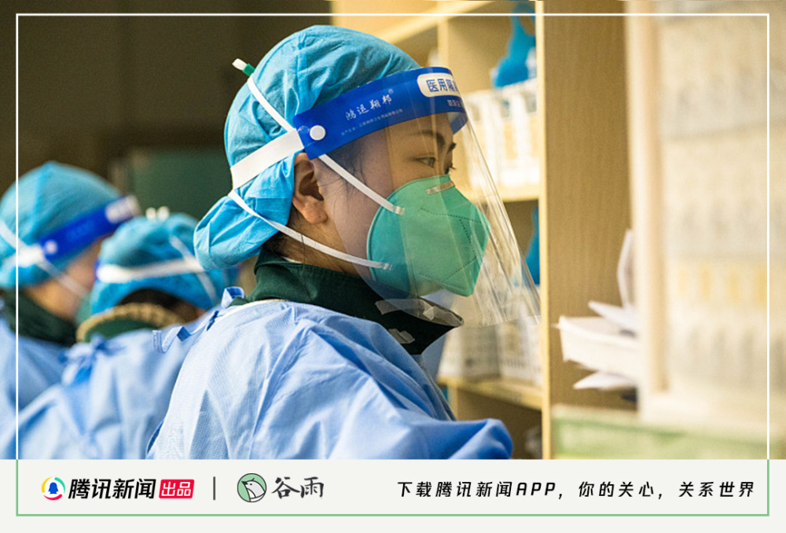
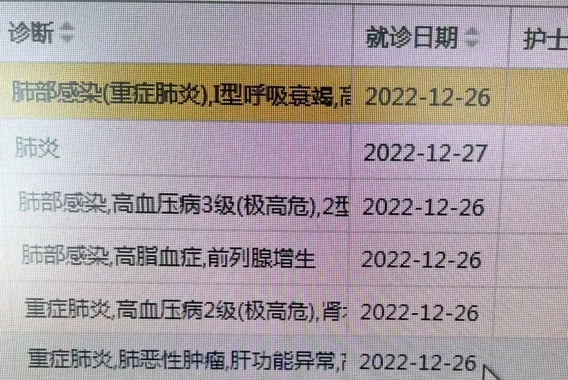
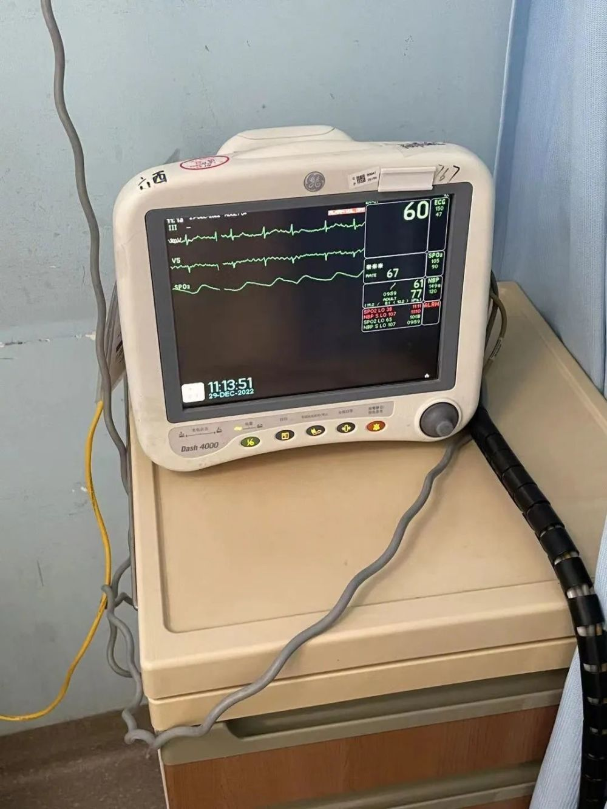

# 我，眼科医生，救治新冠病人：什么内分泌科消化科，现在都是呼吸科

撰文丨张月 编辑丨裘海棠 出品丨腾讯新闻 谷雨工作室

在2022年末这个凛冽的冬天，中国的很多医生完成了一次集体“改行”，他们都在一定程度上成为了呼吸科大夫。

周杉是一家三甲医院的眼科医生，在一周前被派去支援呼吸内科，和他同时去支援的，还有骨科、风湿免疫科、内分泌科、血液科等各个科室的同事。他们在呼吸科医生的指导下，迅速上岗，开始收治新冠病人。

“现在病人只剩下了一种，就是肺部感染+合并症的病人。内科也只有一个科室，那就是呼吸内科。”他告诉我。

资源优渥的城市，捉襟见肘的乡镇，情况是类似的。在竭尽急诊、呼吸科、重症的资源之后，医院都不得不打破界限，紧急培训，让没有接触过肺炎病人的“新手”们迎战奥密克戎这场狂烈的、我们没有准备好的风暴。一位江苏地方医院的心内科医生告诉我们，他们科室收治了很多的肺炎病人，“都去当呼吸科医生了。”一位山西县级医院的医生说，外科的医生停了门诊去急诊轮班，收治病人。一位在山东烟台工作的生殖科医生告诉我，她也即将被派去支援呼吸科。

周杉一开始抱有侥幸，他以为自己支援的病区病人症状比较轻，但在上班的第一天，他做了自己学医多年来的第一次真人心肺复苏（CPR），和几个同事轮流按压了将近一个小时，但那位63岁的女病人还是离开了，他一直记得那个心电图变平的瞬间。

对于康复的人们来说，生活正在回归久违的正常。但对于艰难维系的医院和医护人员来说，重症和死亡高峰还没有过去，周杉们所经历的，也许正是这场战役最惨烈的部分。

以下是他的讲述：

1

我在这家医院工作了半年左右，一直在眼科门诊，做小朋友近视、弱视或者斜视方面的治疗。12月25号晚上突然收到主任通知，要去内科的病房支援，26号我交接了一下眼科这边的工作，暂停了门诊，27号过去的。

我不清楚具体抽调了多少医生，但每个科都调了医生，包括风湿免疫科，因为呼吸内科的医生根本不够。我感觉抽调的年轻人比较多，也许因为医学生本科的时候是内科、外科、妇科、儿科一起学的，实习的时候这些科室也都会轮一遍，那老大夫可能沉在自己的科室十几二十年了，对内科都忘得差不多了，所以新医生反倒还有一些记忆和优势。

我最开始被通知分配到内分泌了，心中还比较轻松，印象里内分泌的病人的病情都比较轻，想着应该能比较轻松地handle住。但是第一天去了才发现，现在还哪分什么内分泌科、消化科还是呼吸科。现在的内科只有一个科室，那就是呼吸内科，病人也只剩下了一种，就是肺部感染+合并症的病人。这个病区是一群内分泌医生对呼吸科病人进行治疗，里面还混了些外科和眼科医生。

其实不只是内科要收治肺炎病人，因为我的同学分布在各家医院，所以我也相对互相了彼此的情况。有些医院现在就是两个步骤，第一个步骤就是呼吸科的医生分散开来，到各个病房去，有些（其他科室）病房索性就改名为呼吸科病房了。一些其他科室虽然还是自己的名字，但是收治的病人也都是肺炎病人，比如说我知道的一家医院，已经开了17个呼吸内科的病区了，就是这么多人。

_©人民视觉_

现在的压力就是从发热门诊过渡到急诊和内科，我之前在发热门诊值过班，12月7号政策放开之后，发热门诊的病人会特别的多，因为大家都发烧了，也有一点恐慌，并且没有这个退烧药，所以大家都来发热门诊取药或者进行一些治疗。现在发热门诊的量其实是在逐渐地减少，取而代之的就是发热之后，有一部分有基础病的老年人或者不太健康的人进展成了肺炎啊，或者一些其他基础病啊，这些人可能对于急诊内科的需求会更大一些。

我的这个病区有40张病床，基本上全院的内科病房都是满的，除了心内科会空几张床，因为要给一些冠心病、心梗的患者留一些床位，其他的基本都满了。

2

我们进行了一些培训，呼吸科主治医师给我们发一些学习资料，比如说有创呼吸机和无创呼吸机怎么使用，碰到心衰应该怎么去处理，这个肺炎到底进展到哪一步了，影像学检查和他的体征相应关系，还有药物的剂量，下一步要该做一些什么样的检查，基础的知识我们肯定是有，但就是没那么熟练了。好在我们上面还有呼吸科主治医生，他会一边培训我们，一边给我们下具体的指令，告诉我们应该怎么做，我们有不会的也可以去问，目前来讲压力会小一些。

我们这个病区大概70%以上是80岁以上的老人，也有那么几位六十到七十之间的，大家的情况都还是比较严重的，对医生来讲也很棘手。

_图片来自周杉的小红书账号：北大眼健康D博士_

其实第一天去上班冲击就比较大。我学医八年，上一次目睹病人死亡还是5年前实习时见到的血液肿瘤病人和肺癌病人。但这次第一天上早班，就有一位63岁的病人不行了。她肺炎伴有严重的糖尿病，血氧一直在掉，我们做了插管，但是氧饱和度还是上不来，那个心电图已经平了。那是我第一次做真人CPR（心肺复苏），我们几个人轮着按压了将近一个小时左右，那个心电图又开始跳了，但是她那个肺已经吸不进去氧了，家属放弃了有创抢救，她撑了几个小时之后，人还是走了。另一位去世的病人是隔壁组的，是下午的同事说一个老爷子走了，我只见到了家属来办理手续。

在当时那种情况下你不会太注意自己内心里面的感受，该做什么就去做什么，过后才会觉得，已经有很久都没有过这种经历了。有一些之前就在内科抢救室待过的医生，他可能适应比较快，但像我一直在眼科，基本上没碰到过病人直接走了的这种情况，还要直接上手去抢救，以前没有过这种压力，这次可能压力给到你，你也只能去做这个事。

我印象最深刻的就是心电图变平的那个瞬间，眼看着她心跳就没有了，对吗？然后你也无能为力，虽然明面上是家属放弃了有创抢救，但谁都知道更重要的原因是她即便有创抢救了，大概率也是救回不来的，徒增痛苦而已。虽然是家属做了决定了，但是根本上还是你救不回来了，家属才这样选择的。

可能只有我们这种“菜鸟”还有这种感受。待得更久一点的医生，他们可能已经经历过很多次类似的场景了，碰到事情都很果断沉稳。也没有太多情绪上的表现。而且他们真的太忙了，如果值班的话，要从今天早上9点待到明天早上9点，但是如果交班不顺利，病人还有很多情况的话，就可能要待到第二天的下午，感觉大家都是在忙忙忙。

3

我主要负责两个病人，一位是84岁的老爷爷，一位是82岁的老太太，都是白肺。12月30号的时候老太太情况一直不太乐观，嗓子里卡痰，吐不出来，做了雾化血氧又掉到80%。老爷爷还行，治疗之后喘得轻了些。病人的家属都是中年男人，头发白了很多，我去查房的时候看到一位家属坐在椅子上睡着了，早上的阳光透过窗子照在儿子头上的白头发，有些闪光。我知道儿子们都是刚刚阳康，也很不容易。

_图片来自周杉的小红书账号：北大眼健康D博士_

我本来以为老爷爷能挺更长时间，但是1号的时候，老爷子先走了。3号的时候，老太太也走了。现在一个病床空出来，很快就会有新的病人住进来，那天我去查房的时候，12床已经是一位新的老太太，她看着比之前那位老太太要精神一些，希望她能熬过去活下来。

我们的支援初步定是一个月，一个月之后呢，如果确实控制得比较平稳了，峰值下来了，大部分支援的医生都会回去。但如果医院仍然是处于一个压力越来越大的紧绷状态，那可能还会延长吧，目前从统计上来看，并没有到最高峰，仍然是在逐步增加的一个状态，排队等着住院的病人很多。

前几天我帮着另外一个组的老师去抢救室推一个病人上来，50来岁的一个儿子推着80岁老妈，没有其他的家人，儿子拎着大包小包，他一天没有吃饭了，一直在抢救室门口，他跟着我们，一路上一边哭一边说，能不能帮帮她啊，他妈妈是一个老知识分子，就想走得有尊严一些。当时我看着就挺难过的。我们每天接触的都是这样的病人。

现在最大的问题就是医疗资源不太够，因为确实是大家想去治疗那么多病人，但是没有那么多床位，即便进来了之后，没有那么多呼吸机。

我有一个亲戚之前给我发微信，说家里老人肺炎，在县里医院治疗，上了呼吸机，问能不能帮忙转到我们医院。我当时建议他先不要转院，因为大医院目前的救治能力不见得比他现在所在医院更加优秀，首先大医院现在的呼吸机难抢，只有经过评估的危重症患者才能用得上，另一方面由于氧气需求量过大，平均到每个人的氧流量出现了受限的问题。另外就是医生，大医院的呼吸科医生已经瓜分完毕，入院后和你一起对抗疾病的医生有可能是其他很多内科，其至外科医生在呼吸科医生的指导下帮助完成的，这样的医疗条件和专业的呼吸科医生直接诊疗相比，还是有差距的。

12月31号的时候，我回了一趟眼科，其实本来没排班，但因为一些小朋友要复查眼轴，我就又回去坐了一天门诊。你就看到那些小朋友叽叽喳喳进来出去，充满了好奇心和活力，家长看上去有点无奈。如果是一周前，我可能会觉得小朋友精力真好，家长可真累，但现在觉得很不一样，觉得那是一种治愈，一种更欢快、活泼一些的生命力，虽然我年龄也不是特大，但是看到那些小孩还是觉得真好。

在内科病房上了几天班之后，我感觉很多丢了的内科知识回来了很多，比如说我看一些内分泌的大夫对于血糖控制的方法就是超过了我之前的认知。之前我手术前查血糖，我可能需要请一个医生过来帮忙会诊，但这次之后，大多数的血糖调整就不太需要他们再过来指导。

最近觉得很开心的事情是，有一个80多岁的老爷子，真的从不行变得行了，不是我负责的病人，是我们组其他医生负责的。他来的时候是白肺，来的时候症状很重，后来治疗之后慢慢能够坐起来，然后能够下地走动，又能进食了，现在这个监护、吸氧全都不用了，可能再过几天，他就能回家了。

◦ 周杉为化名。

版权声明：腾讯新闻出品内容，未经授权，不得复制和转载，否则将追究法律责任。

