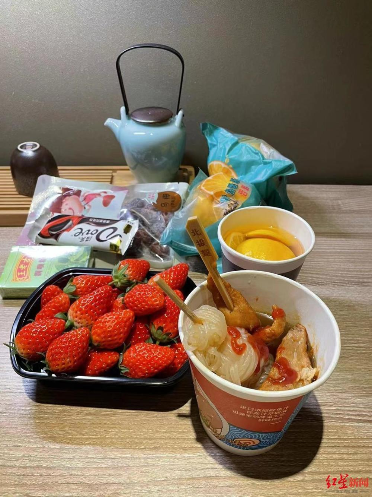

# 独自对抗奥密克戎，那些去“抗阳酒店”自我隔离的人们

红星新闻记者丨李文滔 实习生丨高淼森

责编丨唐欢 编辑丨何先锋

2022年12月26日，国家卫生健康委发布公告，将新型冠状病毒肺炎更名为新型冠状病毒感染，自2023年1月8日起将新型冠状病毒感染从“乙类甲管”调整为“乙类乙管”。

在2022年的最后一个月里，随着奥密克戎病毒致病性的减弱以及我国疫苗接种的普及、防控经验的积累，全国各地逐步对疫情管控实施有序开放……人们纷纷走出家门，城市早晚高峰开始出现拥堵，街头巷尾充满了活力——“烟火气”回来了。

然而，或许是出于对奥密克戎的认识不足，或许是出于对家人身体健康的担心，不少民众仍对开放充满了担忧。一些人在不小心感染后，仍然选择离开家门，住进酒店独自对抗病毒。他们，为什么要这么做？

1 为何选择自我隔离？

“因为家里有老人和小孩。”在红星新闻记者抛出问题后，朴女士脱口而出。朴女士今年33岁，家住上海的她拥有一套3居室，同住的还有60岁的老人以及4岁的孩子。

与朴女士一样，在全国社会面有序开放的第一波感染潮中，许多人出于对家中老人和小孩身体健康的担心，选择独自外出到酒店进行自我隔离。

据澎湃新闻报道，2022年12月21日，浙江金华一酒店被临时改造成“自我隔离酒店”，只接待感染者入住，此事经媒体报道后登上热搜。该酒店经理接受媒体采访时表示，目前入住率在80%左右。

但事实上，家人对朴女士外出自我隔离的举动并不完全支持。一方面是因为奥密克戎的高传播性，在感染后与其共同生活的亲密接触者基本都会感染；另一方面则是出于对其外出隔离过程中病情加重后无人照顾的担心。

“但考虑到家里的老人小孩，我还是出来了。而且即便他们最终感染，那错峰后我也能腾出时间和精力来照顾他们。”朴女士说。

同在上海的戈女士还未成婚，但由于家中老人患有脑梗，因此她在发现自己阳性后不到一个小时，便收拾好了东西前去酒店自我隔离。

这是一个艰难的决定。从专家的科普以及“阳康”者对感染体验的分享来看，相当数量的人群在感染后出现了浑身酸痛无力、高烧腹泻等症状，更有甚者几乎在短时间内丧失了生活自理能力。而到酒店进行自我隔离，则意味着需要独自承受奥密克戎对身体的攻击。

与朴女士情况类似，苏女士家里不仅有7岁的孩子，还有年过六旬的父母，两位老人身体不好，还患有脂肪肝。在出现症状后，苏女士决定就近找一家“抗阳酒店”进行自我隔离。前后七天隔离时间里，她显得格外小心。包括酒店提供的清洁服务，以及去餐厅的就餐活动，她都选择了拒绝。

过去三年以来，进入酒店的隔离会享受到隔离政策背景下的保证供给，包括但不限于必要的医药保障、日常起居的饮食供给，当然还有最重要的——划定隔离区域，禁止外出。

然而“抗阳酒店”的隔离似乎有所不同。“办理入住后我就不再出门了，必要的物资我都靠外卖来解决，酒店完全没有限制我的外出活动”，朴女士告诉红星新闻记者。

2 独自对抗奥密克戎

2022年12月18日深夜，当世界的目光聚焦于梅西和姆巴佩的世界杯决赛夜时，苏女士则躺在酒店的床上沉沉睡去。彼时，她身体的免疫系统也在与奥密克戎病毒进行一场对决。

“我没有体温计，但感觉自己发烧到38度左右了。”苏女士回忆这最难熬的一夜。服用了布洛芬后一直到次日凌晨5点，她才觉得自己身体没有那么难受——奥密克戎被打败了。

但脱离了必要的组织保障供给，个人的隔离很难做到面面俱到。“酒店隔离的困难点在于用药和生活用品还是不如家里方便”，苏女士说，“家里人先后来送过养生壶、自制电解质水的糖和盐、换洗衣物、加湿器、抗原等”。这些家庭中随手可见的物品却几乎无法全部带到隔离酒店中，感染者得到的保障要比在家庭中少得多。

_苏女士嗓子不适准备的物资 图据受访者_

“感染后发烧，食欲会下降得很厉害，吃一点东西就想吐。”苏女士称，而后杭州经历一波感染潮，外卖的等待时间也变长了。戈女士对此感同身受。她称，因为感染高峰，上海的外卖骑手也出现了大面积感染，“打开外卖送餐软件下单，配送时间要接近两个小时。”

“许多时候超过了2个小时还没骑手接单，这时候外卖平台就会把订单自动取消掉。” 戈女士称，她只能戴好口罩、做好防护措施后，前往酒店附近的餐厅购买食物并打包。

朴女士在进入“抗阳酒店”隔离前，做了充足的准备工作。“我测出来阳性之后，马上戴上N95口罩，让老公去哄娃睡觉，我则去收拾了必备的药，后又去水果店花了200多块钱买了柠檬、沃柑……”

在网络上，许多感染者分享了自己的感染经历——“高烧后蜷缩在床上感到头痛欲裂、四肢冰凉，闭上眼睛也感觉眼皮仿佛沾满了辣椒，火辣辣地熏烤着充血的眼球，心跳声清晰可闻。”

朴女士选择时刻让自己身体的电解质保持平衡，以便更好地抵抗奥密克戎的入侵。“有一天夜里发烧38度多，我起床马上外卖下单了大葱和生姜，用葱姜加入红糖熬水喝。冷的时候我就去泡手、泡脚，一遍不行就两遍，让身体暖和起来。”

3 并非没有代价的选择

2022年12月7日，国务院联防联控机制公布《关于进一步优化落实新冠肺炎疫情防控措施的通知》（“新十条”）。面对疫情防控新形势新任务，我国新阶段防控工作的重点调整为“保健康、防重症”。

如何尽力去保护家中老人和孩子不被感染，或是保证他们在第一波感染浪潮中尽可能平安地度过？

在网络上，一些网友称将工作地点搬离至家中，甚至不惜辞职。但更多的人，比如接受红星新闻记者采访的三位女士一样，感染后选择去酒店进行自我隔离，以此周全和平衡。

这样的选择并非没有代价。为了和家人保持便捷和畅通的联系，朴女士选择住址附近一家快捷酒店，费用300元一天，且不包含吃饭和用药。苏女士和戈女士所住的酒店更贵一点，接近400元一天。

红星新闻记者以“隔离酒店”为关键词在网络上继续检索，发现不少酒店推出了不同种类的隔离套餐。比如，海南昌江一家宾馆的价目表显示，单人隔离的房费折后为111元每天，餐费另付，一天90元，合计下来一天近200元。该宾馆老板告诉红星新闻记者，每日还有免费的上门核酸，阴性后可随时外出。

_苏女士在宾馆中准备的食物 图据受访者_

“如果家里没有老人小孩，我和老公无论如何也不会出来自费隔离的。”朴女士告诉红星新闻记者。

当问起外出隔离的费用负担问题，接受记者采访的三位女士均表示，虽然不便宜，但也可以接受。“能明显感觉到这个月的花销增大了不少。”戈女士称。

幸运的是，戈女士、苏女士在转阴回家之后，家人目前尚未被感染。也就是说，她们的选择收获了预期的效果。

4 “抗阳酒店”抓住了风口？

受到感染浪潮冲击不只是住店的客人，酒店行业也同样如此。

徐女士在江苏、浙江经营管理多家酒店。据她观察，此次感染浪潮对于酒店的客流量来说整体是减少的，“我们在江苏的酒店客流量整体下降了大约10%左右”。

“这一波感染浪潮导致商务人群外出活动减少，而他们却是酒店的主客。至于阳性病人的入住占比，确实是有，但是不多。”徐女士表示。

在前述选择自我隔离的三位女士采访中，记者发现，她们在隔离中遇到的问题大多数体现在缺少人照顾和保障，以及日常饮食的问题。对此，徐女士表示赞同，“这也正是大多数酒店目前的现状——无法全方位为阳性病人提供保障支持”。

_苏女士自我隔离时所住的酒店
图据视频截图_

红星新闻记者在微博上搜索“抗阳隔离酒店”，第一的话题讨论为“金华一隔离酒店改成抗阳酒店几乎住满”，这条话题发布于2022年12月21日，目前已有超过1亿次的阅读量。话题评论区不少网友认为酒店方的这一举措是其商业嗅觉的体现，是感染浪潮下对新风口的把握。

但徐女士对此却有不同意见，“其实大多都是有价无市，最近生意好的酒店是因为它两三年前生意就好。”徐女士名下有一家生意较好的酒店，目前每日入住率基本能达到100%，但这家酒店在过去两三年中一直处于较高的盈利水平和入住水平。

去年年底，徐女士在杭州的一家酒店最后一次被政府征用，用作过年返乡阳性人员隔离酒店的储备用房。“现在已经没有隔离的说法了，所谓的征用其实也是政府做一个预案，为阳性后症状较严重的人所准备的。”徐女士称。

—END—

