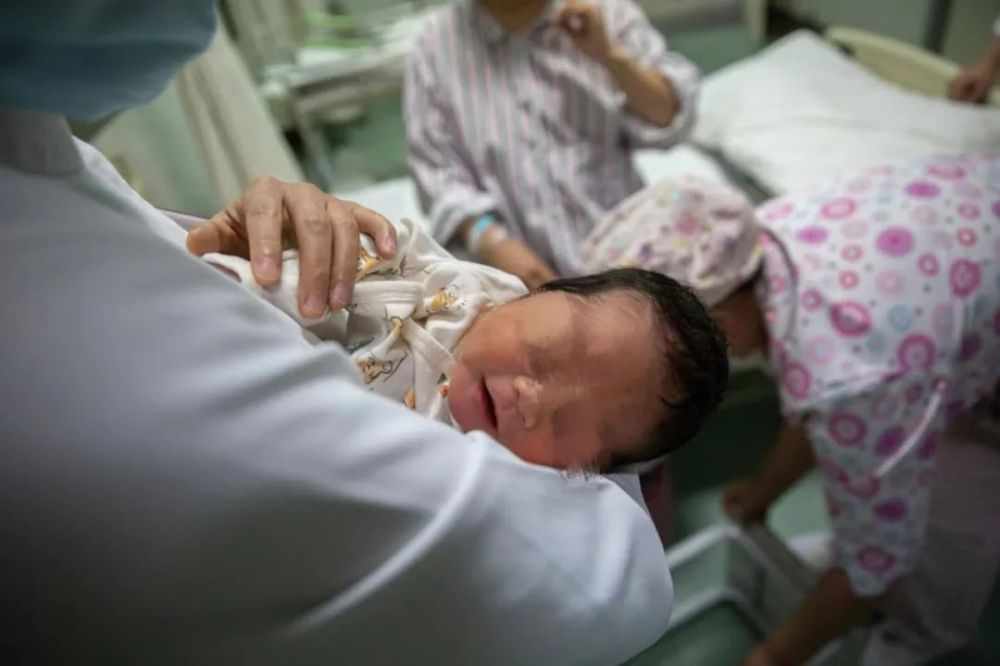
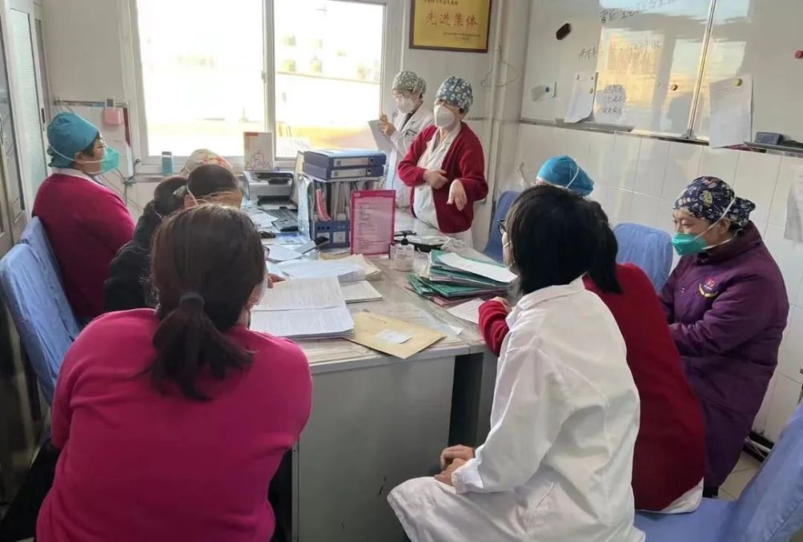
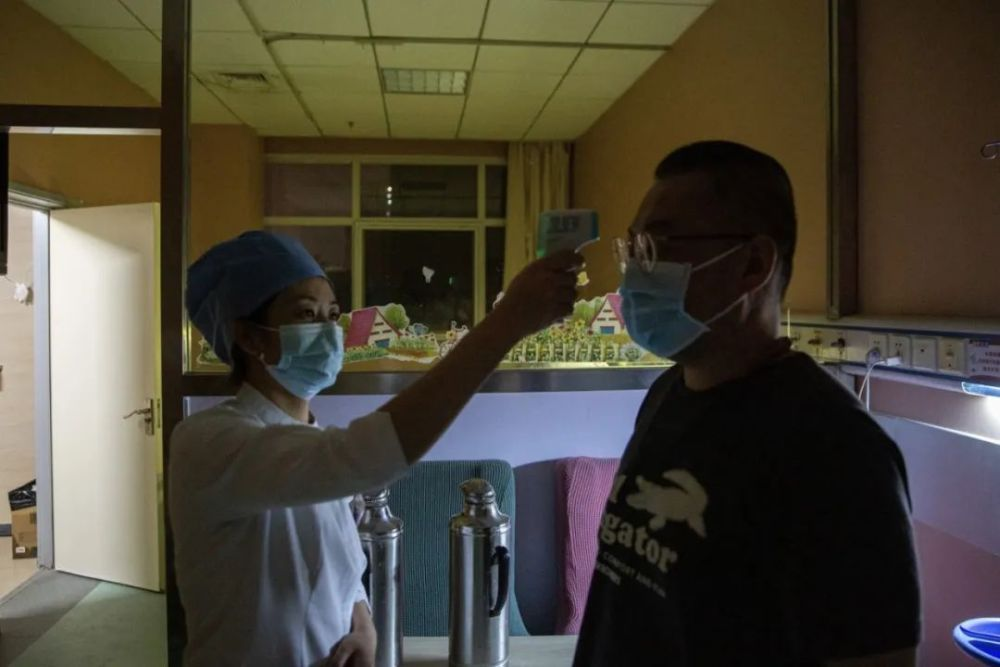
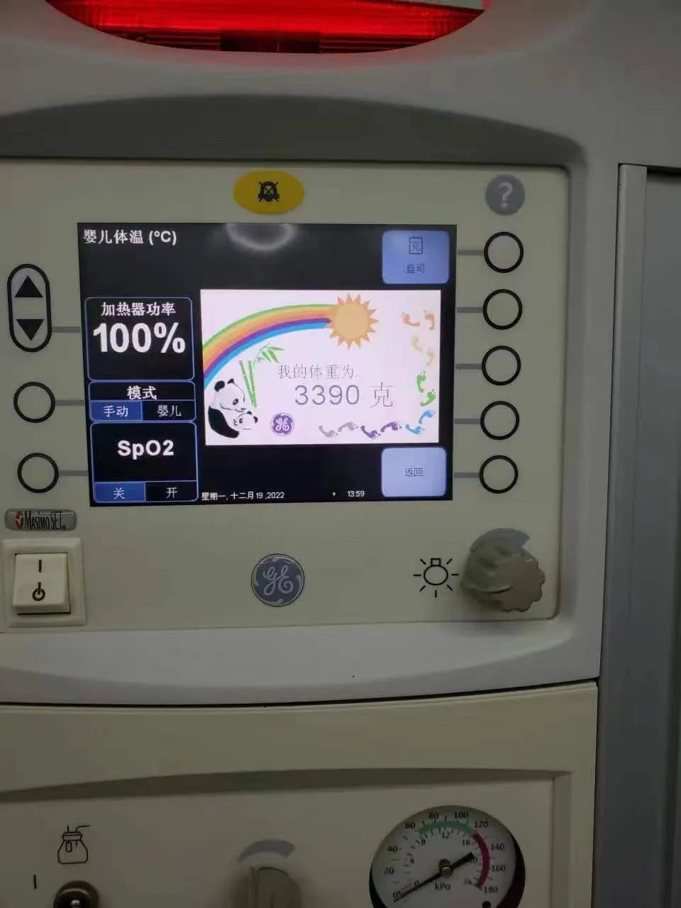
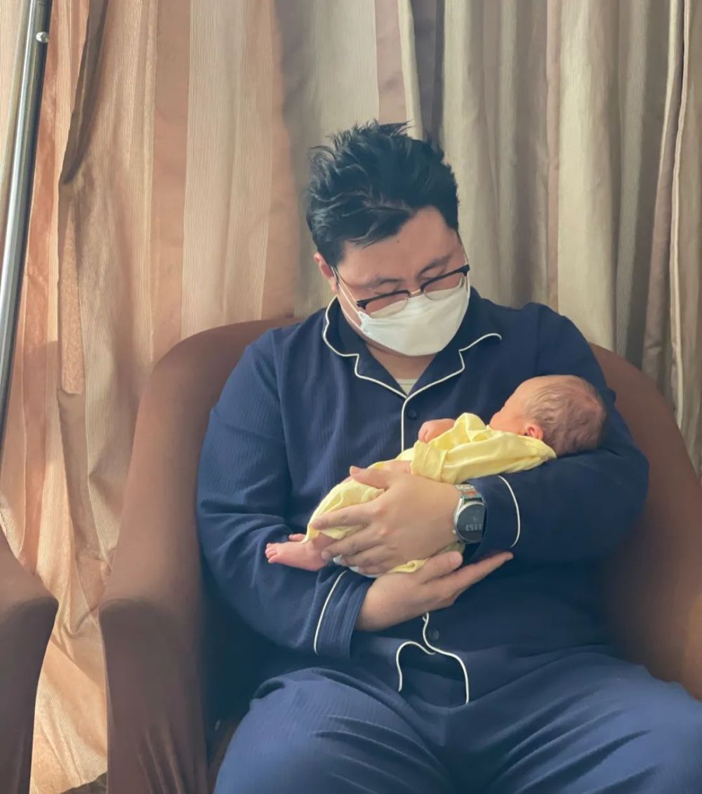

# 疫情下的孕产妇：有人感染中生产，有人焦虑引发宫缩早产

**“在怀孕的过程中，孕妇会感到无助，能有人去帮她，她心态会好一点。尤其在疫情之中，孕妇不敢去医院，心里可能更焦虑。有医生的指导，她们会好受一些。”**

_2022年5月7日晚，北京大学首钢医院产科病房，护士抱着一名新生儿。新京报记者
郑新洽 摄_

**文丨新京报记者 李冰洁 石润乔**

**编辑丨袁国礼‍**

**校对丨柳宝庆‍‍‍**

**►** **本文5812** **字** **阅读11** **分钟**

2022年12月16日，生产前两天，郭文君感到自己“中招”了。在低烧和浑身疼痛中，她生下了自己的第二个孩子，和她一同发热的，是山东青岛市西海岸新区中医医院为她接生的产科大夫。

疫情冲击波之下，和郭文君一样的孕产妇，更关心的是如何保护腹中的孩子。北京市某二级专科医院妇产科医生李梅，常常要直面孕产妇的这种困惑和担忧：“腹中的胎儿会被感染吗？我感染了能不能喂奶？”

2022年12月9日，国务院应对新冠肺炎疫情联防联控机制医疗救治组发布《关于进一步做好当前孕产妇和儿童健康管理与医疗服务保障工作的通知》，指出应当加强健康宣教、强化主动服务随访、做好医疗资源储备等，满足孕产妇和儿童等人群医疗服务需求。

北京市垂杨柳医院妇产科与生殖中心主任辛德梅在接受新京报记者采访时表示，目前国内外没有任何数据提示孕期母体的呼吸系统有新冠病毒的易感因素，这说明孕妇不是易感人群。

在辛德梅看来，孕妇发烧后不必过于恐慌，以免造成没有必要的宫缩、流产等后果。

被感染的孕妇

2022年12月16日快下班时，郭文君开始头晕。她把自己塞进厚厚的棉被里，但没有用，疼痛开始从膝关节蔓延，直到腰背、肩颈，温度计显示体温为37.5摄氏度。往常胎心监护仪的数值一般在110左右，但在发热中郭文君测出的数值接近160,几乎超出正常范围。

疼痛把郭文君封印在床上，她无法动弹，丈夫喂她吃下一片对乙酰氨基酚片——他们从社交平台和孕妇群里学来的经验，希望能缓解郭文君的疼痛和低烧。药物起到了暂时的退烧功能，此后的几天，她出现低烧反复的情况。

郭文君的大儿子出生于2020年9月，她还记得，当时打开孕妇群，大家最关心的是确定预产期和挑选医院。

_2022年12月20日，郭文君所在孕妇群中，怀孕的准妈妈们向医生提出问题。受访者供图_

但在2022年12月，新冠感染成了孕妇们讨论最多的问题。郭文君所在的孕妇群里，越来越多的人出现发热现象，大家在议论如何用药、发热如何就诊、会不会给孩子带来影响等问题。

感染的前一周，郭文君前往医院进行常规产检，作为一名怀孕39周的孕晚期孕产妇，感染了怎么办？还能母乳喂养吗？这些都是她关心的问题。

早在2022年12月4日，郭文君注意到，山东省卫健委对防控政策措施进行优化调整。居民进入公园、景区、服务区等公共场所，乘坐地铁、公交、出租车等公共交通工具，不再查验健康码和核酸检测阴性证明。

从那时起，郭文君就开始担心感染高峰的到来。但她没能料到的是，自己会在感染新冠后的第三天，在发热中生下她的第二个孩子。

2022年12月7日，国务院应对新型冠状病毒肺炎疫情联防联控机制综合组发布“新十条”。

疫情冲击波之下，感染的孕妇也越来越多。从2022年12月中旬起，山西省某三甲医院产科医生刘绍开始体验这轮感染高峰。她和同事们一天要看六七十个病人，从前“整个孕期也不见一个发烧的”，现在“进门诊的几乎没人不烧”。

2022年12月12日，郭桐的验孕棒和抗原同时显示两道杠，前一天，她出现发热症状，已经处在备孕期，她不敢随意服用退烧药，只敢用冰毛巾敷在额头上，进行物理降温。

2022年12月15日，怀孕5周的刘南星在感染后持续高烧超过39.5℃，她担心持续高烧对胎儿产生不利影响，于是用互联网问诊的方式请教了一位产科医生，对方建议服用泰诺林。等她的丈夫费大力气把药买到时，刘南星已经差不多退烧了。

辛德梅说，新冠病毒通过呼吸道传播，因此在感染新冠病毒后，大部分没有合并症的孕妇和普通人一样，以轻症或者无症状为主，会出现腰背酸痛、咳嗽、咽喉痛和流涕等症状。感染后五到七天便能趋于正常。

“进门诊的几乎没人不烧”

柳田怀孕19周，她的发热始于2022年12月9日凌晨。发热引发腹痛，即使家中备有常用药物，但作为孕妇，她不敢随意用药。当天，柳田和丈夫尝试用手机挂号看诊，两个人试了一上午，均以失败告终。

发热持续了一整个白天后，12月9日下午5点多，柳田和丈夫来到了北京妇产医院夜间急诊。按照当时的要求，柳田先是在急诊门口进行了抗原检测，同时进行抗原检测的，还有两对夫妇。

柳田说，北京妇产医院在当时实行阴阳分诊制度。核酸检测阴性后，她得以通过B入口进入医院，另外两个阳性孕妇则从A入口进入。

据柳田回忆，整个候诊的楼层只有一个房间用来看诊，只有一个医生、一个实习生，和一个护士。每一项检查做完回到就诊室时，医生的座位都是空着的。柳田在等待时，一个孕30周的双胎孕妇在走廊上的轮椅上躺着。

检查要等待，拿药也要等待，在等待了数个小时后，柳田拿到了医生开的两盒药，其中一盒是用来退烧的对乙酰氨基酚缓释液。在等待的过程中，她听到护士们的叫喊，“二层的阳性病人已经满了！”

刘绍建议低烧的人物理降温，如果高烧到38.5℃，建议吃一点对乙酰氨基酚。但连她所在的医院，有接近一周的时间开不出药。刘绍发现，前往产科门诊的，除了常规产检的孕妇，更多的是“发烧咳嗽，不来医院看一看不放心的人”。

北京市某二级专科医院妇产科医生李梅，亦经历了妇产科的全面承压。据她说，她所在的科室三十几个医生、护士都被感染，全科基本两个星期之内全军覆没，原则上休息三天，不发烧就上。但缺人手，发着烧也上，每天都需要接生。

李梅和同事们上了二级防护，要穿着防护衣，戴着面罩。李梅负责做门诊的检查，以及病房的分娩和管理、产后的随访。她是医院里较晚感染的一拨，但也只休息了三天随即上岗。为了应对这一困境，降低孕妇感染的风险，李梅建议孕妇晚点产检，将原有日期推迟一周左右。

_‍‍‍2022年12月22日早晨，李梅的同事们在办公室做病例讨论。受访者供图_

辛德梅认为，孕产妇在发烧后，家属可尝试帮助其物理降温，用温淡盐水冲洗鼻腔、漱口。当体温超过38.5℃，可以服用退热药品，如对乙酰氨基酚。如果咳嗽情况严重，建议到医院拍摄胸部CT，由妇产科医生协助内科医生在肺部评估后进行诊疗。

在辛德梅看来，真正需要引起关注的，是一些有合并症的孕妇，对这些人来说，感染新冠可能会引发并发症。比如，患有血小板减少症、妊娠期高血压疾病、妊娠期糖尿病的孕妇，感染新冠后的风险、症状、病程长短可能会各有差异。需要注意的是，患有妊娠期高血压疾病的孕妇，会不会出现血压继发升高，甚至子痫；患有妊娠期糖尿病的孕妇会不会出现酮症、酸中毒。孕妇应该严密监测血压、血糖，监测出现异常后，应积极到医院救治。

每周都开放门诊的刘绍最终也感染了。正常情况下，她所在的产科每天开三个门诊，5个大夫轮流上岗，但从2022年12月中旬起，门诊的数量缩减到一个，每天只有一个医生值班。从前顺产的产妇们有机会进行无痛分娩，现在麻醉科的大夫们也都挤在急诊和重症病区，无暇顾及产科。

据北京妇产医院公众号消息，为了应对北京疫情形势的变化，北京妇产医院在东西两院区同时开设发热门诊，东院区筛查诊区专门接诊发热孕产妇、发热伴妇科相关症状患者等。随着防控政策的调整，医院产房采取分区收治，为了应对紧急分娩，医院还开设了独立小产房保证母婴安全。

本轮疫情以来，北京妇产医院利用发热门诊一层、二层及新建的方舱诊室进行医治，配备产科、妇科医护人员轮岗坚守，针对有合并症和急危重症的患者，内科、MICU启动24小时会诊机制，全方位保障发热孕产妇和患者的院内会诊医疗需求，近一个月来，医院发热门诊平均每天接诊量达到120人次。

为方便孕产妇就诊、用药和咨询，避免来院期间的交叉感染，2022年12月，北京妇产医院开通了互联网诊疗服务，让孕产妇及患者可在线上与医生直接问诊、复诊、咨询和开药。

北京协和医院生殖中心创始人何方方在退休后经营起一家工作室，2022年12月以来，她也用互联网问诊、寄送药品的方式，希望能最大限度减少病人面诊的次数。“假如说你非来不可，做完检查之后也别等了，结果出来我们给你视频告知。”

_‍‍‍2022年5月7日，北京大学首钢医院产科病房，护士为产妇与家属进行定时测温，一日两次。新京报记者
郑新洽 摄_

在感染中生产‍‍‍

赵晚安在2022年12月5日住进了北京妇产医院的过渡病房，她需要在这个病房中待满48小时，之后，才能转入普通病房，进行剖宫产手术。

赵晚安说，在过渡病房之间，产妇们不允许随意走动。医护人员们穿着白色的防护服穿梭其间，不停有工作人员前来消杀。

手术定在2022年12月8日。赵晚安告诉新京报记者，当时北京妇产医院不允许家属陪同，护工也受疫情影响未能到岗。为了保证术后恢复，赵晚安提前一晚在病床两侧的桌子上放好了所有她需要的东西。

_2022年12月7日晚，赵晚安为第二天手术做准备提前摆放好所需物品。受访者供图_

12月8日，赵晚安的儿子顺利出生，但因出现呼吸窘迫被要求住院观察，后因妇产医院儿科病床已满，只能转院到华信医院。

产后的第一晚，因为缺少陪护，赵晚安只能喝预备好的矿泉水，然后忍住伤口的疼痛，在无人帮忙的情况下，按照医生的要求每半个小时进行左右90度的翻身，防止伤口粘连。恶露粘在护理垫上，没有人帮忙替换垫子，赵晚安只能自己用手去清理，“凉凉的，像猪肝”。

但赵晚安很快就迎来了转机。第二天一早，她发现第一批护工已经回到了医院，她也幸运地被分配了一个护工大姐。同时传来的，还有过渡病房被取消的消息，一个在过渡病房待了不到一天的产妇一边流鼻涕一边咳嗽，住到了赵晚安的隔壁床。

产后第三天，赵晚安在晚上7点得知自己核酸检测阳性。当时医院仍然要求阳性隔离，赵晚安坐在轮椅上，左右两手各推一个行李箱，由护士将其推入了隔离病房。

当晚，赵晚安被挂上了消炎针，第二天，她退烧了。

2022年12月18日一早，还在感染中的郭文君开始有规律地宫缩，她预感到快要生了。早上6点，她和丈夫来到医院办理入院手续，11点多，她的孩子顺产出生。即使生产过程已经称得上顺利，但回忆起生育的过程，她只记得当时“在发热的影响下，只顾得上浑身疼了”。生产完被推入3人间病房的郭文君发现，她的邻床也像她一样刚生产完没多久，孕产妇们或多或少都存在发热、疼痛和咳嗽的症状。

2022年12月20日，产后两天，郭文君退了烧，带着孩子出院了。

但不是所有的孕产妇都这么顺利。

赵晚安的朋友刘川在同一时间因为发热进入了北京妇产医院筛查门诊，焦虑引发了宫缩，在怀孕33周时，刘川早产生下了一个男婴，但在生产过程中，胎盘未能正常从身体中剥离，她又进行了二次清宫手术。

之前，刘南星不敢前往医院查看胎儿的情况。但在出现症状三天后，刘南星开始阴道出血，她不得已来到医院做检查，孕酮掉到了0.97，已经属于异常，孩子没能保住。

在低烧中，刘南星听到医生对她讲，需要进行清宫手术，但因为尚在感染期，不能上麻醉，只能药物流产。腹中的胎儿得来不易，刘南星感到痛心和失望。

但在何方方看来，孕早期流产的原因复杂，有些可能跟胚胎、免疫因素等相关，无法判定是否由感染新冠单一原因导致。

_北京某二级专科医院产房内，当婴儿出生后，护士使用仪器为其测量体重、体温以及血氧含量。受访者供图_

走出焦虑，等待春天

感染之前，怀孕26周的陈文婷在社交平台上一遍遍地刷新，每一个社交平台点开都是孕产妇及新生儿的内容。感染之后，她一次次还原自己的行程，“从一年前备孕到怀孕后，除了去医院产检哪里都不敢去，怎么就阳了呢?”她不止一次地想。

自诩心态良好的郭文君也难以抵挡身边人的问候，“一个同事预产期比我晚半个月，每天都要打电话问我情况怎么样，胎心会高吗？发热会影响孩子吗？”赵晚安在生产之前就加入了一个200多人的孕妇群，生产之前，赵晚安担心的问题每一天都在更新。

在李梅眼中，放开后的一周是产妇及家属担心的高峰期，李梅在办公室平均每天接到十几通产妇打来的电话。问题围绕着“自己阳了以后，孩子会被感染吗？”等问题展开。也有家属防护极为小心，问“从市区回来以后抱孩子，会不会让孩子感染？”

从孕产妇们的语气里，李梅能感受到她们的担心。因此，李梅将工作重点放在阳性孕产妇的护理细节指导上。针对家属的问题，一般建议对方观察，如果感染及时就诊，如果孩子发烧一定要去医院看病，如果大人发烧就让其戴上口罩，先不喂奶，把奶挤出来放在瓶子里让别人喂奶。

见到的孕产妇们基本上情况良好，刘绍也将更多的精力花在安抚病人的情绪上，劝她们不必紧张。

何方方在最大限度地与病人保持联系，安慰她们，“在怀孕的过程中，孕妇会感到无助，能有人去帮她，她心态会好一点。尤其在疫情之中，孕妇不敢去医院，心里可能更焦虑。有医生的指导，她们会好受一些。”

辛德梅也提示说，孕妇发烧后，需要放平心态，保证充足的睡眠、水分和营养。不必过于恐慌，以免造成没有必要的宫缩、流产等后果。

2022年12月底，刘绍的诊室里来了几个熟面孔，“都是定期来产检的，每一次都挂号在我这里”，在她看来，产妇们已经渐渐从焦虑中走了出来。“十天前，大家的担忧会更多一些，现在，几乎每一个来看诊的孕妇都感染过了，焦虑是一定会有的，因为大家面对的是未知，但现在，大部分人都挺了过来。”

李梅的工作也松快了一些，打电话来咨询的人少了，现在接起电话来，孕产妇们很少向她倾吐过多的情绪。

在距离2023年还有几天的时候，郭文君的家人都康复了。她曾发着热将母乳喂给孩子，但她的孩子并没有高烧，尚未感染，一切健康。

郭桐也在低烧之后回到了工作岗位，康复后，她去北京医院妇产科做了检查。这两年，她的婚礼反复推迟，这个孩子却比她预想的还要快一些，她期盼胎儿长大，等到6周，会有胎心胎芽，12周就能看到胎儿的四肢和一些主要脏器。

2022年12月18日，赵晚安和丈夫在华信医院终于接到了他们的孩子，当天，她发了一条朋友圈，内容是苏轼写的《洗儿诗》：惟愿吾儿愚且鲁，无灾无难到公卿。

_2022年12月底，在月子中心，赵晚安的丈夫抱着他们刚刚康复的孩子。受访者供图_

2023年元旦，赵晚安与丈夫和孩子在月子中心度过，她的儿子没能躲过新冠感染，发烧五天后，体温才渐渐降了下来。这个新年，孩子在赵晚安的怀中均匀地呼吸，她感到安慰。

（文中赵晚安、郭桐、柳田、刘南星、郭文君、陈文婷、刘绍、李梅、刘川均为化名）

