# 福建舰副舰长重磅表态，疑曝光航母服役时间，或创下“两个首次”

作为中国人自行研发和建造的全球唯一的“非美系超级航母”，国产常规动力电磁弹射型航母“福建舰”下水后，该舰的“一举一动”始终让很多人念念不忘。在我们刚刚步入新的一年之时，“福建舰”也传来了最新的好消息。据央视报道，解放军海军“福建舰”副舰长在接受采访时称：新的一年，我们一定全面抓好以试验试航为中心的各项工作，为实现建军百年奋斗目标贡献力量。（媒体报道：航母福建舰最新消息公布：今年工作中心是试验试航）

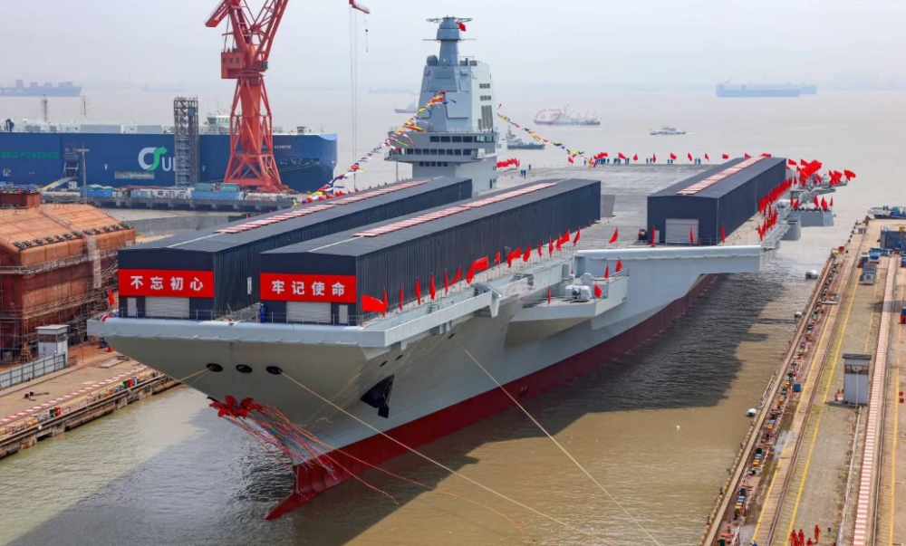

_国产航母“福建舰”下水现场_

从这为数不多的几句话中，我们可以提取出诸多重要信息，乃至令人倍感欣喜和振奋，而其中颇为关键的两个词就是“试验”和“试航”，先来谈谈试航。

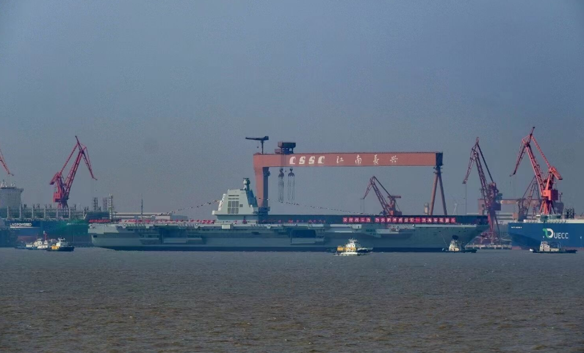

_下水不等于彻底完成建造_

我们知道，一艘军用舰艇下水后，并不等于该舰就已经100%完成建造，其只是具备了从干船坞转移到港口码头的能力。下水后的舰艇仍需要继续完成舾装工作，如武器和船电系统的安装、舰体设施的安装和舰体内部舾装（如通风系统、电路系统、管道系统和内部装饰等），待剩余的舾装工作完成后，才能展开海试。当然，港口舾装工作所需时间的长短，与这艘军舰下水时的完成度有直接的关系。

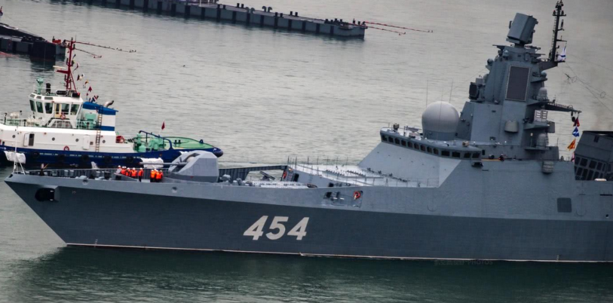

_俄罗斯22350型隐身护卫舰_

以俄罗斯海军最新型的22350型隐身护卫舰为例，首舰“戈尔什科夫海军元帅”号于十三年前下水，八年前开启了首次海试，也就是说从下水到海试用了足足5年之久。这一方面是因俄方造船厂的经费和技术不足，导致新型舰艇下水后的舾装进度始终不理想；另一方面，则与该舰下水时的完成度较低有关，即完成度越低，舰艇下水后所需的继续舾装时间就越久。

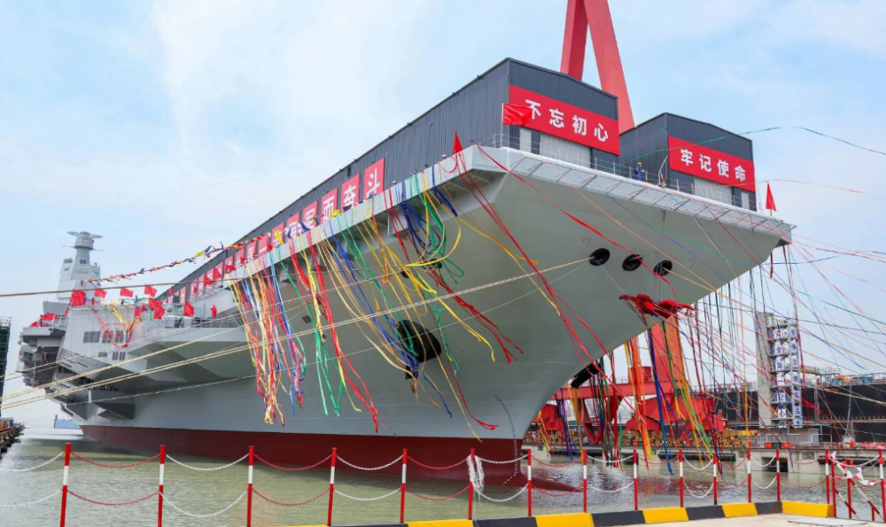

_“福建舰”下水时的舾装完成度很高_

而对于中国和美国一类的国家来说，新型舰艇下水前的完工度往往已经很高，诸多配套的武器、船电系统和内舾工作都已完成或接近完成，故下水后所需的继续舾装时间基本都在1年左右，然后即可展开海试，这是造舰能力强大的一种体现。所以说，“福建舰”去年下水后，今年即可展开试航，显然说明该舰剩余的舾装工作已基本完成，国内船厂的工作效率极为优秀。

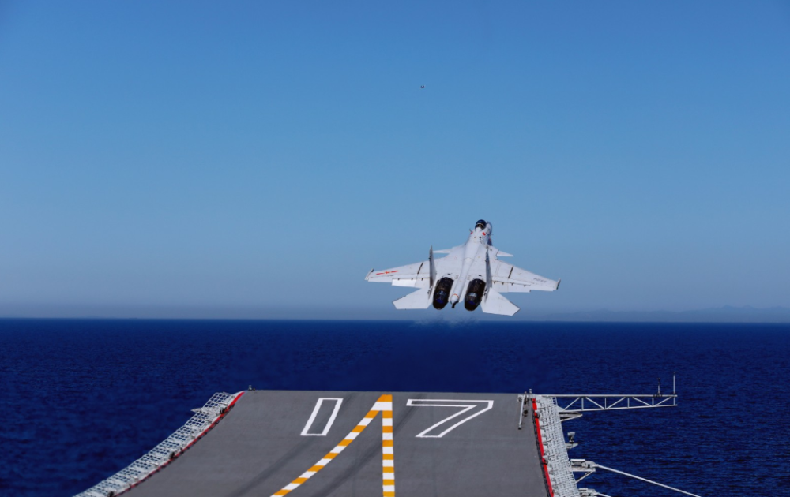

_“山东舰”的海试时间约为19个月_

进一步来分析，既然“福建舰”会在今年展开试航，那该舰的大致服役时间也能粗略推测出来了。通常来说，航母的海试时间在6~24个月左右，周期的长短与建造质量和技术成熟度有关，当然也与新技术的使用程度有关。以解放军首艘航母“辽宁舰”为例，该舰的海试时间持续了约13个月；我们的首艘国产航母“山东舰”的海试时间则持续了约19个月。

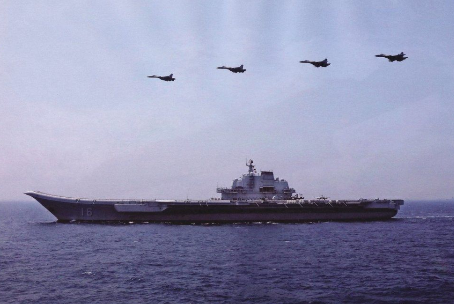

_“辽宁舰”的海试时间约为13个月_

由此想来，“福建舰”虽大量运用了新技术，但我们毕竟有过改装“辽宁舰”和自行建造“山东舰”的经验，故很多方面都极为成熟。“福建舰”的海试时间很可能也会在1年到1年半左右，然后便可交付部队，即有望在明年年中或年末服役。

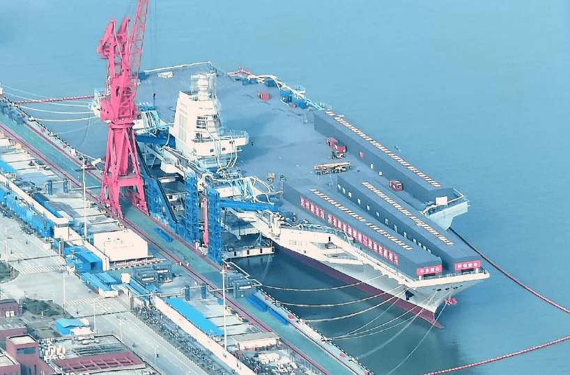

_“福建舰”将进行各项试验_

至于“福建舰”副舰长提到的“试验”，那项目可就太多了，堪称“成千上万”。至于其中最重要的几个大项，则分别为操锚试验、高速航行转弯试验、作战系统测试、舰载机准确进场和着舰系统测试、航母弹射系统测试和抗冲击测试等。这些项目都需要多轮试验，前期由航母建造方主导，并由军方技术人员提供指导，后期则由军方进一步组织验收试航。

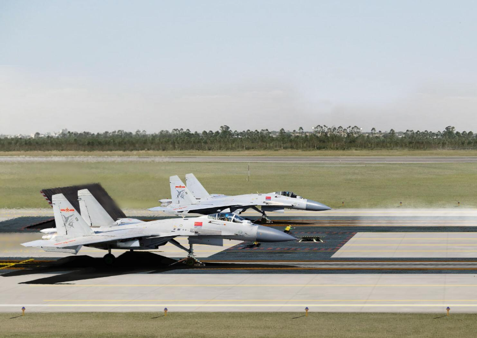

_弹射型歼-15进行陆地机场测试_

这一过程中，“福建舰”极有可能创下中国国产航母历史上的“两个首次”：

其一，国产航母首次以弹射器放飞舰载机。要知道，作为当前全球仅有的两个掌握了电磁弹射器技术的国家，“福建舰”敢于跳过蒸汽弹射器，直接采用最先进的电磁弹射器，足见国内在此领域的技术实力之强和底气之充足。

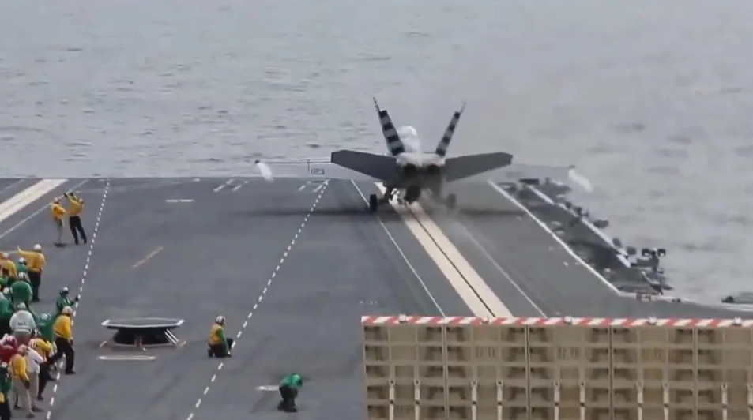

_美军“福特”号测试电磁弹射器放飞舰载机_

待该舰成功测试电磁弹射器放飞舰载机后，即意味着国内首次以此方式在海上放飞战机，同时也宣告着继美国后，全球第二个具备这一能力的航空母舰诞生。

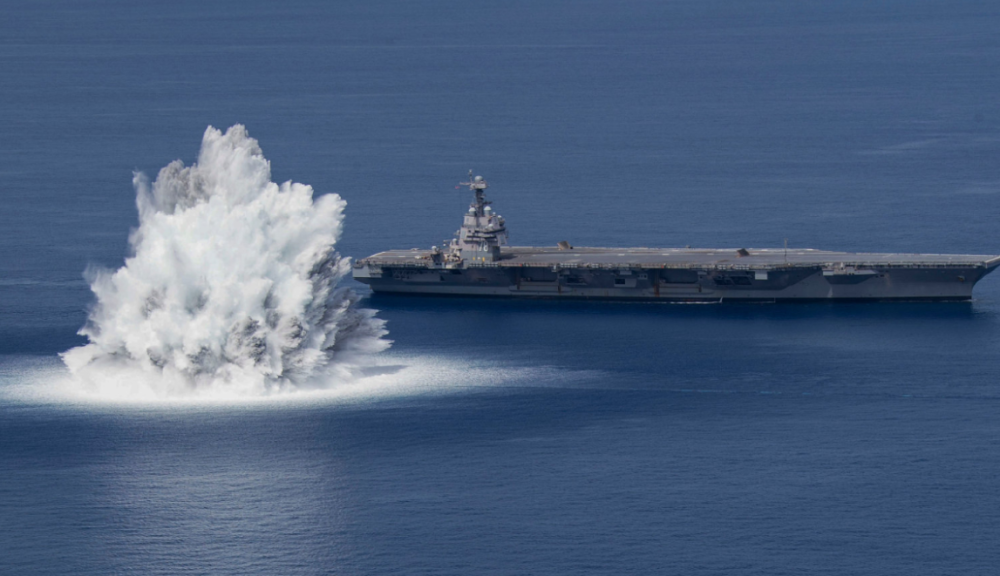

_危险且严格的全舰冲击试验_

其二，国产航母或将首次接受全舰冲击试验。在各项海上试验中，全舰冲击试验可谓是最为危险和严格的一项，航母将在近距离受到水下爆炸的冲击，以检验舰体结构和各项系统能否承受冲击、冲击波是否会对人员造成一定的影响，以及舰员的损管能力是否合格等。

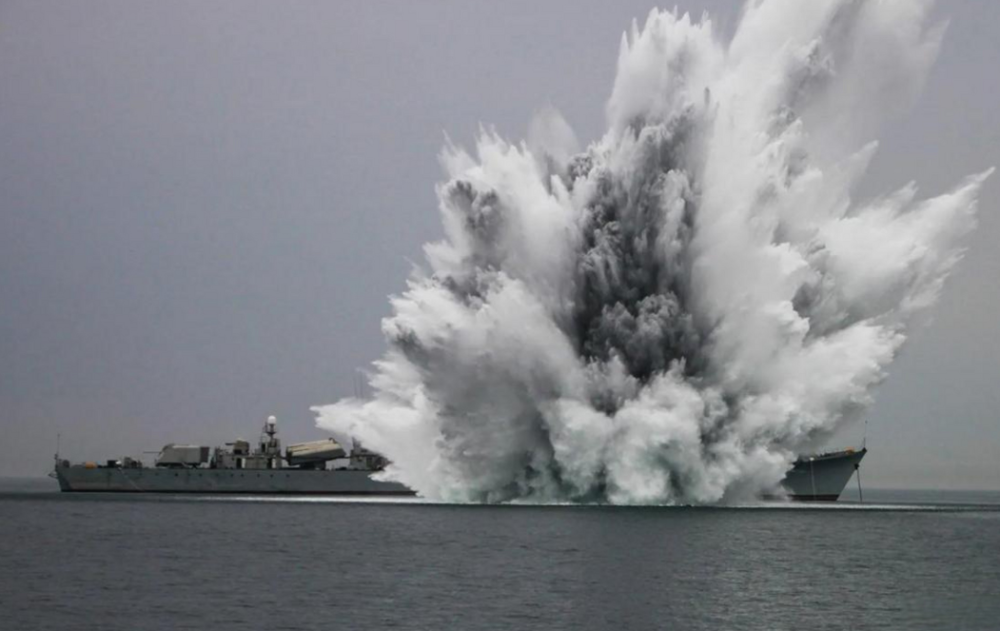

_国产051型驱逐舰曾接受抗冲击实爆试验_

中国海军在九年前首次组织“舰艇抗冲击实爆试验”，获得了大量一手数据。不过如今的“福建舰”是国内首款自行研发和建造的“超级航母”，诸多技术仍需以模拟真实的条件进行测试，故不排除该舰将迎来一次全舰冲击试验。倘若确实如此，那将创下中国国产航母在此领域首个纪录。

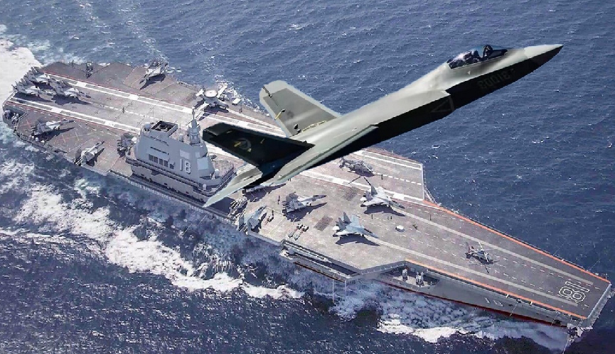

_“福建舰”服役之日不远了_

总之，“福建舰”的服役乃至组成战斗群已是近在咫尺。考虑到去年已有多艘055型万吨大驱和新一批次的052D型神盾舰服役，加上国内在综合补给舰和攻击型核潜艇方面的技术进步，“福建舰”一经服役即可组成完整且强大的战斗群，成为全世界唯一的“非美系超级航母编队”并驰骋大洋，相信这一天很快就会到来。

