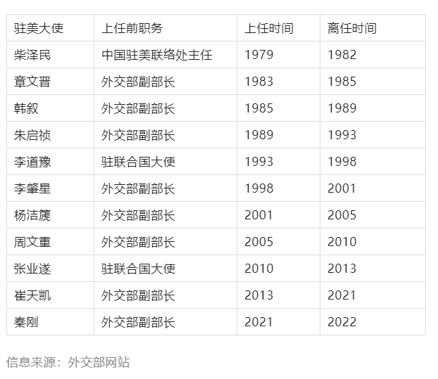
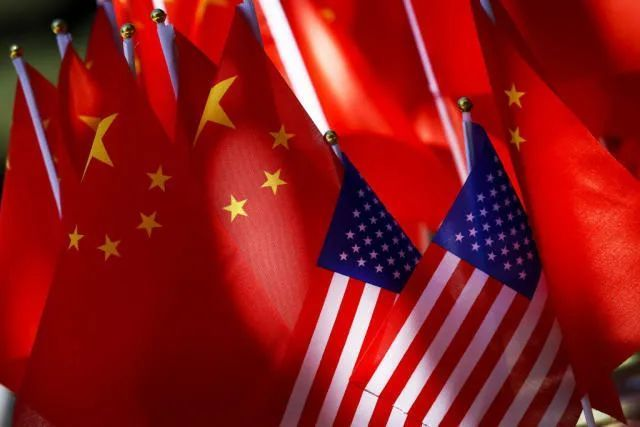

# 秦刚继任者备受关注，什么样的人可以当驻美大使？

新年伊始，中国外交领域的重要人事任免引发普遍关注，新任外交部部长秦刚今天（1月3日）在个人社交账号上连发三段推文，表示自己即将结束中国驻美大使任期。外界十分关注谁将会接任驻美大使一职，外交部发言人毛宁今日在记者会上表示：“中方重视中美关系，新任驻美大使将在履行必要程序后赴任。关于具体人选，建议关注外交部网站的有关更新。”

什么样的人可以当驻美大使？深圳卫视直新闻就相关问题专访中国社会科学院亚太与全球战略研究院副研究员孙西辉，以外交学研究角度解读中国外交官的发展之路。

**直新闻：担任中国驻美国大使，需要有怎样的工作的履历、资历，需要具有什么样的能力特质？驻美大使一职在我国外交领域工作中的特殊性是什么？**

**孙西辉：**
中国的驻外大使现在全部是副司级以上，正司级的占多数，副部级是中国驻外官员的最高级别。副部级的驻外官员主要包括：中国驻联合国的代表，中国驻联合国安理会常任理事国的大使，中国驻日本、德国、朝鲜、印度、巴西、南非的大使，中国驻欧盟代表，中国驻日内瓦联合国办事处大使。上述这些驻外官员都是副部级。
**美国是联合国安理会常任理事国，所以中国驻美大使是副部级，这一点是明确的。**

从历史发展的角度来看，中美关系在1972年实现缓和，双方互设联络处，派遣的官员叫联络处主任，相当于后来的大使，但当时还不是大使级的关系，直到1978年中美两国才建立大使级外交关系。从1972年设立联络处到2022年年底，50年来，中国一共任命了两位驻美国的联络处主任和11位驻美大使。其中这两位联络处主任中的第二任也是中国首任驻美大使——柴泽民。

通过梳理我们可以看到，
**第一，中国驻美大使的一个共同特点就是都有长期从事外交工作的经历，有丰富的外交经验。第二，中国有8位驻美大使，在出任驻美大使之前就已经被任命为外交部副部长，是有实职的副部级官员，这也是比较一致的特点。**
也就是说中国任命的驻美大使不是由正司级提拔为副部级，而是从在职在岗的外交部副部长的职位上调动到驻美大使的岗位上。这与驻其他国家的大使非常不同。我并不是说，中国任命驻美大使一定要有这样的规定，但是这反映出中美关系的重要性以及中国对中美关系的重视。

中美关系日益成为全球最重要的双边关系之一，也是中国最为重视和重要的双边关系之一。作为代表中国处理这种重要双边关系的首要外交官，中国驻美大使责任重大，任务繁重，不仅要履行所有的驻外大使职责，还要通过外交手段巧妙化解两国间的矛盾和分歧，调和中美关系。

**中国历任驻美大使（1979——2022）**

（直新闻注意到秦刚任驻美大使时，时年55岁，是中国驻美大使中第二年轻的大使，第一年轻是杨洁篪。崔天凯是任期最长的中国驻美大使，任职长达8年。）

**直新闻：孙老师您刚才是从历史源流的角度来谈您对中国任命驻美大使这样一个重要外交职务的考量因素，那么您能否从回溯历史的角度谈谈不同时期驻美大使工作的重点和难点？秦刚部长今天在与美国侨胞告别信中说中美你中有我、我中有你的利益交融格局，您怎么看待这样一种概括？对于下一任驻美大使来说，面临的主要挑战是什么？**

**孙西辉：**
首先来说中国驻美大使的外交工作，肯定是服务于党和国家的对美工作需要，听从外交部的领导和指挥，同时要结合中美关系中具体的问题去开展。从这个角度来看，中国驻美大使的工作在不同时期肯定有不同的重点和难点，比如说在1999年，北约轰炸南斯拉夫，炸了中国大使馆，这是中美关系中一个突发的重大热点问题。还有后来2001年的中美南海撞机事件，中国对美外交工作的定位和需要，取决于各个时期的国际形势变化。

但是不管是南海问题、台湾问题还是其他的热点问题，这些是中美关系中的一部分，不能代表中美关系的全部。中美之间的利益和联系也是密切交织的，比如在反恐、应对全球气候变化、应对新冠疫情等方面，中美也有许多共同利益和相近目标。所以中美关系涵盖的内容非常复杂多样，应该说是斗争与合作共存的一种状态。

当前美国将中国视为战略竞争对手，拜登政府实际上延续了特朗普政府对华的战略认知以及政策，虽然措辞上有所缓和，但是本质上换汤不换药，拜登没有取消特朗普时期加征的关税，在新兴科技领域，涉及国防安全和关键产业等领域谋求对华脱钩，试图重组亚太地区的产业链与供应链，在涉疆、涉港、涉台等问题上，不断地挑衅中国。
**对于下一任的中国驻美大使来说，我认为如何在坚定地维护中国利益的同时，维护中美关系的稳定。保持中美关系斗而不破，这是一个不小的挑战。**

而且拜登政府更重视理念，特别是所谓的“民主自由价值观”，他利用这些所谓的价值观去呼吁和加强与盟国和伙伴国的联系，试图建立一个对华小圈子。我们面临的不仅是一个美国，还有美国构建的小圈子。所以需要下一任驻美大使的外交身段和方法巧妙。

直新闻：您刚提到了中美在科技领域的竞争形势，非常错综复杂，美国有301、
337等一系列政策工具，对于外交官来说，在具体的中美的科技竞争中案例中，可以展开哪些工作？

**孙西辉：**
美国屡屡在科技领域利用本国国内法打压中国的企业，从中兴、华为到字节跳动，这个问题的本质是中美关系中美国对华政策问题，它是属于两国政府和相关的职能部门去处理的问题，比如说商务部科技部。当然作为中国驻外的官员，可以就这个问题向驻在国的政府和驻在国的外交部门进行交涉，开展一些辅助性的工作。

比如说首先是向驻在国的政府和外交部门，去阐明中国在这一问题上的立场和政策态度，这是外交官和外交部门的首要工作。第二个，在驻在国收集与这些案例相关的信息和美方的相关的政策动向，提供给中国政府和相关职能部门。大使馆、领事馆是一个国家在其他国家设立的合法的进行信息收集的机构。第三就是为在驻在国的中国相关企业和从业人员提供各类领事服务，这属于驻外机构职责范围内的一些事情。

**直新闻：随着中国与世界联系的日益紧密，中国人留学、旅游，以及企业出海的需求都越来越多。驻外使馆的工作包括外交官的工作是不是也随时更加庞杂了？您觉得外交官有哪些需要随着时代需求而增加的能力？或者说在工作中需要调整的部分？**

**孙西辉：**
随着中国各领域各行业走出去的情况不断增加，意味着中国需要保护的人财物等海外的利益越来越多，中国驻外机构的工作量和责任显著的增加，这是一个总体形势。

在这种新形势下，对外交官也提出了更高的要求，我个人理解是主要有三个方面：首先是外交官要“站稳立场，掌握政策、熟悉业务、严守纪律”。这16个字是周恩来总理时期提出的十六字方针，至今仍然适用。第二是更高标准的科学管理。外交官员的日常工作的每个环节都要有清晰明确的规章制度。第三是外交官需要坚持国家立场和人民至上的理念，
**兼顾政策的原则性和处理问题的灵活性，** 不能被动受制于规则制度，要把原则性和灵活性更好结合，服务于国家，服务于人民。

作者丨段晓卿，深圳卫视直新闻主笔

