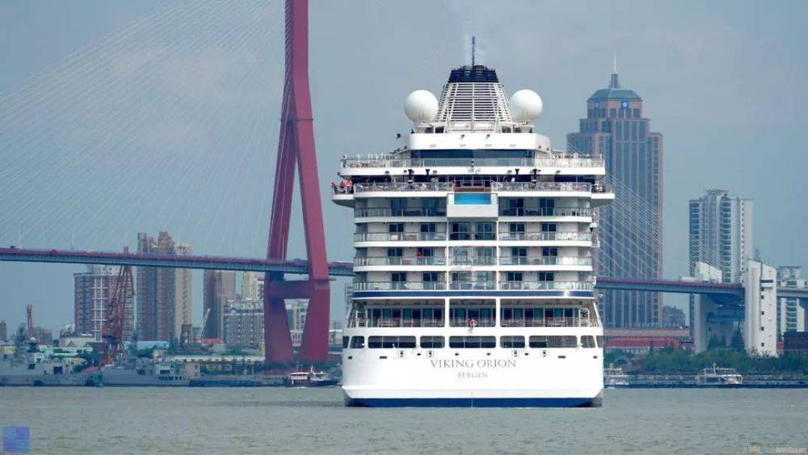

# 维京邮轮因有海洋附生物遭多个港口拒绝靠岸，数百乘客仍被困

“维京猎户星号”邮轮因船体上出现海洋附生物，在多个港口被拒绝靠岸，截至1月2日，船上数百名乘客滞留在澳大利亚外海，已经7天下不了船。

_“维京猎户星号”邮轮 资料图_

据法新社2日报道，船只追踪网站VesselFinder数据显示，“维京猎户星号”（Viking
Orion）自12月26日从新西兰惠灵顿出发后，迄今尚未停靠港口。该邮轮先后遭新西兰基督城、达尼丁以及澳大利亚塔斯马尼亚州的首府霍巴特拒绝靠岸后，目前在澳大利亚南部的阿德莱德外海等候，当地政府要求这艘邮轮必须先将船体上的海洋附生物清除干净，才准靠岸。

在“维京猎户星号”邮轮抵达阿德莱德前，澳大利亚国家海事协调中心认定，这艘邮轮的船体上有少量“生物淤积”，包括海洋微生物、植物、藻类和小动物，这可能会导致入侵物种进入非本地栖息地。澳大利亚渔业部门称，管理生物淤积是所有靠岸的国际船只的普遍做法，以避免有害海洋生物进入澳大利亚水域。

邮轮上的乘客海德里克对英国广播公司（BBC）表示，自2022年12月26日以来，他们一直无法下船，已经错过四个预定的停靠港口。“乘客的沮丧和愤怒情绪越来越强烈。大多数乘客在努力让自己享受更长的海上时光，但我们期待的是在四个港口的短途旅行。”

维京公司在一份声明中表示，正在从邮轮上清除有限数量的海洋附生物，这导致船只错过了行程中的几个站点。邮轮预计将驶向墨尔本，将于当地时间1月2日停靠在那里。但是有乘客表示，由于行程延迟，他们必须要等到1月4日抵达悉尼后才能下船。

