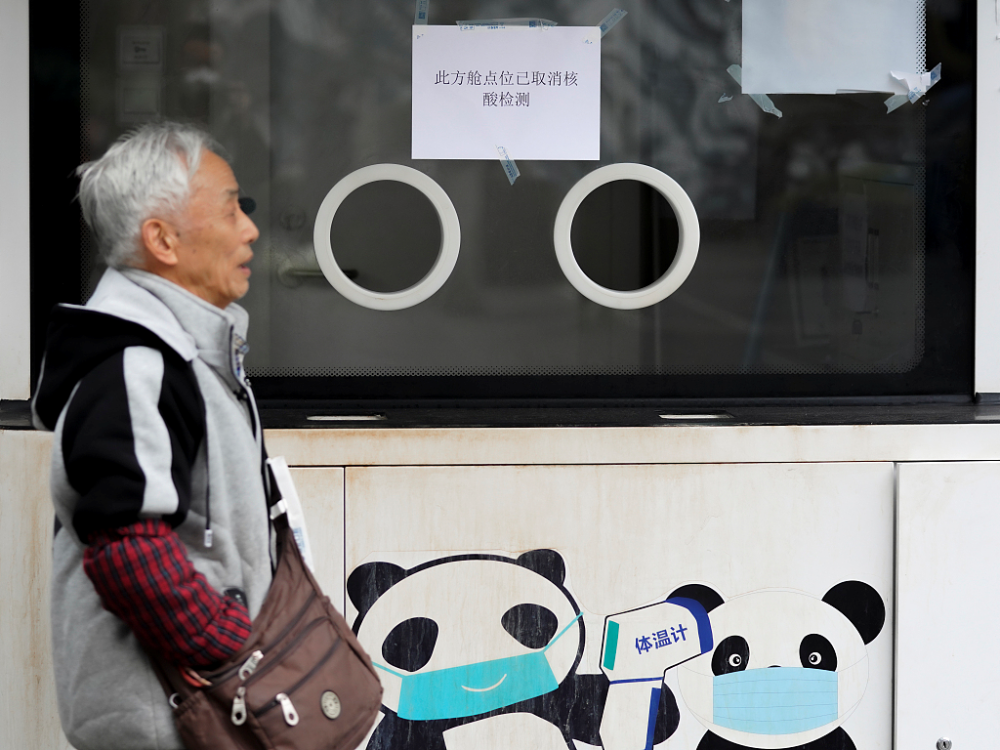
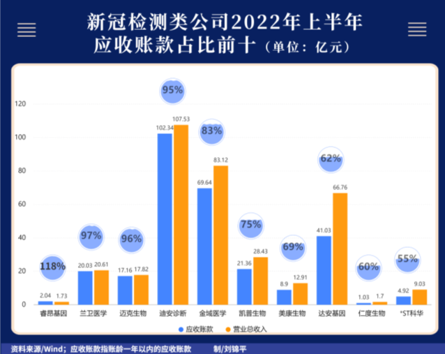

# 账面收入上亿，到手却没多少现金，核酸公司纸面富贵难兑现

**文/ 赵天宇 凌馨**

**编/ 王小**

_2022年12月10日，成都，常态核酸检测取消后，一批便民核酸采样点被关闭。
图/ 视觉中国_

随着各地公共场所核酸点陆续消失，核酸检测成了一件不那么常见的事。

自2022年12月7日“新十条”之后，不按行政区域开展全员核酸检测，进一步缩小核酸检测范围、减少频次。不少检测机构躺着入账的日子已然过去，却至今还没拿到现金。

现在，核酸检测企业到底应该找谁要钱？这是个难题。

北京美因医学检验实验就陷入了一个困难：它为北京市门头沟区永定镇政府行政区域内人员做新冠病毒核酸检测，为了让检测顺利完成，永定镇政府先行支付了保证金200万元。但是，相关的委托检测协议，则是应该由门头沟区妇幼保健院与美因公司签订。这家医院得向美因公司支付检测费用。

检测任务完成后，美因公司找永定镇政府要检测费，没有要到。双方诉讼，法院最终判定，这个实验室应该向门头沟区妇幼保健院要检测费，而不是政府。

根据东吴证券的一项测算，截至2022年4月30日，中国一个月内因常态化核酸检测所需支出为216亿元。

**在这个年末突然踩下刹车的行业里，“应收帐款”成了核酸检测行业的关键词。**

**| 年底收账，有人嫌贵不付钱？**

收了货，却不付钱，有一些核酸公司已经踏上了讨债之路。

在2021年7月底至9月初，扬州疫情暴发期间，从事新冠检测业务的江苏医联生物科技有限公司（下称“江苏医联”），从嘉兴医脉赛科技有限公司（下称“医脉赛”）采购了8866盒试剂。

当时，这两家公司约定，一盒96份装的核酸检测试剂价格576元，合同生效之日起3个月内一次性支付全部价款；若延迟支付货款，每延迟支付一天，应按延迟支付款项部分的0.3％向供方支付违约金。

**由于这笔交易发生于扬州市疫情管控期间，因此不同于一般的交易，医脉赛公司是在双方没有签订书面合同的情况下发的货，合同则是在管控结束之后才补签的。**

但是，到了付钱的时候，江苏医联认为当初合同约定的单价明显高于市场价，以买贵了为理由，直接拒绝付款。

催款起于年底，但并不顺利。2021年12月底，江苏医联的财务人员已收到发票和合同，医脉赛公司表示，现已经到了回款期限内，麻烦帮忙安排回款，但催促数次，直到2022年3月27日还是没有回款，此时已经逾期时间很长。

**江苏医联给出的理由是，医脉赛供货价格是6元／份，但江苏另一家公司的同种产品，单价为2.8元／份，还有一家上海公司的单价为3元／份。**

就此，江苏医联只愿意按照同期同类产品较低的市场价格，即3元／份，向医脉赛公司支付255.34万元。

**医脉赛公司认为这件事太不合理，不仅收到货不付款，还对半杀价。**
该公司在庭审中说，疫情期间核酸检测试剂属于紧俏商品，一般都需要全款提货，而江苏医联是经朋友介绍来的，于是才在分文不取的情况下，向其发送了500多万元的货物，这批货物的价格在发货前早就谈好。

核酸试剂的价格会随市场行情发生变化，所以不同时期的核酸检测产品，价格并不相同。2021年，全国新冠检测厂家和原料供应商的产能恢复充分，新冠检测行业竞争激烈，再加上当时全国多地对新冠检测试剂盒已经进行了降价集采，试剂盒价格逐步降低。第二年，国家医保局要求各省进一步降价，彼时对于政府组织的大规模筛查、常态化检测，核酸检测多人混检按不高于每人份3.5元的标准计费。

实际上，在2021年，江苏医联也跟其他公司签过采购合同，其中有三个供货商对核酸试剂的出价分别为5.8元／人、5元／人、5.8元／人，接近医脉赛公司的6元／人。医脉赛公司因此认为，6元是基本符合当时市场价格的。

上海中岛律师事务所丁天对《财经》记者分析，
**因为疫情原因，在核酸检测及相关产品的采购中，部分约定是口头达成的或对既往协议的延续，此时若对价格、付款方式等细节没有明确，就可能供应商回款困难，甚至需要打官司讨债。**

最终，医脉赛和江苏医联也是在法庭上见。经二审判决，江苏医联公司应按双方合同，向医脉赛公司支付货款510.68万元及逾期付款利息。

从目前已经出现的讨债诉讼情况看，漏洞一般集中在两个环节，
**一是核酸检测产品价格波动大，部分买家在付款环节以“嫌贵”为由拒绝付款；二是因疫情影响交通物流，超过合同约定时限或供应量后继续供货的，未能及时签定新的协议。**

核酸检测价格一路下滑，是部分买主觉得“亏了”不愿付款的主因。对于这种价格波动较大的产品，在没有明确合同约定的情况下，也不能适用交易习惯，属于《民法典》中的“价款或者报酬不明确的”，可按照订立合同时履行地的市场价格履行；依法应当执行政府定价或者政府指导价的，依照规定履行。

“现在很多单位采购中，就明确约定了按照当地政府指导价结算。”丁天告诉《财经》记者。

**| 一场纸面富贵**

**不少核酸检测、抗原检测类公司看似赚得盆满钵满，但实际上拿到手里的现金没多少。**

国家药品监督管理局数据显示，中国注册的新冠病毒核酸检测试剂盒从2020年底的不足30款，到2022年11月底共计38款获国家药品监督管理局批准。

东方证券有研报指出，从市场规模来看，中国核酸检测市场规模在2021年达到132亿元，同比增长9．1％。根据CBinsights
预测，2022年市场规模有望达到146亿元。

**然而，现在看来这类公司有大量的货款还没有收回来，动辄上亿的收入，暂时仍维持在“纸面富贵”的水平。**
比如，兰卫医学（301060.SZ）2022年上半年，应收账款达到20亿元，占总资产的比例达到了65.59%，而2021年底时这个比例仅为37.73%。

虽然公司的业务实现了快速增长，但是，大筛查核酸检测业务的回款期较长，到2022年三季度，这间公司的应收账款还在持续增加，超过23亿元。

2022年上半年，兰卫医学的营业收入是20.61亿元，也就是说，公司还没收到的账，与所获得的营业收入相比，占比超过90%。

**类似的，2022年看起来靠着新冠检测业务收入颇丰的检测类公司，实则上半年应收账款的比重也不低。**

比如利德曼（300289.SZ）控股子公司厦门国拓，自2021年第三季度起新增代理了新冠病毒核酸检测试剂业务，公司坦言，这项业务在公司整体的收入比例较高。

2022年上半年，利德曼的欠款方，前五名分别来自国药集团(广州)医疗器械有限公司、北京九州通医药有限公司、安徽三锦天润科贸有限公司、莆田市第一医院、河南瑞景医疗器械销售有限公司。其中国药方面欠款最多，占五分之一，而莆田市第一医院占全部应收账款的3.08%。

**应收账款的麻烦之处在于，一旦欠款方因为各种原因导致财务困难，无法及时足额偿还欠款，就会给上市公司形成坏账，也就是欠的钱有可能收不回来了。**

由于经营异常，资阳健顺王体检医院、呼和浩特九华门诊部、包头中心医院等，欠款从几万元到几十万元不等，利德曼已经将这些欠款全部计提为坏账。

**一位财会专业人士分析表示，应收账款对于这些企业来讲，一方面没收回钱，另一方面还加速了企业的现金流出，真是“雪上加霜”。**
因为企业虽然看似有了很高收入，实则“纸面富贵”，还没有收到现金，但是，企业需要为自己的收入先缴税，比如流转税就是以营业收入为计算依据的，企业必须按时以现金交纳。

“必须重视应收账款的管理，要明白应收账款每多1块钱，当时你就少了1块钱的现金。”中央财经大学、中国人民大学研究生客座导师马靖昊说。

2022年12月以来，“二十条”“新十条”的发布和落地，各地核酸检测停相继撤离，多数公众场合已不需要出示核酸证明和健康码，生活重新回到2019年。核酸检测公司的业务量锐减，剩下的就是如何要账过年了。

