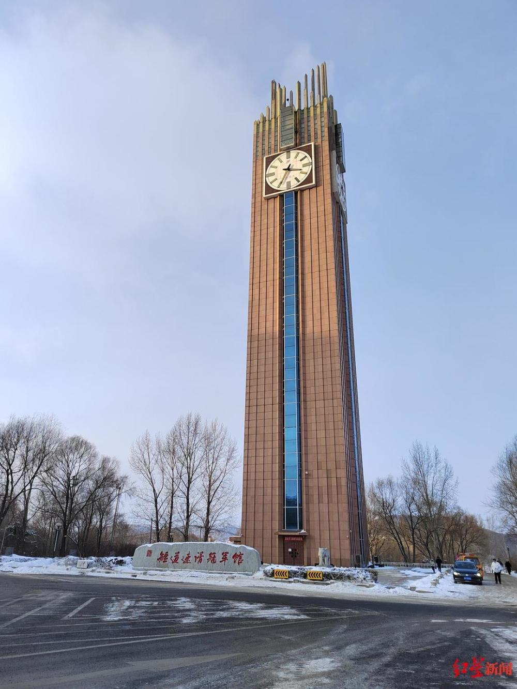
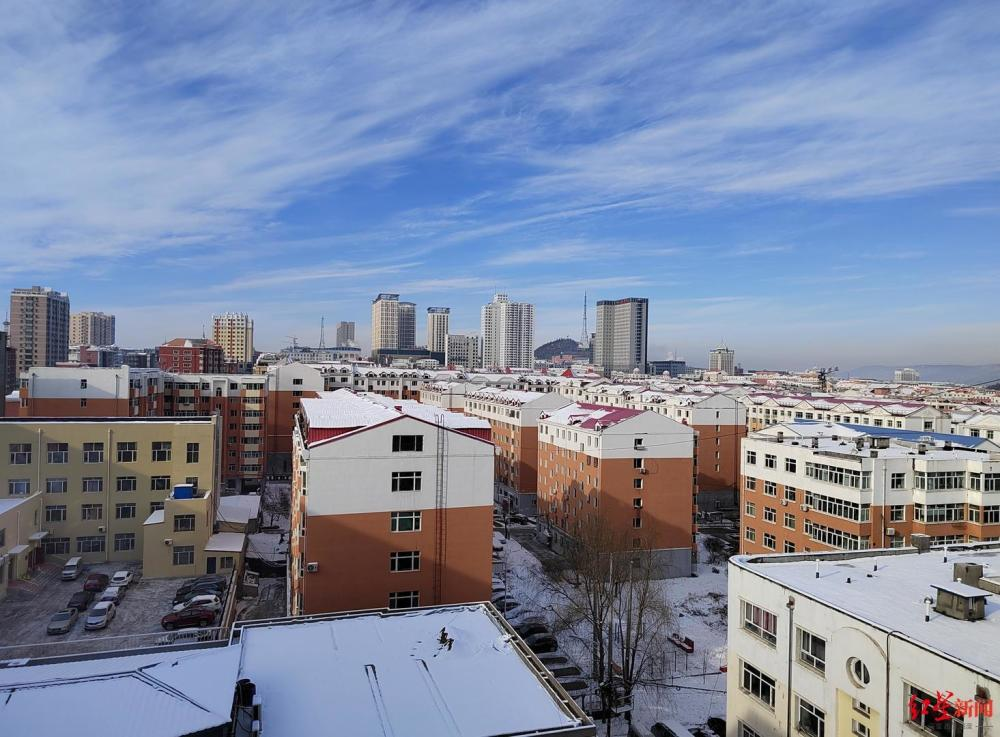
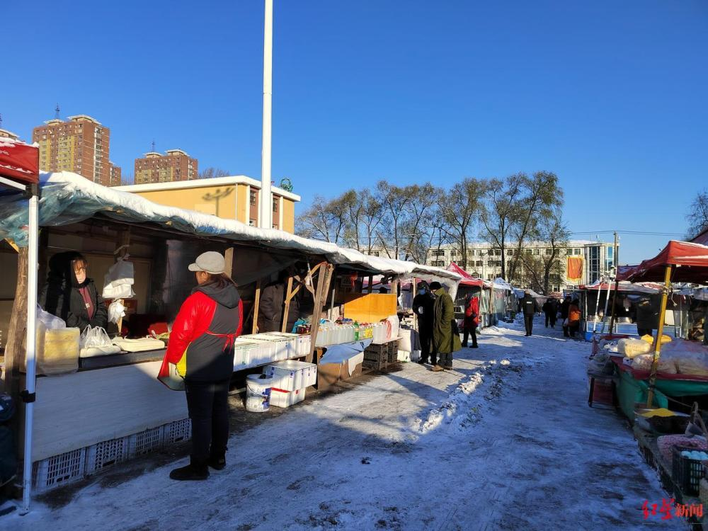
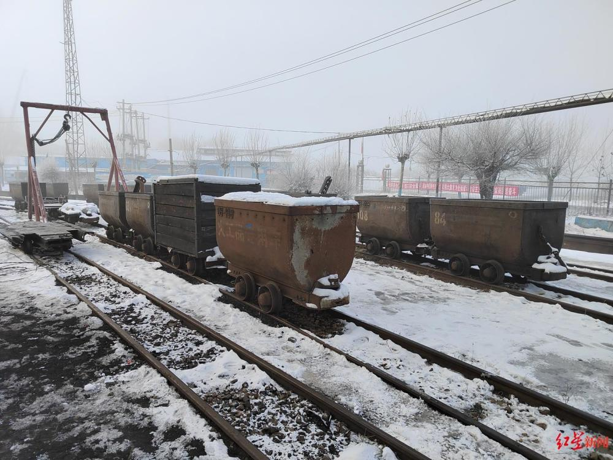
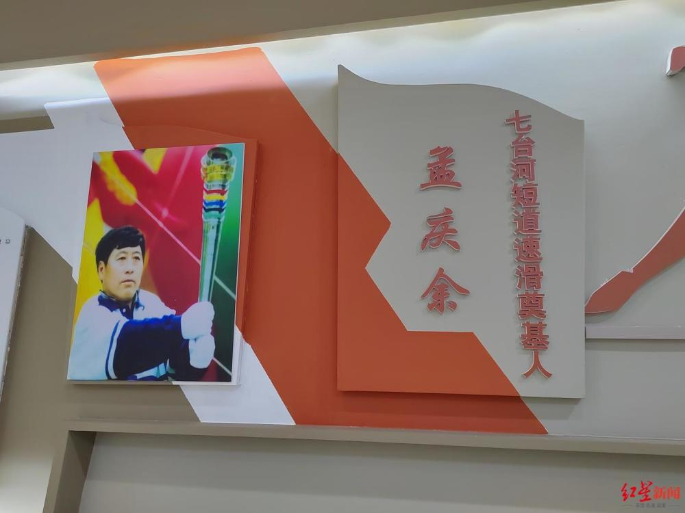

# 资源型城市的困与救丨产业单一、人口外流，东北小城七台河的寒冬如何度过？

20年来，东北小城鹤岗似乎一直寂寂无名，却在最近两年被全国瞩目，原因都是“白菜房价”5万元一套、1.5万一套……“买房如买菜”也让鹤岗成为网红城市，汇聚了“中国最穷买房团”。

然而，“鹤岗化”可能是一些资源枯竭型城市的共同命运。2022年年初，有媒体评选了房价最低的10个城市，其中就有鹤岗、七台河、阜新……而这当中大多数城市都是因矿而生，因矿而兴，也因矿而困。

2011年，鹤岗被国家确定为第三批25座资源枯竭型城市之一。这些城市原本是让人羡慕的“矿产王国”，有力地支撑着当地经济的发展。然而多年对矿产的过度开发使用，也导致当地生态环境破坏严重，资源面临枯竭。

近年，中国基于推动实现可持续发展的内在要求和构建人类命运共同体的责任担当，宣布了碳达峰和碳中和的目标愿景。以往的粗放型增长方式造成了能耗过快和生态环境严重破坏，迫切需要转型发展。而对于衰退型城市，要加快其转型发展，核心是大力发展接续替代产业。

如今这些城市也纷纷寻求转型升级，思考如何摆脱对单一资源的依赖。面对“转型”这道资源型城市的终极课题，几座城市给出了不同的解题思路。

红星深度推出开年观察“小城大事”之鹤岗化：资源型城市的困与救。

红星新闻记者丨卢燕飞 发自七台河市

责编丨任志江 编辑丨郭庄

入冬后，这里白天气温降到零下二十多度，大雪覆盖着一望无际的土地，户外已经不适宜开展露天作业，整座城市的脚步慢了下来。

这是黑龙江省东部边陲小城七台河，与同为煤炭城市的鹤岗仅200公里。让这座城市声名远播的是短道速滑项目，近年来先后诞生了杨扬、王濛、范可新等多位冬奥冠军和世界冠军。

王濛是矿工的女儿，七台河也是先有煤矿后有城市的地方，这里超过一半人的生活与煤矿息息相关。但煤炭属于不可再生资源，随着开采量的不断增长，在2009年，七台河被国家列为第二批资源枯竭型城市，随之而来的是全面转型的考验。

人口方面，2010年至2020年，七台河从92万人降到不足69万人，年平均增长率为-2.85%。这些年，为了治理采煤沉陷区，当地政府花费数百亿元，让20多万群众住进了保暖设施齐全的新房。

目前，七台河正在大力发展生物医药、新能源、食品加工等产业，并与广东省江门市对口合作成立产业园区。前方困难重重，挑战诸多，但这座“冠军之城”俯下身做好了冲刺的准备。

_七台河市短道速滑冠军馆_

**低廉的房价**

**有的房子每平方米1800元难卖出**

近两年，与七台河相隔200公里的鹤岗，由于房价便宜吸引了一批投资客。他们在这里拍Vlog、做直播，让这座边境城市渐渐成为网红打卡地。

七台河没有这样幸运，由于房价比鹤岗稍微高一点，并未引起媒体的注意。但随着近年来煤炭资源面临枯竭、人口不断外流，这座东北小城的房价停步不前甚至开始大幅下滑。

在全国各大地级市的房价排行榜中，鹤岗、双鸭山、七台河往往是倒数前三名。与鹤岗平均每平方米2100元的房价相比，七台河比其高出1000元。那么当地房产销售情况到底怎样？11月中旬，红星新闻记者来到七台河探访。

_雪后的七台河市_

当地市民余凯（化名）在新兴区如意家园小区开了家麻将馆，见到记者咨询房子，赶忙迎了上去。“我家有个4楼的房子要出售，要不上去看看？”说着把记者带到了4楼一套53平方米的一室一厅。这套房子装修十分完善，坐南朝北，根据空间大小住两个人是没有问题的。

但类似这样的房子在如意家园小区有上百套，成交的却不多。“房子是2015年前后建成的，还比较新，要的话10万块就可以。”通过计算得知，这个看起来水电齐全拎包入住的房子，实际上每平方米均价只有1800多元。见记者有些犹豫，余凯赶忙补充说：“手头紧的话预付六七万也可以，到时房款还清了房本再拿过来。”

余凯在1楼的麻将馆也要出售，与4楼的房子户型一致。当问及为何要将经营场所卖掉时，他似乎有些难言之隐，只是说“干够了”。根据余凯介绍，这个如意家园属于拆迁安置小区，几乎每家都有两三套房子，有些甚至有五六套。

站在小区中庭环顾四周，可以看到楼栋内房子的窗户上很多都贴着“卖楼”“出租”的告示，这些业主很大一部分在多年前已经离开了这里。

“七台河的房子明显供大于求了。”这是当地不少市民的感慨。前些年煤炭开采正盛的时候，没人想到资源枯竭后城市会衰退得如此迅速。

丛大勇（化名）是余凯隔壁楼的邻居，他在新兴煤矿干了20多年，11月底就要退休了。在七台河，他只有一套住房，是当年煤矿分配的，但现在他却执意将房子卖掉，“不想在这儿住了，我姐姐和侄子都在青岛、烟台那边等着我。”

前两年，曾有人出价6万元想买下这套45平方米的房子，丛大勇当时预测房价过段时间会涨上去，所以没卖。现在他后悔了，“我要退休了，这个房子5万块都卖不掉，装修的时候还花了两万。”他向记者说，现在七台河的房价已经没法再往下降了，这个6楼的步梯房卖给年轻人挺好的。

不过他话锋一转又说，“现在的年轻人都到外地去了，我在煤矿工作了20多年，年轻人越来越不愿意下井，很难招到人，那些年纪大的都在等着退休。”丛大勇今年56岁，他有很多工友都到了退休年龄。

他望着窗外，看着皑皑白雪覆盖着一望无际的土地，眼前小山坡上种植的松树和白杨挺拔而孤寂。“七台河跟鹤岗差不多，都是先有煤矿后有城市，这个小区都是从采煤塌陷区迁过来的，之前家里面积大的分到了两三套房，原来的地方已经拆除进行了绿化。”

丛大勇在煤矿主要做辅助工种，每月工资3000元左右，相比之下，采煤的工人每月有七八千元。每天早上6点30分，通勤车辆会准时来小区门口接人；下午3点左右，他们会被按时送回来，这样的生活持续了20多年。

把房子卖了，将来回来的时候住在哪里？问到这个问题时，仍是单身的丛大勇在茶几旁抽了几口烟，“回不回来不一定了，亲戚都在山东那边，惦记着我。”说完，他的脸上露出了久违的笑容。室内气温此时达到26℃，窗外太阳的余晖射了进来。

_即将退休的丛大勇（化名）望着窗外_

**人口外流**

**十年间人口总量减少23万**

由于气候原因，东北的农作物每年只能生长一季。进入11月，外面已是天寒地冻，农村有些人家烧起了土炕，城里家家户户暖气相通，街上人烟渐少。

下午三四点钟，太阳就慢悠悠地落山了。晚上的七台河几乎没有娱乐活动，6点钟各大商场和超市开始打烊，公共浴室此时迎来了全天最热闹的时候，人们在这里洗去满身的疲惫，然后便回到家睡觉了。

七台河的早晨在第二天的6点钟被唤醒。天空刚蒙蒙亮，马路上就能看到匆匆忙忙赶往早市的人们。11月13日，记者来到了七煤总医院附近的奋斗路早市。在这里，豆腐脑、麻花、羊杂、高粱酒是必不可少的，还有人在卖母蛤蟆。

_逛早市的人们_

早晨的气温降到了零下15℃左右，即便是东北比较抗冻的人，也难以抵挡户外冰天雪地的严寒，所以当天来早市遛弯的人并不算多。而早市叫卖的商贩穿着厚厚的棉袄，缩着手站在刺骨的寒风里，他们一般下午三四点钟天快黑的时候就会离去。

上午七八点钟，整座城市开始运转起来。出租车以每小时30公里的速度在冰面上缓慢行驶，公交车挤满了上班的人。如果出门逛街的话，最好戴一顶厚厚的帽子。

在七台河市区，很少看到高新科技公司的身影，这座城市超过一半人的生活直接与煤炭相关。这样的格局导致煤炭开采兴盛时城市急速发展起来，而煤炭资源一旦面临枯竭，人口外流的现象就特别明显。

据七台河市统计局、七台河市第七次全国人口普查领导小组办公室公布的数据显示，截至2020年11月1日零时，七台河人口总量为689611人，与2010年第六次全国人口普查的920471人相比，减少230860人，下降25.08%，年平均增长率为-2.85%。

谈及人口外流，当地人的普遍看法是，“我们这边太冷了，冬天的时候户外基本停止了工作。加上没有其他产业做强有力的支撑，煤炭开采乏力的时候人口就会自然流向其他地方，特别是南方城市。”

_早市卖小吃的商户_

王智远（化名）退休前常年在七台河各大煤矿做机电维修。站在桃山区一处废弃的铁轨处，他向记者介绍，“上世纪五十年代七台河煤矿开始兴起，从七十年代开始，我在煤矿干了差不多40年。”他说，当煤炭资源开采殆尽的时候，铁路就派不上用场了，煤矿里面的学校、商场、医院都会废掉，大批人员会转岗到其他煤矿，还有一部分人会离开这里。

随着近些年清洁能源的发展以及煤炭开采量的不断减少，东北地区煤炭城市人口外流的现象愈加突出。附近的双鸭山、鹤岗、鸡西等城市，人口数量都在逐年下降。

“当仅有的煤炭资源没有的时候，房子也就不值钱了。”王智远说，现在黑龙江的4座煤炭城市（鹤岗、鸡西、双鸭山、七台河）都遇到了同样的问题，年轻人离开后恐怕再也不会回来了。“在七台河的汪清湖小区，房价每平方米还不到1000元，比鹤岗很多房子都要便宜。”

他说很理解年轻人的选择，但自己现在已经退休了，不会再往其他地方去。

**资源面临枯竭**

**花费数百亿元治理采煤沉陷区**

2009年，七台河市被国家列为第二批资源枯竭型城市，之后的2013年，又被列为衰退型资源型城市。

官方资料显示，七台河面积6221平方公里，拥有煤炭、石墨、黄金、大理石、石灰石等十多种矿产资源，其中煤炭保有储量17亿吨，远景储量37亿吨，是黑龙江省重要的主焦煤和无烟煤生产基地。从1958年开发建设以来，七台河累计为国家贡献了超过6亿多吨优质原煤。有专家预计，按照目前的进度，七台河煤炭开采时间只能持续50多年了。

新兴区宝泰隆路见证了七台河煤炭发展的辉煌，也正在经历这座城市的衰落。

_煤矿上停放的矿车_

王智远把记者带到这条如今有些“偏僻”的路上，如果不打开地图，很多本地人也很难知晓这条路的名字。但在上世纪六七十年代，这里诞生了七台河第一家商店、第一家电影院、第一家供销社……此后的繁华都是从这里起步的。

宝泰隆路也是上世纪七八十年代王智远经常玩耍的地方。但现在，映入眼帘的是沉陷到公路下面两米深的平房，当年的地标性建筑——两层楼高的第二百货商店已经明显倾斜，前面镶嵌的“百货批发零售交易市场”字样也有些残缺不全了。

周边田地原本是低矮平房组成的村落，现在已经拆除完毕种上了松树。

资料显示，由于七台河“先有矿，后有城”，其各项基础设施建设存在着天生“缺陷”，采煤沉陷等地质原因导致地下管网破损严重。近年来，新兴采煤沉陷区、茄子河独立工矿区、勃利城区老工业区治理工程任务十分繁重，部分项目受配套限制进展缓慢。

为了治理采煤沉陷区，完成采煤煤矿棚户区改造和采煤沉陷区棚户区改造，七台河累计投入数百亿元，新建搬迁安置住宅5.54万套，货币化安置2.6万套，涉及24万名群众。并累计获得国家资源枯竭型城市和采煤沉陷区综合治理中央财力转移支付资金近30亿元。

在2017-2019年度，七台河市连续三年在国家发改委等四部委组织的资源枯竭城市转型绩效评价中均为“良好”，为黑龙江省参评市（县、区）资源型城市中的最佳成绩。

不过，要完成彻底转型仍然任重道远。七台河过去偏重于煤炭采掘和精深加工，其他领域的人才相对较少，服务业层次较低，在替代产业方面也存在短板。多元化转型七台河未来努力的方向。

**城市的荣耀**

**“冬奥冠军之乡”让七台河精神振奋**

虽然七台河地处偏远，经济也不算发达，但这里诞生了杨扬、王濛、孙琳琳、范可新、张杰等多位冬奥冠军和世界冠军，斩获了世界级金牌177块（其中包括冬奥会金牌8块、特奥会金牌7块），国家级金牌535块，有16人次打破世界纪录。

因此七台河被誉为“冬奥冠军之乡”，2022年11月11日，中国奥委会授予七台河“奥运冠军之城”奖杯。而这些成绩的取得，离不开七台河短道速滑事业的奠基人孟庆余。

_七台河体育中心展出的关于孟庆余的宣传画_

孟庆余出生于哈尔滨一个工人家庭，1969年，18岁的他被分配到七台河，在新建煤矿当采煤工人。王智远当时在煤矿做机电维修，与孟庆余一块儿工作了一年多时间。

“当时我们一组有好几个都是知青，我还不知道他会滑冰。”他记得孟庆余刚开始做铆工，后来给矿车贴框加边，再后来就做短道速滑教练了。

孟庆余的妻子韩平云回忆说，1972年，孟庆余代表七台河参加冰上运动会，一举夺得1500米、3000米和5000米比赛三项冠军。因为在这次比赛中的突出表现，他被调入市体委，成为七台河市的滑冰教练，并开始着手组建速滑队。

后来的训练非常艰苦，七台河市体委当时有个冰场，但由于经费太少雇不起人，孟庆余就每天晚上扫冰到八九点钟，第二天凌晨一两点再起来浇水。东北零下30℃的气温，水花溅到身上后马上就结冰了。

正是在这种条件下，孟庆余带过的杨扬、王濛、孙琳琳、范可新都成长为冬奥冠军。不幸的是，在2006年8月孟庆余遭遇车祸去世，当时年仅56岁。但他的弟子张杰、赵小兵、董延海、张利增……接过孟庆余手中的秒表，继续着他未尽的事业，帮助更多孩子实现冠军梦想。

如今，短道速滑这个冬奥项目让七台河重新振奋起精神。王智远说，普通市民对于“冬奥冠军之乡”从心底里感到自豪，很多孩子从小学就开始练习速滑。

除了冬奥项目，七台河近年来在生物医药、新能源产业、食品加工方面也取得了不错成绩。通过与江门市对口合作，在产业园区、政策体系、招商引资方面借鉴了经验，为更多非煤产业创造了良好的营商环境。

这座城市正在转型的路上破浪前行。

