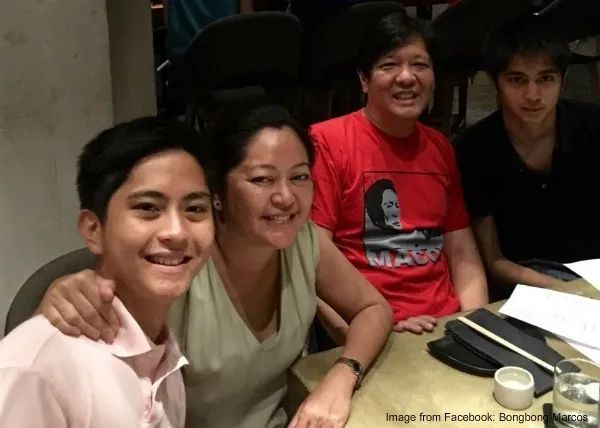
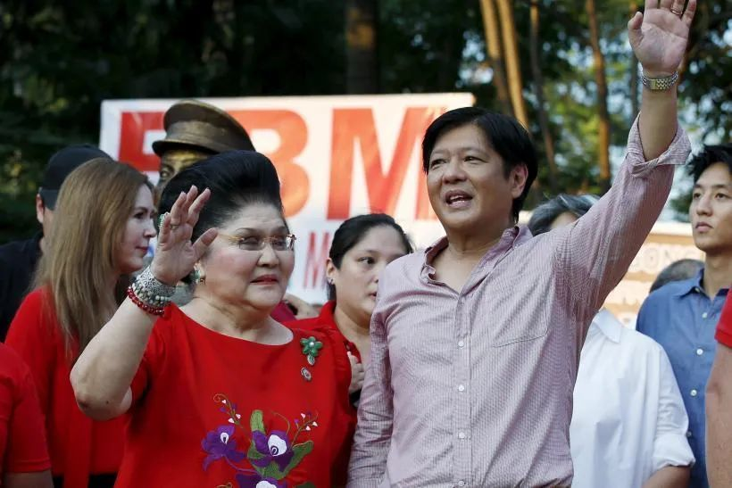
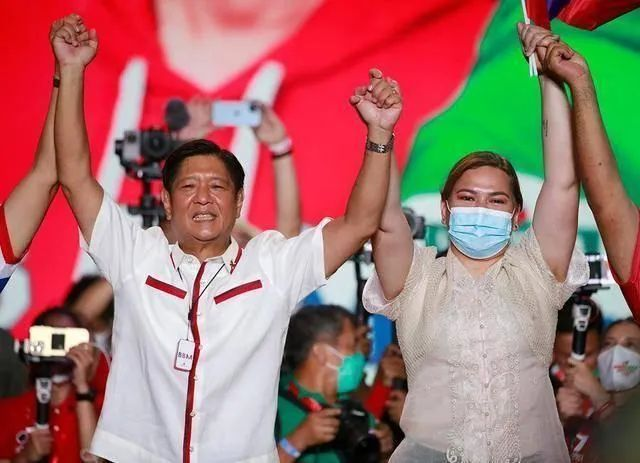

# 邻国“网红”总统来访！他与中国有段特别缘分

**他是2023年中方接待的**

**首位外国领导人。**

作者：付玉梅 于冰

新年伊始，一位邻国重要客人来访！

1月4日下午，国家主席习近平在人民大会堂同来华进行国事访问的菲律宾总统马科斯举行会谈。

习近平指出，这是你首次正式访问东盟以外国家，你也是今年中方接待的首位外国领导人。48年前，你的父亲同中国老一辈领导人洞察时局、顺应大势，共同作出中菲建交的历史性决定。这份情谊弥足珍贵。

马科斯说：“我也是非常期待这次访问，我们必须要向世界其他地方展现，我们双方都高度重视菲中关系，就像您回忆的那样，双边关系对我们两个国家都十分重要，现在又成为我的责任，也是我的荣幸，继续推进菲律宾和中国的友谊，让我们的人民走得更近。而且我希望能够解决未来共同面对的挑战和困难，加强菲律宾和中国之间的关系，让伙伴关系能够稳定、强劲，能够使这个地区成为新的经济引擎。”

马科斯家族与中国的交往源远流长，中菲建交就是在马科斯的父亲费迪南德·马科斯（下文称老马科斯）执政时期实现的。

马科斯的经历也充满传奇色彩。他8岁时因父亲当选菲律宾总统而荣宠加身；28岁时，随父母流亡美国；回国后，在政坛迅速崛起，在65岁的年纪当选总统。

马科斯在新年续写了与中国的新故事。

“马科斯此次访华打破了外交惯例，展示了他对中菲双边关系的重视程度，释放出‘对华友好’的积极信号。同时，马科斯也是中方2023年接待的首位外国元首，充分体现了中国对发展菲律宾关系的高度重视。”清华大学国家战略研究院研究员、太和智库高级研究员钱峰对《环球人物》记者表示。

**受年轻民众支持**

去年5月，马科斯以高票胜选菲律宾总统。他的支持者中有不少年轻民众——也是他的“粉丝”。

马科斯将自己打造成社交媒体上的“网红”。他与支持者积极互动，“脸书”“油管”等社交平台的粉丝总数早已破700万。

_·马科斯（上图中、下图右二）经常在社交媒体上发布家庭出游照片。_

在那里，他是会弹吉他的中年浪漫大叔，可以和年轻人在手游世界一较高下，也是时常与家人外出游玩的好爸爸、好老公。

他跟网友互动，甚至愿意接受网友发来的游戏挑战，一改菲律宾政客一直以来保守又严肃的形象，表现出满满的亲和力。

“马科斯通过社交网络与民众实现良好互动，表现得很接地气，在年轻选民中颇受欢迎。”钱峰表示。

不过，社交媒体只是他用以增加民众好感度的辅助，最关键的仍是他的执政表现。

“早在去年竞选中，马科斯就打出‘团结牌’和‘变革牌’，致力于克服和弥合国内政治分歧，抓住疫情导致菲经济停滞、失业率飙升的问题，提出‘发展经济、维护国家利益、反贪腐’的竞选口号，迎合了选民要求经济复苏、改善民生的诉求。”钱峰分析称。

在钱峰看来，马科斯上台后也一直在积极推动兑现其竞选承诺。而当前菲律宾面临的最重要挑战是经济、就业和贫困问题。

一份民调显示，除了在控制基本商品价格上涨方面，马科斯在解决各种国家问题方面大多获得正面评价。

2022年10月8日，是马科斯执政满100天的日子。

他发表演讲时说：“我们在首个100天做的就是组建一个运作良好的政府，并对经济目标有非常好的想法。”

他说，他引进了“最优秀、最聪明的人”，不分政治背景，在政府中服务，财政部长迪奥克诺领导的经济班子就是最好的例子。“我相信我们具有非常明显的优势，未来几年应能够扭转经济。”

菲律宾前总统阿罗约赞扬马科斯上任百日的表现，称他在经济问题上让菲律宾人感到“安心”，并以“冷静和周到”的举止行事。

钱峰认为，当前马科斯要解决经济问题，离不开中国。目前，中国已是菲律宾最大贸易伙伴、第一大进口来源国和第二大出口市场。

**16岁曾访问中国**

要说马科斯与中国的关系，得追溯到他父亲执政时期。

位于菲律宾马尼拉市中心的马拉卡南宫，是总统办公室所在地，也是装满马科斯童年记忆的地方。

_·年仅8岁的马科斯（右一）跟随父母、姐姐们入驻马拉卡南宫。_

1965年，父亲当选总统，马科斯全家搬进了马拉卡南宫。母亲伊梅尔达曾是菲律宾第一美女，年轻时参选过马尼拉小姐，与还是议员的老马科斯相识11天就“闪婚”，堪称一见钟情的传奇。

_·伊梅尔达早年照片。_

马科斯是家里唯一的男丁，被视为“接班人”，比其他孩子更受宠爱。他由此过着养尊处优的“太子”生活。

从有记忆起，马科斯就经常跟随父亲出入各种政治社交场合，见到的都是“大人物”，耳濡目染总统府内的很多事情。

_·老马科斯。_

他曾告诉记者，“我必须经常保持举止得体，因为永远不知道谁会在父亲的房间里。很多次，我会碰到一位正与父亲商谈事情的他国领导人。那时我还小，这种感觉挺奇妙的”。

16岁时，马科斯被父亲叫到总统府。父亲说：“我准备交给你一项特殊使命——陪同你妈妈出访中国。”

马科斯后来回忆，“我被中国人民的热情好客感动了。”当时，菲律宾是美国“阻击共产主义势力南下的桥头堡”，但在老马科斯坚持下与中国建交了。

马科斯家族对华一直持友好态度，马科斯也铭记于心。1983年，菲中建交10周年，马科斯率菲律宾代表团到中国访问。这一年，他当选北伊罗戈省省长。

只是几年后，马科斯的人生发生巨变。

1986年，菲律宾爆发“二月革命”。它宣告了老马科斯近20年统治的结束，也结束了马科斯的第一次省长生涯。

马科斯一家来到了景色怡人的美国夏威夷，却无心欣赏，更无心久留。

他们带走的大笔财富被美国人扣押，生活上也不得不受美国人的摆布。伊梅尔达曾说，“夏威夷是世界上最美丽的监狱”。每天早晨一醒来，马科斯想到的第一件事就是返回北伊罗戈。

1989年，72岁的老马科斯在夏威夷因病去世。两年后，马科斯家族获准回国。马科斯立即启程，并着手计划重返政坛。

**重回政坛**

在菲律宾政坛，马科斯家族始终拥有不小的影响力。马科斯返乡第二年，就在北伊罗戈省当选众议员。6年后，他再度出任该省省长，并连任两次，其间大力发展旅游业、风力发电等产业。

2007年，马科斯再度在北伊罗戈省第二选区当选众议员，2010年成功当选参议员。

伊梅尔达对此很自豪。她明白自己年事已高，家族的希望还是在儿子身上。“我在怂恿他，在推动他，爬上更高的位置。”她曾这样对媒体说。

_·马科斯和伊梅尔达。_

在马科斯看来，与父亲的亲密关系从来不是难于启齿的，而是父亲留给他的政治遗产。

_·马科斯在一次活动中展示早期的家庭照片。_

但他必须对付政治对手的攻击。2010年，前总统阿基诺夫人之子阿基诺三世当选总统。上台后，他一直打压马科斯。

2016年，马科斯参选副总统。当年2月，阿基诺三世猛烈抨击马科斯家族，提到其造成的军事管制和政府债务等问题。最终，马科斯失败了。

_·2016年，马科斯参加副总统竞选。_

去年的总统大选中，同样的情况又出现了。马科斯知道绕不开这个话题。于是，他采取了淡化策略，甚少就自己的政策细节展开阐述。他也开始通过社交媒体重塑家族形象，获得民众支持。

最终让他一骑绝尘的，还是与时任总统杜特尔特之女莎拉的结盟。他打出了“我们将再次崛起”的口号。这次胜选，普遍被认为意味着马科斯和杜特尔特两大政治家族将在菲政坛上进一步巩固势力。

_·马科斯（左）和莎拉组成“总统二代”选举阵营。_

**访华有何影响？**

与中国关系的发展，也是马科斯当选总统后的一大看点。他此次访华释放哪些信号？

钱峰表示：“此前，由于阿基诺三世政府在对华交往上采取对抗做法，导致中菲关系跌入谷底。2016年杜特尔特执政后主动调整外交政策，中菲关系历经转圜、巩固、提升三个阶段，双边关系重返健康发展轨道，如今两国合作再拾强劲发展势头。”

延续着家族传统，马科斯一直对中国持较友好态度。钱峰认为这样的趋势将持续。

“马科斯家族长期与中国保持友好往来。老马科斯开启了中菲建交的历史。马科斯也一直认为其父推动中菲建交是正确选择。”

从表现上看，马科斯以往对华言论总体上较为温和。即使在中菲关系因“南海仲裁案”出现紧张时，马科斯也保持温和中立。

2022年1月，马科斯曾表示，“中国是菲最重要的贸易伙伴，对华关系影响菲经济发展”。

近年来，海上问题是中菲关系的焦点话题。马科斯主张在南海问题上“不挑战、激怒中国”，尽可能寻求与中国在南海油气、渔业等事宜上开展合作，推动更多民生项目落地。

“马科斯认为海洋问题不是中菲关系的全部，不能把‘南海仲裁案’结果作为开展对话的前提条件。他早在上任之初就承诺过，希望在其任内‘将菲中关系推向更高水平’。”钱峰分析称。

日前，菲律宾外交部长助理英佩里亚尔宣布，马科斯访华期间，菲中两国外交部将建立一条直接沟通渠道，以避免“误判和沟通不畅”。

展望未来，钱峰认为中菲合作有望以农业、基建、能源和人文为“四轮驱动”，呈现总体向好的健康发展态势。

“但也应看到，菲律宾对美国具有至关重要的地缘政治意义，也是拜登政府着力推进‘印太战略’的重要国家。马科斯当选后，美进一步加大了对菲的诱拉和施压力度。菲国内仍有数量众多、实力雄厚的‘亲美派’。”钱峰预测，“马科斯将会继续追求与中国的密切关系，但也会维持与传统安全盟友美国之间更加平衡的外交政策。”

总监制： 吕 鸿

监 制： 张建魁

主 编： 许陈静

编 审： 苏睿 凌云

