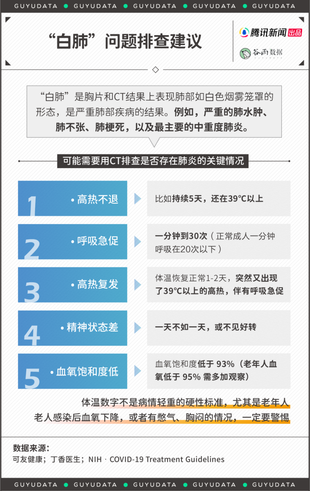
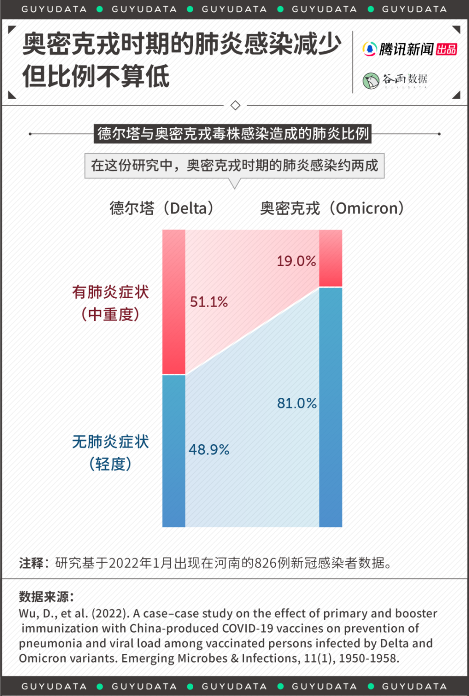
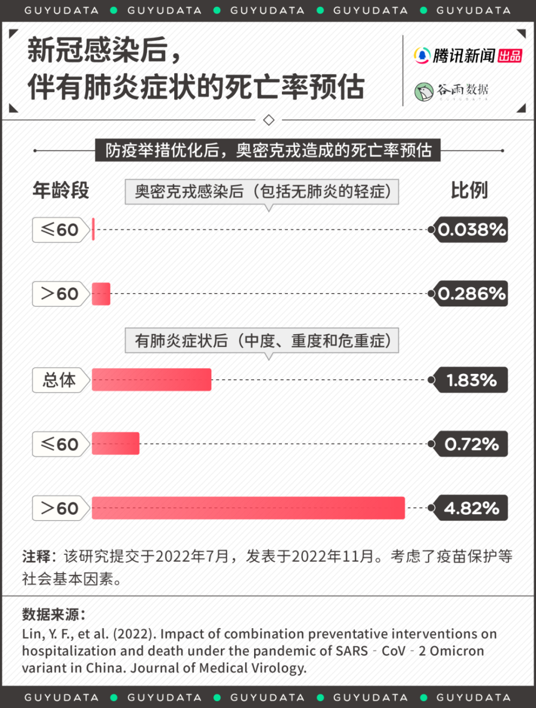
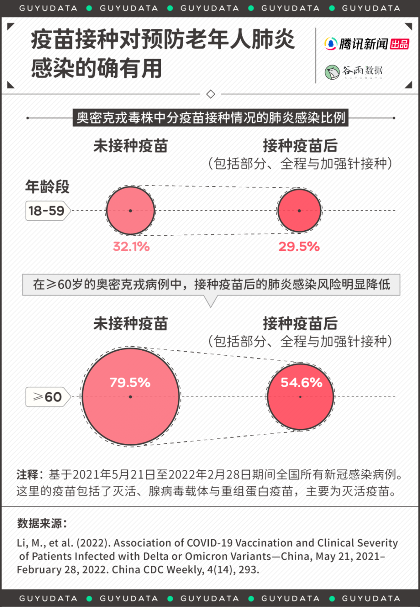
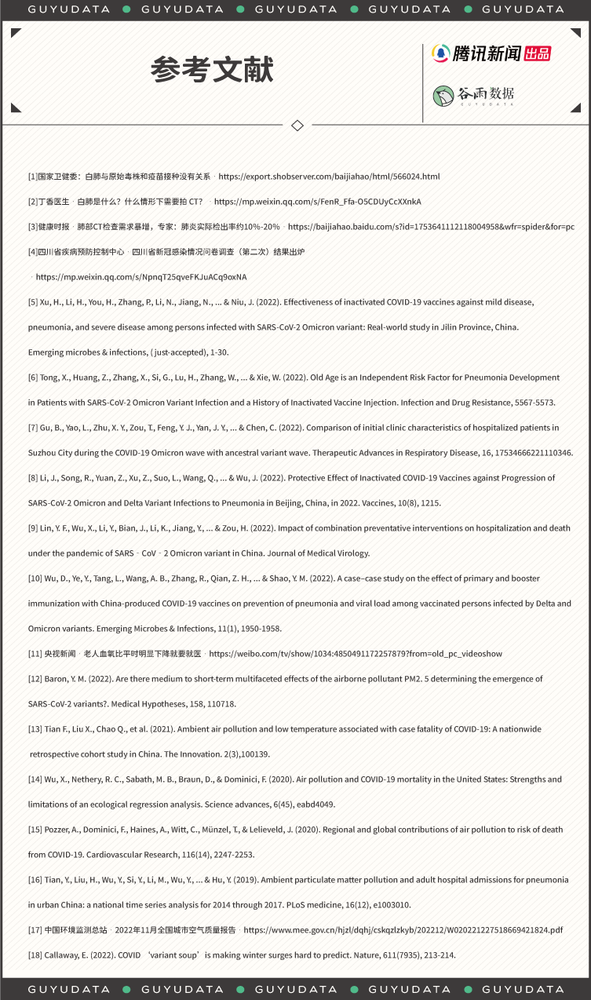

# 50岁以上感染者肺炎率近四成，这些症状后可能该去医院看看了

送走了令人百感交集的2022，但我们也深知新冠病毒尚未走远。

尤其是元旦假后，冬季疫情仍在高位运行，“白肺”现象颇受关注。

尚未感染的“决赛圈”选手，还在咳嗽的“阳康”们都有些不安——当医院的CT室大排长龙，我们如何面对新冠感染依然会引发的肺炎问题？哪些因素会加剧新冠感染后的肺炎？于是我们将目光投向一些最新的科研成果及相关数据。

奥密克戎时期的肺炎感染减少，但比例不算低

最近人们一直在热议“白肺”问题。有一些传言认为出现大批“白肺”患者跟感染了新冠病毒原始毒株有关，闹得沸沸扬扬。

**感染潮下，“白肺”是严重肺炎的结果。**
12月27日，国务院联防联控机制召开的新闻发布会上，国家卫健委医政司司长焦雅辉对此介绍：当肺炎严重，存在较多渗出液和炎性细胞填充肺泡时，X光与CT射线就无法穿透，从而在影像学上呈现白色区域。

当白色影像区域大面积存在（具体比例尚无共识），临床工作上将其口语化称作“白肺”。

“白肺”不常见，但存在即意味着较高的生命风险。同济大学附属上海市肺科医院呼吸监护室副主任医师张黎在澎湃新闻采访中称，
**作为重症的白肺患者，死亡率在40%以上。**

很多人出于担忧，冲进了医院的CT室。而根据可友健康与丁香医生提供的建议，存在以下情况，的确需要前往医院进一步检查肺炎情况。例如，高烧不退，呼吸急促、气喘、胸闷，在血氧检查中存在较低的血氧饱和度等。

尽管医学共识认为，奥密克戎（Omicron）毒株的毒性减弱，肺炎感染已经大幅度减少，但这样的减少是相对于德尔塔（Delta）等此前毒株的威力而言的。

2022年1月，河南省在新冠疫情防控中，进入“双线作战”的局面，既要在郑州、许昌禹州等地迎战德尔塔毒株，也要在安阳迎战奥密克戎毒株。基于当时河南省的疫情数据，中国疾控中心的学者对比了德尔塔与奥密克戎毒株导致肺炎感染的比例。研究包括了826名3岁以上新冠感染者的数据，其中，405例感染德尔塔，421例感染奥密克戎。年龄分布上，未成年感染者占30.8%，18-49岁感染者占42.0%，50岁以上感染者占27.2%。

**他们的研究显示，奥密克戎感染者有19%存在肺炎情况。**
同一时期存在的德尔塔毒株，则导致了48.9%的患者出现肺炎。苏州市第五人民医院提供的另一份研究数据与之接近。

这些患者均是在确诊后就被纳入了防疫管理，而不限于专程在医院就诊的患者，因此更接近于我们现实世界的数据。
**所以可大致判断，奥密克戎毒株下存在明确症状的新冠感染者，肺炎比例在两成左右。严重肺炎（即“白肺”）的比例会更低。**

浙江大学医学院附属第一医院传染病科主任盛吉芳接受《健康时报》采访时表示，2022年12月底接受CT检查的患者中，“肺部有渗出病变（炎症）的患者比例，大约在10%-20%之间”。

奥密克戎毒株对人体的重点攻击目标，除了下呼吸道（包括肺部），还盯上了上呼吸道，从而诱发了强烈的咳嗽、咽痛等症状。

至于近期热议的奥密克戎新子系XBB.1.5，根据《自然》（Nature）杂志发表的判断，XBB.1.5的免疫逃避能力，即传播效率会继续增强，但缺乏数据表明它是否会带来严重症状的增长。在科学界获得相关结论之前，无论是腹泻，还是肺炎，都属于奥密克戎毒株可能带来的症状。

沉默的肺炎问题袭来，老年人首当其冲

新冠感染导致的肺炎问题，老年人首当其冲。一份中国学者发表在《感染与耐药性》（Infection and Drug Resistance）的研究直言，
**高龄是奥密克戎感染后发生肺炎的唯一独立危险因素** 。

2022年12月底，前央视主持人樊登在社交平台上透露了父亲因新冠感染去世的消息。因“静默型低氧血症”，他的父亲在看似稳定的状态中出现了血氧含量极低、呼吸衰竭的情况。

年事已高，老年人对缺氧问题反应迟钝，即使未透露憋气、胸闷的情况，但血氧可能已经很低。又或者，老年人代谢下降，本身体温偏低，看似没有高热等情况，但同样酝酿着肺炎的危机。

所以复旦大学附属中山医院重症医学科主任钟鸣等专家接受采访时表示，老人感染后血氧饱和度明显低于95%，或告知有憋气、胸闷的情况，可能是重症化的先兆指标，需要留意。

中国疾控中心的学者根据2022年1月河南省疫情的数据分析显示，奥密克戎毒株造成肺炎的分年龄段比例中，未成年人仅有13.4%出现肺炎症状。
**50岁以上的中老年人，出现肺炎的比例则高达38.2%。**

另外一份由北京疾控中心学者发表在《疫苗》（Vaccines）杂志上的研究，对2022年初的北京疫情患者数据进行了分析。他们的统计显示
**，60岁以上奥密克戎感染者的肺炎比例可达45%** 。

根据我国《新型冠状病毒肺炎诊疗方案（试行第九版）》，影像学未见肺炎表现属于新冠感染轻症，否则属于普通型及以上。而普通型及重症对老年新冠感染的死亡率不容小觑。

2022年11月，中山大学的学者曾对防疫措施放开后的全国感染情况进行预估。在考虑了加强疫苗接种、隔离和住院等基本因素后，60岁以下奥密克戎感染后的预估死亡率为0.038%，60岁以上的死亡率为0.286%。进一步地，
**当存在肺炎症状后，60岁以上人群的预估感染死亡率上升为4.82%。**

所幸，疫苗对于降低老年人新冠感染后的肺炎率依然有效。根据《中国疾病预防控制中心周报》（China CDC Weekly）披露的数据，
**在60岁以上的奥密克戎病例中，接种疫苗后的肺炎感染风险明显降低。**

当然，降低不代表完全预防。更重要的是，疫苗的保护力存在有效期。当完成疫苗接种超过半年乃至一年，及时为自己和自家老人接种新一轮加强针，十分有必要。

空气污染与低温，肺炎感染的双重打击

加剧肺炎影响的个体与环境因素众多。空气质量与气温的因素需要被关注。

气候太冷，或者雾霾严重，这样的环境待久了，身体难免不舒服。这也反映在新冠疫情上。

以大家熟知的PM2.5为例。
**已有多项针对原始毒株的研究认为，一方面，颗粒物可能会对肺部免疫系统产生不利影响，加剧新冠感染后的肺炎问题。另一方面，PM2.5可能增加病毒进入位点的表达，增强其传染性；或者让新冠病毒的祖细胞具有突变和遗传毒性作用，刺激变异株的出现。**

2020年底，德国马克斯普朗克研究所等机构的学者基于卫星数据的全球研究表明，全球平均15%的新冠死亡病例（其中，东亚为27%）与长期的PM2.5暴露有关。

同一时期，一篇关于美国的空气污染和新冠死亡率的研究结果也显示，PM2.5每增加1微克/立方米就可能导致新冠死亡率增加约11%。

2021年，中山大学与中国疾控中心的学者对71808名中国新冠感染者的个体因素与环境因素进行了分析。他们的结果显示，PM2.5的浓度每升高10微克/立方米,
所对应的死亡风险升高11%。

他们还发现了温度与新冠死亡率的关系——环境温度每下降1℃，所对应的死亡风险增加3%。

以上研究是针对原始毒株。随着奥密克戎的毒性下降，影响效果可能会随之衰减，但风险依然存在。即便没有新冠病毒，学者也认同，室外空气污染与气温本身是诱发肺炎的重要因素。

并且，冬季恰好会集齐空气污染与低温两项因素。尤其是在气候相对更冷的北方，PM2.5污染指数也通常在全国前列。

回过头来看，奥密克戎毒株下的新冠感染不算太可怕。相信屏幕前的读者们，不少已经“阳康”，顺利过关。

养精蓄锐，同时彼此关照，尤其是关心身边的老年人，帮助他们迎接春天。感染潮下的你我，保持乐观，保持谨慎。

撰文、数据、设计｜鹿鸣 编辑丨赤耳

出品丨腾讯新闻 谷雨工作室

腾讯新闻出品内容，未经授权，不得复制和转载，否则将追究法律责任。

