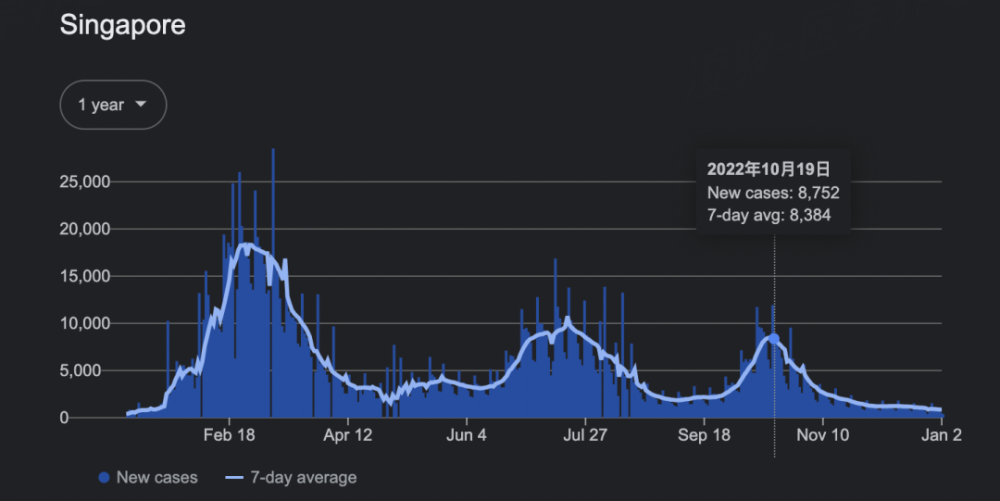
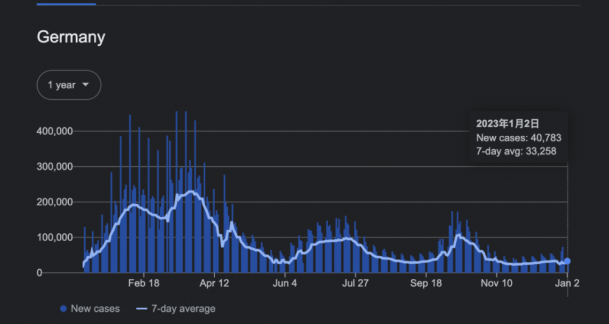

# XBB变异株进入中国，还会有几波疫情？专家：“疫情大海啸”已过去

**撰文 |** **凌骏**

根据近日上传到“全球共享所有流感数据倡议”（GISAID）数据库的中国本土新冠病毒测序结果，目前在境外引发广泛传播的两种奥密克戎亚型毒株——BQ.1家族和XBB家族已进入上海。

在总计上传的369条测序结果中，BQ.1家族和XBB家族占比超过1/3。尽管病例大多数为境外输入，处于闭环管理，但由于中国即将取消入境后的核酸检测和隔离，具有更强免疫逃逸能力的BQ.1、XBB家族等流入社区或许无法避免。

_上海近期新冠病毒基因测序结果。（来源：上海交通大学医学院）_

12月30日，北京大学生物医学前沿创新中心副研究员曹云龙在接受《人物》采访时称，XBB可以称为是目前为止免疫逃逸能力最强的新冠毒株之一。他认为，可以预见，即使国内已经流行过BA.5或BF.7的情况下，该毒株的进入仍有可能导致大规模的再感染。

香港大学医学院生物医学学院教授金冬雁则认为，BQ.1和XBB在美国和香港地区也没有引发二次感染潮，不能认定在中国大陆一定会引发严重后果。

香港城市大学传染病及公共卫生学系助理教授明伟杰长期从事新冠病毒相关的流行病学模型研判，他告诉“医学界”，受新变异株影响的，可能主要是目前的第一波感染，分为两种感染模型。

“首先，对于国内已经接近感染峰值的城市，若XBB等逃逸能力更强的变异株流入，疫情下降的态势可能会被延缓。”明伟杰说，“更值得警惕的是偏远地区，一些地方由于首轮疫情还未进入高峰，若出现传播力、免疫逃逸能力更强的毒株，则可能导致感染人数峰值增加。”

明伟杰认为，上述模型的主要驱动原因是二次感染概率的增加、时间的提前，以及一部分不易感染的人群因此感染。

“最强免疫逃逸”意味着什么？

奥密克戎亚种XBB为BA.2.10.1和BA.2.75的重组体，最早于2022年8月在印度被发现。

进入亚洲后，XBB变异株10月份在新加坡引发了新一轮疫情，持续约1个月。而在最近一周，XBB.1.5开始在美国迅速蔓延，其为XBB家族进化出来的另一新毒株。

根据美国疾控中心(CDC)上周五发布的数据，XBB.1.5
约占美国新冠确诊病例的40.5%，高于前一周的20%。CDC冠状病毒和呼吸道病毒主任Barbara Mahon博士在接受 “CBS
新闻”采访时说，XBB.1.5预计将成为东北部的主要变种，并在其他地区增加。

XBB之所以引发全球广泛关注，和进一步提升的免疫逃逸能力有关。根据北京大学生物医学前沿创新中心曹云龙副研究员/谢晓亮教授课题组上个月发表于《自然》的研究，XBB等毒株逃逸了三针灭活疫苗接种者的血浆，以及奥密克戎BA.1/BA.2/BA.5突破感染者的血浆样本。

而对于接种mRNA疫苗的人群，美国哥伦比亚大学何大一教授团队12月13日发表于《细胞》的研究表明，相比其他毒株，XBB对疫苗接种和既往感染诱导的体液免疫，也存在较严重的逃逸现象。

但金冬雁告诉“医学界”，上述均为体外试验结果，具有警示意义，但不代表XBB或BQ.1会在中国、乃至全球范围内引发新一波“海啸疫情”。

“如果把研究简单理解为，无论打何种疫苗或自然感染，都无法对XBB感染形成保护，那是完全错误，也与事实相悖的。”金冬雁称。根据真实世界数据，他认为在最能体现XBB传播优势的新加坡，也没有造成更多的住院与死亡。

“没有证据表明XBB亚变体会导致更严重的疾病。”根据新加坡政府去年10月14日发布的公告，“事实上过去两周本地数据显示，与Omicron
BA.5相比，XBB病例的住院风险估计降低了 30%。 ”

“新加坡之所以出现XBB的流行，只是因为自然感染人数尚不足，而不是因为重复感染。”金冬雁称。

日本的情况相似，由于另一“新毒株”BQ.1流行率增加，日本从11月起进入新一轮疫情，“这也是由于未达到足够高的混合型群体免疫力。”金冬雁说。与此同时，在BQ.1
流行期间，美国和英国都没有报告随着病例上升，新冠患者的住院率有所上升。

是否会二次感染？

尽管一些研究理论上提示XBB会加剧二次感染风险，但已有的数据表明，目前全球的二次感染病例，患者大多数第一次感染的毒株不是奥密克戎。

业内普遍认为，重复感染奥密克戎，在3至6个月内可能性较小。德国埃森大学病毒所教授陆蒙吉告诉“医学界”，虽然奥密克戎有一些不同的株系，但总体免疫原性变化不大，因此绝大部分如今感染新冠的人，产生的免疫力依然有效，很长一段时间内不会再重复感染。”

“（XBB)免疫逃逸能力最强，并不等于完全的免疫逃逸。免疫逃逸永远不可能是完全的。如果人体的免疫力完全失效，那说明病毒就不会再是奥密克戎，而是新的完全不同的毒株。”金冬雁说，“但哪怕是相类似的事件，也从来没有发生过。即使是基于原始毒株的mRNA疫苗或自然感染，仍能保护人体大幅减少奥密克戎的感染，并免于重症与死亡。”

此外，金冬雁认为，免疫逃逸能力与复制感染能力、致病性是连动的，也是反方向的，因此不会出现所谓的“最强毒株”。“一个毒株不可能复制感染能力与免疫逃逸能力都强。XBB.1.5在感染能力较XBB.1提升的同时，免疫逃逸能力就相对减弱了。”他说。

但由于毒株免疫逃逸能力绝对值的上升，也有很大一部分特殊人群存在风险。

北京佑安医院感染疾病科主任医师李侗曾近日在接受《人民日报》采访时表示，XBB免疫逃逸能力有所增强，感染奥密克戎BA.5后经过一段时间，保护力水平下降，遇到免疫逃逸能力强的毒株，再次感染风险会增加，主要发生在免疫力低下人群。

明伟杰认同上述观点。此外由于XBB等变异株传播力也相对上升，会让一部分近期本不易感染新冠病毒的人风险增加，结果是第一波疫情出现拖尾，或在一些地区导致峰值增加。

“疫情下降趋势被延缓，可能并不会造成严重后果。由于春节后不少大城市首轮疫情陆续迎来尾声，即便感染稍有增加，医疗机构仍足以应付救治。”明伟杰说，“但若是在农村地区峰值还未到来，XBB或BQ.1就有可能导致峰值感染人数增加，医疗系统吃紧，转化为对应的重症、死亡人数增加。”

明伟杰预测，XBB会在1月8日边境开放后逐步流入社区。“没有任何证据表明XBB等变异株致病力增加，因此疫情有多严重，取决于医疗系统是否有出现挤兑。应对措施是要做好分级诊疗，同时利用好远程医疗，释放更多的大医院资源给一些重症的病人，并让每家每户做好基础药物的储备。”

中国还会有几波疫情？

“中国在结束首轮疫情后，可以推测其他全球流行的新冠变异株也会进入，因此把所有精力集中在XBB上是没有根据的，因为它在全球扩张的比例并没有我们想得那么高。”陆蒙吉说。

根据德国的疫情数据，在每一轮奥密克戎感染峰下降约3个月后，会重新迎来一波感染人数的上升，全球不少国家和地区的趋势也类似。

“国内大部分人在首轮疫情建立群体免疫后，时间推移，抵抗力会逐渐下降。今夏可能还会有一波感染，年底冬季可能还会看到医疗机构压力上升，但具体是何种变异株无法预测，而造成多大的社会影响，取决于今年一年中通过感染获得的免疫屏障保护力。”陆蒙吉说。

金冬雁认为，根据各国数据，大多数国家出现的第二波，甚至第三波疫情微不足道，但后面的疫情根本与第一波所谓“疫情大海啸”不可同日而语。

“各国是在‘大海啸’后，新冠疫情才接近季节性流感程度。‘大海啸’是必经之路，无其他解。如日本、新加坡、台湾地区等，压平高峰可以降低大海啸的剧烈程度，但也拖长了阵痛期。”金冬雁说，“中国遇到的冲击与其他国家与地区相比，还是更惨烈一些，这跟中国疫苗接种情况，包括实际接种率、加强针接种时间、暴发后无压峰措施等因素有关。”

但因此也会迅速形成免疫屏障。“目前比如北京，第一波疫情可能已处于下降期，有关部门应当增加信息公开性和透明度。对于未来的第二波、第三波感染峰，都会属于地方性流行，按季节性流感的方式应对即可。”金冬雁称。

明伟杰同样表示，新冠病毒未来的走向会和季节性流感相似，“秋冬季流行，半年一次，一年一次都有可能，肯定还会占用一些医疗资源，重要的是提前做好防疫计划。”

除了传统的公共卫生防疫手段，陆蒙吉认为，要警惕不进行大规模监测所带来的潜在风险，无论是XBB还是未来新的变异株，不能排除流行株的免疫特征发生较大改变，缺乏预测对未来应付常规的新冠流行十分不利。

参照人类应对流感的做法，世界卫生组织每年都会对次年流行的流感毒株做出预测，并依此进行疫苗组分推荐，最大程度降低季节性流感的威胁。

“通过预测未来将出现的变异株，我们可以提前衡量现有抗体药物或疫苗效果。如果我们能够在今年年初就用上BA.5的相关疫苗与药物，BA.5可能就被压制了。如果我们提前开发抗体和疫苗，是不是就可以跟上病毒变异的速度，真正意义上阻断病毒的传播？”曹云龙在接受《人物》采访时称。

来源：医学界

责编：田栋梁

校对：臧恒佳

编辑：赵 静

