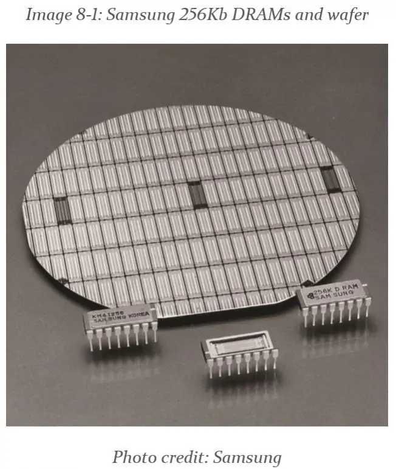

# 三星的又一次豪赌

将三星称为“赌徒”一点不为过，尤其是在存储领域。2000年代三星通过一次又一次赌徒式的逆周期投资，在DRAM市场的衰退中，先后击败德国巨头奇梦达和日本“国家队”尔必达，登上了存储龙头地位。如今，半导体行业下型周期来临，这场戏似乎又在上演？

**逆周期投资，让三星饱尝甜头**

三星由李秉喆创办于1938年，做过贸易、制糖、化肥、电视等等，三星的商业帝国几天几夜也说不完，在此不做过多赘述。三星的半导体业务可以追溯到1974年，彼时三星的会长李秉喆和李健熙自掏腰包出资入股Hankook半导体。到1977年底，该业务完全合并，成为三星半导体。[1]

李秉喆和李健熙知道，当涉及到芯片，Fab资本支出是第一位的，如果时机正确，利润随之而来。如果在需求出现时没有足够的晶圆厂产能，即使是最好的芯片设计也无法成功。1979年，三星建立了一个具有16K
DRAM能力的VLSI晶圆厂。随后三星想进行竞争性的研究，于是四处寻求DRAM技术的许可方，但当时涉足存储芯片的厂商日立、摩托罗拉、NEC、德州仪器和东芝都拒绝了三星的许可请求。

直到1983年6月，三星最终拿到了美光 64K DRAM的设计授权。自此，三星开启了一路逆袭。三星在六个月内便从零发展到64Kb DRAM，并于1983
年11月对制造部件进行了抽样。趁热打铁，到1984年10月，他们制作了一个微米256Kb的DRAM设计（如下图所示），此时三星与日本相差差不多2年，这也是三星在1993年成为世界上最大的存储芯片生产商的第一代突破之路的第一步。

_（图源：SemiWiki）_

1985年，美国向日本半导体企业发起反倾销诉讼，后来双方达成出口限制协议（美国和日本之间的半导体大战这里又可以说个三天三夜，此处仅一笔带过，用以背景参考）。三星乘势而起，对DRAM发起大举投资，此后几年每年投入5亿美元，还有更多的巨额的晶圆厂投资。

终于在1992年，三星率先推出全球第一个64Mb DRAM。1993年，三星超越东芝成为全球DRAM 市场份额的领导者。而随后三星率先发布的256Mb
DRAM，则彻底让三星在技术上领先于日本存储巨头。

在DRAM领域，三星用十年成功实现逆袭，同样的故事也出现在闪存领域。

1987年，日本的东芝存储发明了NAND闪存，但英特尔很快通过NOR闪存超越了东芝，为了缩小容量的差距，东芝于1992年12月将NAND闪存设计授权给三星，此后，三星一路过五关斩六将，先后发布了16Mb、28Mb、1Gb
NAND闪存，直到2002年，三星成为了全世界首个量产1Gb NAND闪存的公司，到2002年底NAND
flash以54%的全球市场份额领先。从获得授权到登顶第一的领导地位，也差不多是十年的时间。

三星的崛起还带动了韩国的内存产业集群，最开始的现代现在的SK海力士也在存储占据一席。眼看韩国存储企业兴起，此时已经不仅是企业之间的争斗，而是上升到国与国之间的较量，于是日本政府整合了日立、NEC、三菱的DRAM业务，建立了“国家队”尔必达。

如果说在DRAM崛起之前的三星，即使亏损也进行连年大幅投资是为了获得入场券，那么此后与德国奇梦达、日本尔必达在DRAM领域的争夺战，则更能显现三星的“赌徒”属性。

2006年Windows
Vista正式上市，DRAM存储厂商本来对DRAM的增长一片看好，原因之一是Vista非常消耗内存，但是由于Vista操作系统的漏洞问题，导致销量不及预期，一时间DRAM内存市场供过于求，DRAM价格开始下跌[2]。就在这时，
**三星反其道而行，将三星电子上一年的利润全部用于扩大产能，通过增大产能来发动价格战，进一步扩大了行业的亏损！**

到2008年金融危机的爆发，DRAM价格跌破成本价，DRAM颗粒价格从2.25美元暴跌至0.31美元，同一时期DRAM厂商的材料成本0.6-0.7美元，现金成本是1.4美元左右。这意味着每生产1颗DRAM芯片，就要亏损1美元。

而德国的奇梦达由于本身成本就偏高，售价也偏高，所以奇梦达率先受到价格暴跌影响。终于在2009年，奇梦达由于资金链断裂宣布破产。日本的尔必达虽苦苦支撑数年，但最终也难逃溃败，最终于2012年被美光收购；日本另一巨头东芝的闪存业务，也在2017年被美国贝恩资本收购。日本存储产业成为“昨日之星”。

可以说三星这次的逆势扩产让其饱尝了胜利果实的甜头，自1993年以来三星一直保持其在存储芯片市场的领先地位。根据市场追踪机构 Omdia 的数据，截至2021
年，三星在 DRAM的市场份额为 42.7%，其次是SK海力士的28.6%和美光的
22.8%。在NAND闪存方面，三星拥有33.9%的市场份额，而日本的铠侠和美国的西部数据分别占据18.9%和13.9%的市场份额。

**三星再次不减产，历史能否重演？**

2022年，半导体行业来到下行周期，存储市场占据半导体1/3市场，受波及更大。包括三星、美光和SK海力士在内的多家存储厂商无一不出现亏损。因此，厂商们都开始变得保守起来。美光计划将把2023
财年的投资从2022 财年的 120 亿美元下调至70亿至75 亿美元，并且还将大幅减少2024
财年的资本支出；SK海力士也在10月份宣布，明年的设备投资预算将比2022年减少50%以上。但是三星不仅不计划大减产，还在扩产。

半导体商业是一件棘手的业务，如果在需求出现时没有足够的产能，即使是最好的芯片设计也无法成功，如果产能不足，竞争对手则会以更优惠的价格和更短的交货时间乘势而上；而如果产能过剩，由于昂贵的半导体设备的闲置，则会拖累成本，不可避免的面临裁员或者关掉产线。

但三星电子的激进投资与其竞争对手因全球消费萎缩而退缩形成鲜明对比。
**三星电子已决定在2023年将其存储器和系统半导体的晶圆产能提高约10%。可以看出，三星不仅想在存储领域实现压制，还想在晶圆代工领域实现反超，晶圆代工厂商台积电和英特尔目前均已表露要减产的计划**
。随着晶圆厂成本攀升，与台积电和其他晶圆厂的竞争将加剧。

五年前，三星的DRAM在密度、性能、成本结构上要优于美光和SK海力士。据行业媒体semianalysis报道，在1α代，三星虽然已经量产了一段时间，但产能还未提上来，而美光在2022年11月已经发布了1β（1-beta）DRAM
技术的验证样品，而且量产全面就绪，1β 是全球最先进的 DRAM 制程节点。SK Hynix在2021年10月发布速度较原先产品增至2倍以上的DDR5
DRAM、抢先三星一步拿到全球首款的头衔。MoneyDJ新闻报道中指出，据半导体业界关系人士指出，过去三星与对手之间还有1年左右的技术差距，不过据分析、目前该差距已缩小至0.5年以内(6个月以内)。

三星的具体扩产规划表现为，将于2023年下半年在其位于京畿道平泽市的第三工厂 (P3)
建立新的DRAM和半导体代工线，每月可生产100,000片12英寸晶圆。三星电子计划将 P3 厂的每月晶圆产量提高3万片，并将运行一条新的 4
纳米线。考虑到三星电子除平泽外，还在器兴和华城设有生产厂，其实际晶圆产能扩张可能超过30,000片。

在DRAM方面，三星电子将在目前每月可生产约2万片12英寸晶圆的生产线上，增加一个可生产7万片晶圆的新设备。三星电子在2022年第三季度(7 ~
9月)的DRAM晶圆生产量为每月66.5万片。预计该工厂将批量生产三星电子最近发表的先进的12纳米DRAM。除此之外，三星电子还决定安装10多台极紫外
(EUV) 光刻设备，用于高科技DRAM 和代工生产。目前三星拥有约40台EUV设备。

除了DRAM领域之外，三星电子的P1厂的NAND闪存设备也将升级。P1的NAND线预计将改造为V8（238层）NAND量产线，可加工约3万片晶圆。此外，在明年下半年完成外装工程的平泽4号厂房（P4）一期工程中，新NAND生产线有可能成为投资对象。根据台湾市场研究公司
TrendForce 的数据，三星电子的 NAND 晶圆月产量目前约为 645,000 张。就半导体投资而言，三星电子决定在所有领域都保持去年的水平。

根据市场研究公司Omdia的数据，NAND的市场价值约为665亿美元。鉴于其增长潜力，一些分析师预计，三星将通过增加NAND的供应，来挤压规模较小的行业企业，在NAND领域仍有6~7家企业正在争夺市场份额。

三星逆周期投资，可能有几方面的原因：一方面，现在半导体已经成为全球实力竞争的一个新的重心，三星不会因为市场因素而决定是否削减存储芯片产量；另一方面，考虑到半导体行业的周期性，即使是衰退也不是灾难性的，周期总会过去，而在行业复苏时完全有可能会实现市场份额的增加。

此外还有一个很重要的原因，长久以来，三星一直是苹果DRAM芯片的主要供应商，但是接下来， **三星将吃下苹果NAND芯片的供应，打进苹果供应链**
。继美国对中国供应商实施贸易禁令后，据一供应链消息来源称，由于这些限制，苹果将从2023年开始使用三星电子作为中国NAND存储芯片的替代供应商。三星位于西安的NAND闪存工厂将为苹果供应NAND闪存，西安工厂目前占据三星3D
NAND闪存总产能的40%。而其他PC原始设备制造商也面临着3D NAND的需求。

Digitimes报道，据IC分销商和测试设备供应商的消息人士透露，虽然需求方面的不确定性依然存在，但三星电子有望在明年开始大幅降价，以进一步提高其在全球存储芯片市场的份额。

扩产、降价，一切看起来是那么的熟悉。历史经验表明，三星在低迷周期投资半导体晶圆厂技术和产能，为下一次好转做准备。

**三星在存储和晶圆代工领域全速进击**

三星在其最近的内存技术日会议上，介绍了其DRAM和NAND业务的先进发展。

下图显示了三星到2030年的DRAM路线图。为了推进10纳米范围以外的微缩，三星正在开发图案、材料和架构方面不断进行突破。即将推出的DRAM解决方案包括32Gb
DDR5 DRAM、8.5Gbps LPDDR5X DRAM和36Gbps GDDR7 DRAM。三星还谈到了 HBM-
PIM、AXDIMM和CXL等定制DRAM解决方案。三星计划到 2030 年实现亚纳米DRAM。

_三星的DRAM路线图（图源：Forbes）_

在NAND领域，NAND制造商一直在增加垂直层数方面进行激烈竞争。SK海力士和美光都推出了200多层NAND技术，不过三星的看法是“重要的不是层数，而是生产力，并且专注于提供具有价格竞争力的更好解决方案。”

三星已经生产到了第八代V-NAND产品，层数大约是230层。三星表示，其第9代V-NAND正在研发中，预计2024年量产。到 2030
年，三星相信他们将在其 V-NAND 产品中创建超过1,000层。下图为三星V-NAND产品进展情况。

_三星V-
NAND产品的历史（图源：Forbes）_

_实现1,000层3D NAND的挑战（图源：Forbes）_

在三星晶圆论坛上，三星很自豪的表示，他们是第一家采用SF3E GAA 工艺开始量产3nm产品的半导体制造商。三星还称这些晶体管为 MBCFET（MBC
代表多桥通道）。下图显示了未来五年三星代工工艺路线图。5nm和4nm的FinFET工艺还在持续发展（绿色部分）；GAA节点从现在的3nm
SF3E开始，到2025年达到2nm，2027年达到1.4nm。可以看出，三星在先进制程上的发展很激进，超越台积电，是三星长久以来的目标[3]。

要实现摩尔定律的继续演进，还需要先进封装技术的支持，三星在2020年8月公布了名为“X-Cube”的3D封装技术，并表示该技术已成功试产，可用于制造7nm和
5nm芯片。三星的封装技术涵盖基于中介层的解决方案 (I-Cube)、混合解决方案 (H-Cube) 以及带或不带凸块的垂直芯片集成 (X-Cube)。

**结语**

三星的商业帝国不是一日建成的，它成功的道路也无法复制，但我们仍然能从三星电子的开创性经验中学习到很多东西。接下来的故事如何续写，让我们继续见证历史。

[1].A Detailed History of Samsung Semiconductor，SemiWiki；

[2]. NAND闪存三十五年，看得见与看不见的“江湖春秋”，全球半导体行业观察；

[3].Samsung Foundry Roadmap 2022，Cadence

