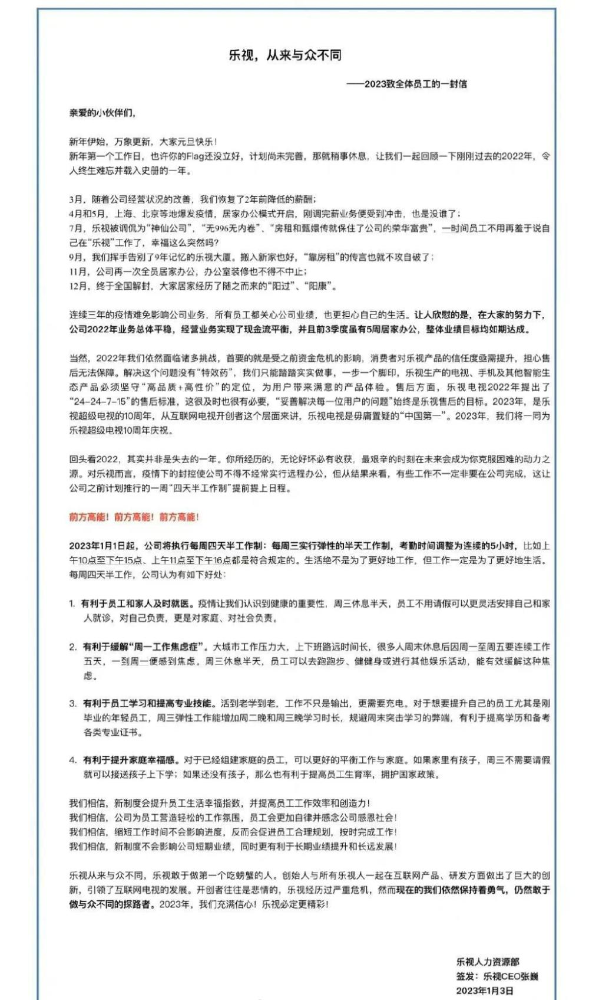

# 乐视发全员信：将执行每周四天半工作制

Tech星球1月3日消息，今日，乐视发全员信表示：2023年1月1日起，公司将执行每周四天半工作制：每周三实行弹性的半天工作制，考勤时间调整为连续的5小时，比如上午10点至下午15点、上午11点至下午16点都是符合规定的。

**以下为内部信全文**

值得一提的是，此前有网友爆料称，乐视还剩下400多人，有不少是五年以上的老员工。并表示“幸福感是很多老乐视人留下来的理由，没有内卷和
996，没拖欠过留下来的员工的工资，也没停过社保。”

随后，乐视发长文回应表示，近日有网传消息称“现在的乐视仍有400多名员工，过着没有‘老板’的神仙日子，无996无内卷，公司没有拖欠过工资和社保，当年无敌高端配置的电视日活仍然不错，靠运营和版权收入养活员工”。在此感谢大家的关注，情况基本属实。

