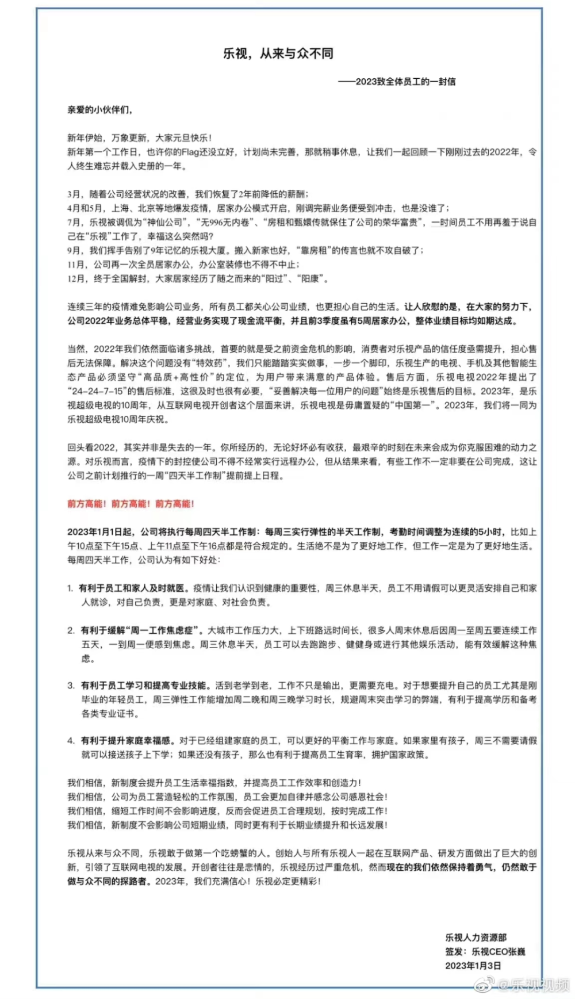

# 乐视实行四天半工作制，网友：还招人吗，我有个朋友想去！

作者 | 苏宓

出品 | CSDN（ID：CSDNnews）

新春的第一个工作日，有一个别人家的公司登上了热搜，羡煞旁人，它就是乐视。

起因是因为#乐视开始实行每周四天半工作制#，所谓话少事大，在官宣这一政策之后，大批网友纷纷涌入评论区：

嫉妒使我面目全非；

小乐，还招人嘛；

还招人吗？我有个朋友非常想去！

**敢于做第一个吃螃蟹的人**

根据其最新对外发布《乐视，从来与众不同》的 2023 致全体员工的一封信中，乐视 CEO 张巍宣布，2023 年 1 月 1
日起，公司将执行每周四天半工作制，即， **每周三实行弹性的半天工作制，** 考勤时间调整为连续的 5 小时，比如上午 10 点至下午 15 点、上午 11
点至下午 16 点都是符合规定的。

在其看来，每周四天半工作，有如下好处:

1\. **有利于员工和家人及时就医。**
疫情让我们认识到健康的重要性，周三休息半天，员工不用请假可以更灵活安排自己和家人就诊，对自己负责，更是对家庭、对社会负责。

**2\. 有利于缓解“周一工作焦虑症”。**
大城市工作压力大，上下班路远时间长，很多人周末休息后因周一至周五要连续工作五天，一到周一便感到焦虑。周三休息半天，员工可以去跑跑步、健健身或进行其他娱乐活动，能有效缓解这种焦虑。

**3\. 有利于员工学习和提高专业技能。**
活到老学到老，工作不只是输出，更需要充电。对于想要提升自己的员工尤其是刚毕业的年轻员工，周三弹性工作能增加周二晚和周三晚学习时长，规避周末突击学习的弊端，有利于提高学历和备考各类专业证书。

**4\. 有利于提升家庭幸福感。**
对于已经组建家庭的员工，可以更好地平衡工作与家庭。如果家里有孩子，周三不需要请假就可以接送孩子上下学;如果还没有孩子，那么也有利于提高员工生育率，拥护国家政策。

用乐视自己的话来形容，「乐视从来与众不同，乐视敢于做第一个吃螃蟹的人。」

**不走寻常路的乐视**

可以说，近几年来，乐视一直在不走寻常路。

从早期崛起于视频网，中期爆发于互联网，再到后期折戟于自动驾驶，乐视对外的标签也随之演变，最初人人都称赞的生态链逐渐没落，变成了外界对其灵魂一问的「贾跃亭下周回国」的质疑声，到过去几年间的“自黑”让别人无处“可黑”，再到如今科技圈真实地「反内卷」第一家。

可以说，乐视在自营品牌上，似乎打通了任督二脉，掌握了行业从业者的心理，招招都应用到了关键点上。

在过去一年全球经济发展不景气的现状下，当「生存」成为各大公司最为紧急的任务之际，乐视「反其道而行」，频登热搜：

春节期间，面对春节期间各大互联网厂商开启瓜分红包节奏的欢快氛围，乐视视频为了降一降温，将 App 标语直接更改为「欠 122 亿」；

3 月，其发布涨薪海报，对外宣布恢复了 2 年前降低的薪酬；

5 月，乐视视频回应能活到今天：何止是奇迹，简直“不科学”；

7 月，乐视被回应被调侃为“神仙公司”，“无 996
无内卷”、“房租和甄嬛传就保住了公司的荣华富贵”，一时间员工不用再羞于说自己在“乐视”工作了，幸福这么突然吗?

9 月，乐视挥手告别了 9 年记忆的乐视大厦。

现如今，乐视四天半的工作制打响了科技圈的"第一声"，成为不少人羡慕的别人家公司。那么，四天半制的工作日是否会引得其他公司迅速跟上，其实未定。

**你支持四天、四天半工作制吗？**

不过，不久之前国外的非营利组织 4 Day Week Global 与剑桥大学、波士顿学院和都柏林大学的研究人员对美国和爱尔兰 33 家企业的 900
多名员工进行了四天工作制的测试。

他们从 4 月到 10 月对大多数公司进行的为期六个月的试点采用 100-80-100 模式：员工在 80% 的时间里领取 100% 的工资，并保持
100% 的生产力。

最终，不出所料， **没有人喜欢五个工作日的模式** ，绝大多数员工都喜欢多给自己留出一天时间：他们将这种体验评为 9.1（满分 10 分），97%
的人表示他们希望继续紧凑的日程安排。

具体来看，在员工的自我评价报告中，多数员工表示，自己的表现水平上升，而倦怠和疲劳感下降。他们可以更好地控制自己的日程安排，每周还可以节省一个小时的通勤时间。

对于公司的领导者而言，他们表示愿意继续这项测试，因为业务没有受到影响。平均而言，企业将他们的日程安排减少了六个小时，从每位员工每周约 41 小时减少到 35
小时。在提供数据的企业中，企业报告整个测试期间的收入增长了 8%，比去年同期增长了 38%。

在试验结束时提供反馈的 27 家公司中，有 18 家企业表示他们肯定会继续每周工作 4 天的模式，7 家计划继续但尚未做出最终决定，1
家倾向于恢复到五天的工作模式，1 家仍在考虑中。

事实上，工作制度的不同对员工的积极性也有不同程度的影响。那么对于你而言，你更倾向于 5 天的工作制还是 4 天亦或是 4.5 天的工作制？

参考：

https://www.cnbc.com/2022/12/09/us-4-day-workweek-trial-results-no-one-is-
going-back-to-normal.html

