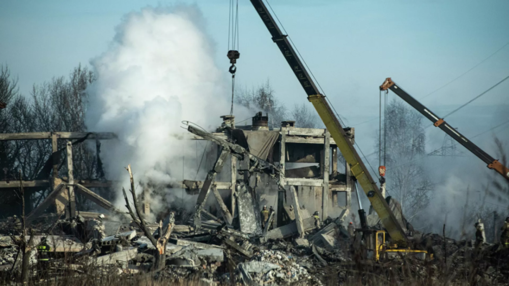
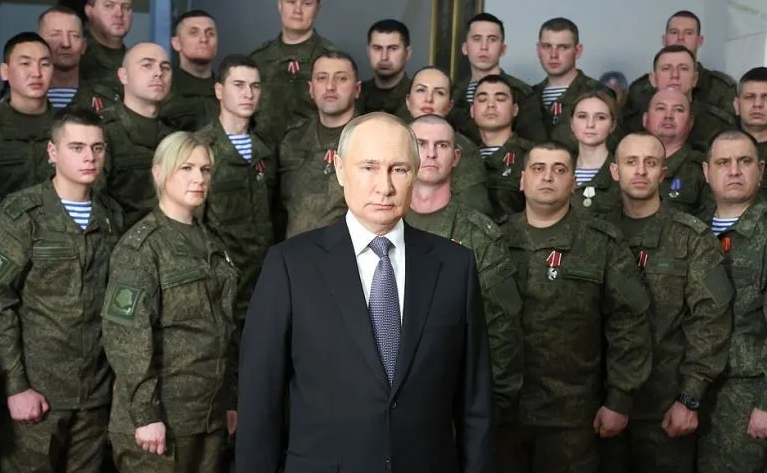
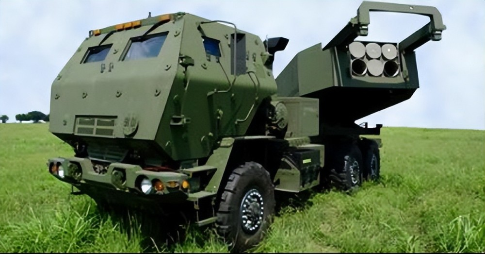
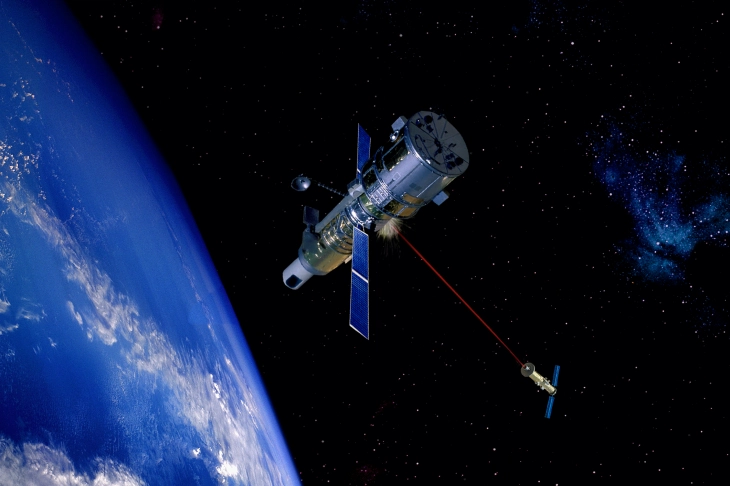

# 俄军罕见公开承认一次性损失63人，反映了什么问题？

**可以说，俄军此次遭受的惨痛损失，反映的绝不是某一单项装备上的差距。面对这种差距，俄罗斯将如何调整与反制，值得高度关注。**

俄罗斯国防部发言人科纳申科夫2日表示，俄军一处临时部署点遭到乌方“海马斯”多管火箭炮打击，承认俄军在此次袭击中已有63人死亡。乌军承认实施此次打击，但公布的俄军死亡人数多达约400人。

尽管乌方数据可能存在水分，但在一次性炮击中损失63人，其人员损失规模也足够惊人。那么，乌军此次打击，暴露出俄军哪些问题？

袭击地点大有讲究

这是自俄乌冲突爆发以来，俄军罕见承认的单次重大人员伤亡。

_俄国防部承认遭受重大人员损失。图源：sputnik_

俄罗斯国防部发言人科纳申科夫当地时间1月2日表示，位于顿涅茨克地区马克耶夫卡居民点区域内的俄军临时部署点遭到乌方打击。乌军向俄方发射了6枚“海马斯”多管火箭炮的火箭弹。俄方拦截了其中2枚火箭弹，另外4枚带有爆破弹头的火箭弹击中俄军临时部署点，造成俄方63名军人死亡。

而据乌克兰武装部队总参谋部当地时间1月2日消息，乌军承认对顿涅茨克地区马克耶夫卡的俄军进行了打击。乌方稍早前表示，对马克耶夫卡的袭击导致的俄军死亡人数远高于俄方公布的数量，约有400人死亡。

这两段新闻提供了诸多关键信息。首先，袭击地点位于顿涅茨克地区。岁末年初以来，在围绕2023年俄乌局势的种种推测中，乌军延续去年秋季以来在西部地区的大规模反攻，是几种可能性最高的选项之一。乌军此次袭击，表明其在顿涅茨克方向仍囤积大量兵力，似乎也暗示了其在新一年初的主攻方向。

实际上，尽管俄乌双方在入冬后的战线趋于停滞，但双方在顿涅茨克的交火十分激烈。去年12月底，由俄国家航天集团前总裁罗戈津等要员组成的军事顾问小组在顿涅茨克所住的旅馆遭炮击，罗戈津背部受伤。俄方称，乌方火炮疑似为法国提供的“凯撒”自行榴弹炮。去年12月初，顿涅茨克议会议员玛丽亚·彼罗戈娃在乌军袭击中身亡，乌军使用的武器疑似为苏联时期的“冰雹”火箭炮。

_普京去年12月31日视察俄南部军区司令部。图源：GJ_

值得注意的是，去年最后一天，俄总统普京访问俄南部军区司令部，并首次在克里姆林宫之外发表新年致辞。南部军区司令部位于俄南部城市顿河畔罗斯托夫，距离顿涅茨克仅约200公里，车程三小时出头。乌克兰此次袭击，或多或少还有向普京挑衅的意味。

差距并非单一装备

“海马斯”多管火箭炮，是乌军此次袭击行动的第二个关键信息。

_“海马斯”多管火箭炮。图源：case.ntu_

在俄乌冲突爆发之初，美军并未向乌克兰提供“海马斯”多管火箭炮。但在乌克兰初步站稳脚跟后，美国在乌克兰的一再要求下最终于去年6月给“海马斯”放行，而俄则对美国这一军援可能造成冲突升级屡次提出警告。

事实表明，“海马斯”给俄罗斯造成的麻烦，远远超出许多人的想象。截至目前，乌克兰已使用“海马斯”摧毁了俄军数十座大型弹药库和指挥所，对俄军的兵力集结地和后勤基地造成极大威胁。要知道，这些目标通常位于战线后方约一百公里的纵深地带，超出一般榴弹炮的射程，而且这些区域通常警戒森严，即便特种部队突袭也很难取得战果。

更值得关注的是，俄军也是火箭炮制造和使用大国，却被“海马斯”屡屡得手，其背后反映的问题值得俄罗斯这样的陆军大国深思。单从炮火射程、弹药种类、火力密度等传统数据来看，“海马斯”多管火箭炮与俄军火箭炮相比并没有优势，但“海马斯”之所以屡屡奇袭得手，主要在于一个“快”和一个“准”。

从“快”来看，“海马斯”不仅跑得快，瞄准快，打得也快。在满载弹药的情况下，“海马斯”的公路最高时速可以达到80至90公里，可以充分利用乌克兰境内的公路网随停随打。同时，“海马斯”能够有效融入北约作战体系，可以充分利用美国等北约国家的卫星与情报系统提供的信息支持与坐标信息。在完成发射后，“海马斯”可以立刻撤离实施再次装填，最短可以在6分钟内完成装填并进行下一次发射。

显而易见，“海马斯”的最大优势在于其高度的信息化与快速机动能力，这与北约体系化的作战网络密不可分。而“海马斯”最大的优势，恰恰是俄军最大的劣势。从克里米亚大桥遭到破坏，到俄境内军港与机场屡屡遇袭，再到前线高级将领与敏感要地被多次精准“点名”，俄军现代化态势感知能力的不足已暴露无遗，其侦察定位能力和实时反应能力都难言出色。

_俄与西方在太空领域的差距正在拉大。图源：techcrunch_

事实上，冲突双方态势信息化程度的巨大差距，从在轨卫星数量可见端倪。截至去年初，俄罗斯军民两用卫星仅有169颗，且极度缺乏高分辨率的侦察卫星。而在冲突的另一方，仅美国就有在轨卫星2944颗，其数量与性能的双重优势足以让战场在某种程度上呈现出“单向透明”。

可以说，俄军此次遭受的惨痛损失，反映的绝不是某一单项装备上的差距。面对这种差距，俄罗斯将如何调整与反制，值得高度关注。

**出品 深海区工作室**

**撰稿 深海龟**

**编辑 深海獭**

