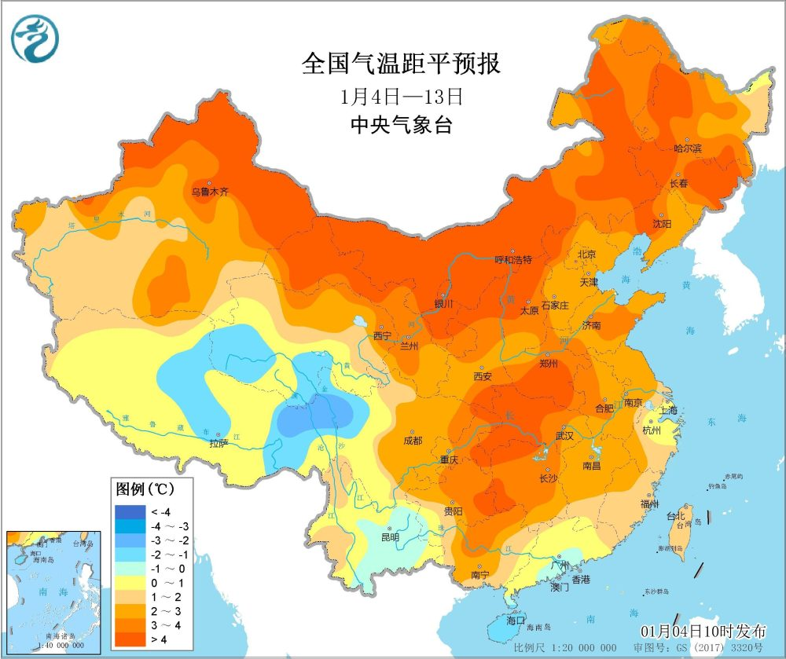

# 大范围暖潮确定席卷中东部 多省或“暖”破纪录

1月4日下午，随着冷空气持续减弱，我国中东部多地已经进入到持续的平静状态，不仅多地雾霾滋生，气温也开始处在升温节奏中。1月4日下午14点的24小时气温变化图上看，今天从北方到南方，都出现了大范围的升温区，尤其是在西北地区东部、云贵高原和江南多地，升温更是相当显著，部分站点24小时升温幅度超过了10度。

**一、大范围暖潮即将席卷中东部**

像是湖南茶陵，监测数据显示，茶陵昨天最高气温仅为8度出头，但今天白天茶陵气温明显回升，下午气温一度超过了15度，对比昨天明显转暖。当然，这还只是我国1月上旬大范围回暖浪潮的开始。

从超级计算机的预测上看，接下来几天，随着东亚地区暖空气强势反扑，我国中东部多地的回暖将成为天气模式的主流。甚至于一波南下的弱冷空气都将存在感微弱，不少地方气温几乎不下降。

中央气象台的预报中也指出，未来10天，影响我国的冷空气势力总体偏弱，中东部大部地区气温将逐步转为偏高，其中北方大部、黄淮西部、江汉、江南西部及贵州东部等地偏高3~5度。

**二、广东等省或将除外**

不过，从中央气象台的气温距平预报上看，虽然中东部多地的升温浪潮即将启动，但并非所有地方接下来都将步入气温偏暖的氛围中——广东、海南、云南、西藏、青海等地，接下来的气温不仅不会大幅度偏高，反而还会略有偏低！

像是华南沿海，海南和广东多地之所以将排除在暖潮之外，是因为在接下来的几天，这里水汽大量反扑，从而带来不少降雨。中央气象台的降水量预报中指出，1月9日前后，广西广东海南福建台湾等地将出现大范围降雨，尤其是广东，多地可达中到大雨，局部暴雨。在阴雨天气的干扰下，气温自然回升缓慢，在大范围偏暖浪潮中显得十分不合群。

**三、多省或暖破纪录**

实际上，接下来我国中东部地区的回暖浪潮是如此强盛，以至于部分地区甚至有破纪录的可能性——像是超级计算机极端指数预报上可见，1月8-9日，我国多地气温异常偏高，陕西河南山东湖北安徽等地极端指数甚至超过了0.9，意味着这一时期多地的日最高气温为同期少见，甚至可能破同期纪录。
​​​​

像是湖北武汉，官方预报中指出，武汉1月8日最高气温可升至21度，这将相当于常年3月甚至4月初的水平，小寒节气变成了春分节气的气温模式。对于武汉而言，这一最高气温也可能打破当地1月上旬最高气温纪录。

