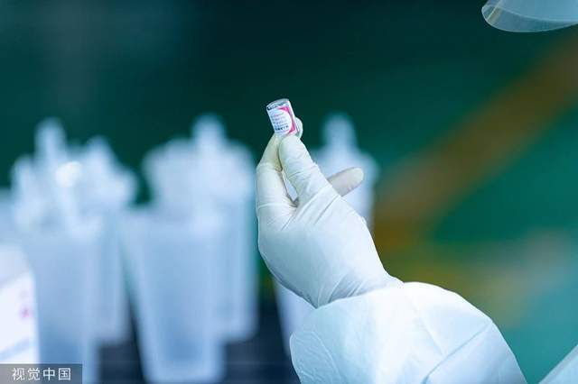

# 感染高峰下顾此失彼，老年人疫苗接种再次失速

岁末年初，短短一月间，新冠感染海啸与重症高峰接踵而至，致使计划中的全国范围的一场“接种攻坚战”被迫中断。

“攻坚战”重点针对老年人群，这也是疫情三年来中国最大的“免疫洼地”。

国家层面曾在去年12月1日下达任务指标：要求在2023年1月底前，80岁以上人群第一剂接种率达到90%，符合条件的目标人群全程接种率、加强免疫接种率均达到90%；60-79岁符合条件的目标人群全程接种率、加强免疫接种率均达到95%。

任务下达后，各地旋即掀起一波接种小高峰，无论是供给侧的推动力度还是需求侧的接种意愿，均有难得的起色。然而不足半月，接种工作即告停顿：

有的地方，接种医生感染倒下、或被抽调到医疗救助，疫苗接种点又关了；有的地方，物流吃紧，疫苗迟迟不到；有的地方，集中精力救治感染者，早已从疫苗接种工作中失神。

最糟糕的是，大规模感染之下，老年人群体也快速感染，感染后6个月不必接种新冠疫苗的要求，影响了老年人对疫苗的信心……

八点健闻致电南、北方多省共计超过20个疫苗接种点了解到，受感染大流行的影响，一些接种点的接种者数量，只有高峰时的十分之一。而且接种点减员现象严重，疫苗接种工作难以正常开展，推动接种的难度越来越大。

这一局面再次验证了从防疫专家到医护人员的经验共识：疫情三年来，“疫苗接种”与“感染高峰”在某种程度上是一种此消彼长的关系。换言之，每当一个地区开始承受感染高峰冲击时，该地公众的疫苗接种意愿可能会由高转低。

一位疫苗专家痛心地向八点健闻表示，中国对老年人的接种安排过于保守，尽管全人群的接种率超过了90%，但老年人接种这块难啃的硬骨头，却始终啃不下来。如果从一开始就作重点安排，则当传染高峰来临，大批老年人涌进重症、甚至死亡的局面就会大幅扭转。

新年之际，距离“接种攻坚战”的截止日期仅剩不足一月的时间，而第一波全国性的感染浪潮仍处于高位运行状态。

这场艰难的疫苗攻坚战能否按时完成、达到预期的免疫水平，一切都变得比计划中的更难。

**短短半个月，疫苗接种工作再度“失神”**

最近半个月来，疫苗接种点重回萧条，疫苗接种工作也不再风风火火。

一些提高接种率的措施匆匆停止。以“上门接种”来说，这项曾被视为提高老年人疫苗接种率的重要措施，但目前就连上海和北京这两个一线城市，也只有少数接种点可以提供这项服务。

山东某地级市接种点的医护人员表示，“非常时期，全市都不能上门接种，大夫都感染了，出了事算谁的？”

而在安徽某县城，下午4点多，还没到下班的时间，疫苗接种点的人就提前下班了。

一些地方疫苗供应开始不足。以第二剂次加强免疫接种（俗称“第四针”）来说，在山东东营，“苗很少”，第四针仅面向医务、城市保障等重点人群，有的接种点疫苗仍未到位；而在安徽某县城，第四针打的都是灭活，而且也并非人人都打得上。

一位新疆西北部地区县医院副院长告诉八点健闻，疫苗需要冷链保存，因此，他们需要一批批上报所需疫苗的数量，疫苗再通过物流一批批配送到当地，“我们最新报的这一批疫苗还没有到，因为物流暂停的原因，等了大半个月，12月26日才到。”

而在大城市如北京，疫苗接种的“萧条”，是另一种场景。

北京的疫苗种类和数量，都最为丰富和充足，不仅第四针接种已对社会面开放，而且“苗充足，够用”，但前来接种的人里很少有老年人。大部分受访接种点都表示，“没人”、“人不太多”；其中一接种点因为人流量小，加上医务人员减员，索性取消了“老年人绿色通道”。

在北京海淀区某卫生服务中心，在2021年1月开始大规模接种第一针时，一天能接种三、四千针，但最近一周每天都只有一百多针。

为了提高辖区内老年人的接种率，据八点健闻了解，北京市海淀区各街道进行了多种探索。田村路街道接种点为前来接种的老年人免费发放抗原试剂盒、N95口罩、酒精消毒喷剂等防疫包；温泉镇紧急成立接种小组保障专班，为失能、行动不便老人提供“上门”接种服务。

对居民来说，因感染无法接种，或者担心感染点风险增加是影响接种意愿的重要因素。多位近期接种疫苗的居民甚至表示，自己在接种点接种疫苗后不久，就在家中测出抗原阳性。

河南某地卫健委宣传科科长向八点健闻坦言，因为12月放开以后感染的人比较多，当地疾控负责的老年人加强针疫苗工作应该还没能开展，得到1月份才能进行。

山东某接种点工作人员透露，很多人担心自己感染了却不自知，接种疫苗后症状加重；另外考虑到接种点感染风险，她建议尽量避开这段感染高峰期，尤其是老年人，“现在接种点不查核酸，医护核酸出得也很慢，风险性太高了”。

随着疫情蔓延，基层医疗的工作重心也在转移。北京某社区卫生服务中心主任柳宇（化名）表示，现在的工作重心主要集中在在医疗救治；而在此之前，疫苗接种才是要调动其他科室人员协力完成的“头等大事”。

过去，为了提高辖区老年人接种率，中心医护人员和街道干部一起主动上门接种，给家属和老人做工作。如今，柳宇也觉得很无奈，“后来基本上推不动，愿意打的都打了，到了一个节点没再使劲往前推了，但还是一直打着。”

**“放开”后，曾出现疫苗接种的小高峰**

多位采访对象告诉八点健闻，2022年12月7日，“新十条”颁布之后，其实迎来过第一针新冠疫苗接种的小高峰，居民的接种意愿在短期内骤升。

在安徽，刘波（化名）就曾考虑劝说父亲接种新冠疫苗。

刘波的父亲是尿毒症患者，隔天就要去医院进行一次透析。为了知道父亲究竟能不能接种，刘波上网查信息，请教多名临床医生，都没有得到过明确的回复，“有的说能打，有的说不能，还有个院士直接说不确定，因为没有这方面的临床数据”。

不确定性太大，加上父亲生活在疫情偶尔才袭击的4线小城市，刘波一家此前达成共识：只要做好防护，感染的可能性很低，暂时先不打疫苗。

意料之外的是，“新十条”之后情况骤变，疫情以迅雷之势迅速蔓延。

不到2周时间，刘波老家所属的中部省份地级市已经开始出现大规模新冠感染，“感染”变成大概率事件。“如果灭活疫苗都扛不住，感染新冠后要怎么办？”秉持这种想法，刘波不断打视频劝说父亲赶紧接种新冠疫苗。

与刘波想法类似的人不在少数，“放开”后的一段时间，不少高危人群曾涌向疫苗接种点。

在山东省东营市某接种点，解除封控后，来接种的人群中，孕妇、老年人、有严重基础病的占比较高。“这些人因为平时不怎么出门，此前都不愿意打，12月初一放开，同住的亲人避免不了每天出门，担心因此被传染新冠，所以都改变心意，过来打疫苗了。”负责该接种点的某社区卫生服务中心计划免疫科医生说。

“愿意接种的早就接种过了，这时候来接种的，都是此前持观望态度但又对新冠感染有担忧的，”上海市静安区某社区卫生服务中心工作人员说，“夏天的时候，我们一直在做疫苗工作，甚至对行动困难的老年人展开上门接种服务，但愿意接种的人非常少，可能一天就3、4人，放开后，来接种的65岁以上老年人明显增多。”

第一针疫苗接种小高峰中，还有一部分此前年龄未满3周岁、不符合接种条件，或者年龄刚刚超过3周岁的儿童。放开之后，父母们几乎赶在第一时间带孩子前去接种。

在北京的部分社区，由于感染人数激增，12月3日起，感染者已经开始居家隔离，疫苗接种小高峰也来得比其他地方更早一点。

“3日到6日那几天，接种点的接种量蹭地一下就上去了，一天能接种500多针，其中，60岁以上老人接种数多的时候能达到一天30多针，”北京市海淀区学院路社区卫生服务中心院长佘瑞芳说，“在这之前，一天的接种量平均只有一二十针，老人接种量则几乎为0。”

她还发现，老年人的接种意愿与新冠疫情之间，总是呈现此消彼长的相关性，“每次发生疫情的前几天，接种量都会呈现明显的上涨，疫情一好转了，接种量又会下降”。

自2020年7月22日正式启动新冠疫苗的紧急使用以来，截至2022年12月1日，我国全人群的新冠疫苗完全接种率已经超过90%。

在此前轰轰烈烈的疫苗接种动员中，各地频出奇招，打疫苗可以免费获得鸡蛋、生活用品购物券甚至现金。为了追求高接种率，部分地区还出现了本地居民被拉到外地打疫苗的“抢人头”事件。

如今，热火朝天的盛况已经过去。“该打的已经打得差不多了”，还没接种的，只剩下疫苗禁忌人群，和高龄、身患基础病、一直对疫苗心怀疑虑的“硬骨头”们。

**新冠疫苗接种工作遭遇窘境**

根据统计，目前，在我国18至60岁成年人群中，接种两剂或三剂新冠疫苗的比例超过了90%；61岁~79岁人群接种率约为83%；80岁以上人群相对较低，只有65%。

这与多地在一个月前下达老年人新冠疫苗接种工作指标——要求2023年1月底前，80岁以上人群新冠疫苗第一剂接种率达到90%；60-79岁符合条件的目标人群全程接种率和加强免疫接种率均达到95%——存在巨大差距。

多位负责接种工作的工作人员均表示，任务很难完成，不少社区卫生服务中心的预防接种门诊甚至已经停诊了。

“除了我，其他人都感染了，人手实在不足。”一位某街道预防接种门诊的工作人员说，“门诊正常开诊的话，第一针到第三针都能接种，只有灭活疫苗，但现在感染人数这么多，估计2023年1月之前无法恢复门诊。”

这是目前全国疫苗接种工作中更为普遍的情况——由于新冠疫情的大面积传染，接种人员相继“中招”。

在某一线城市的一家社区卫生服务中心里，负责新冠疫苗接种的15位防疫保健科医护人员是最早一批感染的。当时，他们去给居民接种鼻喷疫苗，造成部分医护感染；病毒又被带回中心，造成更大范围的院感，“有一天同时有70多个人不在岗”。好在，经过最早一轮感染，目前该中心到岗率已经逐渐恢复到了95%。

与感染后康复的医护陆续回岗的城市不同，目前，上海、山东东营部分接种点依然面临着医护病倒、人手不足的窘境。

另一方面，现如今的医疗机构也将其工作重点转移到了对新冠重症患者的救治。

“大规模新冠感染必定会影响疫苗接种工作，因为救治患者的医疗需求是最迫切的，”广东省佛山市一位疾控人员告诉八点健闻，“患者来了，医务人员不可能不管，在医疗资源有限的情况下，只能集中精力做一件事。”

另外，还未接种新冠疫苗的老年人中，不少人已经感染了新冠。

“对于这部分人群，一是他们自己会觉得接不接种无所谓了，反正已经感染过了，二是目前的疫苗接种政策也要求感染过后6个月才能接种疫苗。这样的情况下，这部分人的疫苗接种率也很难在短时间内提上来。”上述疾控人员表示。

而在很多已过或正处于新冠感染高峰的城市里，60岁、80岁老年人的感染比例并不低。北京市一位社区卫生服务中心院长告诉八点健闻，根据他所在的中心近期的就诊数据，60岁以上的老年人中，可能有80%-90%的人已经感染过了。

由于目前的接种量不算太大，一天在100人次左右，他只派了预防保健科的3位医护负责接种点的工作，一人负责登记，一人负责打针，一人负责留观保障。其他医护转去负责新生儿疫苗等常规疫苗的接种。

“目前老年人的疫苗接种形势并不妙，一是一部分严重基础病老年人群始终无法接种新冠疫苗，二是我们从一开始就采取了偏保守的疫苗接种策略，等于把难攻克的关卡放在了最后。”疫苗专家陶黎纳表示。

但从长远角度来看，虽然这波疫情已经在全国铺开，但奥密克戎的变异特性注定，下一波疫情可能就在不远的将来。疫苗，将始终是新冠防治中不可或缺的一环。

“最近这3个月可能很难，但等这波疫情过去之后，疫苗接种工作还有机会。”陶黎纳说。

（张雨箫对此文亦有贡献。）

田为、张晓艺、严雨程丨撰稿

李琳、严雨程丨责编

**本文首发于微信公众号「八点健闻」，未经授权不得转载**

