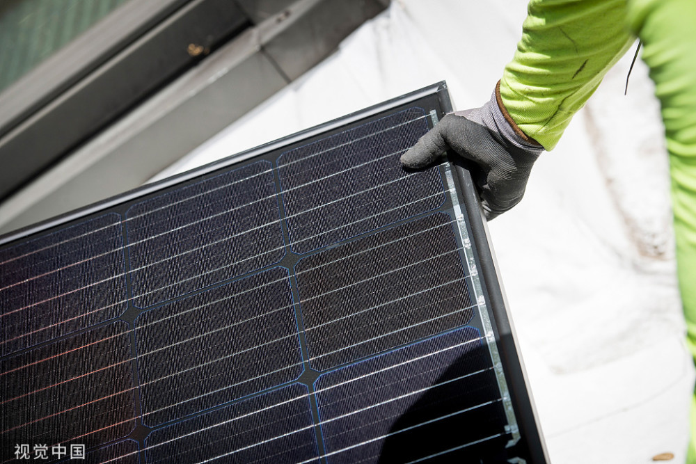

# 日媒：受对华制裁影响，美国光伏产业供应链断裂

【环球时报报道
记者潘晓彤】据日经新闻网3日报道，由于对华贸易限制阻碍了光伏设备关键的低成本零配件和材料进口，美国2022年太阳能新增装机容量据估算比上年减少23%，降至约1860万千瓦。

报道称，美国光伏发电零部件高度依赖中国，受美国对华制裁的影响，光伏产业供应链断裂，企业难以采购光伏电池板必需的硅零部件等中国产品。英国调查公司伍德麦肯兹咨询公司和美国太阳能工业协会（SEIA）的统计数据显示，在美国，2022年大型公用事业规模的新增装机容量减少40%，约为1030万千瓦。家用小型太阳能项目装机容量增长37%，约为580万千瓦，但未能完全抵消减少的部分。

日经新闻网称，这一下降发生在美国以所谓“侵犯人权”为借口，对中国采取更严厉的贸易限制措施之后。2021年12月，美国根据其编造的新疆“强迫劳动”谎言，签署了所谓“防止强迫维吾尔人劳动法”。根据该法，来自中国的太阳能电池板以及其他关键性的可再生能源设备将受到进口限制。该法于去年6月生效之后，美国海关和边境保护局便借“新疆人权”之名无理扣押从中国进口的太阳能设备，造成大量光伏零配件的滞留。日经新闻网称，据估计，太阳能电池板所用的多晶硅有近一半是在新疆生产的。

日媒援引行业领袖的话说，美国设置的进口障碍可能会减缓拜登政府试图推动的向可再生能源的过渡。“美国的清洁能源经济正受到自身贸易行动的阻碍，”SEIA首席执行官阿比盖尔·霍珀在一份声明中表示，“太阳能和储能行业正在采取果断行动建立道德供应链，但不必要的供应瓶颈和贸易限制正在阻止制造商获得投资美国设施所需的设备。”

商务部研究院国际市场研究所副所长白明3日对《环球时报》记者表示，全球绝大多数的光伏组件产自中国，美国无理打压中国光伏企业的做法，不但使美国的光伏企业运营成本承压，还不利于本国新能源产业的发展，是典型的“搬起石头砸自己脚”的做法。

中国外交部发言人毛宁在去年12月的一场例行记者会上曾表示，美方以谎言为依据，制定并实施涉疆恶法，严重干扰中美正常光伏产品贸易，严重违背市场规律和国际经贸规则，严重损害全球光伏产业链供应链稳定和全球应对气候变化的努力，最终将损害自身利益。

