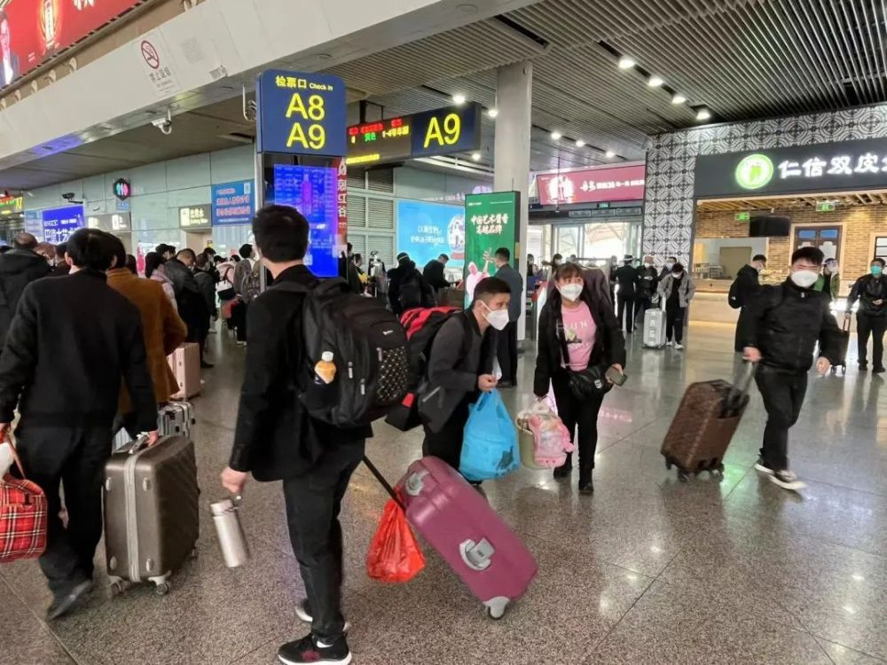
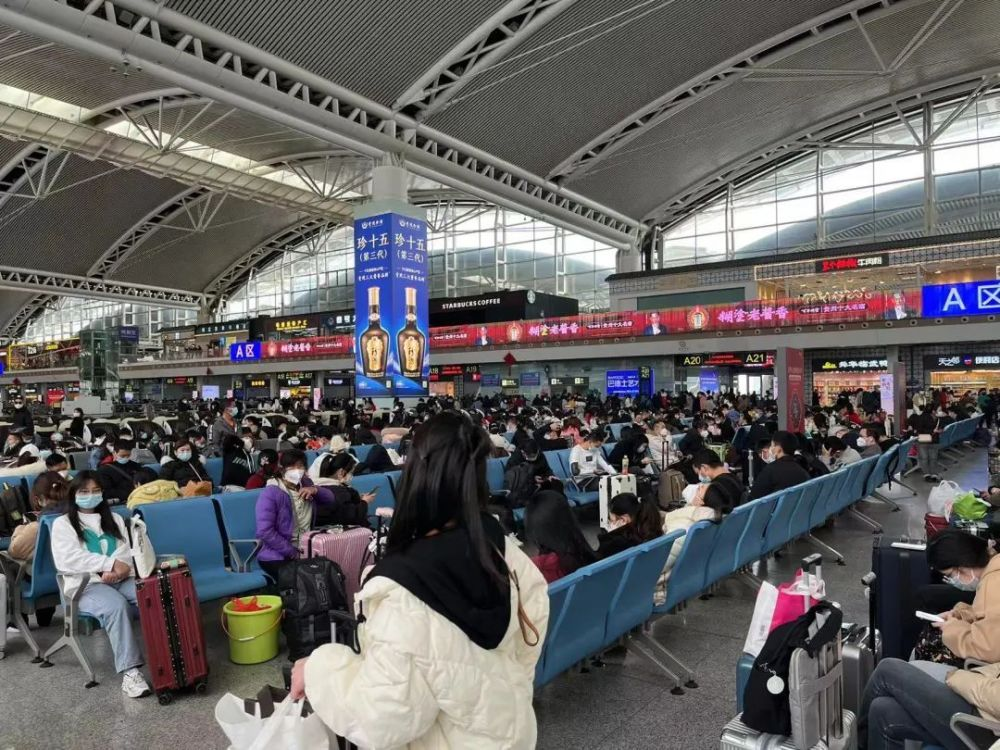

# 春运前的返乡者：有人千里带药回乡，有人回村排队就医

2022年12月29日，广州南站人头攒动。这天中午，郝建国肩上背着一个背包，手提一个装满了泡面的塑料袋，步履匆忙地在人群中穿梭，生怕赶不上回家的高铁。

“去年我是腊月二十九才回家的。但现在工厂已经没有什么订单了，所以只能提前回家。”郝建国在接受第一财经记者采访时说，“目前工厂里至少大约有80%的工友已经返回老家。”他来自江西一个偏远的山村，目前在广东肇庆的一家服装外贸工厂打工。

连日来，第一财经记者在广州南站接触了多位如郝建国这样的提前返乡人员，他们有的是因为疫情之下所在单位已经停工停业，有的是担心春运期间的疫情会更加严峻，还有的是希望农村地区的“封闭”环境能够与疫情隔离，如此种种，大家决定赶在春运前返乡。

2022年12月27日，国务院应对新型冠状病毒感染疫情联防联控机制春运工作专班印发的《2023年综合运输春运疫情防控和运输服务保障总体工作方案》显示，2023年综合运输春运从1月7日开始，至2月15日结束，共40天。

多方信息表明，多数地区将在春运期间完成这一轮的新冠病毒传播“达峰”，值得关注的是， **随着大量人员返乡，农村地区的医疗资源和卫生环境将面临更大挑战。**

**带药返乡**

2022年12月29日，尽管距1月7日的春运启动还有一周多的时间，但广州南站服务台上一位工作人员向第一财经记者表示，现在“不是春运，胜似春运。这几天，车站里的人流明显增多，每天都满人”。

在广州南站的候车厅里，记者看到，候车的座椅上基本坐满了回家的人，一些人因为临时找不到座位，干脆坐在竖起的行李箱上等待检票。

和郝建国一样，来自湖南衡阳的赵立明也提前返乡。2022年12月28日下午13点，年近60的赵立明和他的妻子，以及另外一对同样来自湖南衡阳的工友夫妇坐在广州南站的广场上晒太阳，正在用双手捂着头部打瞌睡，等待下午18点开往衡阳的高铁。“当时我们都以为来了就能买到中午的票，所以没有提前买票。”赵立明说。

赵立明和其他三人均在广州的工地里打工，为新建的房地产砌墙。大约一周前，他在工地里被上面掉下的砖头砸断了左手的两根手指，术后手掌上还缠着一层白色胶布。但对于这些，他似乎并不在意，笑呵呵地跟记者说：“今年活少，工地时断时续，赚不到什么钱。”他的妻子则因为晚上到衡阳时赶不上公交车，届时将白白浪费一百多块的打车费而唠叨着。她脚下放着一罐尚未用完的花生油，说是正好拿回家做菜。

和去年腊月26日返乡相比，赵立明今年提早了差不多三个星期回老家。据其介绍，在同一个工地上，至少已经有七成的工友已经从广州返回老家了。

距赵立明他们大约20米外，是来自湖南永州一个乡村的陈德生，今年56岁，正在太阳底下干啃着一块年糕，等待下午一点多回家的高铁。“这次回家主要是给家里的老人送药。”他在接受第一财经记者采访时说。

随后，他从一个黑色的布袋里拿出一些感冒退烧药给记者看。有氢溴酸右美沙芬片，也有氨咖黄敏胶囊。前者是一种用于治疗干咳，包括上呼吸道感染（如感冒和咽炎），支气管炎引起的咳嗽；后者则是用于缓解普通感冒及流行性感冒等引起的发热，也可缓解轻、中度疼痛，如头痛、四肢酸痛、咽痛等。这样的药品，他带了大概三四盒。

这些药，都是陈德升所在的公司自己生产并发给员工的。他所在的是一家国内知名的上市药企，主要研制、生产、销售中西成药、化学原料药、外用药、儿童用药和保健药。他在该公司的药厂里负责制药设备维修。尽管药厂目前人手非常紧缺，他还是请了一周的假。在此之前，他已经连续两个月吃住都在药厂里了，时刻盯着这两个月来每天24小时满负荷运转的制药设备。

过去一段时间，村里不少亲朋好友都纷纷给陈德生打来电话，询问他能否从广州这边帮忙买点感冒退烧药回去。但他办不到。他向记者坦言，这次给两位年过八十的父母送药回去，并没有告诉村里的其他人。“（药）拿得不多，只能给两位老人，谁都不给。”

陈德生与妻儿都在广州，只有年迈的父母还留在永州老家。家中的两位老人属于典型的“空巢老人”。

根据民政部2022年公布的数据，截至2021年底，全国60岁及以上老年人口达2.67亿，占总人口的18.9%；65岁及以上老年人口达2亿以上，占总人口的14.2%。
**全国空巢老年人占比目前已超过老年人口的一半，部分大城市和农村地区，空巢老年人比例甚至超过70%。**

看着疫情传播逐渐加剧，陈德生愈发担心老家的父母，一方面是老两口身边无人照顾，另一方面老家方面不断传来缺医少药的消息，因此他果断提前请假回乡。

**在村卫生室排队看病**

在深圳一家工厂打工的陈芳则更早就返乡了。

2022年12月18日，陈芳带着刚满6个月的女儿和年近七十的婆婆回到了老家海南。她的想法是，和深圳相比，海南气候相对温暖，村里也较为闭塞，或许可以让年幼的孩子暂时躲过这场疫情。

但回到老家的陈芳发现，村里也已经“到处养‘羊’”。她一家子在到家的第二天，就陆续出现发热症状，其中女儿高烧39.1℃。她说，如果是在深圳，那么她一定会把女儿带到大医院里就诊。但在村里，她只好抱着女儿来到当地的卫生室。

陈芳所在的村庄，位于海南西部某市，整个村庄共有3800余人，卫生室有3家，各有一名医生，其中一家配有两名护士。这样的配置已经高于不少同类的村庄，但发热的人是如此之多，以至于当陈芳抱着女儿来到卫生室时，远远就看到门口外面挤满了人，她最后排队等了两个多小时才看上病。

在2022年的最后一天，该卫生室的医生吴旺在接受第一财经记者采访说，
**他现在每天平均要看100多名患者，高峰的时候甚至有200人，其中有三分之二是发热患者，人数是疫情“放开”前的七八倍。**
在吴旺的卫生室里，病情较重的发热患者，一般会主动请求输液。

由于看病的人太多，吴旺现在每天至少需要工作14个小时，有时候连吃饭的都顾不上。“除了自己感染新冠休息两天外，我每天从早上8点开始，一直干到晚上10点，有时候会搞到凌晨12点。”他说。

眼下，最让吴旺头痛的是，卫生室里的感冒退烧药已所剩不多，库存大约只能支撑三四天，但现在到处买不到更多的感冒退烧药。

也是在2022年的最后一天，在陈芳所在村庄的隔壁村开药店的吴明达向记者表示，此前以为所备的退烧药已经足够，但目前已接近断货，大约还有“一天的样子”。在疫情“放开”前，每天到他药店里买感冒退烧药的不到30人，但这两周来，平均每天大约有180多人来买药。由于一个人忙不过来，他的妻子也来帮忙。

吴旺和吴明达均向记者表示，村里大部分人都没有做抗原检测，更没有做核酸，但他们发现，从在药店来买退烧药和在卫生室里看病的发热患者来看，至少有90%的人都出现了发烧发热症状。

感冒退烧药面临断货的还有当地镇上的卫生中心院。12月30日，该镇卫生中心院的院长给吴明达打来电话，询问他是否还有多余的感冒退烧药。

这个镇的户籍人口大约3万余人（2020年数据）。记者从该镇上的卫生中心拿到的数据显示，目前该镇每天接收的发热患者有600左右人，高峰时有700多人，是疫情“放开”前的10倍。

发热患者数量猛增的同时，医护人员也抓襟见肘。记者了解到，该镇卫生中心院共有60余名职工，其中医生、护士各有12人，公共卫生人员10人左右，剩下的是药房、收费、采购等后勤工作人员。如果以该镇卫生中心院目前每天接诊600名发热患者来计算，平均每名医生需要对接50名患者。

此外，这些医生还需为其他患者接诊。该镇卫生中心院一名医生向记者表示，这些日子以来，院里所有的医生都是在“连滚带爬”工作着。

**“硬仗还在后面”**

相比较而言，陈芳老家的医疗资源配置已经远远优于郝建国、陈德升等人的老家。

陈芳所在的镇上的卫生中心院，其职工人数高于全国平均水平。来自国家卫健委的数据显示，截至2021年末，中国2.96万个乡镇共设乡镇卫生院3.5万个，卫生人员149.2万人。按此计算，这3.5万个乡镇卫生院，平均卫生人员只有42.6人。

与此同时，陈芳所在村庄的卫生室数量，也高于全国平均水平。来自国家卫健委的数据显示，截至2021年末，中国49万个行政村共设村卫生室59.9万个，在村卫生室工作人员136.3万人。按此计算，平均每个行政村设有村卫生室1.2个，平均每个村卫生室有2.3个工作人员。

正如陈芳、郝建国、陈德升等人各自老家的情况一样，数据显示，乡村医疗资源的分配很不均衡，但总体而言，各地村卫生室和乡镇卫生院这类最基层的医疗机构面临的压力是相同的。仅就老年人口来说，根据《2020年度国家老龄事业发展公报》，
**截至2020年底，全国60岁及以上老年人口达2.64亿人，其中乡村60岁老年人口达1.21亿人。**

这也意味着，在当前疫情的冲击下，全国其他3.5万个乡镇卫生院和59.9万个卫生院的医护人员，或将面临这更大的压力。

2022年的最后一天，国务院联防联控机制、中央农村工作领导小组印发《加强当前农村地区新型冠状病毒感染疫情防控工作方案》（下称《方案》），部署加强当前农村地区新型冠状病毒感染疫情防控。

为保障农村地区医疗物资供应，《方案》提出，加快防疫药物生产。关于健全基层疫情防控体系，《方案》提到“加强对农村地区医疗卫生机构的支持”。同时，统筹县域内医务人员调配，结合乡镇卫生院服务人口和服务量，加大乡镇卫生院医务人员配备力度。《方案》在提到“加强重点人群健康服务”时要求，加快扩大农村地区65岁及以上老年人家庭医生签约服务覆盖面，对重点人群实现签约全覆盖。通过电话、视频、微信或线下随访等方式加强对居家治疗观察人员的健康监测、用药指导、抗原检测等服务。

**“疫情已过三年，但感觉真正的硬仗还在后头。”** 海南西部某市一家三甲医院的一名工作人员在接受第一财经记者采访时说。

（文中郝建国、赵立明、陈德生、陈芳、吴旺、吴明达均为化名）

