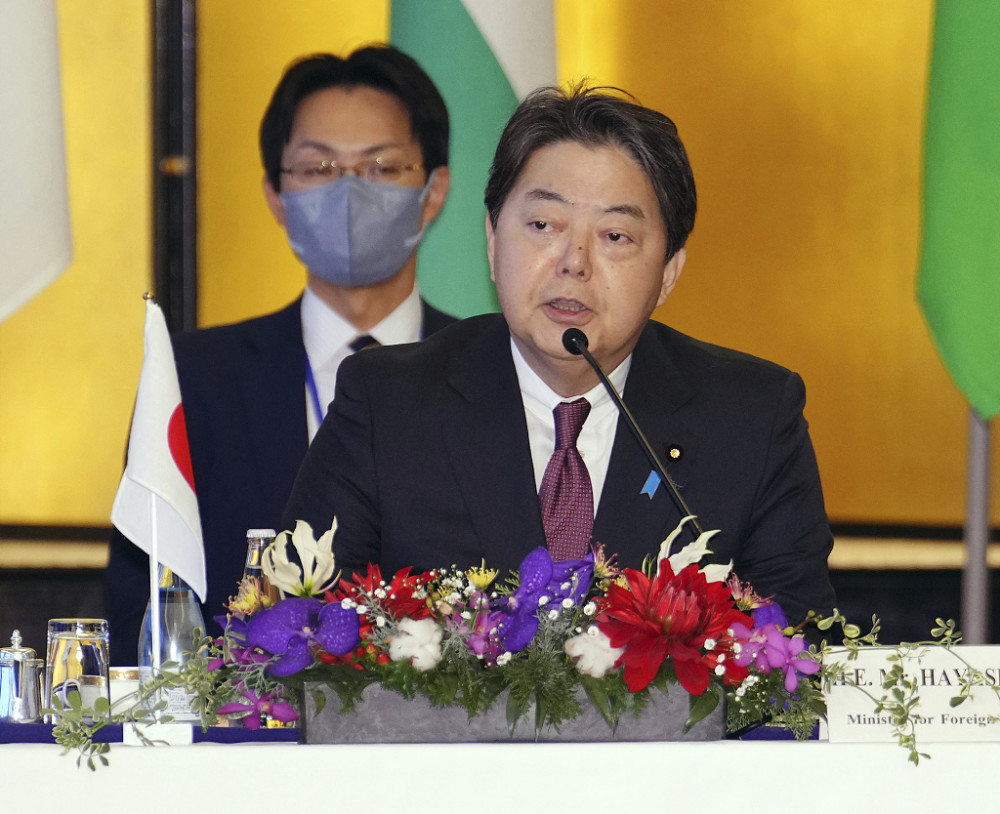

# 林芳正将访问墨西哥巴西等国，日本“布局”中南美洲意在中俄？

【环球时报驻日本特约记者 杨君 环球时报报道
记者白云怡】日本外相林芳正将于4日至11日对中南美洲国家墨西哥、厄瓜多尔、巴西和阿根廷进行访问。日本《产经新闻》2日报道称，该地区是中国与俄罗斯影响力日益扩大的区域，而今年日本是联合国安理会非常任理事国，并担任“七国集团”（G7）轮值主席国，日本欲借此次访问之机推进其所谓价值观外交和同中南美地区的经济安全合作。

在访问期间，林芳正将与四国外长等举行会谈，就推进双边合作、强化经济安保等议题交换意见。日本共同社报道称，鉴于日本与巴西在2023年都将担任联合国安理会非常任理事国，所以林芳正也将与巴西方面商议合作推进安理会改革。另外，墨西哥是中南美最大的日资企业活动据点，林芳正将与该国讨论深化经济关系。

《产经新闻》称，围绕乌克兰危机，作为今年G7轮值主席国的日本，将以拉拢包括中南美洲在内的“全球南方国家”为重要课题。据悉，林芳正此次访问的4个国家在去年3月联合国的一份谴责俄罗斯的决议中，均投下赞成票。但在一个月后美洲国家组织关于暂停俄罗斯常驻观察员国资格的投票中，阿根廷、巴西和墨西哥却都选择弃权。日本官员分析认为，“如果不进行拉拢，它们就有可能转向俄罗斯”。

此外，报道认为林芳正此次访问也有遏制中国在该地区影响力的目的。《产经新闻》称，中南美洲矿产资源丰富，是重要的资源供给地。日本过去曾是该地区最大的政府开发援助捐助国，但近年来的资金援助呈现减少趋势。取而代之的是崛起的中国，通过扩大资源和食品贸易，中国强化了与该地区的经贸关系。日本外务省一名官员称，“（林芳正）此次访问正是为了进行布局”。

不过，日本《东京新闻》曾分析称，在拉美地区因新冠疫情而贫富差距拉大的背景下，左翼政府不断出现。在经济方面，中国在拉美地区的存在感很有可能进一步增强。日本《朝日新闻》指出，中南美国家与中国的贸易从2000年开始快速增长。目前，对巴西、智利、秘鲁和乌拉圭来说，最大的贸易伙伴国是中国。

中国社科院日本所综合战略研究室副主任卢昊3日对《环球时报》记者表示，中南美在日本外交中的优先级相对靠后，日本首相上一次访问该地区还是近十年前安倍访问中南美五国。林芳正此次中南美之行或旨在为岸田未来可能对该地区的访问“打前站”，并增加日本在当地的战略影响力。

卢昊分析认为，林芳正此行或兼具政治和经济意图。“在政治上，日本希望为其在联合国等国际机制上争取更多国家的支持，尤其是作为金砖五国之一的巴西有着较突出的政治影响力；在经济上，拓展日本对外经济关系也是其重要目标之一。”不过，卢昊表示，从整体上看，日本对拉美地区的外交和战略投入仍十分有限，无论经济纽带还是价值观纽带都远没达到“非常密切”的程度。

