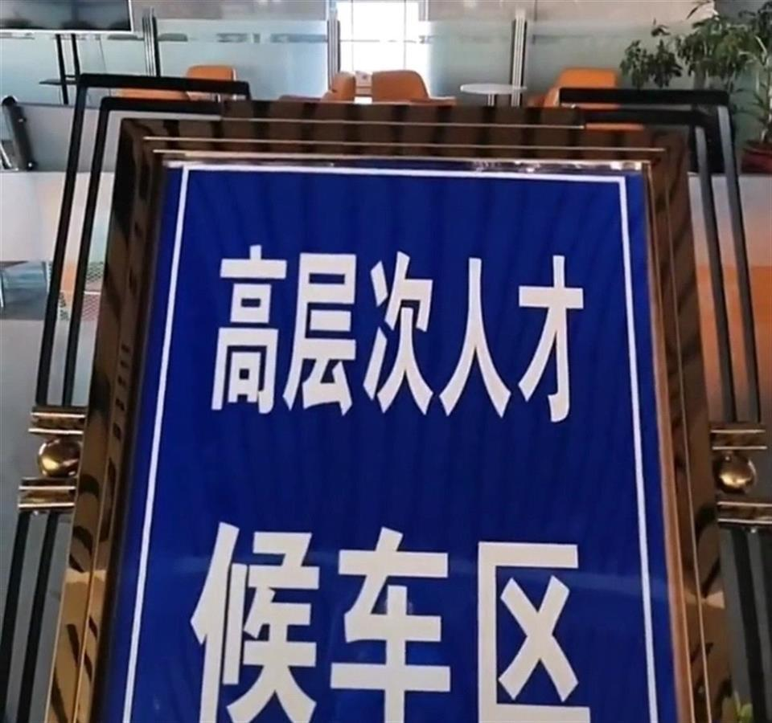

# 黑龙江一火车站设“高层次人才候车区”，官方：为了吸引人才

极目新闻记者 肖名远 赵德龙

近日，网传黑龙江省齐齐哈尔一火车站现“高层次人才候车区”，引发网友热议。1月4日，当地人才办工作人员回应极目新闻记者称，此举其实是落实人才服务的相关文件政策，高层次人才凭有关部门发的“人才卡”候车。

_车站内的“高层次人才候车区”标牌（图片来源
上游新闻）_

网传视频中，一个火车站候车区摆放着一个展架，蓝底白字写着“高层次人才候车区”。有网友表示质疑：“什么人才是高层次人才？”还有网友表示，职业都是平等的，不应该搞特殊。也有网友表示理解，认为引进人才给与优惠政策，也可以给地方带来更大发展。

极目新闻记者了解到，此事发生在黑龙江齐齐哈尔南站。该站工作人员曾回应媒体称，车站候车室的座椅有一两千个，“高层次人才候车区”的座椅约20个，像母婴候车区一样是单独设置的，并不影响其他旅客候车。工作人员还称，“高层次人才”不是车站自行定义，而是由政府相关部门认定。

1月4日，齐齐哈尔市人才办服务科工作人员向极目新闻记者介绍，他们也注意到网络上对车站展示牌的关注，此举其实是落实人才服务的相关文件政策。按齐齐哈尔市高层次人才分类目录，高层次人才分别是A类（顶尖人才）、B类（杰出人才）、C类（领军人才）、D类（高端人才）、E类（高级人才），“高层次人才候车区”供省内企事业单位B类以上人才候车。通俗来讲，B类人才属于在国内某领域处于领先地位的人员，能为当地经济和社会发展作出重要贡献。

该工作人员还介绍，“高层次人才”分类认定工作在全国各省市都有，旨在吸引和留住人才。一些经济基础更强的省市，往往能给人才提供更优厚的经济和物质条件，齐齐哈尔市在这方面不占优势，因此他们希望用更好的政策和感情来吸引人才。火车站“高层次人才候车区”座位只有20个左右，高层次人才凭有关部门发的“人才卡”到这里候车，结合目前客流情况，并不会给其他乘客带来候车障碍。

（来源：极目新闻）

