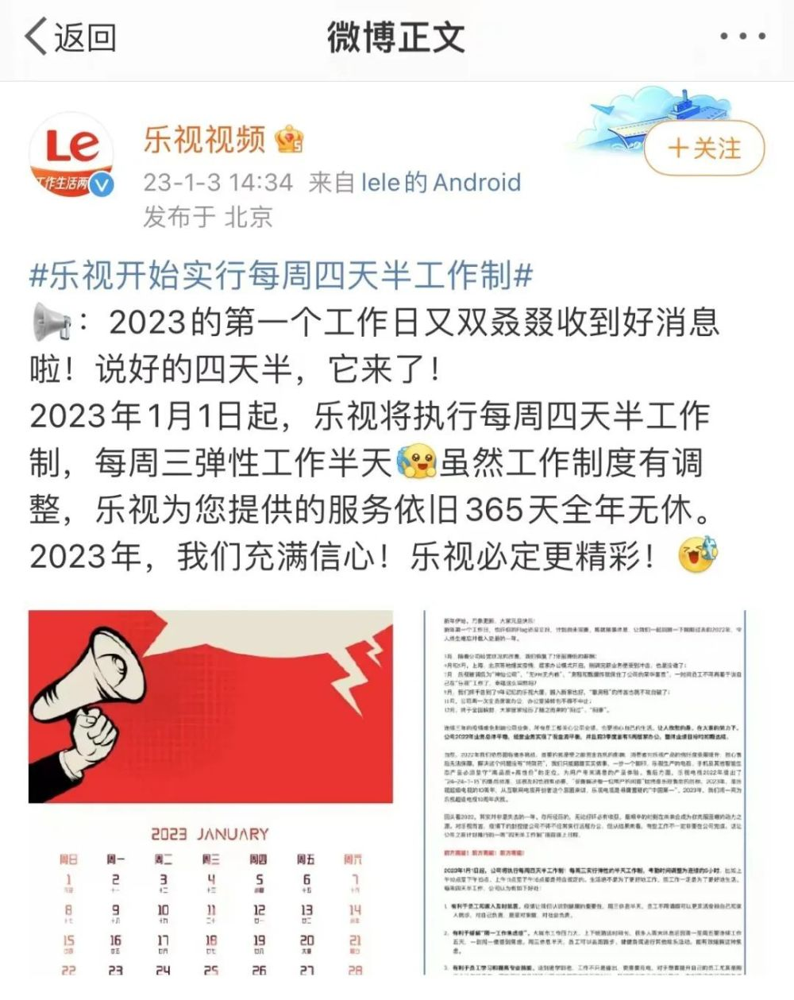
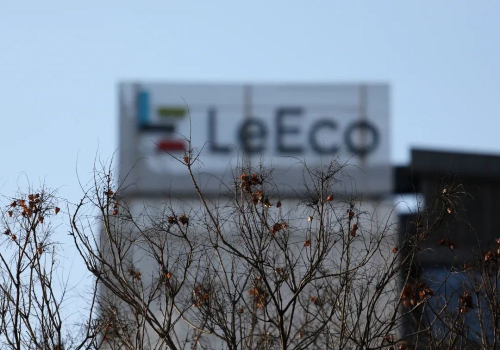
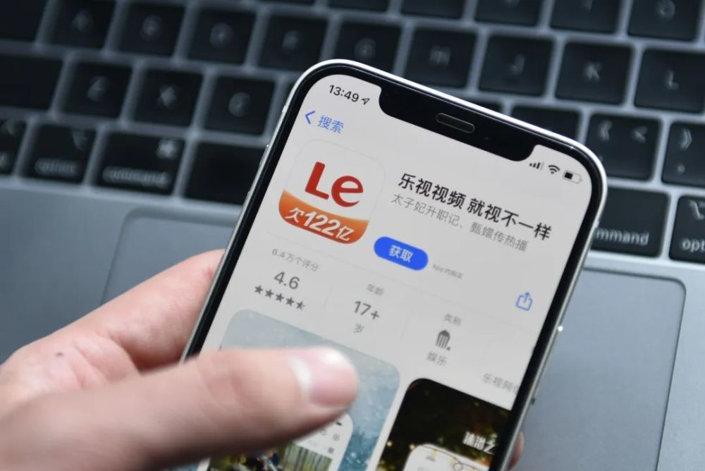
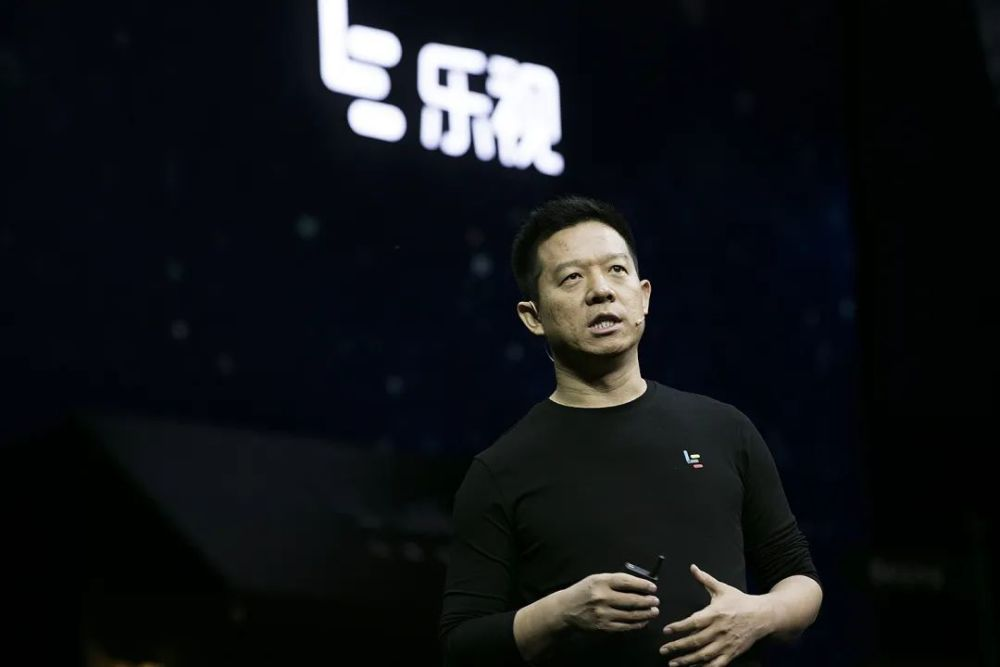

# “四天半工作制”背后的乐视：只要赚钱，什么都干

**作者 |** 赵子坤

**编辑 |** 董雨晴

“感谢老板，老板V587”，有着391名员工的乐融集团微信群，突然刷屏了。

这是元旦刚过的第一个工作日，一向擅长踩点营销的乐视又发通知了，宣布将推行“四天半工作制”。每周周三，实行5小时弹性打卡。

上一次乐视因为“没老板的神仙公司”上热搜时，乐视就在回应信中“预告”：哪天要是我们率先推出四天半工作制，每周36小时工作制，也不奇怪。

这项规划了半年的新制度，终于落地了。脉脉热榜上，“乐视四天半工作制，能全国推广吗”的话题在热度榜首挂了一天，但紧接着的一条热议话题却是：猜猜年终奖会打折吗？

“别人在躺平享福，我甚至连卷的资格可能都要被剥夺。”活在裁员动荡、年终缩水时期的心酸互联网人如此感慨。

告别贾跃亭时代的乐视，真就活成了打工人最羡慕的去处？

“佛系”的另一面

1月3日，一整个晚上，乐视网人力资源负责人常乐都在回复响个不停的微信，有前来确认消息的前同事们，也收到不少“慕不卷之名”而来的简历。

“外界看起来很突然，员工也蛮惊讶的，但其实内部酝酿了很久。”常乐向市界透露，早在去年7月中旬内部就提出了这个计划，最终拍板落地是在12月。

新政策的推行可以说非常顺利。因为公司架构简单，讨论后很快就能拍板推行。常乐在12月底聊了一圈业务部门负责人后，决定趁“新年新气象”，开年推行，且不降薪，部分需要线下沟通、值班的岗位再做落地细化，“但大方向不会变，也会持续推行下去。即便将来员工出现绩效下降，我们也不认为是多半天少半天的事。”

2022年，乐视首次宣布不考虑历史债务，经营业务实现了现金流平衡，同时恢复了两年前的降薪和取消的补贴。2020年疫情初期，乐视宣布月薪三万以上的员工普遍降薪，比例大概在10%-20%，高管层比例更大。

和正处在降本增效、轮番裁员的互联网大厂不同，当下的乐视看起来是十分“佛系”。

恢复降薪、不裁员、不加班，还提前实行了“四天半工作制”。这种反差从何而来？乐视又凭什么成了别人口中的神仙公司？

毕竟，人们印象中的乐视，还是那个在2016年底宣布爆雷，创始人贾跃亭出走美国，留下高达百亿债务的乐视。那几年间，乐视从高峰陨落到谷底：被讨债、裁员、强制退市等一系列负面舆情缠绕。

曾经让贾跃亭骄傲的乐视“七大生态”也已经消失于过往。目前仅剩的平台、智能硬件、电影，分属于乐视网、乐融致新和融创文化，三者之间早已经相互独立。

（乐视旧Logo，图/视觉中国）

当下频繁在舆论场掀起波澜的乐视，是指乐视网和乐融致新，前者靠包括《甄嬛传》在内的、早年累积的版权过活，后者则是乐融集团着力发展的方向：智能生态。

2021年5月，乐视智能生态回归后，发布了热水器、空调、燃气灶、智能手表、智能门锁、电动牙刷、移动电源、耳机、数据线、手机等品类。

就在四天半制度发出后，从1月3日开始，就有不少人涌入乐视的抖音直播间“求职”，让原本没什么人观看的乐视直播间单场累计观看人数直接突破了10万。

乐视品牌相关负责人向市界透露，2023年乐视生态还会陆续“上新”，将推出投影仪等新品类产品。直播方面，乐视将尝试搭建自己的供应链，除了自身现有的智能生态产品外，还包括“带货界”常见的食品、饮料、酒类等，“会学习东方甄选的自营模式”。

同时，在一些创新业务的“试错”上，会考虑多采用兼职岗位，比如目前直播团队只有12人，将持续欢迎兼职主播加入。

开脱口秀式直播带货、出《甄嬛传》IP周边、推出小程序游戏、投资短剧、开发硬件新品类……“对乐视来说，在不考虑历史债务情况下，能自己养活员工，一年比一年活得更好，就是我们努力的方向。”该品牌负责人说。

“只要有利润，能赚钱，我们都会去做。这个方法不行，就换下一个。”

最新财报数据显示，乐视网2021年实现营收4.18亿元，同比下降10.73%；归母净利润亏损21.46亿元，同比增长14.00%。2022年前三季度，乐视网实现营收2.67亿元，同比下降10.04%；归母净亏损3.53亿元，同比扩大118.35%。同期，该公司经营活动产生的现金流量净额为1177.9万元，负债合计为223.1亿元。

目前，乐视的主要收入来源分别是在线视频会员收入与智能硬件收入，前者由乐视网进行运营，后者由乐融致新进行运营。

老“反向操作”玩家

这也并不是“反卷”的乐视第一次引起舆论风波了。

2021年春节，在各家“你分10亿，我分20亿”的红包PK之际，乐视视频一波反向操作，以“欠122亿”的自嘲赢回了一波好感，也让乐视App下载量上涨了20%。

2022年5月，在受疫情普遍影响，行业受到冲击之际，乐视发布内部信，强调疫情居家办公期间，公司实行全员全薪，将继续信守承诺，不再有大规模裁员计划，又突出一个“动荡时期不降薪”的良心公司形象。

这次，更是声情并茂说出：生活绝不是为了更好地工作，但工作一定是为了更好地生活。

“公司能喊出这样的话，我很骄傲。不是所有的老板都能跟打工人共情。”有乐视员工在小红书晒出群通知的截图，提及自己在上家单位流泪熬夜干活的崩溃。

无疑，乐视这项举措提升了员工对公司的认可度，也变相再刷了一波对外的形象好感。

“第一次自嘲能赢得好感，还能不花钱上热搜，但其实时间久了，大家也容易审美疲劳。”离职员工王桦说，看到群里前同事们都在讨论，“回流似乎也是一条出路，还能有时间搞搞副业。”

但受乐视“黑历史”口碑影响，王桦认为，再进去就不一定好跳出来了。而且，相比其他大厂，乐视薪资待遇并没有竞争力。而据乐视方面向市界透露，近期也并未有大规模招聘计划，会根据实际业务发展来释放岗位。

（图/视觉中国）

王桦也看到了业内一些不是滋味的“酸言酸语”：“老板是老赖，还在这炫富”、“乐视还欠钱呢，好意思出来黑红”？

但在离职员工们看来，以乐视近两年的业绩表现和企业风格，“不至于为了刻意营销来推这种企业背成本的政策。”

“正常企业会把钱拿出来砸广告，但乐视当下情况不适合这么做，就当把对外打广告的钱给员工福利，对内提高员工归属感，对外算是不花钱刷波好感。毕竟，恢复降薪、少上半天班对企业来说都是成本。”工龄7年的离职员工张军向市界分析。

张军认为，当前的乐视CEO张巍是财务出身，更注重企业持续发展和经营能力，这也是乐视这两年能逐渐“缓过来”，财务状况变好的原因。

“船小好调头，当市场波动变化，因为本身份额小，所以做任何一点新动作都比不做好。起码有能力推新品类，就是一个好兆头。”

乐视开的头，其他人跟不起

2004年，乐视网正式成立，在其他视频网站还在主张免费的时代，贾跃亭就大胆出手囤积了不少版权，成为最早宣布盈利的视频网站。乐视网最辉煌的时候，一度市值位列中国互联网公司前五，贾跃亭名列富豪榜，公司总员工数量一度过万。

也是那几年间，乐视生态迅速扩张到电影、体育、音乐、汽车等多个板块，成为贾跃亭为之骄傲的“乐视七子”。

直到2016年，乐视业务扩张到汽车版块后，一次银行的大规模挤兑，让乐视迅速陷进了资金链危机。2016年11月6日，贾跃亭发内部公开信承认乐视存在资金链紧绷问题。并自此开启了“拆东墙、补西墙”的资金拆借计划，希望能补上上市公司的资金漏洞。

在内部员工看来，致使乐视帝国发生倒塌危机的，造车业务只是“多米诺骨牌”倒下的最显眼的一张。更早的隐患，在“七大生态”时期就已露端倪。

“从布局金融科技就有点危险了，花了大把的钱买小贷牌照，摊子铺太大，就倒不上气了。”王桦回忆，此外，乐视体育、乐视音乐等都是赔本赚吆喝的赛道，而乐视做的口碑最好的互联网电视业务由于定价过低，其实并不赚钱。

今天，重新出发后的乐视，早已不再是那个当年的“巨无霸”，仅剩400名员工，品牌力荡然无存，再没有烧钱的资本，无异于重新创业。而这家企业的风格也变得十分谨慎，产品难谈激进创新，走起了“高性价比”之路。在谈及未来新出的硬件品类竞争力时，乐视品牌负责人也较为坦诚地表示：“乐视不会做太多的品牌溢价，也没那个能力。”

找准了当下位置的乐视，过起了以“稳”见长的日子。

当年，员工入职时会收到一本《乐视员工手册》。翻开第一页，是贾跃亭致全体员工的一封信：《主宰自己，蒙眼狂奔，你就会成为最亮的那颗星》。

贾跃亭出走后，“蒙眼狂奔”的企业文化早就已经不见了，除了还叫乐视，这家公司的风格已经完全转变了。当下的乐视不再提“颠覆者”，它的一系列自嘲、躺平、反卷的举措都在向外界说明：当下的乐视，最想要的，是找回大众好感度和消费者信任。

与“四小时工作制”一同发出的，还有重申的“24-24-7-15”售后服务。

当年，乐视构建的庞大生态系统需要大量的、源源不断的资金注入，乐视本身“造血”能力又弱，杠杆加到最后，就是崩塌的开始。

“四天半工作制”新闻爆出后，离职员工们都难免回忆往昔，“老板当年的决策没有错，只是念头生错了时机。摊子铺太早，太大了。”

而在当下，谨慎，才是讲究自我造血、现金为王的互联网企业的新“通用风”。

这两年，乐视的“反向营销”都能踩准情绪节点，用“不卷”、“躺平”和“没有老板”的噱头构建了一个打工人想象中的乌托邦美梦：债不自己背，福利自己享，提前接轨北欧福利国家生活。

（2016年，贾跃亭在乐视生态发布会，图/视觉中国）

乐视从老板跑路、老赖欠债变人人倾羡的“神仙公司”背后，是互联网行业“996就能换来好日子”的福报阶段已一并随着远走追梦的贾老师成为历史回音。

国内目前也只有携程曾推行过混合办公制度。2022年3月1日开始，携程开始实施“3+2”混合工作制，即每周有1-2天，符合条件的员工可自行选择办公地点，既可以是家里，也可以是咖啡厅或者度假酒店等。其余绝大多数互联网公司甚至还在奢求取消“996”和“大小周”。

梦醒之后，人们会发现，讨论四天半工作制还为时尚早，还是先把该有的下班时间、周末、假期和福利还回来。特别是在当下，国内互联网公司普遍都在“降本增效”，提高人效是必然。有大厂员工告诉市界，“在大厂，一个人现在恨不得掰成三个人用，你还要拼命证明自己的价值”，本质上，当下的互联网公司都希望用更少的成本产出最大的利益。

“怎么可能普推四天半工作制，公司恨不得让你天天来。线上办公是会影响效率的。”一位互联网公司HR如是感慨，今年大厂年终奖普遍缩水，自家公司甚至连春节假期都少了一天。

乐视开的这个头，其他人可跟不起。

（张军、王烨为化名）

