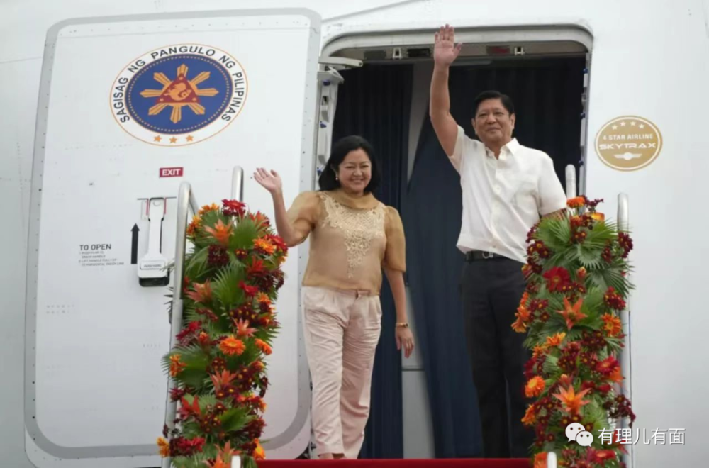
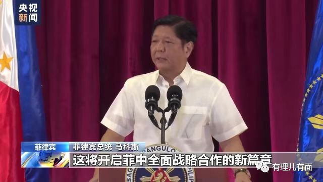
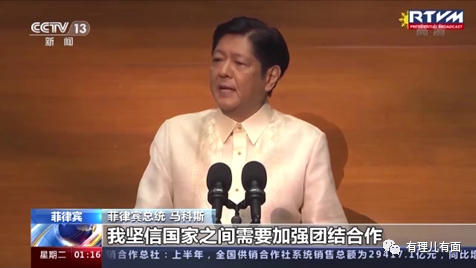

# 从菲律宾总统访华看美国阴谋破产

1月4日下午，习近平主席在人民大会堂同来华进行国事访问的菲律宾总统马科斯举行会谈。

马科斯此次访华的主要目的是推动中菲互利共赢，并管控好南海分歧，还要建立两国直接沟通的对话渠道，以避免双方在敏感水域发生误判。

而就在上个月，美国政府还造谣中国在南海干扰菲律宾船只，并宣称“美国在南海问题上支持菲律宾”，塑造“中菲紧张”的谣言。随着马科斯访华，谣言不攻自破。如此一来，美国以后再想搅乱南海，恐怕是越来越难。

**1、首次访华旨在开启中菲“黄金时代”**

会谈中，习主席指出马科斯是2023年中方接待的首位外国元首，中国也是马科斯首次正式访问东盟以外的国家，这充分体现了中菲关系的密切程度，也说明双方在彼此的外交格局中占有重要位置。

本次访华期间，双方还计划发表《中华人民共和国和菲律宾共和国联合声明》，可以说，无论是客人还是主人，都诚意满满。

马科斯早在启程前就曾表示“期待此访可以开启中菲关系新篇章”。中国外交部也期待中菲双方以此为契机，推动中菲关系提档加速，开启中菲关系新的“黄金时代”。

据菲媒报道，本次访华很可能会诞生14项合作协议，涉及农业、绿色能源、双边贸易等菲律宾非常重视的关键领域，并将决定未来5到6年内中菲双边关系的基调和方向。

对于南海问题，中方在会谈中也亮明了立场：中方愿同菲方继续以友好协商方式妥善处理海上问题，重启油气开发谈判，推动非争议区油气开发合作，开展光伏、风能、新能源汽车等绿色能源合作。

针对与菲律宾及东盟国家的关系，中方强调愿同菲律宾及其他东盟国家聚焦合作与发展，维护好东盟在区域合作中的中心地位，推进“五大家园”建设，推动本地区摆脱冷战阴影，免于阵营对抗，持续成为发展繁荣高地。

马科斯也在会谈中表示，中国是菲律宾最强劲的合作伙伴，没有什么能够阻挡菲中友谊的延续和发展。菲方坚持一个中国政策。菲方愿继续通过友好协商妥善处理海上问题，同中方重启油气开发。

相信马科斯如果确实能够在加强中菲两国经贸合作的同时，避免两国在南海问题上的彼此消耗，对于推动中菲在新形势下的双边合作将起到重要作用

如此一来，南海局势的和平稳定将为南海各国形成普惠效应，使各国共享南海和平发展红利，共同成为繁荣高地。

**2、从“怀旧之旅”走向“开创之旅”**

可以说，马科斯与中国的缘分由来已久。在临行记者会上马科斯讲述了他1974年陪同其母、前第一夫人伊梅尔达访华，为中菲两国1975年建交奠定基础的宝贵经历。并称，此后他便心系两国关系发展，持续推动两国人民友谊升温，加强双边合作关系。

从1975年老马科斯总统访华，中菲正式建立外交关系，至今已48年。

2016年杜特尔特总统刚上任时，中菲两国的关系正处于低谷期，数年来，经过双方的共同努力，中菲关系重返健康轨道。

菲方“大建特建”计划和中方“一带一路”倡议深入对接，为菲律宾农业、工业带来巨大发展机遇，同时也为两国合作交流创造大量机会。

自此以后，中菲双边贸易额成倍增长，中国也逐步成长为菲律宾第一大贸易伙伴、第一大进口来源地和第二大出口市场。

2018年11月，习近平主席对菲进行国事访问更是正式确立了中菲两国全面战略合作关系。

2022年马科斯总统上任后，多次公开表示将继续构建更为坚实的对华关系，菲外交部部长助理英佩里亚尔也表示，稳定且蓬勃发展的菲中关系对菲至关重要，也是菲外交的最优先方向之一。

2022年11月，习近平主席与马科斯在曼谷举行会晤，就双边关系达成重要共识。马科斯表态，菲律宾不会在美国和中国之间选边站，亚太地区的未来应由亚太国家自己决定。

中国和菲律宾是一衣带水的近邻，在两国上千年交往史上，以诚相待、守望相助是中菲关系主流，也是两国人民共有的宝贵精神财富。

因此，马科斯此行也许正如习主席在会谈中期待的那样，不仅是一次“怀旧之旅”，更是一次“开创之旅”！

**3、菲律宾不甘再作马前卒**

美国一直以来都在不断插手南海事务，菲律宾一直是美国想尽办法拉拢的对象。早在十年前，美国就妄图通过介入南海来遏制中国，主宰亚太，维持其世界霸主地位。

2010年美国前国务卿希拉里在河内高调表示要重返亚太，称“和平解决南海争端”和“航行自由”是美国在南海的两项“国家利益”。

此后美国多次煽动菲律宾通过法律，特别是国际仲裁来解决南海争端。2013年1月22日，在美国的不断怂恿下，菲律宾单方面将中国的黄岩岛问题提交海牙常设仲裁法院，提请第三方仲裁。

中国自然不会参与这场闹剧，并严正地提出“不接受、不参与、不承认，不执行”的四不原则。

彼时，菲律宾还没有看清美国口蜜腹剑、两面三刀的本质，中菲关系也在美国的插手和挑拨之下急剧恶化。

直到2016年中美南海对峙，中国正面挫败美国后，才结束了这场“闹剧”，而菲律宾也在这场“闹剧”中赔了夫人又折兵，不但黄岩岛被彻底纳入中国管控范围，部分产业也遭受重创。

有了历史的教训，南海周边国家对美国兔死狗烹、过河拆桥的伎俩已经看得清清楚楚。

本次访问出发前，马科斯还表示“我期待与中方讨论双边和地区政治安全问题，我们两国之间的问题是菲律宾和中国这样的朋友之间不应该存在的，我们将寻求解决这些问题，让两国互惠互利。”

相较于给美国充当马前卒，马科斯更希望自己去了解、去判断，避免成为美国干涉主义以及离岸平衡战略的下一个牺牲品。

**4、合作共赢主旋律在南海回荡**

中国坚定不移地高举和平、发展、合作的旗帜，一如既往地奉行独立自主的和平外交政策。

2022年，中国提出全球发展倡议和全球安全倡议，两大倡议一经提出便引发强烈共鸣。

针对不断上升的全球安全挑战、粮食能源危机、新冠疫情、气候变化等问题，中国展现出负责任的大国担当，积极参与全球治理体系改革和建设，全面开展国际合作，赢得广泛国际赞誉。

针对周边外交，中国不断加强与周边国家深化合作，奉行亲诚惠容、睦邻友好的基本方针，夯实政治互信，加强利益融合，区域合作不断取得进展。

而美国，一直奉行“霸权外交”政策，一心想将其他国家纳入由其主导的单边国际秩序中，持续地大兴保护主义、搞脱钩制裁，完全没有大国该有的担当与责任。

尤其是拜登上台以来，口头禅就是“美国回来了”，要“重新领导”世界，真的是狼子野心、昭然若揭。

不难看出，中国和平共处、共同发展的外交政策的确要比美国的霸权主义更得人心。

中美外交战略如此云泥之别，更让周边国家看清了谁才是可靠合作伙伴。此次马科斯访华，更说明南海周边国家也充分认识到了国家间加强团结合作的重要性，相信合作共赢也将成为南海的未来的主旋律。

**5、美西方的南海阴谋终将破产**

一直以来美国为了阻止其霸权的衰落，先后发动了阿富汗和伊拉克战争，入侵叙利亚，并在非洲和中亚地区进行军事行动，但仍然难以阻止其霸权衰落的趋势。

于是，美国就开始试图孤立、封锁反对其霸权行径的各种力量，防止他们联合起来。南海就成为美国挑拨离间、搬弄是非的重点目标。

美国政府和媒体长期以来一直热衷于散布涉及南海的谣言，然而一次两次可以糊弄人，时间久了，谣言不攻自破。

2022年11月下旬，美副总统哈里斯访菲，意图再次挑起南海争端，却引来菲律宾国内爆发反美抗议。

如今马科斯亲自访华处理分歧，更是狠狠给了美国一记耳光。

除了菲律宾以外，越南等南海周边国家也曾多次表示，将争取和平解决南海争端。

通过本次菲律宾总统马科斯访华，我们可以看到，南海各国正愈渐形成和平合力。相信今后在南海问题上，各国很难会再被美国牵着鼻子走，其搅局南海的阴谋注定会以破产告终。

来源 有理儿有面

