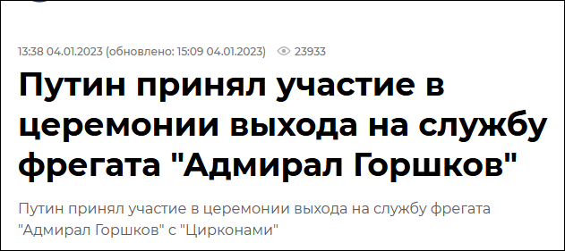
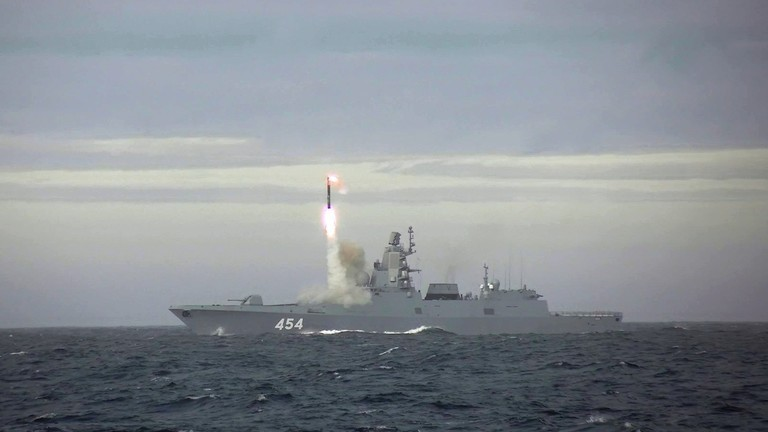

# 俄军首艘搭载“锆石”高超音速导弹的军舰开始战斗值勤，普京发声

【文/观察者网
刘程辉】当地时间1月4日，俄军首艘搭载“锆石”高超音速导弹的军舰“戈尔什科夫海军上将”号护卫舰开始战斗值勤，前往大西洋、印度洋及地中海远航。俄罗斯总统普京以视频方式出席启航仪式。

_俄新社报道截图_

据俄新社等俄媒报道，普京在讲话中说，“戈尔什科夫海军上将”号护卫舰将开始远洋航行，“这一次，舰上配备了无与伦比的最新‘锆石’高超音速导弹系统，以及最新一代的其它武器”。

普京评价“锆石”导弹是一种“独特的武器”，“没有其他国家拥有类似的武器”。他说：“我相信，这样强大的武器装备将使我们能够坚定地保护俄罗斯免受潜在的外国威胁，这将有助于维护我们的国家利益。”

普京还感谢了参与批量生产“锆石”导弹的俄军工企业专家，并补充道，俄罗斯将进一步提高武装力量的作战潜力。

“我想强调的是，我们将继续提升武装力量的战斗潜力，生产在未来数十年能够有效捍卫俄罗斯安全的武器和装备。”普京说。

_普京和绍伊古出席“戈尔什科夫海军上将”号起航仪式。（俄新社图）_

俄罗斯国防部长绍伊古在仪式上表示，“戈尔什科夫海军上将”号护卫舰将前往大西洋、印度洋和地中海执行远航任务。在此期间，护卫舰将演练使用“锆石”高超音速导弹和远程巡航导弹。

“这次远航的主要目的是回应俄罗斯面临的威胁，并且与友好国家共同维护地区和平与稳定。”绍伊古还指出，“锆石”导弹射程超过1000公里，配备了这种导弹的军舰能够对海上和陆地上的敌方目标实施精确而有力的打击。

_在巴伦支海演习期间，“戈尔什科夫海军上将”号发射“锆石”导弹（俄国防部）_

绍伊古发表讲话后，普京下令“戈尔什科夫海军上将”号护卫舰开始投入战斗值勤。

“今日俄罗斯”报道提到，该型舰于2010年下水，为俄罗斯时代建造的最大战斗舰艇之一。来自俄国防部的消息称，“戈尔什科夫海军上将”号已于去年6月完成对“锆石”导弹的测试工作。

在去年12月21日举行的俄高级国防官员会议上，普京发表讲话称，北方舰队的“戈尔什科夫海军上将”号护卫舰将在2023年1月初开始搭载“锆石”高超音速导弹。普京还强调，核武库是俄罗斯主权的关键保障；俄罗斯将继续现代化核武库，并承诺新武器将很快投入使用。

**本文系观察者网独家稿件，未经授权，不得转载。**

