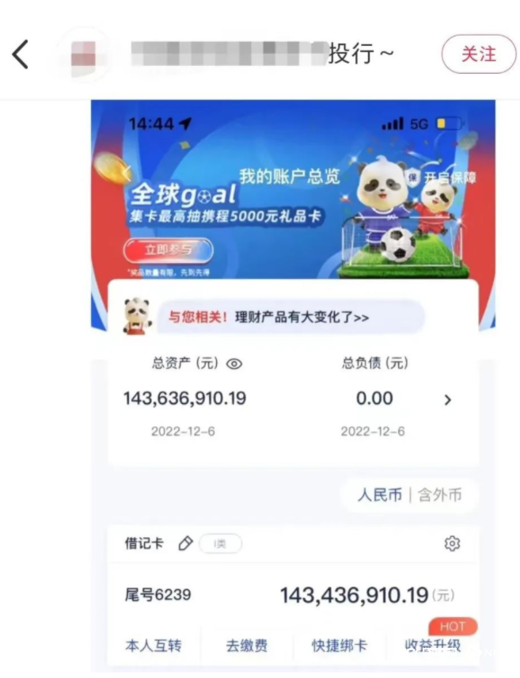

# 再现炫薪事件？有人自称投行大佬，晒出1.4亿银行卡余额

多金的证券业从来就不缺高薪传闻。近日，一位自称是投行MD（董事总经理）晒出了一张银行卡总资产高达9位数的截图，瞬时刷爆网络。

不少网友认为真实性存疑。不过，事件真实性如何虽未有定论，但在此事再度掀起公众对券商高薪酬的热议后，已有从业人员担心是否会迎来降薪。

**银行卡账户余额高达1.44** **亿？**

根据上述网传的截图，该银行卡内总资产约1.44亿元。据报道，该博主自称是投行MD，且网传图片显示，该博主昵称中含有“投行”字眼 。

MD是什么概念？目前券商使用的职级虽然不尽相同，但大致可分为以下等级：
A（经理）、SA（高级经理）、VP（副总裁）、SVP（高级副总裁）、D（董事）、ED（执行董事）、MD（董事总经理）。

显而易见，MD在金融行业算相当高的职级。有头部券商人士告诉湾财社记者，虽然作为业务核心部门，投行出MD相对容易一些，但MD堪称职级天花板。

那么，上述截图真实性如何？影响如何？ 湾财社记者发现， 有从业人员觉得“假，搞不好是P图的”，也有人担心再度引发高薪风波，进而影响年终奖的发放。

事实上，
对于金融业而言，炫薪事件屡见不鲜。2022年年初，某券商非银分析师在小红书上晒出224万年薪后，旋即引发热议。这一事件也被视为推动薪酬管理制度出台的导火索。

随后，监管机构密集发文，屡次提及和强调券商薪酬制度的规范性，意在发展稳健合理的、充分反映合规和风险管理要求的薪酬制度。

2022年4月1日，《证券基金经营机构董事、监事、高级管理人员及从业人员监督管理办法》施行。其中，在券商高管薪酬上，规定证券基金经营机构应当建立长效合理的薪酬管理制度，充分反映合规管理和风险管理要求，避免短期、过度激励等不当激励行为。证券基金经营机构应当对董事长、高级管理人员、主要业务部门负责人、分支机构负责人和核心业务人员建立薪酬递延支付机制，在劳动合同、内部制度中合理确定薪酬递延支付标准、年限和比例等。

2022年5月13日，中证协发布《证券公司建立稳健薪酬制度指引》，自发布之日起施行。该文件明确要求，证券公司在制定薪酬制度时，应当结合行业特点制定稳健薪酬方案，充分考虑市场周期波动影响和行业及公司业务发展趋势，适度平滑薪酬发放安排，强调避免过度激励、短期激励引发合规风险。

此外，近年来在券商的文化建设实践评估中，也有对高管薪酬的约束。2021年年底，中国证券业协会下发的《证券公司文化建设实践评估办法（试行）（征求意见稿）》中，就提及扣分项包括“薪酬激励过于激进，未能体现建立长期激励机制要求的”。

**监管曾专门就券商薪酬问题表态**

值得一提的是，2022年6月，证监会专门对券商、基金等薪酬问题做了表态。

证监会指出，薪酬制度是公司治理的重要内容，构建科学合理的薪酬制度是保持行业核心竞争力的基础，也是保持行业稳健可持续发展的基础。全球监管部门对薪酬激励相关制度近年来比较关注，目的是为了防范过度投机、过度激励引发的金融风险。

同时，证监会也强调，“证券业协会、基金业协会分别发布的薪酬管理指引并无设置薪酬限额，也不涉及薪酬总额和具体操作办法。”

而在上述多个政策出台之前，降薪传闻就已不绝于耳，但湾财社记者梳理Wind数据后发现，2021年大多数券商的员工实现了人均薪酬的增长，降薪并非全行业现象。从人均薪酬的涨跌幅来看，2021年，逾6成上市券商的人均薪酬实现了增长。

当然，这与2021年的市场行情不无关系。2021年是一个券商大年，A股市场行情整体向好，且交投活跃度较高，证券公司营收和净利稳健增长。

但在高管薪酬上，与2020年相比，2021年多家券商高管的薪酬不增反降。以董事长为例，Wind数据显示，2021年招商证券董事长、浙商证券董事长薪酬分别约388.41万元、258.44万元，降幅均在20%以上。

另外，广发证券董事长的薪酬也从前一年的242.2万元降到了197.87万元，国金证券董事长薪酬从793.64万元降至657.5万元，下滑幅度近20%。

不过，2022年券商薪酬表现如何，有待观察。

采写：南都湾财社 记者王玉凤

