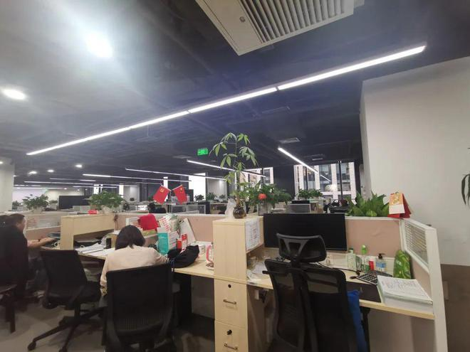
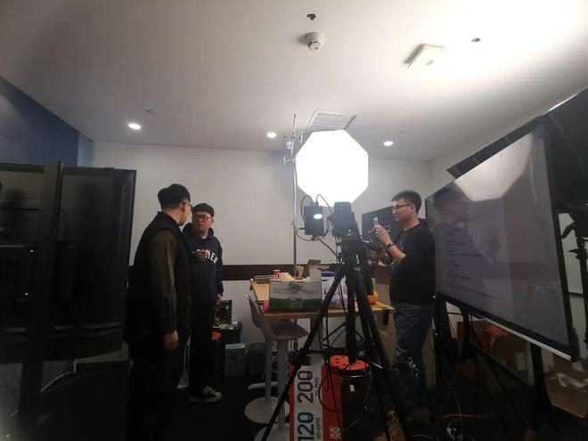
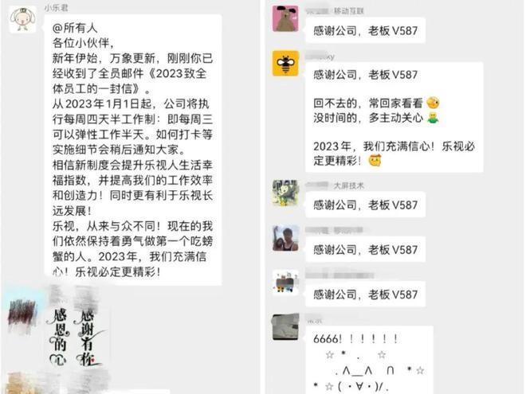

# 实探“四天半工作制”的乐视：三点只剩几个人

**划重点：**

  * _1_ 从1月3日起，大批网友涌入乐视的抖音直播间“求入职”，致使一向冷清的乐视直播间单场累计观看人数破10万，环比暴涨近20倍。
  * _2_ 多位乐视员工表示，虽然工作氛围宽松，但乐视并不能轻松“养老”，工作的紧凑与压力仍在。
  * _3_ 1月4日，刚到中午，部门leader已经开始“赶人”，“完成今天工作任务的，三点就下班吧，该陪家人陪家人，该玩去玩。”

燃次元（ID:chaintruth）原创

作者丨马舒叶 姜 辉

编辑丨谢中秀

1月4日，恰好是乐视实行“四天半工作制”的第一天。

**当天下午三点，燃次元到达北京乐视公司楼下时，迎面撞上不少面带笑容、结伴离开办公大楼的乐视员工，当燃次元进入乐视公司时，诺大的工区内，只剩下零星几个人**
。

乐视市场部负责人小夏告诉燃次元，在她宣布实行“四天半工作制”时，员工们是出乎她意料的“淡定”，毕竟在乐视，“从不996，下班即挂机，”小夏补充道，“员工下班从来不回我消息的，所以他们也没有很激动。”

2023年的第一个工作日，1月3日，乐视CEO张巍发布全员信，宣布了一个“高能”的消息，2023年1月1日起，公司将执行每周四天半工作制，每周三实行弹性的半天工作制，考勤时间调整为连续的5小时，比如上午10点至下午15点、上午11点至下午16点都是符合规定的。

1月4日，恰好是消息发布后的第一个周三，也是乐视实行“四天半工作制”的第一天。

对于乐视的“神仙操作”，互联网顿时炸开了锅，不少网友纷纷表示“是谁酸了我不说”，并在官方评论区“在线求职”。

**从1月3日起，大批网友涌入乐视的抖音直播间“求入职”，致使一向冷清的乐视直播间单场累计观看人数破10万，环比暴涨近20倍，1月4日，乐视直播间单场销售额破6万元**
。

_图/下午四点变空的乐视工区
来源/燃次元拍摄_

**近来，凭借“神仙公司”，乐视不断“出圈”**
。2022年4月，#甄嬛传每年播出收益还有上千万#的消息传出，乐视视频官方调侃道，如果2018年《甄媛传》版权没有被分销，乐视现在回的血会更多，乐视视频可以安心养老。

2022年7月，有微博用户发布“冷知识”，乐视“还剩下400多人”“没有内卷和996，没拖欠过留下来的员工工资”，进而有人爆料，公司有《甄嬛传》等影视版权收入和大楼出租租金，乐视有400名员工过着没有老板的神仙日子。

在互联网叫苦不迭，不断降本增效的当下，乐视成为互联网行业人人艳羡的“神仙公司”。

但乐视和乐视打工人真的过着“神仙日子”吗？

**多位乐视员工告诉燃次元，虽然工作氛围宽松，但乐视并不能轻松“养老”，工作的紧凑与压力仍在**
，一方面是人员精简带来了身兼数职的新挑战，也带来成长机会；另一方面，“变小”后的乐视更像“创业公司”，手机等业务仍然面临着剧烈的市场竞争。

**乐视的财务压力更重**
。2016年，乐视爆发超百亿元的债务危机，2017年乐视创始人贾跃亭“出国”，2020年乐视因持续亏损从创业板退市。此后，债务问题围绕着乐视。

2022年春节期间，乐视视频“欠122亿”的新年APP图标引发关注。新一年的春节即将到来，这一数字可能又要增加。根据乐视2022年第三季度报，2022年1-9月，公司经营活动产生的现金流量净额为1177.9万元，负债合计为223.1亿元。

如今，乐视仍吸引着一批互联网人前往。入职不到半年的阿乐就向燃次元直言，“不用996，工作氛围轻松就是选择乐视的最大理由。”

在“啃老”《甄嬛传》之外，乐视也在寻找新的业务增长点。就在乐视宣布实行“四天半工作制”的第二天，乐视还发布了新手机——乐视手机S1
Pro。此外，乐视也在努力推出包括手机、电视、智能门锁等在内的新产品，并发力直播。

显然，乐视人不再满足于“活下来”，而希望活得更好，“希望提起乐视，大家不再惊讶于乐视还活着”，成为了小夏们“憋在心里的一口气”。

但不得不承认的是，这些业务都只是起步阶段。

对此，人民网、人民邮电报专栏作者张书乐向燃次元直言，目前乐视在内容领域短期难以扭转“吃老本”的现状，此外，在硬件方面，虽然乐视电视一直以极高性价比著称，但由于乐视并未建立起完善的生产链条，本身不生产电视硬件，短期内很难提炼出其他优势，也容易陷入价格战。

没有“996”、没有“内卷‘，如今还率先开始了“四天半工作制”，在互联网行业，乐视“神仙”也许是真“神仙”，但乐视要活下去，并活得好，并非仅靠“神仙”就能达成，还有诸多问题需要一个一个解决。

01

**下午三点，“溜了溜了”**

1月4日，星期三的下午三点，阿乐的办公桌面已经清空，他熟练地打卡下班，走出工区后看着空荡荡的马路“发乐”。

这是乐视实行“四天半工作制”的第一天。

实际上，1月3日，随着#乐视四天半工作制#话题登上微博热搜，阿乐的手机就开始不间断收到朋友充满羡慕的“问候”，新制度刚刚公布，从事开发岗的阿乐和同事们有些发懵，“不知道是不是真的能三点就下班。”

**而1月4日，刚到中午，部门leader已经开始“赶人”，“完成今天工作任务的，三点就下班吧，该陪家人陪家人，该玩去玩** 。”

直到阿乐和同事结伴走出工区，在朋友圈晒出下班照后，他才对四天半工作制有了实感。

突然到来的“下班自由”让他一时之间不知道该做什么，阿乐索性去了公园，一边满足得晒太阳，一边切换角度拍小猫小狗，坐在一群带着孩子的老人中间，阿乐直呼“太爽了，感觉过上了退休生活”。此外，早下班也让阿乐晚上的休息时间延长了一倍，他决定把自己囤的剧一次性追完。

**和阿乐不同，佳佳选择早上在家睡懒觉，“睡到自然醒，下午再去公司上班”，“反正只要连续工作时间达到5小时就可以”** 。

不用担心听不到早晨的手机闹铃，也不必被早高峰地铁里的人流挤得疲惫不堪，四天半工作制，让喜欢睡“回笼觉”的佳佳有了奢侈的“工作日睡眠自由”。而“不减薪还能早下班”也让佳佳感觉“赚到了”。

**根据乐视回应媒体，实行“四天半工作制”不会影响员工工资，带来工资变化** 。

1月4日，佳佳睡到早上11点，自己做了午饭，甚至悠闲得追了一集番剧才出门，“中午地铁里都没什么人。”她兴奋地告诉燃次元，不用早起让她一天效率极高，往常周末才能任性得赖床，而“想到能在连续工作两天后睡一个懒觉，就感觉精力满满，都不用灌咖啡强制开机了。”

在佳佳的周围，大多数同事选择了下午3点下班，工区不到4点已经走得空空荡荡，佳佳拍了一张照片，发到乐视原同事的小群里，激起一片“哇哦”的惊叹，“不少离开的同事，在问乐视还招不招人，他们都想回来了。”

**但即使“弹性化”工作，工作也仍然存在。在“四天半工作制”之下，除了下午三点即离开公司的同事之外，也有乐视人因工作需要，仍在“负重前行”** 。

随着乐视四天半工作制的话题引发网友热议，接待燃次元的市场部员工姗姗坦言，“今天不少媒体都在联系采访，恐怕晚上也不能早睡了。”虽然半天假日无法休息，姗姗亦表示，“媒体工作本来就很特殊，平常乐视也是早九晚六，没人卷。”

除了突然“忙起来“的市场部，在静悄悄的工区内，乐视的直播业务部仍在“继续营业”，为了晚上的直播，他们仍在紧锣密鼓得核对流程。

_图/紧张准备中的乐视直播间
来源/燃次元拍摄_

1月4日晚上七点，乐视的直播开启，不大的直播间内热闹起来，主播们面对镜头宣传着乐视电视和手机。但观众似乎对于乐视“神仙公司”的向往更明显，评论区“还缺人吗？”不断刷屏。

但这并未打乱直播间员工介绍产品的节奏，对于突然涌入的流量和关注，乐视正越来越“淡定”。

02

**乐视何以成“神仙公司”？**

在内卷当道，裁员不止的互联网，乐视以其没有“996”、没有“内卷”，突然成为了“神仙公司”。

阿乐刚入职乐视不到半年，他告诉燃次元，促使他选择入职乐视的主要原因，就是“这里没有996”。

此前在杭州度过大半年996高强度生活，难以承受“每日编日报，每周开5小时周报会议”的阿乐，入职乐视后“感觉找回了生活”，“做研发也可以准时下班，每周公司考虑到早高峰，还有5次补卡机会，”1月4日，下午3点就离开公司，也让阿乐那些到了年底每天卷到晚10点才能下班的朋友们“狠狠酸了”。

2022年中入职乐视的时候，朋友们都劝阿乐“别上贼船”，如今，“风水轮流转”，在互联网2022年底一片裁员的哀声里，阿乐在朋友“乐视招人，扫地也去”的玩笑里，心底也有着一丝自豪。

“在乐视，内卷的人会被鄙视。”2019年从乐视离开的小白亦表示，即使当时身在迅速扩张的乐视TV业务部，经常需要连轴转得工作，但“没人卷工作时长，都是做本职工作。”

而辗转多个互联网公司，身心俱疲的小夏，也在2021年选择了入职乐视，“这里没有很多重复性的工作，也不需要花一周时间做PPT完成向上管理。”而只要到了下班点，微信群里的同事就会“默契停摆”，“下班之后默认是员工的自由时间，这点很重要。”

实际上，乐视员工的工作时间一直都很弹性，“早上班可以早走，晚上班就晚走，甚至可以把孩子带来公司。”姗姗告诉燃次元，919乐迷节后，这支从市场、HR、商务抽调来的“直播杂牌小分队”，会利用下班的时间做直播，“公司会给加班补偿，第二天也会安排调休。”

如今有了每周四天半工作制，乐视人的日子无疑“愈加令人羡慕”。

_图/宣布四天半工作制后乐视内部群刷屏
来源/乐视提供 小红书平台_

不过，对于外界对乐视“神仙公司”的种种想象，小夏不置可否，她告诉燃次元，“乐视员工一个萝卜一个坑，每个人肩上的工作并不少，现在行业竞争激烈，我们也有压力。”

从2015年就入职乐视的发发负责用户运营，她直言，“我们不是不卷。”经历过2017年到2019年的业务大调整，刚入职时市场部“人多到新人没有工位坐”，而现在，市场部缩减到10个人，接踵而来的考验，这让发发们更偏向于思考如何“利用有限的预算和资源完成工作”。

除此之外，原先只负责用户运营的她需要把活动运营岗的“活”接过来，这些改变也倒逼发发不断学习，对她而言，策划全新的直播业务，让原先单场只有二三十人在线的直播业务，实现“单场GMV”的小目标，是她2022年重大的成就感来源。

对此，小夏亦表示，2022年市场部在媒体合作上的预算几乎为零，刚入职时，她甚至需要从0开始重新建立乐视的媒体账号，“因为原来的微博号封了。”如今的直播新业务，2022年直播间的投入成本也基本为0，没有投流，“都是自然流量”。

实际上，就在2022年9月17日，在宣布直播带货单场GMV破万后，乐视又宣布卖出了第一台电视，不过由于919直播期间，办公楼空调停了，主播们咬牙坚持在闷热的直播间里继续直播，“最后因为吹风扇全都热伤风，全员都生病了。”

作为乐视的HR，被征调来直播间做主播的小胖亦告诉燃次元，在只有他一个人直播的时候，“同事们明明下了班，也陪我直播。”只为了让他“能多休息几分钟，有时间喝口水。”

如今，乐视不再是一艘“巨轮”，小夏认为，现在的乐视是一家“普普通通的小公司”，“不必神化乐视，也不用再怀疑现在的乐视。”

2021年至今，小夏在乐视已经待了近2年，她手下有人工龄8年，有人离开后，2022年又重新回到了乐视，对他们而言，现在的乐视“一切都能从0开始”，这让他们有更大的成长空间。

03

**乐视还能“乐”多久？**

对于乐视实行“四天半工作制”，讨论分为两派，一派表示，“羡慕”“还招人吗”，另一派也直言，“（乐视）估计不需要更多劳动力了，不然也不会只工作四天半”。

速途传媒执行总编兼速途研究院院长丁道师表示，乐视四天半工作制的实施底气，不仅来源于乐视员工数量少，人力成本负担低；也源于乐视手握的一大批热门影视剧版权，这些如今成了乐视收入的重要支柱。

自债务危机、老板贾跃亭“出国”、退市之后，曾经的明星企业乐视逐渐淡出大众视野。直到2022年4月，“乐视可以靠《甄嬛传》养老”的消息，让大众再一次关注到这个“神仙”“躺平”的互联网企业。

2023年1月4日，就在燃次元前往乐视时，小夏刚刚结束新产品的相关会议匆匆而来，她告诉燃次元，每周四天半的工作制，一方面是在外界质疑“乐视还在活着”时给员工打的一剂强心针，“希望让员工挺起腰杆来”，另一方面也是向外界传达“乐视在改变”的信号。

但乐视到底靠什么活，也是困扰大众的一大疑惑。

对于乐视的盈利来源，“甄嬛传保住了乐视一世荣华富贵”的消息曾经甚嚣尘上，但随后数据传出，乐视每年凭《甄嬛传》拿到的会员收入为上千万元，对乐视网的总体收入贡献占比不到5%。

随后又有消息传出，乐视“靠房租养活”。张巍也在宣布实行“四天半工作制”的全员信中提及，“（2022年）9月，我们挥手告别了9年记忆的乐视大厦。搬入新家也好，‘靠房租’的传言也就不攻自破了。”

但据媒体报道，乐视品牌负责人曾介绍，2021年乐视大厦房租收入只占乐视网母公司收入的6%，粗略估计几百万元。同时，2021年11月，乐视网公司总部乐融大厦（原北京乐视大厦）已被拍卖，2022年9月乐视全员也已搬离乐视大厦。

综合来看，目前乐视主要有内容及硬件两大业务，其中内容主要有乐视视频与华影时光两大平台，营收来自会员收入、版权业务和电视剧发行等；硬件则有电视业务、手机业务以及其他智能产品，颇有想走“小米路线”的迹象。

**但内容仍是乐视营收贡献的主力**
。据界面新闻此前报道，乐视智能生态执行副总裁李晓伟表示，乐视近几年业务的重点在于硬件业务，不过乐视目前主要营收仍来自内容业务。

在宣布实行“四天半工作制”的全员信中，张巍提及，“在大家的努力下公司2022年业务总体平稳，经营业务实现了现金流平衡，并前3季度虽有5周居家办公，整体业绩目标均如期达成。”

但乐视的财务状况仍难言乐观。根据乐视财报，2022年前三季度，乐视营业收入2.67亿元，同比下降10.04%，但营业成本高达5.98亿元，同比上升2.85%；归母净亏损3.53亿元，同比扩大118.35%。同期公司经营活动产生的现金流量净额为1177.9万元，负债合计为223.1亿元。

而关于乐视的下一步，小夏表示，“乐视之后会推出新的手机、电视，还有智能门锁等一系列产品。”特别是在手机领域，乐视正尝试通过富有“性价比”的手机重新在手机市场分一杯羹。

_图/乐视发布的新手机 来源/微博 燃次元截图_

同时，乐视也开展了直播业务，甚至想成为下一个新东方。

**但无论是手机、电视，还是智能门锁业务，市场对乐视的认可度和知晓度都不高。在直播方面，乐视更是刚刚起步** 。

小夏也直言，目前公司的直播带货业务兼有自己的产品和其他产品，但直播带货收入仍然微薄，并不足以支撑其公司业务。

随着国家对知识产权保护的力度越来越大，内容业务能够为乐视带来源源不断的现金流，此时投入新业务应更加谨慎，2023年乐视网维持现状的可能性较大。丁道师表示。

张书乐也指出，直播带货仍然是目前摆在乐视面前的机会，乐视近期形成的“自嘲”和“乐观”的公司人设直播带货有助益，如果乐视能在直播中突出这种人设，依靠自己较为完善的管理流程，去挖掘直播带货体系，并且开发新的业务线和内容线，塑造用户新的信任习惯，这对乐视来说，未尝不是一条突围之路。

但对于乐视来说，无论是“自嘲”“乐观”，还是“神仙”“躺平”，眼前都是实打实的困难。

张巍在全员信中直言，“2022年……受之前资金危机的影响，消费者对乐视产品的信任度必需提升……”但乐视要实现债务外经营利润和现金流的双平衡，扭转口碑，仍道阻且长。

*题图来源于视觉中国。

*文中小夏、小胖、阿乐、佳佳为化名。

*免责声明：在任何情况下，本文中的信息或所表述的意见，均不构成对任何人的投资建议。

