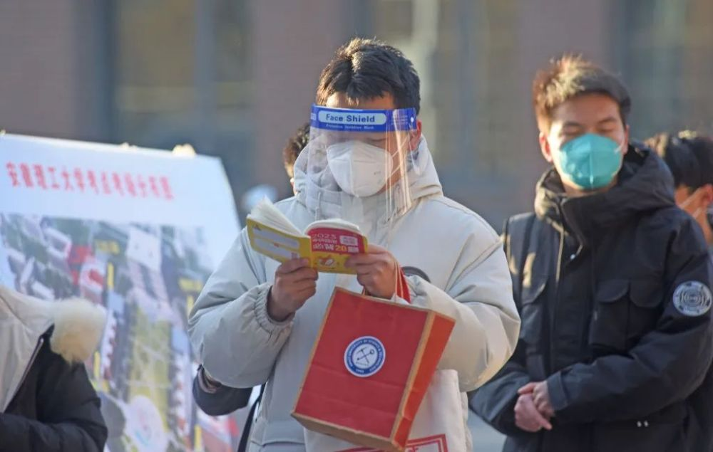
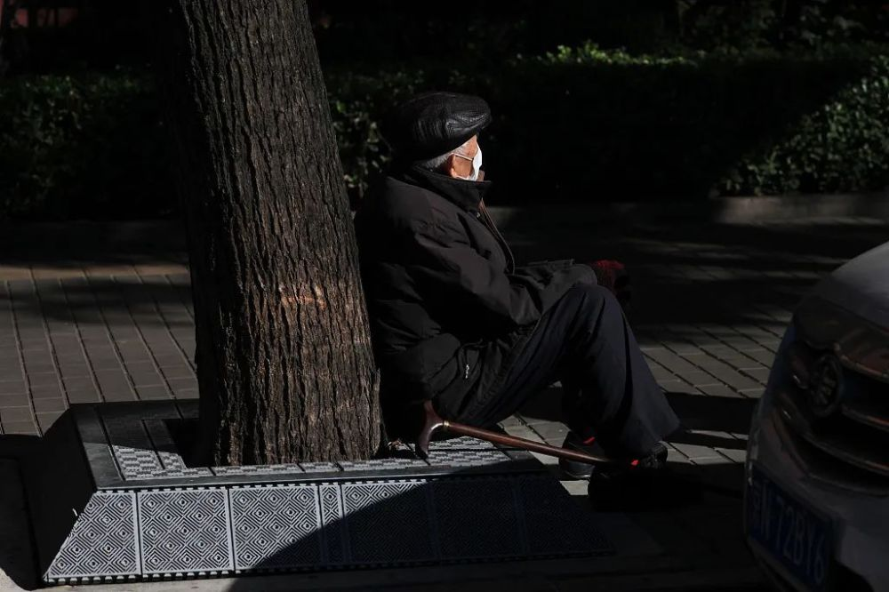

# 恐阳、幻阳、过度囤药……如何度过疫情中的心理风暴

导致这些痛苦、抑郁等复杂情绪的并非是疫情本身，而是疫情的催化所带来的人们无法适应的改变

_2022年12月24日，安徽淮南，安徽理工大学考点，考生在考场外进行最后复习。_

“我马上就要考研了，好担心自己在临近考试的时候感染新冠。”

“如果我感染了新冠，不小心传染给有基础疾病的家人该怎么办？”

“感染后我被辞退了，好像生活的意义也同时崩塌了。”

……

胡馨怡默默地看着最近这些留言，就像一个树洞一样，装下人们的各种倾诉。

胡馨怡是北京新阳光慈善基金会“联爱护心”公益项目的负责人，这个项目从2020年4月启动，旨在针对疫情期间的心理困扰，通过提供免费心理热线、一对一咨询、讲座培训等方式为公众疏解情绪。

项目转眼已经运转了三年。胡馨怡一路见证了公众情绪的高低起落，也敏锐地捕捉到最近的变化——2022年12月初疫情管控放开后，公益热线曾短暂地消停过一阵儿，然而仅仅过了一周，电话又一个接一个地响了起来。

对痛苦的抵制

最近，苏盈刚刚从一系列的情绪风暴中缓了过来。

疫情管控放松后，还在失业状态的苏盈高兴了好一阵子，觉得终于能线下求职了，未来机会可能会更多，就算感染了，也能熬一熬，三四天就能好。于是，她每天都热切地寻找各种面试的机会，每次出门都“全副武装”，做好各种防护，以降低被感染的风险。

但感染还是来得猝不及防。回想起来，是有一天楼上的一位老爷爷阳了，打不通救护车电话，她就帮着拨打了电话。即便戴着口罩跟老爷爷刻意保持着距离，她还是被传染了。

发烧的时候，她突然陷入巨大的焦虑和恐惧之中。刚开始她没有退烧药和抗原试剂，无从知道自己是一般感冒还是感染了新冠。后来，只好去医院开了药。但接下来的4天时间里，她一直高烧不退，最难受的时候一整晚无法入睡，心里有种崩溃的感觉。而在睡不着的夜晚，她打开手机刷新闻，各种负面信息扑面而来，让她感到更为混乱和窒息。

好不容易熬过了高烧阶段，这时一家公司邀约苏盈面试。她忍着“吞刀片”式的嗓子疼，一边打起精神去面试。在回家的路上，她觉得整个脑子都不听从指挥了，很多情绪一下子涌了上来，说不清具体是什么，只是感觉笼罩在一大片抑郁之中。

幸运的是，苏盈顺利通过了面试，这是她三个月来找到的第一份工作。她开始收拾行李，搬到离公司近一些的地方，准备好好去上班。但就在这个时候，苏盈突然感到胸闷，喘不上来气。她再次来到医院，医生告诉她这是新冠后遗症的一种，需要输液一周。这时，苏盈感觉心里的防线崩塌了。

一边输液，一边痛哭，“可能这段时间积压了太多的情绪，身体和心理都在备受煎熬，而且也不知道这种胸闷会持续多久，能不能好彻底。同时也开始担心家人感染后万一也像我这样症状强烈，能不能熬过去。”苏盈说，这是她第一次想到要求助于心理咨询。

在胡馨怡看来，苏盈经历的一切也反映出了当下人们普遍面临的心理问题：对于感染和后遗症的恐惧，对病毒的不了解，加上过载的新闻信息制造的焦虑感，个体独自面对身体和心理双重打击的孤单无助感……

“这与封控期间人们所面临的状况有了很大不同。有利的变化是人际距离改变了，人们可以直接地、面对面地相处，同时全民形成了一种应对新冠感染潮的共同体心理，这些都会让封控期间的负面情绪得以消解。”中国心理学会科普委副秘书长唐义诚说。但另一个问题冒出来了——当下面临海量的网络信息、不停反转的新闻叙事时，人的大脑会产生倦怠感，从而触发负面情绪，甚至产生政治性抑郁。

所谓政治性抑郁，即由环境变化所带来的情绪起伏，会让人感觉凭个人力量“做什么都没有用”，从而陷入自我批评和自我攻击之中，情绪就更为低落。

此外，还有很多人出现了过度囤积药物、过度CT、幻阳症等情况，虽然这并不是临床诊断上的“病症”，但当这些行为严重影响到生活时，也需要专业心理指导加以干预。

胡馨怡认为，这些新的现象背后代表着的是一种“对痛苦的抵制”——倦怠社会已经在人们的心中埋下了痛苦的种子，疫情只是做了催化，人们开始抵制痛苦，只求生存（不感染），放弃了许多生存以外的意义世界。“在这种情况下，如果个体有一些与社会主体声音不一致的想法或追求，就会陷入更大的困顿与绝望，也会为了抵制痛苦的到来而做更多妥协，让人生的开创性萎缩。”

_2022年5月18日，北京，公园内一位市民在“不扎堆、不聚集、戴口罩”的标语旁休息。_

打破无力感

那么，面对这些复杂的情绪，该怎么办？

中国心理学会科普委副秘书长唐义诚表示，情绪不会因为人的自我压抑或理性层面的忽视而消失，如果长期得不到疏解，会对人的认知能力、情绪自我调节能力、日常生活秩序产生冲击，甚至会引发人与人之间的冲突。

在2022年年初上海和吉林疫情比较严重的时候，唐义诚曾带领心理志愿服务队为人们提供心理咨询服务。他认为，当时所面临的主要问题，是突然的封控导致的社交隔离，人们的心理问题主要来自巨大的孤独感。而在当下，需要关注的是复工复学的心理准备，以及感染新冠带来的压力。

唐义诚认为，当下可以让更多已经恢复了的“阳康”人群通过网络分享经验，降低其他人对感染的恐惧感，也可以在面对海量网络信息时，多一些自我觉察能力。他建议，如果已经感到信息过载的压力太大，就要暂时从网络世界中脱离一段时间，保护好自己的心理边界。

而应该在什么时候寻求专业力量的介入，则主要取决于三个维度的判断：首先要看负面情绪是否已经影响到正常生活；其次，是看情绪状态一直比较糟糕的时间是否超过3个月；最后，是看情绪的自我调节能力是否还起作用。

“如果以上这三个条件都满足，就必须寻求专业帮助。” 唐义诚说。

胡馨怡坦言，希望心理服务能够被更多人接纳和认可。这三年以来，她负责的团队遇到过很多问题和挑战，比如，寻求免费心理咨询的一般是社会经济地位不占优势的人群，他们对心理咨询并没有一个很好的理解和认识，经常会频频取消预约，或者是在自认为状态良好时就随意中止咨询，导致效果不理想。后来，团队只好主动与医院、社区对接，借助这些机构的背书和推动，才有更多人愿意坚持下来。

“有时候公共事件会给人带来强烈的冲击，导致个体心理受损，但这并非不可逆，只要我们积极寻求帮助，改变就会发生。信心很重要！”胡馨怡强调。

_2022年10月10日，北京，疫情期间，戴口罩在路边休息的老年人。_

老年人需要得到更多关注

胡馨怡告诉《中国慈善家》，她和团队目前最关注的是老年人群体，也呼吁大家多关注老年人的心理问题。

老年人就像是“冰山下的一角”，不容易被看见。胡馨怡和团队在服务过程中发现，无论是在过去的三年时间抑或当下，老年人的身体和心理层面都更加脆弱，而且这个群体更难触达，因为大部分老年人不会使用网络求助，也不了解什么是心理咨询，因此很少有人会主动求助。

胡馨怡透露，“联爱护心”公益项目提供心理服务的老年人，主要是通过社区、医院转介至团队。面对心理咨询师，这些老年人会讲述让自己感觉不舒服的事情，触发情绪时也会流泪，但对心理疾病的病耻感很重，往往倾述完之后不会配合下一步的咨询或药物建议，就此戛然而止。由此可以看出，这些老年人是多么孤单、恐惧和无助。

年过六旬的杨忠伟就是“联爱护心”的一位帮扶对象，他在很长时间里都与哥哥相依为命。2021年年初，杨忠伟的哥哥不幸感染了新冠去世。杨忠伟此前的生活一直很依赖哥哥，哥哥去世后，他失去了生活和精神的双重依靠，也陷入巨大的创伤之中，同时也会责备自己为什么没有能力为哥哥争取更多的医疗资源。而在当时的疫情封控条件下，他无法为哥哥办一场体面的葬礼，这让他更为自责和痛苦。

联爱护心在与社区合作开展心理健康测评和筛查时，才发现了深陷痛苦的杨忠伟。此时，他已经有四个月没工作，也很少出门，并且拒绝与家人朋友联系。

当杨忠伟第一次接触心理咨询的预检时，他几乎每说一段话就会痛苦流涕，咨询一度无法顺利进行下去，后来，当他同意接受正式的咨询后，也会不时质疑，“心理咨询到底能起多大作用？”

在各方努力下，杨忠伟坚持了下来。用了一年时间，他完成了30次咨询，逐渐从复杂的痛苦中走了出来，知道如何更好地体察自己的情绪，并主动联系家人，也开始积极找工作。

在胡馨怡看来，杨忠伟接受心理服务的过程，或许是很多老年人群体心理服务状态的一个缩影。老年人对心理咨询感到陌生和不信任；开始咨询后往往要花比年轻人更长的时间才能打开心扉；大多数老年人已经形成了比较固定的认知模式，改变的发生也需要更长时间。

眼下，胡馨怡和团队所接听到的来电咨询仍旧很少有老年人。胡馨怡说，面对目前新冠感染的风险，可以想象得到老年人对疾病、死亡有着更深的恐惧和担忧，在感染后也有可能会出现如何照料、如何决策等问题。

“在过去，社会公众可能对老年公益的关注相对少一些。此次病例集中暴发让我们真切感受到身边老人的需求，通过推己及人，促使社会公众能够更多地关注到老年人群体的需求、支持到老年公益活动中来。”胡馨怡说，“如果说儿童是祖国的未来，那老年人就是我们的过去，而过去和未来同样重要。”

（为保护受访者隐私，文中苏盈、杨忠伟皆为化名）

作者：陈柯宇

图片来源：视觉中国

图片编辑：张旭

值班编辑：万小军

