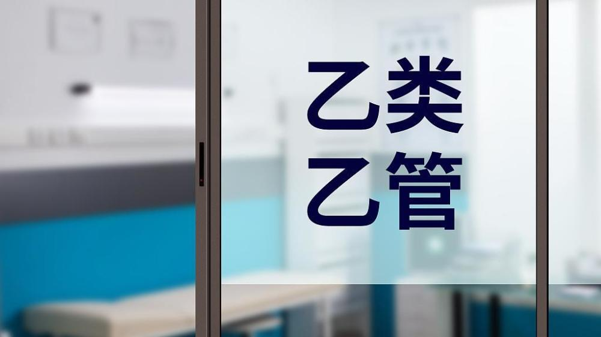

# 撤案或无罪？“乙类乙管”后未判决的涉新冠传播刑案如何处理

新冠病毒感染将自2023年1月8日起由“乙类甲管”调整为“乙类乙管”。近日，有网络文章盘点称，调整为
“乙类乙管”后，“不接受社区报备”“拒绝隔离”“不扫场所码”等七大行为，将不构成违法犯罪。对此，上海市锦天城律师事务所律师窦贤尚向澎湃新闻表示，1月8日政策调整后，违反新冠疫情管控措施将不属于我国刑法规定的犯罪情形。

此外，他表示，结合刑法第十二条规定的“刑法溯及力从轻”原则，1月8日后，此前涉及新冠病毒疫情传播的在办案件应撤案、不起诉或者判决无罪，“即：被公安机关刑拘的，应撤案并立即释放；移送检察院审查起诉的，应由公安机关撤案或者检察院不起诉处理；已经起诉到法院的一审或二审案件，应由检察院撤诉或由法院判决无罪。”

**“乙类乙管”后涉新冠传播案件可撤案或判无罪**

2022年12月26日，国家卫健委发布公告称，自2023年1月8日起，对新型冠状病毒感染实施“乙类乙管”。这意味着，2020年年初起对新型冠状病毒实施的甲类传染病预防、控制措施将正式解除。

对此，窦贤尚表示，从刑事犯罪的角度来看，这也意味着政策调整后，违反新冠病毒管控措施的行为将不再属于刑法第三百三十条等明文规定的犯罪情形。

他介绍称，1月8日新规施行后，新冠病毒感染相关的刑事案件，由于原有法律依据不再适用，原先违反防疫政策的行为根据现行规定将不再构成犯罪。

如疑似新冠感染病人拒不隔离治疗并进入公共场所或者乘坐公共交通工具，造成传播风险的行为；已确诊新冠病毒感染病人拒不隔离治疗并进入公共场所或者乘坐公共交通工具，引起传播的行为等，在1月8日后将不构成违法犯罪。

窦贤尚表示，结合刑法第十二条规定的“刑法溯及力从轻”原则，1月8日后，此前涉及新冠病毒疫情传播的在办案件应撤案、不起诉或者判决无罪，“即：被公安机关刑拘的，应撤案并立即释放；移送检察院审查起诉的，应由公安机关撤案或者检察院不起诉处理；已经起诉到法院的一审或二审案件，应由检察院撤诉或由法院判决无罪。”

我国刑法第十二条规定，中华人民共和国成立以后本法施行以前的行为，如果当时的法律不认为是犯罪的，适用当时的法律；如果当时的法律认为是犯罪的，依照本法总则第四章第八节的规定应当追诉的，按照当时的法律追究刑事责任，但是如果本法不认为是犯罪或者处刑较轻的，适用本法。

本法施行以前，依照当时的法律已经作出的生效判决，继续有效。

**已生效的涉新冠疫情定罪判决继续有效**

此前因违反防疫政策被判处刑罚的人该如何处理？

在对新冠病毒感染采取甲类传染病预防、控制措施期间，根据刑法第三百三十条规定，具有法定的5种情形之一，引起甲类传染病以及依法确定采取甲类传染病预防、控制措施的传染病传播或者有传播严重危险的，构成妨害传染病防治罪，可处三年以下有期徒刑或者拘役，后果特别严重的，处三年以上七年以下有期徒刑。

澎湃新闻在中国裁判文书网搜索获得的部分判决书中，80余人因在新冠防控期间违反传染病防治法的规定，拒绝执行卫生防疫机构依照传染病防治法提出的预防、管控措施等行为，构成妨害传染病防治罪，并获有期徒刑六个月至两年不等。

如今政策调整，对此前经法院审理已定罪处罚的人员是否有影响？窦贤尚说，将不会有变化。他表示，按照刑法第三条规定，“法律明文规定为犯罪行为的，依照法律定罪处刑；法律没有明文规定为犯罪行为的，不得定罪处刑。”即罪刑法定原则。

因此，在2023年1月8日前，新冠病毒感染仍属于传染病防治法规定的“乙类甲管”，违反当时的防疫政策并符合刑法第三百三十条等相关明文规定的犯罪情形，可依法按“妨害传染病防治罪”等定罪处刑的，符合上述罪刑法定原则。

同时，结合刑法第十二条规定的“本法施行以前，依照当时的法律已经作出的生效判决，继续有效”，即“刑法溯及力从旧”原则，即使后来防疫规定发生变化对当时的生效判决也不会有影响，原生效判决继续有效。

窦贤尚表示，判决生效后已经在服刑的人员，无权以防疫政策变更为由申诉，但可以通过良好表现争取减刑或者假释，达到实际减少刑期的目的。

