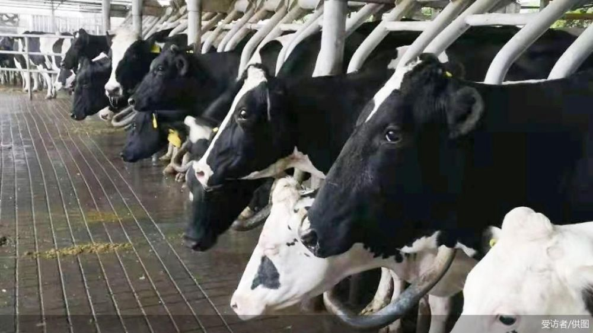

# 牛奶没人收、养牛月亏几十万，河北内蒙古等地出现“倒奶杀牛”现象

“一头奶牛每天的草料费大概要80元，牛奶没人收，几十头牛的牧场，养一个月能亏几十万元，在短期看不到好行情的希望下，只能杀了奶牛卖牛肉，及时止损。”安徽省宿州市一名养了30多年奶牛的奶农老李告诉北京商报记者，目前奶牛养殖规模较大、供应充足的北方地区，如河北、内蒙古、山东等地已经开始有“倒奶杀牛”的现象，牧场较少的南方省市则暂时供需正常。

原奶市场怎么了？在几日前召开的河北省生鲜乳价格协调会上，经测算的生鲜乳交易参考价从最低不低于3.93元/公斤下调到3.85元/公斤，逼近北方3.5-3.8元/公斤的成本价。这也是河北省生鲜乳价格协调会第一次附加条件地公布交易参考价，要求乳企做到应收尽收、如期续签收购合同，并在困难缓解后补偿差价。

专家建议，可尽快落实“喷粉补贴”，推动实施“奶粉国家收储”政策，向市民发放“牛奶消费券”以拉动乳制品消费，为乳企纾困。

“倒奶杀牛”现苗头

“现在北方地区的河北、内蒙古、山东等地已经开始有2015年那轮‘杀牛倒奶’的现象了。”老李告诉北京商报记者，养殖端奶牛和牛奶都太多了，3.85元/公斤的价格赚不了什么钱，即便这样下游的需求还是跟不上来，从伊利、蒙牛几大奶企近年的销量有所下滑就可以看出来。企业收奶减少，订奶合同到期后，北方不少奶农都没有收到新一年的订奶合同，成吨的奶囤积着没有销路。

老李今年刚满60周岁，从1984年开始养奶牛，2020年的时候因为家里孩子都成家立业、外加行情不那么好，将牧场关了，开始做奶牛流通商，前往全国各地收购奶牛，按品相贩卖到不同的渠道。见证过行业的繁荣，也经历过几轮“倒奶杀牛”行情，谈起当下的奶牛市场，他如数家珍。

“我在上海的一家牧场客户，没企业收奶，现在养一个月赔几十万元，短期内看不到行情好转的希望，已经卖了一小半的奶牛了。只能说是牛卖了就不用赔钱了，但奶牛当肉牛卖，并不能挽回损失。”老李解释道，从养殖成本看，为了补充营养产奶，奶牛一般吃的草料原料是青储带穗的嫩玉米，一吨800多元，折合斤价大概在4角多/斤，肉牛吃的是黄储玉米，折合斤价1角多/斤。从产肉率来看，肉牛专门养膘，产肉率好的能到50%往上，奶牛奶水多，产肉率大概只在30%左右，同样重量的牛，奶牛能产的牛肉要少很多。

就老李提到的北方市场的情况，内蒙古德旺农牧业科技有限公司负责人张明言告诉北京商报记者，德旺农牧主要向全国各地贩卖奶牛，“我在河北的一位奶农客户，养了1000多头奶头产奶，但因为行情下滑的原因，这半年已经将接近一半的奶牛转成肉牛育肥了，但肉牛和牛奶的行情都不算好，几乎是牛和奶都没人收”。

“河北奶协提出的3.85元/公斤参考价已经逼近成本线，且仅仅是‘参考’。”独立乳业分析师宋亮向北京商报记者分析称，“不同规模的奶牛牧场成本不一样，基本上在3.5-3.8元/公斤。去年奶价较高的时候，北方的原奶能够卖到4.6-4.8元/公斤，养殖场较少的南方价格会更高。另外，养殖场委员定的价格只是参考，并没有法律上的强制作用，企业收奶的时候合同价最终由双方协定，企业也可以定高价或是觉得这个价格高了不收奶。”

阶段性产能过剩

在宋亮看来，近期原奶行情走弱，主要是消费需求不足下阶段性产能过剩导致。

“从原奶的消费需求端看，一方面，去年至今酸奶销量整体一直在下滑，在疫情影响下，终端需求走弱；另一方面，2022年以来，各大企业都在将收上来的生鲜乳进行喷粉，目前喷粉量已经较为富裕，很多中小乳品企业在2023年可能都不再收一些牧场的生鲜乳，导致了个别牧场现在还没有签下2023年的订货合同。”宋亮分析道。

宋亮提到的喷粉，是指在乳制品销路不畅时，将保质期只有2-3天的生鲜乳经过灭菌、浓缩等处理后制成奶粉储藏，喷粉的保质期一般在一年左右，在奶牛产量低时还可再用喷粉还原。

时间拉近到当下，河北省奶业协会副会长、秘书长袁运生认为，近期原奶需求走弱，主要是受疫情影响，“人们乳品消费水平下降，毕竟在居家隔离的日子里米、面、油、菜才是基本生活保障。随着学生放假，学生奶供应也停滞，各乳品生产企业产量下调，库存激增，生鲜乳使用量骤减”。

虽然用奶量下降，河北省绝大多数乳企还是按《生鲜乳购销合同》约定将生鲜乳收购后再加工成奶粉储存起来。据河北奶协不完全统计，日前河北省每天喷粉储存的富余生鲜乳在4000吨以上，每天占用企业资金达1600万元以上。

就养殖端本身的供应增长情况而言，受访养户均表示，前些年北方对养奶牛相关补贴较大，导致奶牛的产能在过去几年大增。据张明言介绍，内蒙古等地对养牛的补贴包括贷款、建养殖场补贴、草料补贴和收奶补贴等。宁夏2019年农村养殖业补贴政策显示，存栏奶牛300头以上的奶牛标准化规模养殖小区(场)建设项目可申报补助，补助最高可达170万元（存栏量1000头以上）。

来自国家统计局的数据佐证了供应端的充足，2022年1-11月乳制品产量2848.9万吨，产量同比增长2.8%。聚焦到生鲜乳本身，艾媒咨询数据显示，自2018年来中国牛奶产量持续增长，2021年牛奶产量达3683.0万吨，同比增长7.1%。

行情转好或需3-4年

奶牛市场行情走弱，养户如何度过？

“养户自己几乎没有什么风控办法，只能跟着市场走。”老李谈起了自己在2015年行情低谷的经历，“我当时养了80多头奶牛，牛奶卖不出去，只能在保持日常供需的情况下杀了30多头牛卖牛肉，扛着亏损度过。”

老李说，他当时的销路主要是卖鲜奶和酸奶给市里订购的小区，而规模大的养殖场和企业签订合同，亏损只能跟着企业走，行情好的时候价格高、卖的多，行情差了企业收购的少了也没有什么办法。

针对已经开始有的“倒奶杀牛”的苗头，袁运生建议，“首先在顶层设计层面应兼顾全产业链的规划布局，尤其建奶牛养殖场好像没规划，只要有地有资金，谁都可以建，建议奶牛养殖场的建设应根据乳制品加工产能进行合理规划审批，必要时施行配额制以尽量实现生鲜乳供需平衡。其次，为解决乳企富余生鲜乳多，喷粉保存量过大的问题，应尽快落实‘喷粉补贴’，推动实施‘奶粉国家收储’政策，向市民发放‘牛奶消费券’以拉动乳制品消费，为乳企纾困。最后，为保障奶农利益，防止出现‘倒奶杀牛’等事件，对于在困难时期有‘拒奶、限奶、拒签合同’等行为的乳企可取消享受相关扶持政策资格并通报”。

展望后市，受访者一致认为由于终端需求偏弱，短期难以提振，2023年国内原奶价格预计还会进一步下行。老李预计，“行情估计得3-4年才能逐步好转”。

从长期来看，宋亮认为，下游的乳制品消费会在2025年迎来较好的恢复。而就现阶段而言，全球通胀造成大宗商品价格上升，饲料价格上涨给养殖户带来了较大的成本压力，奶价下行叠加成本上升，2023年预计大概有60%以上的牧场可能出现不同程度的亏损。

“短期来看，2023年下半年或者四季度有可能企稳，随着2023年经济逐步恢复，反映到生鲜乳的需求端也会有起色，但反映到供给端还需要一定时间，因而整个国内的奶源供过于求的状态还会维持一段时间。”浙商证券食品饮料首席分析师杨骥向北京商报记者分析表示。

北京商报记者 方彬楠 陆珊珊

