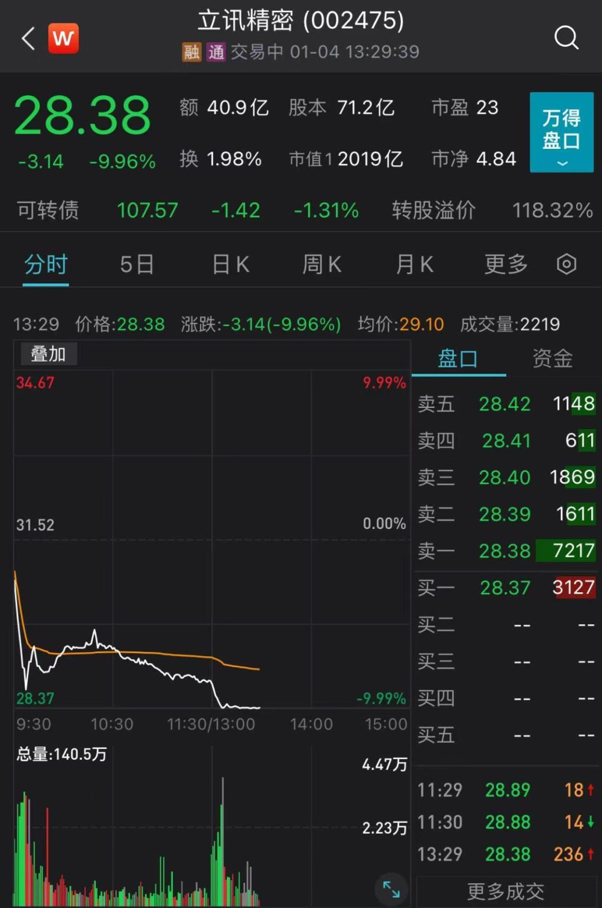

# 砍单传闻吓崩“果链”！2000亿巨头跌停，舜宇光学跌超12％

中新经纬1月4日电
(付健青)4日，立讯精密开盘直线跳水，午后触及跌停。市场传闻，苹果要求减少相关产品零部件生产，这次轮到了AirPods、AppleWatch和MacBook。

**砍单传闻再现**

日前，日经亚洲报道暗示，苹果正面临需求问题。报道援引消息人士称，苹果已告知其部分供应商在第一季度减少生产AirPods、AppleWatch和MacBook所需的零部件。

中国基金报报道称，业界人士指出，苹果砍单三大产品线，立讯精密受创最大，广达、仁宝、精元、新普等中国台湾厂商同步警戒。立讯精密证券部相关人士对此回应，“目前没有可透露的消息，公司不对具体客户、具体产品发表评论，如果有消息将会以公告形式披露。”

今日开盘，立讯精密跳水暴跌，早盘最大跌近9%。午后，公司股价再度下跌，并触及跌停。

_来源：Wind_

“果链”概念股大多同样“难受”。截至发稿，A股方面，环旭电子跌超6%，赛腾股份跌超4%，歌尔股份跌超3%，共达电声、安洁科技等跟跌；港股方面，舜宇光学科技跌超12%，高伟电子跌超7%，比亚迪电子跌超5%。

值得注意的是，对于立讯精密遭砍单，在2022年上半年曾出现同样一幕。不少投资者在上市公司互动平台询问当时公司股价大跌及市场传闻的砍单事项，但公司均回应称“经营情况正常”“订单如预期增长”等。

_来源：投资者互动平台_

作为“果链”一员，立讯精密为苹果代工生产手机、耳机和手表等多种产品零部件。从2022年业绩来看，与同为“果链”成员的歌尔股份不同，立讯精密发布的年度业绩预告显示，公司2022年归属于上市公司股东的净利润约95.45亿元-98.99亿元，同比增长35%-40%。

歌尔股份则发布了下调全年业绩预告，预计2022年净利润约17.10亿元-21.38亿元，而此前曾预计净利润约40.61亿元-47.02亿元。下调的原因，正是因为“境外大客户”砍单。

歌尔股份表示，受境外某大客户暂停生产其一款智能声学整机产品的事项影响，公司直接损失和资产减值损失约20-24亿元，对2022年度经营业绩产生显著影响。经调整后的2022年度归属于上市公司股东的净利润17.1亿元-21.4亿元，同比降50%-60%。

歌尔股份透露，基于目前进展情况，该款产品预计在2022年度内无法恢复正常生产发货。受此影响，公司年度营业收入减少不超过33亿元，与之相关的直接损失约9亿元(包括直接利润减少和停工损失等)。

此前，天风国际证券分析师郭明錤曾在社交平台称，歌尔股份被暂停生产的可能是苹果的AirPods Pro
2，为填补缺口，立讯精密已扩产并成为该产品独家组装厂商。

**苹果跌破2万亿美元**

作为“果链”的“大老板”，同样受砍单传闻影响，当地时间3日，苹果股价跌3.7%，21个月以来总市值首次跌破2万亿美元。

据路透社报道，Refinitiv数据显示，法国巴黎银行Exane分析师杰罗姆·拉梅尔将苹果股价从“强于大盘”下调至“中性”，并将其目标价从180美元下调至140美元。拉梅尔将iPhone手机2023财年的出货量目标从2.45亿部下调至2.24亿部。

同时，由于投资者担心消费者需求，Refinitiv数据显示，分析师平均预计苹果公司将在未来几周公布12月当季收入下降1%，这标志着苹果公司自2019年3月季度以来首次出现季度收入下降。

另据彭博报道，苹果供应商村田制作所表示，预计这家科技巨头将在未来几个月进一步削减iPhone
14的生产计划。不过，服务业目前成为苹果扩张的一个关键领域，基本占收入的五分之一。与此同时，公司也在进行一些策略调整，VR和汽车线产品或许将很快推出。

过去一年，苹果股价在大部分时间里表现都优于标普500指数，但近几周投资者对该公司的需求担忧加剧，导致股价持续下跌。2022年12月，苹果股价累跌12%，创下2019年5月以来表现最差的一个月。

对于消费电子行业整体走势，展望2023年，中金公司认为，复苏将成为消费电子行业的主题。一方面，手机市场安卓产业链随库存出清走出底部，新兴市场增长潜力待挖掘，折叠屏等微创新有望提振需求。另一方面，AIoT领域需求有望回暖，并在ARVR、服务机器人、储能、智能汽车等细分方向百花齐放，驱动消费电子行业景气度抬升。

国盛证券也指出，市场后续将更加关注有汽车电子、AR/VR可穿戴等第二成长曲线的消费电子标的。目前消费电子板块处于历史估值底部，2023年随着消费迹象回暖以及新产品的布局落地，有望带来行业拐点。

**中新经纬版权所有，未经书面授权，任何单位及个人不得转载、摘编或以其它方式使用。**

**(文中观点仅供参考，不构成投资建议，投资有风险，入市需谨慎。)**

