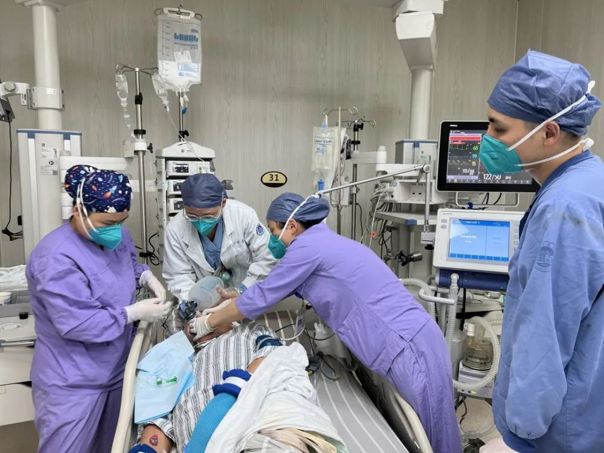

# 第一拨重症病人尚未出院，杭州各医院ICU仍“一床难求”

市民刘女士前天陪阳了的老父亲去医院拍CT，76岁的父亲诊断为：两肺散在感染、病毒性肺炎。“但医生说没床位，所以当天我们没有住院。没想到，回家第二天爸爸又开始发烧了。”
**刘女士忙不迭地找人到处打听：现在哪个医院住院有床位？**

前天，市民马先生80岁的老丈人因重度肺炎住进医院，家人办完手续住下才发现，原来他们住的是血管外科的病房，同病区也住了其他肺炎病人。马先生了解了一下，医院血管外科、心内科不少床位都让给呼吸内科肺炎病人了。

随着第一波感染高峰逐渐过去，最近几天，杭城各家医院的急诊、住院情况如何？

快报记者采访了几家医院，发现急诊患者的数量较前段时间有所回落，但
**ICU和重症病房仍然压力颇大，床位几乎都处于满员状态，很多需要住院的患者可能会遇到“一床难求”的情况。**

针对这样的情况，各大医院也及时采取应对措施，“应收尽收”，尽一切可能保障危重症患者及时得到救治。

**浙大二院：**

**第一拨重症病人尚未出院**

**为一部分患者设立了过渡专区**

浙大二院副院长张茂介绍，目前浙大二院急诊的总量有所下降，发热门诊就诊人数已经回落。ICU进入高位平台期，第一拨重症病人的出院高峰还没来，导致床位需求越来越大。

浙大二院滨江院区重症监护3病区负责人、麻醉手术部副主任邬伟东说，目前他所管辖的病区30张病床都已满员，收治的都是重症病人。

“目前通过我们的后续治疗，还能够保持病人一定的好转率，每天都有一定比例的病人从重症监护室转出，从而保证医院病房整体有序运作。” 邬伟东说。

有很多患者担心，如果要来住院，是否会遇到“一床难求”的情况？对此，张茂表示，
**重症的、需要马上得到特殊治疗的病人，目前浙大二院基本上做到“应收尽收”，市民不用担心危重症会有住院困难。**

在病房如此紧张的情况下，医院如何保证危重病患能够顺畅住院？浙大二院网络医学中心主任葛芳民表示，浙大二院致力于推动新冠轻症病人的“互联网问诊”，让症状不那么严重的患者在家就可以看诊。

“ **这段时间，医院还征用了普通内、外科的床位，配套相应的设备，层层布点，根据病人的增长数量，持续扩容重症监护的床位**
。在人力配置上，也以重症监护专业的医生作为‘种子’，带动其他内、外科的医生学习相应知识，共同奋战在重症监护的前线。”

副院长张茂说， **医院还特地设立了一个Stepdown单元，作为过渡专区**
，专门收容那些在重症监护室症状已得到缓解，但转移到普通病房还是有一定程度风险的病人。

目前，由全科医学主任郭谊负责的Stepdown病区大概有40多张床位，根据病人数量的增加后续会继续扩容。在Stepdown病区的病人情况渐渐稳定后可以转去普通病房，部分状况好的患者甚至可以直接办理出院。

66岁的患者老李，不久前由120送到浙大二院，他既往患有小脑萎缩，病情危重，一度呼吸衰竭，在急诊抢救时采用了气管插管、呼吸机辅助通气等。在一系列对症治疗以及俯卧位通气治疗后，老李顺利拔除了气管插管，3天后转入stepdown病区，继续对症治疗，目前病情已有明显缓解。

张茂副院长说，通过这个过渡专区的设置，医院尽可能将重症病房留给真正有需要的患者。从目前情况来看，危重症的病人来到医院都能第一时间得到有效救治。

**浙江医院：**

**老年人在ICU没有7-10天的住院** **时间可能挺不过来**

**离开ICU后，还需在呼吸科等病房住院5-7天**

浙江医院三墩院区重症医学科主任蔡国龙介绍，浙江医院两个院区ICU平时的床位大概是51张，按照ICU标准配置的病床有170张，较之前增长了2倍多。除此之外，还有91张床位属可转化重症床位，用于收治一般重症的病人。

浙江医院医务部副主任杨杰表示，可转换ICU的病床包括灵隐院区4病区的30张床，三墩院区18病区的23张床，两院区CCU和NICU床位38张，随时准备扩容。

蔡国龙说，目前浙江医院两院区ICU留存病人160人，医院为应急也做好了准备，短时间内还能再容纳10个重症病人。
**重症监护室也派出医生，和急诊医生一起梳理病患，确保落实卫健委提出的“病患在急诊滞留不超过12个小时**
”。目前浙江医院对危重症患者应收尽收，暂无排队情况。

“我们现在每天救治的、需要气管插管的重症病人大概为10-15人。整体病患数量还处于一个动态变化中，ICU收治的病人前两天有所回落，但重症病人数量整体仍在高位运行。”蔡国龙强调，“90%的危重症病患是75岁以上的老人，这也是这波疫情非常鲜明的特点。”

另外，病情进展快也是这次疫情的特点之一。

今天下午，浙江医院三墩院区，病人血氧下来了，医生在给他用皮囊辅助呼吸，按了一会儿氧饱和就上来了。

蔡国龙说，由120送来的病患基本都是呼吸困难、缺氧，氧饱和度在80左右，其中有5%-10%的病患是在家里拖的时间久了，送到急诊时血压已经受到影响，甚至需要心肺复苏。而ICU的病患基本都是有糖尿病、高血压、脑梗、尿毒症等基础疾病的老年人。

**“这次新冠还有一个特点就是病程长，老年人在ICU没有7-10天的住院时间，可能挺不过来。”**
蔡国龙表示，第一拨收治的病人中，目前已经有十个病人陆续从ICU转到了普通呼吸科病房。

“有一个85岁的老爷爷，我印象很深刻，送来的时候检查出来是‘大白肺’，治疗三天后就大面积吸收了，第四天气管插管拔掉，现在已经离开ICU了。”

在ICU的病人命运各有不同，有的好转离开，也有的没能挺过去。

“其实很多病人在治疗5-6天后，核酸就转阴了。但因为基础病严重，后续并发细菌感染，再加上高龄，治疗就非常困难。”蔡国龙说，
**一般重症病人离开ICU后，还需要在呼吸科等专科病房住院5-7天** ，身体状况稳定后才能办理出院。

**浙大邵逸夫医院：**

**全院病床统一调配**

**积极主动探索借用民营医院的可用床位资源**

浙江大学医学院附属邵逸夫医院医务科科长戴胜介绍，近几天，医院急诊接诊总量总体有所回落。

“急诊日接诊最高纪录出现在上周六（12月31日），当日庆春院区和钱塘院区两院区急诊共接诊2450人次，送抢救室抢救134人。最近两天，两院区急诊接诊量下降到平均每天1600-1700人次左右。”戴胜说，尽管急诊接诊量有所回落，需要送抢救室的危急重症病人依然很多，总量与之前一段时间相比基本持平，最近两天每天依然有110-120人次左右。

由于每天都有大量危急重症患者被收治入院，床位的需求量居高不下，对此， **邵逸夫医院进行了相应的分层处理。**

“危急重症患者肯定是优先考虑的，送到抢救室的患者基本保证能在当天被收治入院；情况相对严重的患者收到呼吸重症病房，呼吸重症病房主要起到桥梁作用，通过规范化的治疗和护理，尽量避免患者转成危重症，情况好转后及时转到普通病区，确保医疗救治资源的最大可用度。
**全院病床统一进行调配，以便随时根据当下的情况将患者送去合适的病区。** ”

戴胜提到， **目前，医院还在积极主动地探索民营医院的可用床位资源，进行暂时借用，将邵逸夫医院的人力、医疗救治水平投射到民营医院。**
一方面，将情况相对稳定的患者分流出去，可以减轻本院医疗压力，以便把资源尽可能留给危急重症患者；另一方面，患者在外院也可以享受邵逸夫医院的同质化医疗服务及管理，得到及时、有效的治疗和护理。

另据介绍，邵逸夫医院特地组建了专业专职的俯卧位通气治疗工作组，又称“趴趴队”。“趴趴队”由专科医生和康复医学科医生主导，康复治疗师和护士组成。
**两院区团队成员共30人，3到4人一组分工合作，将ICU常规开展的俯卧位通气治疗模式覆盖到所有集中收治的呼吸重症病房，甚至是全院新冠病人。**

1月2日—1月4日，医院普通病房的普通型及重型新冠病毒感染患者2078人次，实施俯卧位通气治疗病例数为1716人次，其中禁忌证173人次，拒绝治疗76人次，实施占比93.82%。

“通过有效的俯卧位通气，患者氧合均取得了较好改善，呼吸重症病房患者好转转出至普通病房从0个提升至5个，加重而插管的人数从9个减少为2个。”浙大邵逸夫医院护理副院长庄一渝表示，保质保量的俯卧位通气有助于解决紧张的医疗资源问题，减少呼吸机等重症救治资源的占用，使重症救治能力最大化。

**浙江省立同德医院：**

**特别成立了床位协调小组**

**加快从抢救室到收治住院的过程**

秉承“应收尽收、应治尽治”原则，浙江省立同德医院所有病区均收治新冠感染患者，优先保障急症和危重症患者住院治疗。

目前，医院设立亚重症病区3个，在原有重症监护病房扩容的基础上，又新开设1个重症监护病区，已全部投入使用。正在筹建的另一个重症监护病区近日也将投入使用，全力投入危重症患者的救治。

同时， **医院特别成立了床位协调小组，加快从抢救室到收治住院的过程。**
评估抢救患者体征相对稳定的，尽快转运至病房，从而保障了新一拨需抢救患者能及时进入抢救室治疗。

此外，医院还 **把麻醉师派到急诊、ICU、120等加强气道管理** ，并专门成立医疗救治组以及中医治疗小组，指导各病区救治工作，确保专业规范。

橙柿互动·都市快报 记者 林琳 张慧丽 张静

见习记者 吴双 通讯员 方序

陈丹 王婷 应晓燕 李文芳

