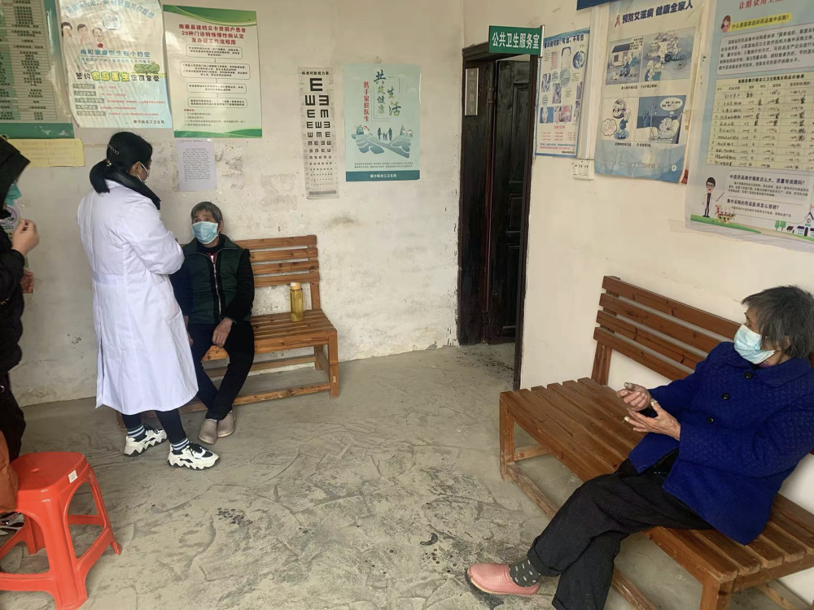

# 老去的农村如何度过疫情寒冬

“父亲74岁患有哮喘，独居。身为儿子本应陪伴，但因为身边工友都阳了，怕病毒传染给父亲。邻村出现很多一整家一整家的阳，甚是担心，所有乡镇卫生院、县城医院买不到药。”湖南怀化辰溪县板桥村一位返乡男子在一个名为“农村退烧救助行动”的公益项目上留言。

“农村退烧救助行动”自2022年12月14日发起，项目方通过收集社交平台上各地农村求助信息，对接药企和当地村医或志愿者，完成民间自助。目前，城市医疗资源告急的消息受到广泛关注，乡村老人的声音则更难被听见。

第一财经记者采访多位求助者发现，农村老人普遍闭门不出，此前既未被感染，对新冠病毒的认知也不清晰，近期才开始戴上口罩。因为信息滞后，他们很难比城市居民更快储备发烧药品。作为沉默的大多数，他们的求救信息也多是由远在外地或是提前返乡的子孙辈代为发出。

根据第七次全国人口普查数据，截至2020年11月1日，我国乡村人口约5.1亿人，与10年前相比减少1.64亿。乡村60岁、65岁及以上老人的比重分别为23.81%、17.72%，比城镇分别高出7.99、6.61个百分点，据此计算，乡村60岁以上老人约有1.2亿，65岁以上老人约有9037万。

无论面对的是基础病还是新冠病毒，老年人都是薄弱群体，而农村老年人还必须直面缺医少药的情况，这个冬天，他们的境遇会如何？

_广西柳州市某村卫生室在给老人问诊和派发药品
供图/郑宏彬_

**医药紧缺**

“药也买不上，在家里睡着呢，我也不知道自己阳没阳，没做核酸。”村民老吴60岁，他所在的陕北某村共1800余人，比他年纪大的老人大约有400人，占比约四分之一。

在疫情放开以前他不敢去买感冒药，怕被送到方舱，放开之后他再去卫生所，发现买不到药了。2022年12月初，老吴发烧了，乡村医生上门给他输液。老吴有关节炎，而诊所没有暖气，他无法去诊所打针，他网购的药品一度也物流不畅，“东北、内蒙古的药下不来，西南的药还可以来”。

之后家里的孙子和老伴也发烧了，每人输液3天，老吴比他们少输1天，“因为总要有个人照看家”。大概十天之后，老吴一家基本没有症状了。后来，村里的病患基本都收到了一两片布洛芬，有的来自政府发放，有的来自民间志愿者，但诊所和医院还是买不到退烧药，“如果吃完了（布洛芬）不见好也没办法，忍忍也就好了，就是好得慢点”。

元旦以后，村里九成的人都阳了，诊所里因感冒求诊的人还是很多，但比一个月前要少些。

在“新十条”颁布之前，许多乡村诊所和卫生院基本不收治发热病人，因此储备的发热、感冒药物有限，个别地区基本为零；而在政策转向后，乡村发热病例大幅提高，相关药品的采购储备一时间难以跟上。村镇卫生所（院）通过替代药品、中药以及输液等方式应对病患需求。但由于此前阳性病例都直接被收走隔离，许多乡村基层医生对于新冠治疗方案并无准备，“有什么用什么”的现象较为普遍。

乡村医疗资源紧缺之时，“农村退烧救助行动”这样的公益项目开始介入民间自助。但据“农村退烧救助行动”发起人之一郑宏彬介绍，一些村镇在对待民间救助的态度上比较谨慎，一方面希望医药资源尽快到位，另一方面又不希望媒体和民间团体等过多介入。

_陕西汉中市某村给村民派发药品
供图/郑宏彬_

刘桂芬是黄冈市浠水县人民医院的一位医生，她告诉记者：“我们医院编制床位是1200（张），现在加到了1800张，走廊加了很多床，空一个进来一个。轻症基本进不来，住院的都是老人，大多患有高血压、糖尿病、肺气肿等。县医院主任一级的医生会去乡村摸排，将重症患者及时转运到县医院来。”

从2022年12月23日晚上开始，浠水县人民医院通知所有科室都要接收发热病人，接着每一层楼收满，新接收病人基本都是合并肺炎感染，医生忙得不可开交，工作时间变成早8点到晚8点。据《鄂东晚报》报道，自2022年12月中旬以来，浠水县人民医院发热患者激增，最多一天接诊最高峰达近500余人次，医院抽调了20余名行管后勤科室具有医疗背景人员支援一线。

刘桂芬回忆，2022年12月25日前后最为忙碌，有医生陪同病人转运到武汉的大医院，病床位依然要等。但元旦过后，病人没有之前那么多，去武汉的医院也不需要等太久床位。“春节前后人员流动或许会有一个新的高峰，以往春节时候也比平时要忙”。

**鞭炮一响，就知道又走了一位老人**

虽然存在缺医少药，但老吴没听说村里有重症的病例和大量死去的老人，大部分人当作一次比较严重的感冒。但在另一些地方，情况大不一样。

湖北黄冈人老孔今年76岁，他感觉到最近村里去世的老人变多了，“有的八九十岁的老人在家里就走了，并未送医院。本县最好的棺材以往卖5000元一副，最近半个月都卖到一万多。”

老孔所住的黄冈某地城乡接合部，小区共有200多户千余人，每户都有老人一两名，总体老龄化比例在20%以上。去年12月17日，患有高血压、冠心病、中风等多种基础病的他开始发烧感冒，服药后渡过难关。公务员退休的他是当地医养条件较好的一批人，有城镇职工保险和慢性病医保。但即便如此，小区对于其健康情况并未建立档案，疫情冲击之下社区也并未对他进行排查。

最近，小区里放了几次鞭炮，鞭炮一响，他就知道又走了一位老人。

从事农村工作多年，老孔对于农村医养差距深有感触。“无儿无女的‘五保’老人由政府出钱看病养老，儿女有钱或者自己有退休工资的老人也可以颐养天年。但中间那批自身有重大疾病、儿女又在外打工经济条件一般的老人，境遇最糟，每月100多元的农村养老金无法覆盖他们的生活，即便县医院可以报销60%，但余下部分对农村老人而言依然是很大负担，他们生不起大病。”

据老孔介绍，当地农村老人平时可以去社区或乡村医院买药，看一些小病或者慢性病；生了大病无人照料的情况也不罕见。中风之后，老孔去当地残联办的护理院做过康复，看到那里的一些农村老人晚景凄凉，“独自一人瘫了七八年，最后慢慢就走掉了”。

根据第七次人口普查结果，黄冈市65岁及以上人口91.85万人，占比为15.61%，已步入老龄化社会。截至2021年，该市城镇化率不到50%，排在全省倒数第三。

为何有的老人把新冠当作大感冒，而有的却因此送命？又为何部分农村老人重症并未就医？

前述医护人员介绍，“新冠感染有很多症状。有的年纪大的、心肺功能不好的老人，他可能会合并肺部感染严重。”她表示，“有些年纪大的人，估计是从心里面已经接受了这个事实，觉得自己治不好了。但也有些老人90多岁，血氧降到七八十了，家属的抢救意愿还是比较强。”根据连续几版《新冠诊疗方案》，血氧饱和度低于93%即为重症患者，需要进行辅助呼吸治疗。

国家卫生健康委员会医政司司长焦雅辉近日表示，春节将近，随着人员流动的增加，城市疫情有可能蔓延到农村，增加农村疫情防控压力。要提前布局，一方面让药能够发下去；另一方面要让农村的重症患者，特别是老年重症患者及时转上来。

**乡村医生：和农村一起老去**

郭红卫是浠水县的一名村医，村里4000多人中，65岁以上老人有600～700人。他所属的镇卫生院有四支家庭医生团队，每支对应三四个村，每个村有两名家庭医生。

浠水县位于大别山南麓，是传统农业和人口大县，也是劳务输出的大县，每年有超20万，接近四分之一的人在外务工，当地老龄化趋势加深。

2022年12月22日，第一财经采访郭红卫时，他咳嗽加重，“估计是阳了，要休息几天”。他已经64岁，接下来几天的问诊工作会交给另一位“年轻”的村医——也年近60岁。

河北保定的村医秦海从上世纪80年代开始从业，“赶上了赤脚医生的尾巴”，前几年，他考取了执业（助理）医师。

2022年12月初，秦海经历了最忙碌的时候，早上5点就会被病人的敲门声叫醒，在发烧状态下开始一整天长达十几个小时的忙碌，每日接诊数十病人，还经常上门治疗。

村里65岁以上的老年人有80多位，他们的基础病、常用药，秦海心里都有一本账。如今，村里的老人越来越多，新生儿越来越少，秦海也步入暮年，周围像他这样干了几十年的同行寥寥无几。

一些年轻的村医选择了离开。

哈尔滨的李同强曾是一名村医，但因为“个人发展原因”，40多岁的他选择在2019年离开这支队伍，去城乡接合部开自己的中医诊所。“农村医生的工作量非常大，除了治病还要承担当地的公共卫生事务，收入水平和覆盖人口挂钩，总体收入来源非常有限。”他告诉记者。

在秦海看来，上世纪八九十年代是职业高光时刻，那时乡村医生受尊敬，逢年过节总有人上门送礼；之后，村里的瓦匠木匠开始吃香，村医的收入下滑，愿意干这行的年轻人越来越少，因此许多村医到了退休年龄还会被返聘。

根据国家卫健委每年发布的《我国卫生健康事业发展统计公报》，我国行政村和村卫生室数量逐年减少，乡村医生队伍正在逐渐萎缩，近两年减少14.6万人。

持有乡村医生资格证书经注册可以在村医疗卫生机构从事预防、保健和一般医疗服务；持有执业（助理）医师则可以在乡镇卫生院或村卫生室执业。截至2021年底，两者合计人数约为117万人，平均每人对应约80位65岁以上的农村老人。

因此，乡村医生数量减少，其一是因为农村人口的减少；其二是部分乡村医生升级成为执业（助理）医师，这并不代表他们就不在乡村问诊，每千农村居民的村医数近十年来实际上在提升。

截至2021年底，中央财政累计投入14.3亿元，共培训基层卫生人员59万人，其中乡村医生38万人。

2022年10月，国家卫健委对《关于加强乡村医生队伍建设助推乡村振兴的提案》作出答复，在岗村医可以按照规定根据不同身份参加机关事业单位养老保险、企业职工基本养老保险或城乡居民基本养老保险。对于老年离岗村医，多数地方采用发放定额补助或根据服务年限给予年资补助的方式提高养老待遇。医疗保障方面，国家医疗保险体系不断完善，村医可按规定参加基本医疗保险并享受相应的待遇。

**农村养老院：“能防守就防守”**

胡霞是鄂东农村一家养老院的院长。2022年12月21日，胡霞告诉第一财经，院里出现了两位阳性老人，他们的家属刚往院里送过东西，有可能将病毒带来了进来。两位老人被隔离起来，胡霞手里还有50到100份各式感冒发烧药物，“能防守就防守”。但到了元旦，全院基本全阳了。

这家康养结合的养老机构有300多个床位，配备三位全科医生、一位理疗师，目前收治老人160多名。他们平均年龄在80岁以上，最大的102岁，基本是生活不能自理的瘫痪老人，心梗、脑梗时有发生。如果老人出现紧急状况，他们会先行抢救，然后送到十几分钟车程的县人民医院。

但在疫情大面积暴发期间，去县医院的救护车需要等待更长时间，有时四五十分钟，有时三个小时。“我们的医疗手段只能检测出老人有肺部感染，进一步治疗要送医院，但现在急救资源紧张，有时需要家属自行开车送老人去医院”。

等待时间变长的还有殡仪馆的车。胡霞的养老院近期已往外送出20多位老人，有的去了医院，有的被接回家，还有的离开了人世，“去世的多是心肺功能不好的老人，在‘阳康’之后病情加重，一些家属无奈选择放弃”。

去年上半年，复旦大学老龄研究院在全国539家养老院发布调研报告。报告显示，疫情防控方面，六成受访养老机构现缺乏专业人员、机构老年人新冠疫苗接种率相较居家老年人明显偏低；有四成机构在封闭管理期间存在不同程度的生活物资短缺；8.24%的机构表示经常或一直存在防疫物资短缺，35.52%的机构存在一些急需医疗物资（如导尿管）短缺的情况，60%的机构存在药品短缺的情况，尤其是罕见病、精神类药物。

此外，66.05%的受访机构表示2020年以后年平均营业收入比疫情前明显有所下降，其中78.37%的机构下降率不超过40%；68.83%的机构反映由于疫情期间员工的总体工作负荷增加导致机构人手出现短缺，60.48%的机构疫情期间出现员工离职导致人力资源匮乏。

胡霞的养老院同样面临困难，此前当地国药集团和民政部门已和她对接，但养老院重症老人逐渐增多，国药集团药品资源也变得紧张，她只能另寻渠道找药。“现在已经花了20多万元储备各类中西药，由于老人不同的基础病和一些药物不能同时服用，我们还需要到武汉等地去采购多种药物。”

养老院面临的另一个现实问题是急缺能够帮助医生治疗的护士（而非护理）。和村医群体类似，农村老人护理人员的年龄也普遍偏大。胡霞所在的养老院员工多是50岁左右文化程度较低的农村妇女。

和全国几乎所有养老院一样，疫情3年，这家养老院一直处于封闭和半封闭的状态。即便全国已经放开，整个县和养老院内已经阳了大片，但养老院依然严防死守，害怕外界带来更多的感染。

出于安全考虑，胡霞谨慎收住新的老人。而一些老人因家庭负担不起住院费用被家人接回。“我们这里有些瘫痪老人，拖欠费用好几万。儿女在外打工，但今年都没收入，我们也不好催他”。

56岁的胡霞目前每月退休工资有5000元，她为自己在这家养老院选好了养老房。但大部分农村老人每月只能领取几十到几百不等的养老金，儿女负担很重。

“中国传统就是‘水往下流’，在老人和孩子之间，大部分人肯定选择照顾小孩，这些瘫痪老人就只能留给我们照顾。一些老人刚住进来思想上还不愿意，但一个月左右也就适应了这里的生活。”胡霞说，“要是哪天所有老人不管有没有儿女，都能像‘五保’那样有政府托底安享晚年就好了。”

（应受访者要求，文中刘桂芬、郭红卫、秦海、胡霞为化名）

