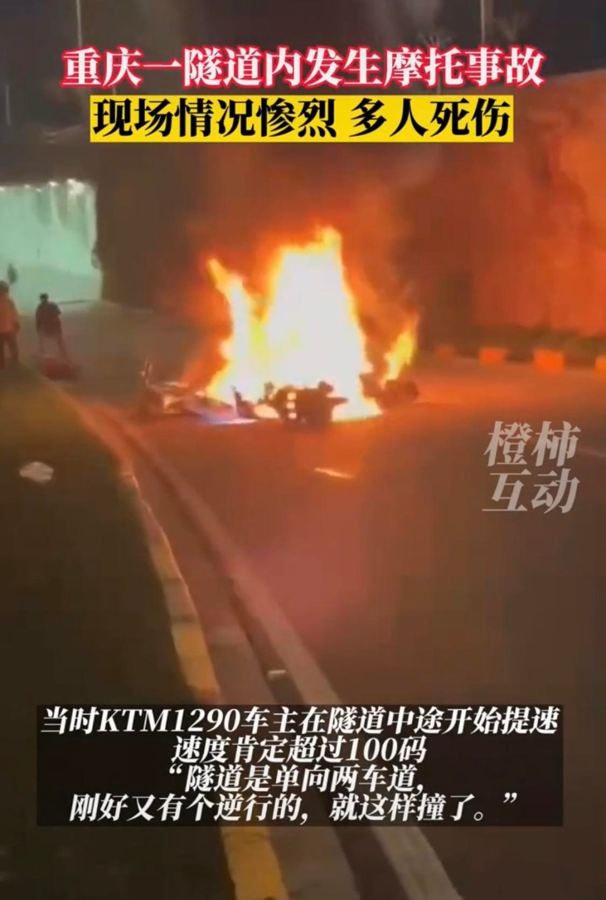
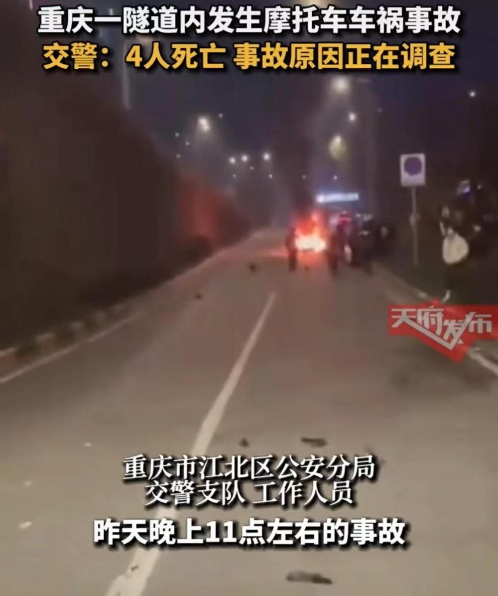

# 重庆一隧道发生摩托车事故致4人死亡，21岁网红疑丧生

根据都市快报橙柿互动报道，重庆一隧道内发生摩托车事故，两辆摩托车相撞，现场燃起大火，零件七零八落。交警称，事故造成4人死亡，原因正在调查，具体情况警方会进行通报。

现场一名目击者称，事故发生在重庆聚贤岩隧道，隧道在市区，限速60码。当时KTM1290车主在隧道中途开始提速，速度肯定超过了100码，隧道是单向两车道，刚好有个逆行的，就这样两辆车撞在一起了。从视频可以看到，现场相撞的车辆已经燃起大火，零件七零八落，还有数人躺在地上。

此外，还有网友证实21岁网红庄某某在事故中不幸身亡。

另据天府发布消息，重庆市江北区公安分局交警支队工作人员表示：“事故是昨天晚上（5日）11点左右发生的，4个人已经都死了，事故原因还在了解当中，（江北区）分局会出通告的。

**【来源：九派新闻综合根据都市快报橙柿互动、天府发布】**

