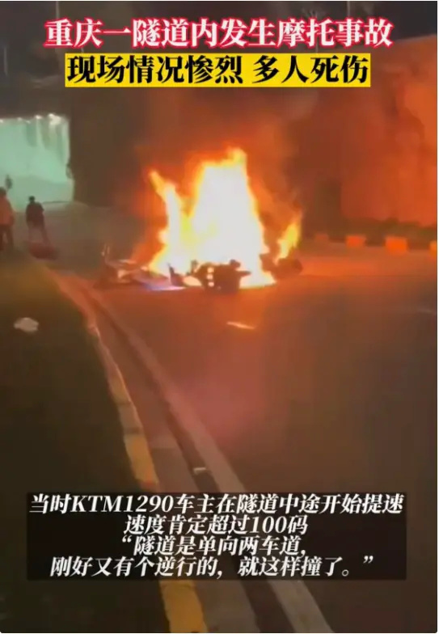
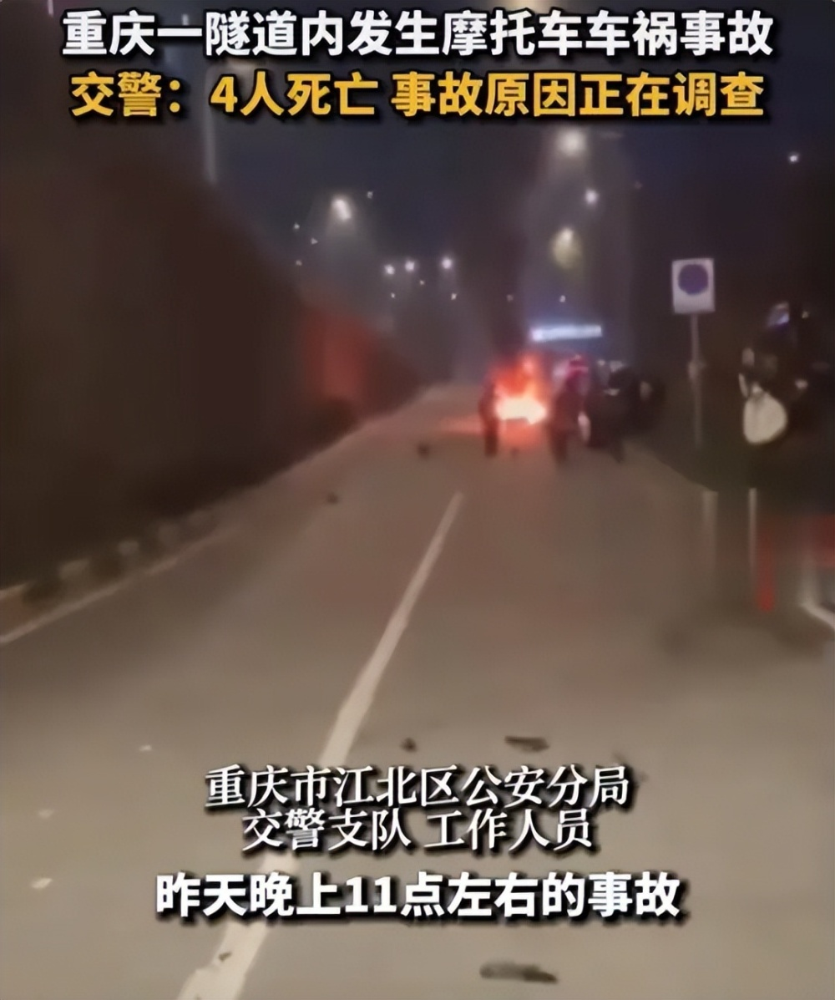

# 重庆一隧道发生摩托车对撞事故，4人死亡，1人为21岁网红庄慕卿

重庆一隧道内发生摩托车事故，两辆摩托车相撞，现场燃起大火，零件七零八落。交警称，事故造成4人死亡，原因正在调查，具体情况警方会进行通报。

1月5日晚，网传重庆江北区聚贤岩隧道内发生两辆摩托车对撞事故。据网友拍摄的视频显示，一名男子和一名女子面部朝下趴在隧道一侧，另一名绿衣女子仰躺在隧道另一侧。隧道外，其中一辆涉事摩托车被撞后发生燃烧，不远处，又有一名佩戴护具的男子仰躺在地上。

现场一名目击者称，事故发生在重庆聚贤岩隧道，隧道在市区，限速60码。当时KTM1290车主在隧道中途开始提速，速度肯定超过了100码，隧道是单向两车道，刚好有个逆行的，就这样两辆车撞在一起了。视频里的现场目击者不停地说：“隧道这下出事了”“已经没有呼吸了，膝盖也断了”。

6日下午2点，据封面新闻报道，现场已围起了警戒线，警戒线内仍能清晰看到黑色的火烧痕迹，以及摩托车和地面摩擦产生的划痕，地面上散落着被火烧过的摩托车细小零部件。

此外，还有网友证实21岁网红庄某某在事故中不幸身亡。

有网友认出，其中一名死者是曾与OST传媒签约的网红庄慕卿。对此，重庆越野圈一名认识庄慕卿的摩友江先生向记者确认，该消息属实，庄慕卿确实在昨晚出了事故。

6日下午，庄慕卿曾经的合作伙伴、OST传媒直播运营部运营人员古斯豪表示，“今天（6日）凌晨，我们关注到@庄慕卿 发生意外的噩耗，我们对此非常痛心。”

古斯豪也对公司目前才解绑庄慕卿账号进行了说明，“2022年11月20日，公司与庄慕卿合约到期后没有再续约，由于一些工作失误，没有及时解除绑定，目前已经解除账号绑定。”

他还表示，在双方合作期间，庄慕卿工作很敬业，为人也谦和友善，“我们正在设法联系庄慕卿的家属，联系上后会前往重庆致哀，并当面慰问家属。”

另据天府发布消息，重庆市江北区公安分局交警支队工作人员表示：“事故是5日晚上11点左右发生的，4个人已经都死了，事故原因还在了解当中，（江北区）分局会出通告的。

（橙柿互动、封面新闻等）

编辑：赵珊珊

