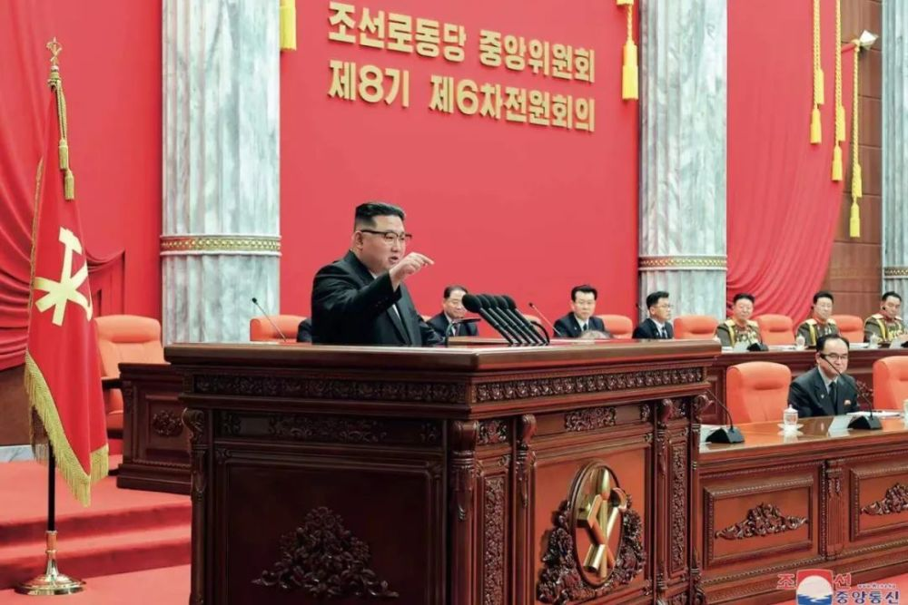

# 金正恩携女儿视察导弹库，朝鲜核武库或将“几何级”扩容

_金正恩在朝鲜劳动党中央八届六次全体扩大会议上。图/人民视觉_

2022年年底，朝鲜劳动党中央八届六次全体扩大会议在平壤召开，朝鲜2023年度“核武力及国防发展变革战略”首次披露。在过去半年朝鲜半岛局势日趋紧张的背景下，新战略明确提及核武器运用包括“非防御”使命，及核武库建设将“几何级数般”扩容。韩美分析人士纷纷猜测，朝鲜进行第七次核试验的时间已越来越近。

朝鲜核战略的迅速升级超出外界的预料。2022年1月，劳动党八大曾提出制造超大型核弹头、升级洲际弹道导弹的固体燃料火箭、研制潜射核武器等五大核心课题。八届六中全会前夕，韩国统一研究院朝鲜研究室主任洪珉曾推测，朝鲜2023年核战略可能聚焦五大课题尚未完成的内容，及扩充中程导弹阵容、发射侦察卫星等已有公开报道涉及的计划。

然而，据朝中社2023年1月1日发布的报道，建设层面上，朝鲜新核战略强调核武器的“几何级扩容”及战术核武器的“批量生产”。据西方智库估测，朝鲜现有核弹头数量在15到60枚之间。

值得注意的是，2022年的最后一天，金正恩出席军工部门向八届六中全会“奉送超大型火箭炮”的仪式，赞扬军工部门一次性交付30门“至关重要的攻击型武器”，并指出这些火箭炮“射程覆盖整个南朝鲜，可搭载战术核武器”。2023年新年伊始，金正恩同女儿一起视察弹道导弹武器库，朝鲜媒体的照片中出现10多枚弹头。韩联社援引专家分析称，这些公开活动或是为“核弹倍增”计划制造声势，但增加数量究竟为多少，尚不得而知。战略层面上，朝鲜新核战略被韩美媒体认为从“防御为先”转向“先发制人”。

美国亚太和平研究所前所长马克·巴里指出，朝鲜新核战略的惊人发展，既表明朝鲜目前的军力建设周期尚未结束，也体现出2022年不断恶化的国际地区局势对朝鲜的影响。

2009年到2017年，朝鲜曾六次进行核试验。2018年后，随着朝韩、朝美对话展开，朝鲜暂停核武器发展计划，关闭丰溪里核试验场。2019年朝美对话陷入僵局后，2020年1月发布的劳动党中央七届五中全会公报指出，因为无论采取“发展核武器和发展经济并举”的路线还是“集中一切力量进行经济建设”的路线，外部环境都未有改变，因此朝鲜将“蓬勃推进战略武器开发工作”。至2022年，劳动党八大将此明确为重新发展核武器，并列明“五大课题”。

如今，八届六中全会在提出新核战略的同时，还做出一系列人事调整。人民军“一号人物”、劳动党中央军事委员会副委员长朴正天被免职，国防相李永吉继任。社会安全相朴秀逸和总参谋长李太燮对调。被美国财政部以参与大规模杀伤性武器和弹道导弹研发为由列入制裁名单的新任平壤市责任书记金秀吉、前军需工业部长俞镇分别晋级政治局候补委员和中央委员。有分析认为，这意味着朝鲜核武器及军工发展进入了“五大课题”后的新阶段。

据朝中社报道，近期半岛局势日趋紧张，也是朝鲜选择进一步升级核战略的原因之一。2022年5月韩国新总统尹锡悦上台后，摈弃前任文在寅政府的对朝友善、对话政策，强调韩美军事同盟及“最大压力”措施，并恢复韩美大规模军事演习。9月以来，朝鲜以密集试射导弹回应韩美军事活动。

巴里等分析人士认为，尹锡悦对朝敌对的政策未必足以影响朝鲜长期核战略，但可能促成朝鲜进一步延长当前的武器发展周期。更重要的是，在俄乌冲突、印太地区形势紧张等大背景下，八届六中全会报告显示出朝鲜明确认为国际格局正转向“新冷战”体系。这种判断或将对半岛对抗局势的走向产生深远影响。

记者：曹然

