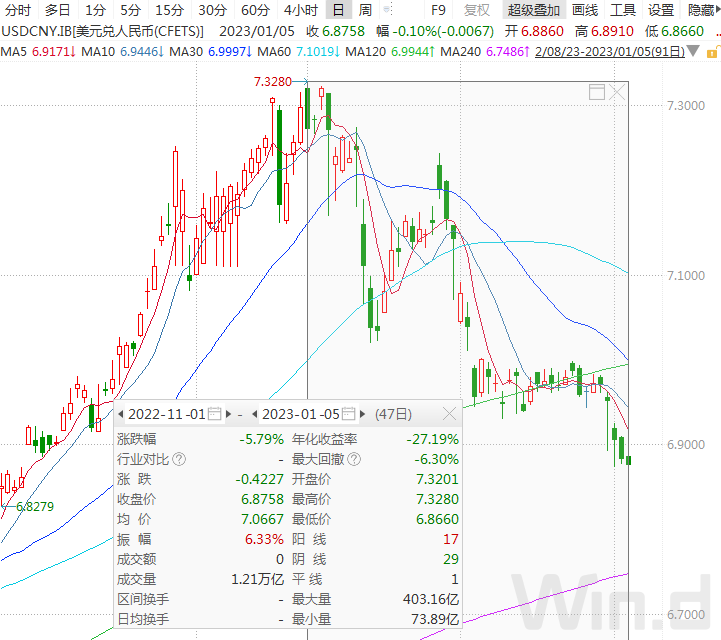

# 两个多月人民币兑美元升值超4500个基点，2023年如何走？

随着美元指数不断走弱，近两个多月人民币强劲，连续升值。在岸人民币兑美元自11月初低点7.328一路走强至本周最高点6.8733，期间累计上涨超过4500个基点。本轮人民币升值较快，不断创阶段新高，而且升值趋势依旧，后期将如何演绎？

**人民币持续走强**

2023年开启，本周在岸人民币兑美元继续走强，尤其是开年第一个交易日盘中一度攀升至6.8733，再创4个多月新高，这也是自11月1日以来的两个多月持续走高。截至1月5日13:00点，最新报收在6.8835，期间人民币兑美元最大升值4445个基点，上涨5.69%，升值幅度巨大。

此外，2022年末，为促进外汇市场发展，中国人民银行、国家外汇管理局12月30日宣布，决定自2023年1月3日起，延长银行间外汇市场交易时间至次日3:00，覆盖亚洲、欧洲和北美市场更多交易时段。

人民银行、外汇局相关人士表示，此举有助于拓展境内外汇市场深度和广度，促进在岸和离岸外汇市场协调发展，为全球投资者提供更多便利，进一步提升人民币资产吸引力。

**强美元临近尾声**

尽管各大机构预计美联储2023年至少还要加息2~3次，每次25BP，但比起2022年400BP的全年加息幅度，可以说目前美联储的紧缩政策已接近尾声。

**“美元的整体疲软将至少延续到2023年上半年。由于日本央行可能会出人意料地加速收紧政策，美元的下行风险已经加剧。”**
国泰君安国际首席经济学家周浩表示。

Wind行情显示，美元指数自去年9月底出现高点114.7861后一路下跌，并在12月30日创半年多新低。虽然2023年新年以来四个交易日震荡反弹未再创新低，但能否止跌还需等待。

嘉盛集团资深分析师Jerry
Zhang表示，按照“美元微笑理论”，美元在避险情绪高涨和美国经济强劲的阶段都会走强，而经济表现疲软的周期（利率到达峰值，美联储开始降息）将拖累美元下行。从美元指数的周线图来看，103.30附近将成为关键分水岭，跌破该点位将意味着2021年5月开始的上升趋势被打破，指数可能跌向长达12年的上升通道下轨。

**人民币2023年如何走？**

英大证券研究所所长郑后成表示，从四方面的因素来看， **2023年人民币汇率升值压力大于贬值压力。**

首先，从中美两国宏观经济基本面看，2023年中国处于主动去库存向被动补库存转化阶段，而美国则处于主动去库存阶段，中国宏观经济基本面领先于美国。

其次，从货币政策走势看，在美国ISM制造业PMI持续位于荣枯线之下，以及美国长短端利差倒挂的背景下，2023年三至四季度美联储大概率降息，中美利差大概率收窄，利多人民币汇率。

第三，从美元指数的走势看，美元指数处于周期的顶部区域，随着美国宏观经济承压及美联储降息，美元指数下行是大概率事件。

最后，从人民币汇率自身周期看，当前人民币汇率处于“8•11汇改”以来的第三轮周期的底部区间，后期升值是大概率事件。

野村东方国际证券研究部首席策略分析师高挺表示， **美联储快速加息的进程已经进入后期，美元大幅升值的阶段也已经过去**
，这对新兴市场是有利的，2023年资金可能回流新兴市场。同时，美国经济衰退的可能性会使国际投资者在其他领域寻找投资机会。2023年中国经济复苏，尤其是在二季度之后复苏更趋明显，北向资金的流入量有可能会较2022年增加，外资有望成为全年额外的流动性亮点。

光大银行金融市场部宏观研究员周茂华也表示， **今年人民币汇率面临的环境更加友好**
，令人民币汇率有望继续在合理均衡水平附近平稳运行。究其原因，一是国内经济需求恢复趋势确定，令人民币资产吸引力持续增强；二是美联储加息周期步入尾声、加之美国经济增长趋缓、制约了美元汇率大幅走强。

