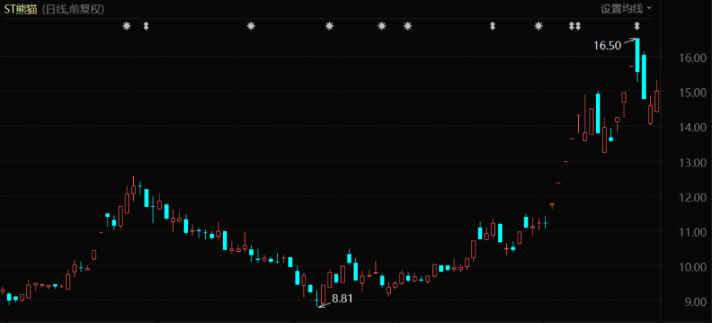
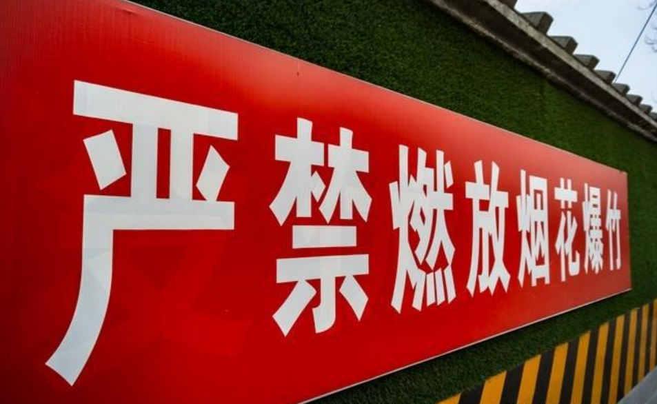
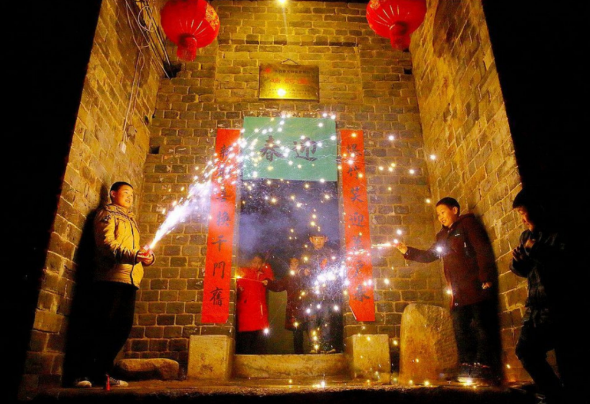
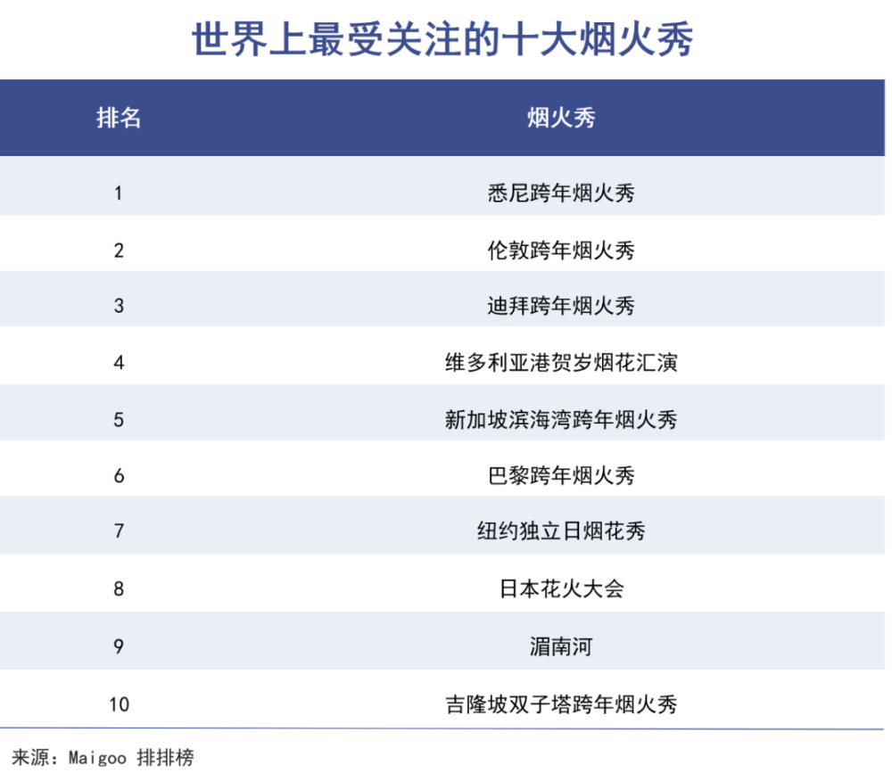

# 中国烟花，还有未来吗？

文 | 老鱼儿

编辑 | 杨旭然

元旦前夕，一则2023跨年的烟花秀预告，让河北省石家庄市的人们喜上眉梢。

然而跨年夜当人们聚集在活动现场欢呼完倒计时后，惊愕地发现所谓烟花只有电子烟花动画，在街边的大屏幕上绽放。

不少人顿时有种“被坑爹”的感觉。

无怪乎人们感觉被欺骗，因为自从去年年底以来，全国有多地已经开始对禁放烟花爆竹政策有所松动，拉高了人们的期待值。

比如大连规定腊月二十三、除夕至正月初七、正月十五每日7时至23时（除夕不限时），都可以燃放烟花爆竹。

山东滨州市则规定除夕至正月初五、正月十五在主城区、县（市、区）建成区可以有限制燃放。山东东营市也规定有7天可以燃放烟花爆竹。

受多地烟花禁令松动的影响，A股上市公司ST熊猫在2022
年12月份收下了9个涨停板。2023年开局两个交易日，又连续收得两个涨停，这可能是资本市场十几年来第一次真正关注起了烟花股。

_ST熊猫股价表现（2022年8月至今）_

不过石家庄的“烟花秀”还是给了期待者一个无情的提示：少数松动的背后，仍是多数地区对于烟花爆竹的禁令如山。

自中国“四大发明”中的火药产生之后，中国人就把它用于烟花爆竹的制作之中。迄今，我们仍然拥有着世界上规模最大、历史最为悠久的烟花产业。

只是 **在近30多年的时光里，中国烟花却始终面临着“绽放”还是“禁放”的两难境地。**

这也让中国烟花产业的未来，至今仍然充满迷茫。

01 烟花易冷

在新中国成立，尤其是改革开放之后，中国的烟花产业总体上来说是处于不断发展壮大的进程之中。产业集中度也越来越高，出现了像湖南省浏阳市这样的产业集群。

据相关数据统计，浏阳烟花占据着80%左右的国内烟花爆竹市场份额，国外市场份额更是高达60%以上。浏阳还诞生了中国第一个以烟花爆竹为主业的上市公司。

2001年8月28日，浏阳花炮于在上海证券交易所上市交易（后改名为熊猫烟花，又改名为熊猫金控），实现了企业的跨越式发展。2009年6月29日，浏阳花炮还曾成功实现在加拿大多伦多证券交易所挂牌上市。

本以为这会是中国烟花登陆资本市场的开端，可谁也没有料到的是， **20多年过去了，熊猫仍然是烟花行业的独苗一只，而且已经被ST。**

中国烟花没落的最主要原因，是进入21世纪之后，这项古老的传统遭遇到了现实最严峻的挑战。

就是我们最熟悉的“禁放”。

其实早在20世纪90年代前后，国内就有一些城市开始陆陆续续限制烟花爆竹的燃放。1986年12月，北京市发布了《北京市烟花爆竹安全管理暂行规定》，开始对烟花爆竹燃放采取“逐步限制、趋于禁止”的政策。

在进入21世纪之后，限制燃放向“禁止燃放”不断演变，并在近十几年的时间内，到达了顶峰。

2016年由上海市将禁放范围从内环扩大至外环，被网友称为“史上最严禁燃令”。

根据中国烟花爆竹协会官方网站文章称：截至2018年1月底，全国共有803个城市禁止燃放烟花爆竹，同比提高81%，其中直辖市3个，包括：北京、天津、上海；省会城市16个；地级城市153个；县（市）城市631个。同时，还有923个城市出台了限制燃放烟花爆竹的政策，同比提高21%，其中直辖市1个，即重庆；省会城市9个；地级城市146个；县（市）城市767个。

对此，国人有着切实的直观感受， **在最近五年之内，几乎整个中国都成了烟花爆竹的“禁飞区”。**

在这种一片“喊打”的大环境下，中国烟花产业整体发展实际上是较为缓慢的。以熊猫烟花为例，近十年来，企业起起伏伏，几乎没有任何发展。熊猫烟花方面曾向媒体表示，2019年春节期间，北京全市总销量是2.3万箱左右，而在2009年，这一数字是60万箱，十年间缩水九成以上。

主业的萎靡，导致公司急于寻找第二曲线而涉足金融业务，结果反而导致了持续的经营不善。

根据浏阳市鞭炮烟花产业发展中心的数据来看，2015年1-9月该市花炮产业集群实现总产值158.9亿元。国内销售额100.52亿元。到了2022年1-9月，该市花炮产业集群实现总产值159.7亿元，仅比7年前增长0.5%。国内销售额89亿元，比7年前不增反降了11.46%。

而 **之所以总额略有增长，全都依赖于出口销售额由21.58亿元增加至35.4亿元。**

02 墙内开花墙外香

不仅是浏阳烟花，对于整个中国烟花而言，国外市场的“新大陆”给了这个产业一个大大的喘息之机。

2022年11月20日晚上，在卡塔尔世界杯开幕式上，姹紫嫣红、绚丽的烟花秀将现场气氛推向高潮。而这些可以打上350米的高空，绽放花朵直径达到200多米的烟花，则来自江西萍乡上栗桐木镇的一家烟花生产企业。

_2022年卡塔尔世界杯开幕式烟花秀_

据了解，美国在2020年进口了3.7亿美元烟花，其中中国烟花占了3.57亿美元。据美国烟花协会的数据，全美大型表演中使用的烟花75%都产自中国，个人燃放的烟花则98%来自中国。浏阳市相关部门曾表示，每逢美国独立日，建国庆典或者圣诞节，浏阳烟花爆竹企业的国外订单都会大幅度增多。

国家统计局的数据显示， **2021年全国烟花、爆竹累计出口322901吨，金额累计8.05亿美元，分别同比增长19.2%和16.5%。**
亚洲、北美和许多西方国家是我国烟花爆竹产品主要的出口市场。

国家统计局数据显示，近20年来，中国烟花爆竹出口数量及金额呈螺旋式增长。华经产业研究院数据显示：2022年仅1-10月中国烟花、爆竹出口金额为100718.8万美元，已经超过2018年的历史最高水平，创下新的出口纪录。

日趋增加的烟花出口消费背后， **是世界各国对烟花的喜爱程度和容忍程度都在提升。**

今年的跨年夜，澳大利亚悉尼燃放了3.5万发近地特效弹、1.2万枚空中礼花弹和超过10万枚单独的烟火弹，让悉尼上空亮起璀璨的星图；泰国曼谷则燃放了长达1400多米、3万多支的环保烟花表演进行庆祝；美国的纽约、洛杉矶、芝加哥、迈阿密、拉斯维加等主要大城市均举办了多种形式的烟花秀。

_2023年跨年夜澳大利亚悉尼烟花秀_

虽然说这些秀中的烟火大多来自中国，可中国的技术也并非高枕无忧。国外同行也有在技术上的不断追赶。

2014年10月12日，日本埼玉县鸿巢市商工会青年部在该市荒川河岸举行的第13届鸿巢花火大会上燃放了一枚名为“4尺玉”的巨型烟花，这枚烟花被吉尼斯世界纪录认证为世界上最大的烟花。

2020 年2月8日，在美国科罗拉多斯廷博特斯普林斯镇，Tim
Borden率领的团队，成功燃爆了一次长62英寸（1.575米）、重达2797磅（约1.27吨）的烟花，并获得吉尼斯世界纪录认证。

除了消费上的喜爱，更让人意不平的是，中国烟花在文化上也可能面临觊觎。近日，有未经证实的网络传言称：韩国将对烟花进行申遗。

尽管后经考究，此消息大概率为假消息。但与以往韩国对“端午申遗”时面临的指责不同的是，消息一经传出，中国网友反而纷纷表示支持。

主流声音是：既然我们自己禁止，为什么不让别人去重视呢？

越来越多的人已经意识到， **中国烟花遭遇了在产业发展和文化传承上的双重尴尬。**

中国烟花，还有未来吗？

03 文化的呼声

平心而论，中国的“禁放”政策在很长一段时间内，起到了积极正面的效果。

比如安全问题。这也是一直以来人们对烟花爆竹又爱又恨的“心头病”。

根据公开报道我们来看，在“禁放”并不十分严格的年代，安全事故确实触目惊心：

2005年1至11月份，全国共发生烟花爆竹伤亡事故87起，死亡187人；

2007年10月下旬至11月底，仅一个月全国发生较大以上烟花爆竹事故12起，造成86人死亡；

2009年前11个月，全国共发生烟花爆竹事故79起，死亡169人。

自从“禁放”政策趋严之后，烟花爆竹的安全生产事故得到大幅度降低。“十二五”末（2015年底）比“十一五”初（2006年）相比往年事故起数和死亡人数分别下降76.4%、71.4%。

到2020年，全国共发生烟花爆竹生产经营事故8起、死亡9人，相比十几年前已经是天壤之别。

此外，烟花“禁放”对环境问题的改善也起到了一定的作用，这也是禁放政策最重要的初衷之一。

但最近，关于对烟花“禁放”政策的议论开始增多，其 **根源在于严厉政策与文化传承的撞击开始剧烈起来。**

中国人骨子里是有烟花情结的，从古代的文人骚客留下的诗词中可见一斑。

中国人最传统的年的传说中，就有用响声来祛除邪祟的美好愿望。所以我们最常描述的过年情景是：“爆竹声中一岁除，春风送暖入屠苏”。

烟花还是中国人庆祝各种节日的不可或缺的环节，否则辛弃疾也不会在元宵节写下千古名句“东风夜放花千树，更吹落，星如雨”。

我们对传统文化的继承一向是“取其精华，去其糟粕”，但是对于烟花而言，我们很难从文化中找到它的糟粕之处。

相反，在世界各国人民的心中，烟花代表了一种短暂而又极度璀璨的美丽。这种让人沉醉也易逝的美丽，可以赋予人们种种不同的想象。可以是珍惜时光，也可以是追求辉煌。

**从文化本身的角度，我们很难给烟花贴上糟粕的标签，所谓“糟粕”，更多是出于环保、安全事故（包括人、建筑物、植物）方面的考虑。**

有媒体评出是世界上最受关注的十大烟火秀，但是遗憾的是，作为烟火的故乡，中国尚无烟火秀入围。

但是中国烟花不应止于在国外绽放，在国内，也拥有巨大的消费潜力和文化需求。在更加强调文化自信和经济发展的今天，烟花再次被密切关注，显得水到渠成。

当然，作为一个产业，其潜力能否被挖掘，取决于两方面：

第一是企业科研水平的提升。是否能在不断保障安全和环保的基础上，给产品以更大的使用空间；

第二则取决于决策者的管理智慧。如何在大众需求和不良后果之间做一个管理平衡，是严防死守，还是合理管控？这是一个需要直面的问题。

