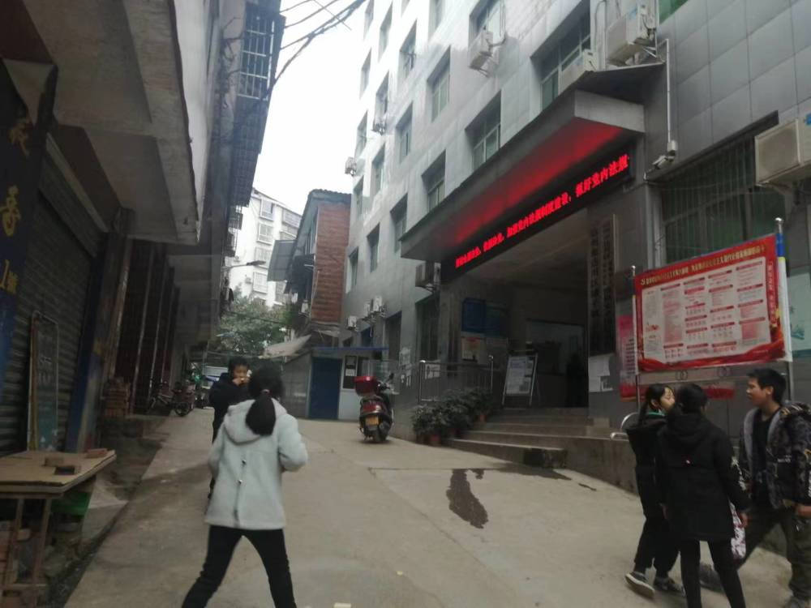
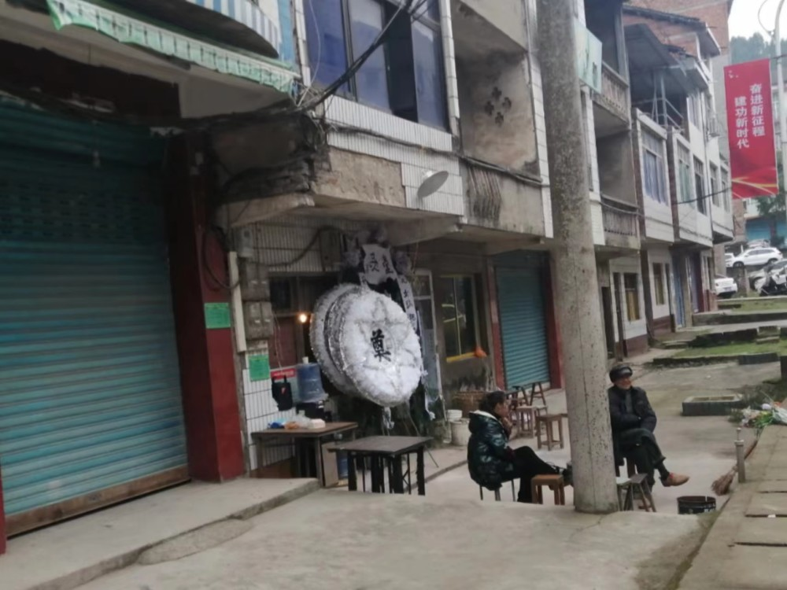
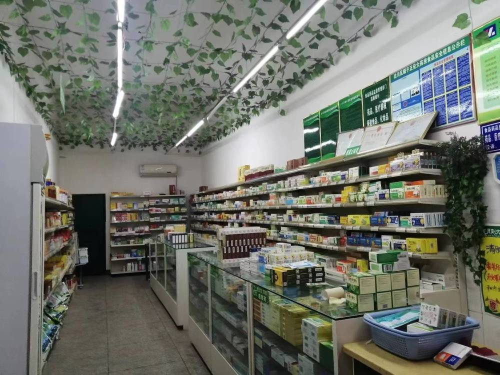

# 农村感染高峰过后：第二波没有到来，但医疗系统依然薄弱

记者 | 赵孟

编辑 | 翟瑞民

防疫“新十条”实施后，国内许多城市已逐渐渡过感染高峰，但在有近5亿人口规模的中国农村，疫情形势仍时刻牵动人心。

2022年12月30日，国务院联防联控机制、中央农村工作领导小组印发《加强当前农村地区新型冠状病毒感染疫情防控工作方案》（下称《方案》），要求围绕“保健康、防重症”，重点抓好农村地区防疫体系运转、药品供应、重症治疗、老人儿童防护等方面工作，最大程度保护农村居民生命安全和身体健康。

近一个月以来，在广大农村地区，过去构建的县、乡（镇）、村三级预防保健网络正在经受考验。而作为距离农村居民最近的医疗机构，村级卫生室和乡镇卫生院在“防重症”方面却显得力不从心，对重症患者往往难以展开及时救治。界面新闻实体地探访位于四川省东北部的达州市罐子镇，发现这里已经度过到了感染高峰，并没有迎来预期的第二波感染，但这个冬天去世的老人确实比过去要多。

**“高峰”过后**

2023年1月4日并不是罐子镇赶集的日子，但熙熙攘攘的人群已经显露出一些过年的气氛。从外地回来的年轻人穿着鲜亮的衣服在街上溜达，镇中心校门口，几十个接孩子的老人聚在一起，有些甚至都没有戴口罩。

这个四川达州的小镇上，卫生院门口只有三三两两的人，显得冷清。发热门诊的医生依然接诊，但未见多少患者。“我们早就阳过了。”发热门诊一位医生告诉界面新闻，近期发热门诊的接诊量几乎回到了正常水平，但他仍清晰记得大约一个月前的忙碌景象。

“平时一天门诊量只有四五十人，但高峰期一天接诊两百多人。”这位医生介绍，其中发热病人占一百二三十人，而平时一天的发热病人只有四五个。突然增加的就诊量很快耗尽了卫生院的药品储备。通常，乡镇卫生院需要配备一个月的用药量，但到12月14日，该卫生院一些主要的退烧类药物已经耗尽。后来，对于高烧患者，医生只能对其“挂水”降温，或使用抗生素。

_罐子镇卫生院门口已不见排队的患者。摄影：赵孟_

罐子镇距离达州市30余公里，由原来的罐子乡和陈家乡合并而来，现有人口3万多。罐子镇是一个典型的农业镇，外出务工是农民们近些年主要的收入来源。罐子镇政府一位人士估计，全镇大约有三分之一的人外出务工，该镇下辖和平村一位村民称，全村2000多人中，留在村里的只有几百人，而且几乎都是老人。

人们居住相对分散，全镇3万多人中，住在罐子街和陈家街的人口大约有3000多人，其余的都分散在乡村。每年春节前，外出务工的人员回家过年，是一年中人员流动最频繁的时期，这也是一些专家担忧农村可能迎来第二波感染潮的主要原因。

当地一些医生记得，该镇的感染高峰大约持续了一周左右，他们注意到，最初来医院看病的是7-15岁的学生，多数是从达州市回来的；接着是成年人逐渐增多；然后是老人。他们认为，疫情可能是从城市向农村蔓延而来，这加剧了他们对春节迎来第二波疫情的担忧。

感染高峰期，在卫生院排不上队的人，开始涌向诊所和药店。“我们一开门药就被‘抢完’了。”一位药店销售人员记得人数多的那一天的情形，由于顾客太多，公司临时安排一位人员过来帮忙，但货架上很快销售一空，公司不得不开始对一些药物限购。

1月4日，界面新闻记者在罐子镇上走访了多家药店，发现货架上已经摆满了药物，但诸如布洛芬之类的退烧药依然缺货，只有一家药店在销售。销售人员提醒，如果没有症状不建议购买，实在要购买，每个人限购一板（11粒）。

从12月16日开始，罐子镇卫生院接诊的患者开始下降，并逐渐回落到平时的接诊量。但卫生院不敢掉以轻心，他们担心迎来第二波感染潮，一方面是因为储备药物迟迟没有到位，另一方面是因为人手紧张。卫生院的医生全部“阳过了一遍”，一些医生坚持带病上岗，从12月初至今都没有休假，存在健康风险。

罐子镇现有两个卫生院，主院医务人员有22人，分院则有16人。此轮感染发生前，3万多居民的健康保障工作尚能被应付，但突然新增的感染量让人手捉襟见肘。当时，卫生院将退休的人员梳理一遍，计划返聘一些老医生。但退休者符合要求者寥寥。最后，只有一个人符合条件，这位退休医生已年近七旬，但也义无反顾重新回到了工作岗位。

大约一周前，罐子镇卫生院才联系到能够批药的医药公司，将药物储备恢复到一个月的量，但一些效果较好的药物依然缺乏。庆幸的是，医生们在惴惴不安中度过了20多天，第二波感染潮并没有到来。“只有一些零星从外面回来的人（来看病）。”一位医生说。

这位医生分析，一方面是由于外出务工的多数是年轻人，这些人在回乡之前可能已经“阳过了”，回家后二次感染的概率较低；此外，经过上一轮的普遍感染，许多人具备了一定的医学常识，感染后知道自行买药和居家治疗，主动减少来医院就诊。鉴于此，他预计可能不会出现此前预判的“第二波”。

和平村一位村民也称，进入农历腊月后，返乡回来的人逐渐增多，回来的人多数已经“阳过了”，村里并没有出现再次感染的情况。但他发现，村里去世的老人比往年多了。

**离去的老人**

“这几日天天都有人放鞭炮，”罐子镇一家寿衣店的裁缝陈兰说，“有时候四个方向都在响。”这个时节听到鞭炮声，通常意味着居民家有红白事，但罐子镇的居民们普遍感觉，今年冬天丧事居多。

1月3日，59岁的王云被送到达州市区的医院几个小时后过世。意外发生前，他还在帮助另一家邻居处理丧事，许多人对他的突然离世感到意外。根据镇上多位居民的说法，仅1月3日当天，罐子镇就有三位老人过世，王云只是其中之一。

王云的妻子萧红告诉界面新闻，丈夫出事前三四天，已经觉察到身体不舒服，“脑壳痛，有点拉肚子”。萧红称，去年12月，王云已经“阳过了”，当时的症状并不重，开了一些药，打了几针后就康复，所以此次身体不适，自己并没有太在意。

1月3日下午，王云出现呼吸困难、腰痛加剧，家人赶紧将其送往达州市区的医院。急诊室挂号后，医生先进行抽血、做CT等检查，然后王云就被推进了重症室，插上了氧气。但几个小时后，CT结果尚未出来，王云被宣告不治。根据家属的转述，医生诊断其死亡的原因为“病毒性心肌炎”。

由于不再进行核酸检测，许多患者也未做抗原自测，很难认定罐子镇这些逝者的病因。界面新闻采访了多位家属均表示，逝者平时患有糖尿病、心脏病等基础性疾病，但发病前都出现过诸如咳嗽、哮喘等感冒类症状。

罐子镇主街南面，一处灵堂已经搭了4天。死者是一位75岁的的老人。老人的女儿唐璐称，母亲于2022年12月31日去世，由于选定落葬的日期在1月9日，因此这期间必须有人守灵。母亲发病前，曾出现咳嗽等症状，但老人罹患糖尿病已有十多年，身体一直不好，此前也多次住院。对于老人的离开，家属表示能够接受。

_近期镇上去世的老人较多，不时听见鞭炮声。摄影：赵孟_

“得这个病就像打架，主要看你的身体，你强它就弱。”上述老人的丈夫说。他今年79岁，但身体硬朗。他在2022年12月也“阳过了”，症状持续五六天就消失了。平时，他还能在建筑工地上打零工，女儿们劝他休息，但他觉得身体可以承受。

唐璐介绍，大约在一个月前，隔壁的另一位老人离世，现在这家人大门紧锁。不过，去世的并不都是老人，距离她家几十米外，42岁的陈克英于二十多天前去世，留下3个仍在读书的孩子。这是目前已知该镇近期离世人员中最年轻的一位。但病因未知。

黄博在罐子镇经营一家丧葬用品店已20多年。最近一个月来，老人过世的消息接二连三传来，“一些地方道师（农村处理丧事的司仪）人手不够，这家没弄完就赶到下家去了。”

究竟有多少老人在这个冬天离世？罐子镇卫生院一位医生表示，从患基础病的住院人数看，比往年多出了“一到二成”。镇政府一位工作人员透露，全镇去年12月至今大约有60多人因各种原因过世。他强调，冬天是老人发病的高峰期，而且这些案例很难认定因新冠病毒感染引起。但他也承认，与往年相比这个数据“要多一些”。

**基层医疗机构的考验**

“新十条”实施后，中国的防疫重心已由“防传染”转为“保健康、防重症”。近一个月以来，在广大农村地区，过去构建的县、乡（镇）、村三级预防保健网络正在经受考验。

罐子镇罐子社区书记陈兵称，目前社区正在对60岁以上患有基础病的老人进行统计上报，对于有基础病的孤寡老人，社区还将协助他们买药，做好健康监测。此外，对于返乡人员，社区和村委会人员也会对其进行防疫宣传。

目前，当地每个村均设有一个卫生室，并配有1-2名村医，可以向村民提供一般疾病的开药服务。但多位村民表示，由于村卫生室不能打针，他们平时很少到村卫生室开药，有些人则称“药物效果不好”。

根据2012年出台的《抗菌药物临床应用管理办法》，“村卫生室、诊所和社区卫生服务站使用抗菌药物开展静脉输注活动，应当经县级卫生行政部门核准”。在实际执行中，许多地方采取“一刀切”，禁止所有肌肉注射。一些医生认为，在疫情爆发的特殊时期，这些规定应该展现出灵活性。

去年12月初，一张达州市某诊所患者聚集输液的照片在网络曝光，引发热议。达州市卫生系统很快明确通知，禁止诊所提供打针和输液服务。这一决定引发了诊所的不满，“有些病人烧到快40度，不给他打针激动得都要骂人了。”界面新闻报道后，当地很快纠正了这一禁令。

_镇上药店的药物较为充足，但布洛芬依然不容易买到。摄影：赵孟_

通常情况下，农村居民生病后首先选择乡镇卫生院就医。中国医院分为三级十等，乡镇卫生院一般属于一级乙等，属于十个等级的倒数第二位，这个等级的医院在软硬件配备、医生资质、药物使用方面存在诸多掣肘。

根据《基本医疗保险、工伤保险和生育保险药品目录》，某些药物仅限二级及以上医疗机构使用，乡镇卫生院往往只能使用一些“基药”（指进入国家基本用药目录的药品）。违规用药则面临扣罚。多乡镇卫生院医生表示，这些限制并不利于防重症工作的开展。

去年12月感染高峰期，罐子镇卫生院先后接诊两位病情紧急的患者，初步诊断一位患有肺心病，一位患有冠心病，但卫生院没有可以使用的药物，只能建议家属立即送到上级医院。从罐子镇到达州市需要40多分钟，遗憾的是，两人最终未能抢救回来。

用药受限的不只是医院，还有医生。由于一些历史的原因，从乡镇卫生院退休的医生职称通常都不高，这让他们能够使用的药物也很有限。同事们称，上述罐子镇卫生院返聘回来的这位医生临床经验丰富，但因为职称不够，“现在还在使用青霉素”。而许多医生现在使用的是更有效的同类药物。

乡镇卫生院的财政困境也在这次感染高峰中凸显。乡镇卫生院属于差额拨款单位，但许多卫生院反映，本应拨付的财政款项长期不到位，导致医院运行出现困难，拖欠医药公司费用比较常见。此次感染高峰出现后，各级医院都在抢购药物，而基层卫生院成为最弱势的一方。

罐子镇卫生院有关人士透露，目前该院尚有180多万元的财政拨款没有到位，目前只能“东拉西扯”想办法将医务人员工资发放到位，而医药公司的货款尚无法及时支付。这也导致在采购药物时，医药公司缺乏积极性。近期因为一些患者出现腹泻症状，治疗腹泻的蒙脱石散又出现断货。

最近，在有些社区和村里，开始为80岁以上的老人发放“健康包”，里面包括常用感冒药、消毒液等。但社区工作人员表示，光靠“健康包”里的物资，能起到多大作用？他表示担忧。

（文中除陈兵外，其余人物为化名）

