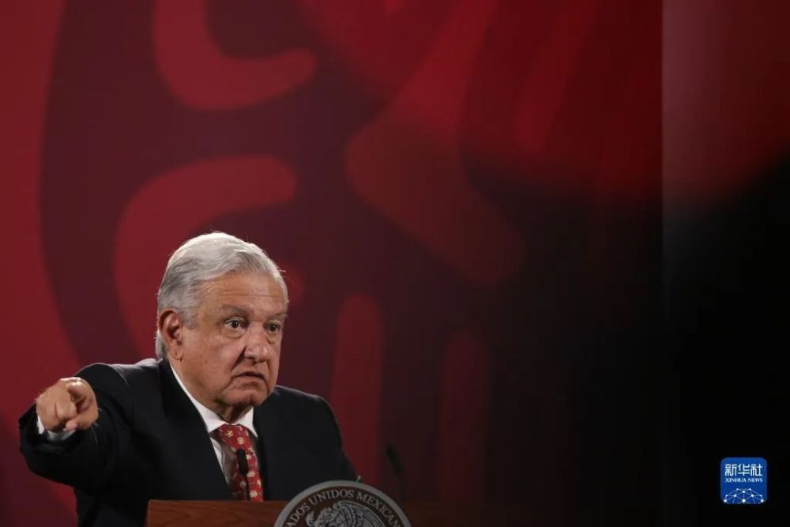

# 北美领导人峰会还没开，东道主就给了拜登一记警告

美国近年来的新门罗主义，已经在美洲国家引发了强烈反弹。

_墨西哥总统洛佩斯资料图。图/新华社_

**文 | 徐立凡**

据新华社报道，墨西哥总统洛佩斯1月3日说，在即将举行的北美领导人峰会上，他会呼吁美国政府结束已经持续200年的“门罗主义”及其干涉主义政策。

在当天的例行新闻发布会上，洛佩斯说，墨西哥政府希望推动美洲大陆所有国家的团结与经济一体化，促进地区国家共同发展，解决发展不平等和移民问题。他表示，美洲不应再有“门罗主义”、干涉主义政策和封锁他国行为，也不应由任何一个国家主导该地区，要尊重各民族的自主权和自决权。

1月9日，洛佩斯将在首都墨西哥城与美国总统拜登举行北美领导人峰会框架下的双边会谈。这也将是拜登上台以来首次访问邻国墨西哥。但现在看来，这场会晤未必有多愉快。

_美国总统拜登资料图。图/新华社_

**今年正逢门罗主义诞生200年**

洛佩斯之所以向美国门罗主义开炮，是因为今年正逢美国提出门罗主义200年——1823年，时任美国总统詹姆斯·门罗发表了“门罗宣言”，宣称“美洲是美洲人的美洲”。这就是门罗主义的开端。

很大程度上，门罗主义是新崛起的美国和当时的欧洲列强争夺美洲大陆控制权的产物。当时，欧洲列强刚从拿破仑战争中喘过气来，神圣同盟又计划出兵干预西班牙事务。而西班牙在美洲拥有广袤的殖民地。

这就给了门罗全面介入美洲的借口。门罗主义提出，欧洲不应再干预美洲事务，而作为交换，美国对欧洲列强之争和列强与美洲殖民地之间的争端也保持中立。

门罗主义表面是维持美洲人的利益，实际上是瞄准了西班牙，想夺得西班牙在美洲的利益，是美国想控制美洲的先声。

自门罗主义提出后，就成为了美国对外战略思维的基石，虽然期间几经包装，特别是填充了一些维护前殖民地、落后国家主权的内容，但作为美国战略工具的性质没变。门罗主义提出20多年后，美国把包括得克萨斯在内的墨西哥200多万平方公里领土收入囊中就是证明。

到“冷战”时期，门罗主义是美国拒止苏联势力进入美洲的主要依据。“冷战”结束后，门罗主义又成为美国在美洲扶持亲美势力、打击异己的决策来源。

_当地时间2022年5月1日，古巴民众在哈瓦那参加“五一”国际劳动节集会游行，反对美国封锁，并向古巴医疗工作者和科研人员致敬。图/新华社_

**新门罗主义引发美洲强烈反弹**

200年来，以门罗主义为理论依据，加之军事和经济强权行为，美国一度把美洲搞成了自家后院和禁脔。近年来，在“美国优先”思想下，门罗主义声势再起，演变出了新门罗主义。

到特朗普时期，针对委内瑞拉的“政权更迭”计划，甚至都不再做什么“政治正确”的包装，激起美洲国家的普遍反感。因此，在北美领导人峰会召开前，洛佩斯就不给面子地向美国发出了警告，不算奇怪。

事实上，美国近年来的新门罗主义，已经在美洲国家引发了强烈反弹。比如2018年，美国主导的针对委内瑞拉的利马集团瓦解。值得注意的是，率先拆掉利马集团的正是墨西哥洛佩斯政府。

这两年，一度沉寂的拉美和加勒比国家共同体再度复活。拉共体是拉美和加勒比地区国家针对美国主导的美洲国家组织成立的，而“反对外部干涉”，就是拉共体的主要主张之一。其针对的是谁，不言而喻。

_当地时间2022年6月10日，在美国加州洛杉矶，一名抗议者手持标语牌参加游行，抗议美国拒绝古巴、尼加拉瓜、委内瑞拉三国领导人参加美洲峰会。图/新华社_

**洛佩斯此时喊话拜登颇多讲究**

对于“后院”的这些变化，拜登政府不是没有察觉、没有反应。今年6月美国主持召开的第九届美洲峰会，就代表了拜登政府的主要应对。但这番应对却并不那么受欢迎。

美国提出不邀请“不尊重美洲民主宪章”的古巴、委内瑞拉、尼加拉瓜三国参加，测试美国目前的权威性，结果是遭到了美洲国家的普遍反对。

而事后美国为应对俄乌军事冲突后的能源危机，又试图“原谅”委内瑞拉，让不少美洲国家觉得美国进退失据，是非完全依据美国自身利益定义，进一步加剧了美洲国家的不满。

当然，洛佩斯之所以要在北美领导人峰会上向拜登政府提出终结门罗主义，也有时机和对象上的考虑。

从时机上看，墨西哥是此次北美领导人峰会的东道主，有制定议程的优先权；从对象上看，他选择向拜登喊话也有脉络可循
——2013年，拜登的重要政治盟友、当时的国务卿克里也曾表态说，门罗主义已经过时。

至于拜登将如何面对洛佩斯的喊话，现在还不得而知。但可以肯定，不管是否参会，场内场外都不会只有少数拉美国家领导人站到洛佩斯一边。

美洲国家对美国说“不”，反对门罗主义，不仅是当下的拉美左翼化浪潮必然的结果，也是实行了200年的门罗主义理当得到的反馈。

撰稿 / 徐立凡（专栏作家）

编辑 / 何睿

校对 / 赵琳

