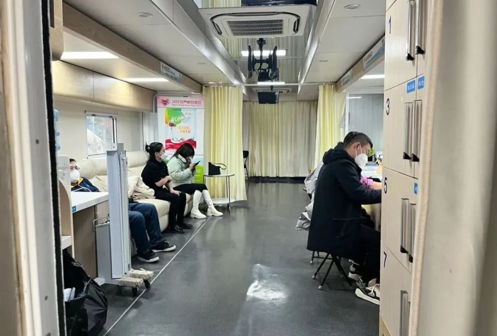
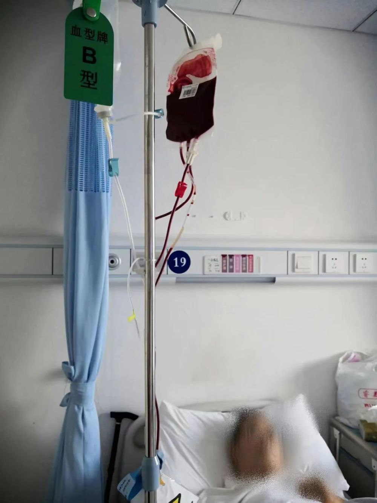
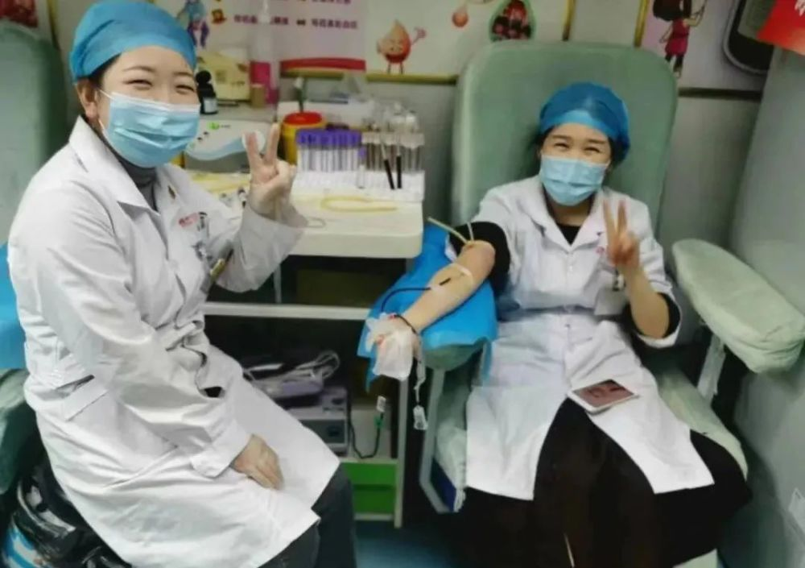

# 告急的血库与“找血”的患者：血站员工带头献血 病人家属线上线下四处求助

**记者/颜星悦 实习记者/陈湫林**

**编辑/杨宝璐**

_北京通州的献血车上，等待献血的人们_

直到丈夫住院之前，王怡都未觉得，用血是一件这么“奢侈”的事——想让亲朋好友帮忙捐血，却发现身边的人都“阳”了；在网上发布求助信息之后，多位热心网友虽然主动联系，但符合捐血要求的，只有一个人。

随着寒冬到来、各类患者增加，以及各地陆续出现新冠病毒感染高峰，全国多地血库启动采供血应急预案中最高级别的红色预警。多地血液中心满足不了医院的临床输血需求，不得不“卡着医院的脖子”，按比例减少血液的分发。

以往，当某地发生“血荒”时，采用从其他地区调血支援的方法，在这个冬天失效了。在深一度的采访中，各地血液中心纷纷采取措施缓解用血困难，不少地方的血液中心只能由员工上阵捐血，充当“应急血库”。

12月17日，国家卫健委《血站新冠病毒感染防控工作指引（第二版）》，修改“新冠患者康复半年内暂缓献血”的条款，确定新冠感染者转阴7天后即可进行献血。

_医院给王怡丈夫开的优先用血流程单_

**找血**

“必须有人给你定向献血，给你优先用，你才能用上。”医生这样告诉王怡。

王怡的丈夫今年30岁，除10年前做过一次胃部手术外，身体一直很健康。但从2022年12月15日感染新冠后，久未发作的胃病突然又找上门来——12月17日起，他开始连续吐血、便血。挺到19日，挨不住了，才告诉王怡自己的情况。

王怡立刻带丈夫做核酸、挂急诊。12月20日，丈夫住进山西白求恩医院，彼时，他已经开始吐血块了。

住院两天，王怡眼看着丈夫的血红蛋白指数一路从70多掉到20，焦虑得睡不着觉。在办理住院手续时，医生就告诉她，以她丈夫目前的情况需要输血，但医院没给他输，“医生就一直说‘你们去找血，找到了才能输’。”王怡说。

医生给了她一个“优先用血审批单”，上半联是她丈夫的姓名、住院科室，用血需求，下半联要求写这次捐血人的信息：姓名、血型、本次献血量。当时，她丈夫需要至少400cc的A型血，医院要求“必须是1:1换”，这就意味着，王怡必须找到人去献400cc血，丈夫才能用上血。“不一定非得家属献血，也不要求A型必须跟
A型置换，但是必须是等量置换。”王怡告诉记者。

那几天，王怡自己也“阳”了，没法献血，她得找亲友去附近的献血屋献血。献血成功后，机器会自动生成一个系统码，把码条贴在审批单上，再把审批单交给血库，患者就能用血了。

但王怡向身边亲友求助了一圈，发现身边竟没有一个合适的献血人。根据医院最新的献血要求，最后一次新冠病毒检测或抗原阳性7天后才可以献血，但符合献血条件的亲友，恰好都不符合要求。

在太原找不到人“换血”，王怡甚至联系了外地朋友，但外地朋友纷纷把抗原检测的照片发给她，“他们说自己现在也阳了，过两天，等阴了一定给你献去。”王怡回复朋友，“急救呢，你这过两天是啥时候？”

12月22日，丈夫的情况陡然紧急，开始吐血。王怡实在没辙，只能请求医院协调先给丈夫输血。“他都休克了，医生抢救时给他输了400cc血。”回忆起那晚的情景，王怡胆战心惊。

丈夫抢救过来后，医生又找王怡，“你这两袋血是欠的，你还得继续去找血。”王怡说，除了急救欠下的这两袋，她还需要找更多血“备用”——丈夫随时可能需要手术，需要更多的血。

12月22日晚10点，王怡在微博上发布求助，随后陆续有人给她私信留言，但大部分热心网友都未满足“阳性七天后”的条件，真正满足条件的只有一个——一名没有阳过的大学生。确定对方满足条件的第二天，王怡和公公就带他去献血点献了400cc血。之后，公公还硬塞给了大学生1000元营养费。

_血贩子跟王怡在社交平台上的交流_

**告急**

“用血难”在这个冬天格外严峻。12月27日，太原市血液库存全线紧张，各种血型存量都在警戒线以下，太原市血液中心宣传科科长田斌告诉深一度，其实从11月起，血液就开始紧缺了。“一开始我们还有库存顶着，现在已经顶不住了。”田斌说。

据田斌介绍，一般情况下，太原市每日临床用血量约600—700单位，每单位200毫升，按照这个供血量计算每天应有300—350人，每人献血2个单位，才能满足临床供应。以12月25日的数据看，全天太原市采全血合计85人，165个单位，未到临床用血量的1/3。

“太原11月没有封区管理，但也是静默状态。”田斌说，那阵子太原街面上几乎没人，跨区交通需要有通行证才可以，人们也不出门。“献血的人都出不来了，可医院每天都在用血。”

11月底，太原市血库库存降到警戒线以下，库存告急。到12月29日，太原市血液中心传来消息，当日库存为2512单位。

田斌告诉深一度，血库没办法满足医院上报的用血需求，只好按比例减少分发，“比如今天某家医院上报血库需要100单位血量，只能批给80，让医院拿回去自己分。”田斌表示，这也是无奈之举，于是医院里一些临床上可以择期的手术，医生会建议患者推迟手术时间。

这并非太原一地的情况。青海省血液中心工作人员欧英估算，比起去年同期，血库库存出现了至少80%的缺口，“的确是卡住了医院的脖子，他们要10个单位，可能只给1个单位。”

“还有一种办法，比如你们家人用血，那就发动你周围的人去捐献。你们家要用，（找人）去献个血，你们家的事就解决了。”全国范围内，互助献血这一政策一直都在实行，对此，兰州市血液中心的松嵩解释道：“在献血法十五条规定了，应急的情况下，鼓励患者自体输血或者是家属进行互助献血。”

在兰州市，血库也在吃紧的状态下运行。兰州每天医疗用血量约为260个单位，血库能提供的治疗量维持在160到180个单位之间。血库缺血的直接原因是献血人数大幅减少。在天津，正常情况下，每天有500-600人献血，近期每天献血人数只有200人左右。安徽省毫州市甚至一度每天只有30多人献血。

血库告急，但在灰色地带，“血”的生意却异常活跃。为了找血，王怡在所有社交平台发布了消息，甚至到闲鱼上去发帖求血，一些血贩看到信息后联系了王怡，明码标价2500元400cc，不讲价，还告诉她“这生意在很多省会城市都可好做了”。

_正在输血的患者_

**阳后6个月改为7天**

“全国的血站都难。”江西省血液中心宣传科鲍丽告诉深一度，一个半月前，北京的血液中心多次给他们打电话要求调血，“突然之间，大家都不符合献血条件了。”

根据国家卫健委《血站新冠病毒感染防控工作指引（第二版）》明确规定，感染新冠病毒(重型和危重型除外)，最后一次新冠病毒核酸检测或抗原检测阳性结果7天后可以献血，并提出，接种基因重组疫苗与接种灭活疫苗后暂缓献血48小时的要求。

这一版本的《指引》于2022年12月17日颁布，在此之前，各地实施的第一版《指引》，要求新冠病毒感染者治愈后6个月内不可捐献全血和血小板。

鲍丽透露，从2020年到2022年，全国的血库大多是靠“拆了东墙补西墙”的办法维持，“上海没血江西供，江西没血湖南供”，从时间上来看，各地的疫情暴发时间和血荒暴发时间是一致的，之前，因为各省市疫情未集中统一暴发，各地总可以通过区域调血来暂时周转。但到年底，各地集中暴发新冠疫情，这就大大增加了用血的压力。

根据四川省疾控中心近日发布的新冠感染情况问卷调查（第二次）结果显示，截至2022年12月26日，省内21个市州183个县（区、市）的158506名被调查者的感染率为63.52%。据江西省发热门诊哨点监测显示，12月9日至22日，全省二级及以上医疗机构发热门诊诊疗量呈持续上升趋势，日均增幅23.45%。

鲍丽称，在这种情况下，无论是“未阳”的人，还是“阳康”的人，都会谨慎献血，“有些人‘阳康’了，但身体虚弱，有些人则考虑自己的亲人感染阳性，到时候也需要用血。大家只会在确有余力的情况下才会主动献血，否则都会再掂量掂量。”

深一度采访了多市血液中心，得到的反馈是，四种血型中，A型血处于相对紧缺的状态。采访中，江苏、山东、武汉等地血液中心均表示，库存A型血不到3天的临床医疗用量。

“全国可能都是A型血更缺。”兰州市血液中心的松嵩说。“如果放开使用，兰州库存中的A型血仅够使用5天。”

除去疫情缘故，冬季也向来是无偿献血的“淡季”，松嵩告诉记者，出现这种情况的原因有三：首先，无偿献血占比很大的高校学生寒假放假，献血中心无法进高校集中采血；二是受寒冷天气影响，街面上的行人减少，献血车的人流自然减少；第三，各类疾病在冬季发病率更高，医院的用血需求也更高。

_亳州血液中心工作人员上阵献血_

**一二月份会最困难**

为了增加血液库存，各地血液中心都在想方设法呼吁献血。兰州市血液中心与兰州市出租车协会合作，为有需要的献血者提供车辆接送服务。松嵩告诉记者，兰州市血液中心先给以前献过血的人打电话，询问他们的健康状况和献血意愿，必要情况下，派“爱心车队”去专程接送献血者。

毫州市中心血站专门安排了两个工作人员发短信呼吁献血，但毫州市献血中心主任田义感觉“效果不是特别好”。

除了挨个发短信、打电话，田义联系了当地晚报、电视台进行报道，鼓励市民献血。亳州血液中心还在自家微信公众号发文章，并做了广告牌立在各个献血点。“我们以前基本上不会用告急这个词，现在可以称得上是告急了。”田义说，他几乎把能用得办法都过用上了，甚至后期还可能会延长采血点员工的上班时间。

在松嵩的记忆中，上次发生血量告急还得追溯到上世纪九十年代。“还是需要加大无偿献血宣传，有些人对献血还是抱有一定的顾虑，觉得有害健康。”他向记者解释道，“人体红细胞的寿命是120天，即便不献血，这些细胞也会在体内自然代谢。”

青海省血液中心动员员工和员工家属到头献血，十几年来，欧英已经献血14次了，她的爱人还获得了无偿献血金奖（累计献血8000毫升上），“基本上我们血站的员工和家属都是这样。”欧英说，“我们血站就是一个应急血库。”

这两天，青海省血液中心正在准备召开用血培训班，培训主题是“开源节流”。“开源”指得是广泛联系血源，“节流”是让医护人员们更加合理用血。“当患者的血红蛋白在60g/L时，就处于相对贫血的状态，此时需要输血。当内科患者的血色素达到了60、外科病人达到80，医院就不建议再输血。”欧英说。

王怡的丈夫还没出院，由于他的血色素尚未完全恢复，医院无法为他安排胃镜手术，这几天，他的血色素刚刚高于50， 医院就告诉王怡“不用输了”。

“现在的库存是历史以来最低的一次，没有这么低过，”欧英说，“最困难的是1月和2月，需要我们咬牙坚持过去。”

（应采访对象要求，文中人物均使用化名）

**【版权声明】本作品的著作权等知识产权归北京青年报【北青深一度】所有，未经授权，不得转载。**

